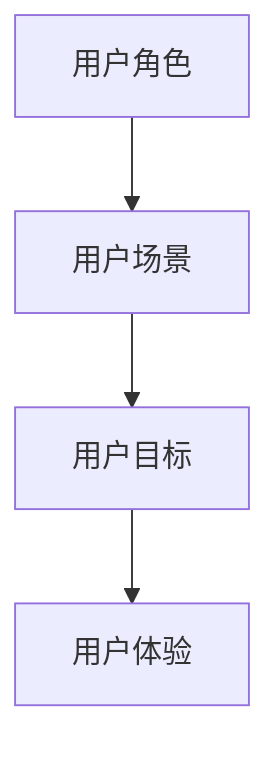

                 

# 如何设计富有说服力的产品演示

> 关键词：产品演示、说服力、用户体验、设计原则、技术架构、用户故事、交互设计、视觉呈现

> 摘要：本文旨在探讨如何设计富有说服力的产品演示，通过深入分析产品演示的核心要素、设计原则、技术架构以及实际案例，帮助产品经理和技术团队构建能够打动人心、展示产品独特价值的产品演示。我们将从用户体验出发，结合用户故事和交互设计，探讨如何通过视觉呈现和演示技巧提升演示效果。

## 1. 背景介绍
### 1.1 目的和范围
本文旨在为产品经理和技术团队提供一套系统的方法论，帮助他们设计出能够有效传达产品价值、吸引目标用户的产品演示。我们将从用户体验出发，结合用户故事和交互设计，探讨如何通过视觉呈现和演示技巧提升演示效果。本文将涵盖产品演示的核心要素、设计原则、技术架构以及实际案例。

### 1.2 预期读者
本文的目标读者包括产品经理、设计师、技术团队成员以及任何需要进行产品演示的专业人士。无论你是初学者还是有经验的演示专家，本文都将为你提供有价值的见解和实用建议。

### 1.3 文档结构概述
本文将按照以下结构展开：
1. 背景介绍
2. 核心概念与联系
3. 核心算法原理 & 具体操作步骤
4. 数学模型和公式 & 详细讲解 & 举例说明
5. 项目实战：代码实际案例和详细解释说明
6. 实际应用场景
7. 工具和资源推荐
8. 总结：未来发展趋势与挑战
9. 附录：常见问题与解答
10. 扩展阅读 & 参考资料

### 1.4 术语表
#### 1.4.1 核心术语定义
- **产品演示**：一种展示产品特性和功能的手段，旨在说服目标用户或投资者。
- **用户体验**：用户在使用产品时的感受和体验。
- **用户故事**：描述用户需求和期望的故事，用于指导设计和开发过程。
- **交互设计**：设计产品与用户之间的交互方式，确保用户能够轻松地使用产品。
- **视觉呈现**：通过视觉元素（如图表、动画、图像等）来增强演示效果。

#### 1.4.2 相关概念解释
- **用户旅程**：用户从首次接触产品到最终使用产品的全过程。
- **用户痛点**：用户在使用产品过程中遇到的问题或不便之处。
- **用户满意度**：用户对产品功能、性能和用户体验的总体评价。

#### 1.4.3 缩略词列表
- **UX**：User Experience（用户体验）
- **UI**：User Interface（用户界面）
- **PO**：Product Owner（产品经理）
- **POV**：Point of View（视角）

## 2. 核心概念与联系
### 2.1 用户体验
用户体验是产品演示的核心。一个优秀的演示能够清晰地传达产品的价值，让用户感受到产品的独特之处。用户体验包括以下几个方面：
- **易用性**：用户能够轻松地理解和使用产品。
- **可用性**：用户能够有效地完成任务。
- **满意度**：用户对产品的总体评价。

### 2.2 用户故事
用户故事是一种描述用户需求和期望的故事，用于指导设计和开发过程。用户故事通常包含以下几个部分：
- **角色**：描述用户类型。
- **场景**：描述用户在特定场景下的需求。
- **目标**：描述用户期望达到的目标。

### 2.3 交互设计
交互设计是设计产品与用户之间的交互方式，确保用户能够轻松地使用产品。交互设计包括以下几个方面：
- **导航**：用户如何在产品中导航。
- **反馈**：用户操作后的反馈信息。
- **响应时间**：用户操作后的响应时间。

### 2.4 视觉呈现
视觉呈现是通过视觉元素（如图表、动画、图像等）来增强演示效果。视觉呈现包括以下几个方面：
- **图表**：展示数据和信息。
- **动画**：展示动态效果。
- **图像**：展示产品外观和功能。

## 3. 核心算法原理 & 具体操作步骤
### 3.1 用户体验设计流程
用户体验设计流程包括以下几个步骤：
1. **需求分析**：了解用户需求和期望。
2. **用户研究**：通过访谈、问卷调查等方式收集用户数据。
3. **用户旅程图**：绘制用户旅程图，了解用户在使用产品过程中的体验。
4. **用户故事**：编写用户故事，描述用户需求和期望。
5. **交互设计**：设计产品与用户之间的交互方式。
6. **视觉呈现**：通过视觉元素增强演示效果。
7. **原型设计**：设计产品原型，进行用户测试。
8. **迭代优化**：根据用户反馈进行迭代优化。

### 3.2 用户故事编写步骤
用户故事编写步骤包括以下几个步骤：
1. **确定角色**：描述用户类型。
2. **描述场景**：描述用户在特定场景下的需求。
3. **描述目标**：描述用户期望达到的目标。
4. **编写用户故事**：将以上三个部分组合成一个完整的用户故事。

### 3.3 交互设计步骤
交互设计步骤包括以下几个步骤：
1. **确定导航**：设计用户在产品中的导航方式。
2. **设计反馈**：设计用户操作后的反馈信息。
3. **优化响应时间**：优化用户操作后的响应时间。
4. **设计交互元素**：设计交互元素，如按钮、滑块等。

### 3.4 视觉呈现步骤
视觉呈现步骤包括以下几个步骤：
1. **选择图表类型**：根据数据类型选择合适的图表类型。
2. **设计动画效果**：设计动画效果，增强演示效果。
3. **选择图像类型**：根据产品特点选择合适的图像类型。
4. **设计视觉元素**：设计视觉元素，如颜色、字体等。

## 4. 数学模型和公式 & 详细讲解 & 举例说明
### 4.1 用户满意度模型
用户满意度模型可以用来评估用户对产品的总体评价。用户满意度模型包括以下几个部分：
- **用户满意度**：用户对产品的总体评价。
- **用户需求**：用户在使用产品过程中的需求。
- **用户期望**：用户对产品的期望。

用户满意度模型的公式如下：
$$
Satisfaction = \frac{User Needs - User Expectations}{User Needs}
$$

### 4.2 用户旅程图
用户旅程图是一种描述用户在使用产品过程中的体验的工具。用户旅程图包括以下几个部分：
- **用户角色**：描述用户类型。
- **用户场景**：描述用户在特定场景下的需求。
- **用户目标**：描述用户期望达到的目标。
- **用户体验**：用户在使用产品过程中的体验。

用户旅程图的示例如下：

## 5. 项目实战：代码实际案例和详细解释说明
### 5.1 开发环境搭建
开发环境搭建包括以下几个步骤：
1. **安装开发工具**：安装IDE和编辑器。
2. **配置开发环境**：配置开发环境，如设置环境变量、安装依赖等。
3. **创建项目结构**：创建项目结构，如创建目录、初始化项目等。

### 5.2 源代码详细实现和代码解读
源代码详细实现包括以下几个步骤：
1. **编写用户故事**：编写用户故事，描述用户需求和期望。
2. **设计交互元素**：设计交互元素，如按钮、滑块等。
3. **编写代码**：编写代码，实现用户故事和交互元素。
4. **测试代码**：测试代码，确保代码能够正常运行。

### 5.3 代码解读与分析
代码解读与分析包括以下几个步骤：
1. **理解代码结构**：理解代码结构，了解代码的组织方式。
2. **分析代码逻辑**：分析代码逻辑，了解代码的执行流程。
3. **优化代码性能**：优化代码性能，提高代码的执行效率。
4. **编写文档**：编写文档，记录代码的功能和使用方法。

## 6. 实际应用场景
实际应用场景包括以下几个方面：
1. **产品演示**：通过产品演示展示产品的特性和功能。
2. **用户培训**：通过用户培训帮助用户了解产品的使用方法。
3. **产品推广**：通过产品推广吸引用户关注产品。
4. **产品反馈**：通过产品反馈收集用户反馈，优化产品。

## 7. 工具和资源推荐
### 7.1 学习资源推荐
#### 7.1.1 书籍推荐
- **《用户体验要素》**：作者：唐纳德·诺曼
- **《设计心理学》**：作者：唐纳德·诺曼
- **《交互设计精髓》**：作者：唐纳德·诺曼

#### 7.1.2 在线课程
- **UX设计课程**：Coursera
- **交互设计课程**：Udacity
- **用户体验课程**：edX

#### 7.1.3 技术博客和网站
- **UX设计博客**：Smashing Magazine
- **交互设计博客**：A List Apart
- **用户体验网站**：Nielsen Norman Group

### 7.2 开发工具框架推荐
#### 7.2.1 IDE和编辑器
- **Visual Studio Code**
- **IntelliJ IDEA**
- **Sublime Text**

#### 7.2.2 调试和性能分析工具
- **Chrome DevTools**
- **Firefox Developer Tools**
- **Visual Studio Debugger**

#### 7.2.3 相关框架和库
- **React**
- **Vue.js**
- **Angular**

### 7.3 相关论文著作推荐
#### 7.3.1 经典论文
- **《用户体验要素》**：作者：唐纳德·诺曼
- **《设计心理学》**：作者：唐纳德·诺曼

#### 7.3.2 最新研究成果
- **《交互设计精髓》**：作者：唐纳德·诺曼

#### 7.3.3 应用案例分析
- **《用户体验要素》**：作者：唐纳德·诺曼

## 8. 总结：未来发展趋势与挑战
未来发展趋势包括以下几个方面：
1. **用户体验**：用户体验将成为产品演示的核心。
2. **交互设计**：交互设计将成为产品演示的关键。
3. **视觉呈现**：视觉呈现将成为产品演示的重要组成部分。

未来挑战包括以下几个方面：
1. **技术更新**：技术更新将带来新的挑战。
2. **用户需求**：用户需求将不断变化。
3. **市场竞争**：市场竞争将不断加剧。

## 9. 附录：常见问题与解答
### 9.1 问题1：如何编写用户故事？
**解答**：编写用户故事包括以下几个步骤：
1. **确定角色**：描述用户类型。
2. **描述场景**：描述用户在特定场景下的需求。
3. **描述目标**：描述用户期望达到的目标。
4. **编写用户故事**：将以上三个部分组合成一个完整的用户故事。

### 9.2 问题2：如何设计交互元素？
**解答**：设计交互元素包括以下几个步骤：
1. **确定导航**：设计用户在产品中的导航方式。
2. **设计反馈**：设计用户操作后的反馈信息。
3. **优化响应时间**：优化用户操作后的响应时间。
4. **设计交互元素**：设计交互元素，如按钮、滑块等。

### 9.3 问题3：如何优化代码性能？
**解答**：优化代码性能包括以下几个步骤：
1. **分析代码逻辑**：分析代码逻辑，了解代码的执行流程。
2. **优化代码结构**：优化代码结构，提高代码的执行效率。
3. **编写文档**：编写文档，记录代码的功能和使用方法。

## 10. 扩展阅读 & 参考资料
### 10.1 扩展阅读
- **《用户体验要素》**：作者：唐纳德·诺曼
- **《设计心理学》**：作者：唐纳德·诺曼
- **《交互设计精髓》**：作者：唐纳德·诺曼

### 10.2 参考资料
- **UX设计博客**：Smashing Magazine
- **交互设计博客**：A List Apart
- **用户体验网站**：Nielsen Norman Group

---

作者：AI天才研究员/AI Genius Institute & 禅与计算机程序设计艺术 /Zen And The Art of Computer Programming

