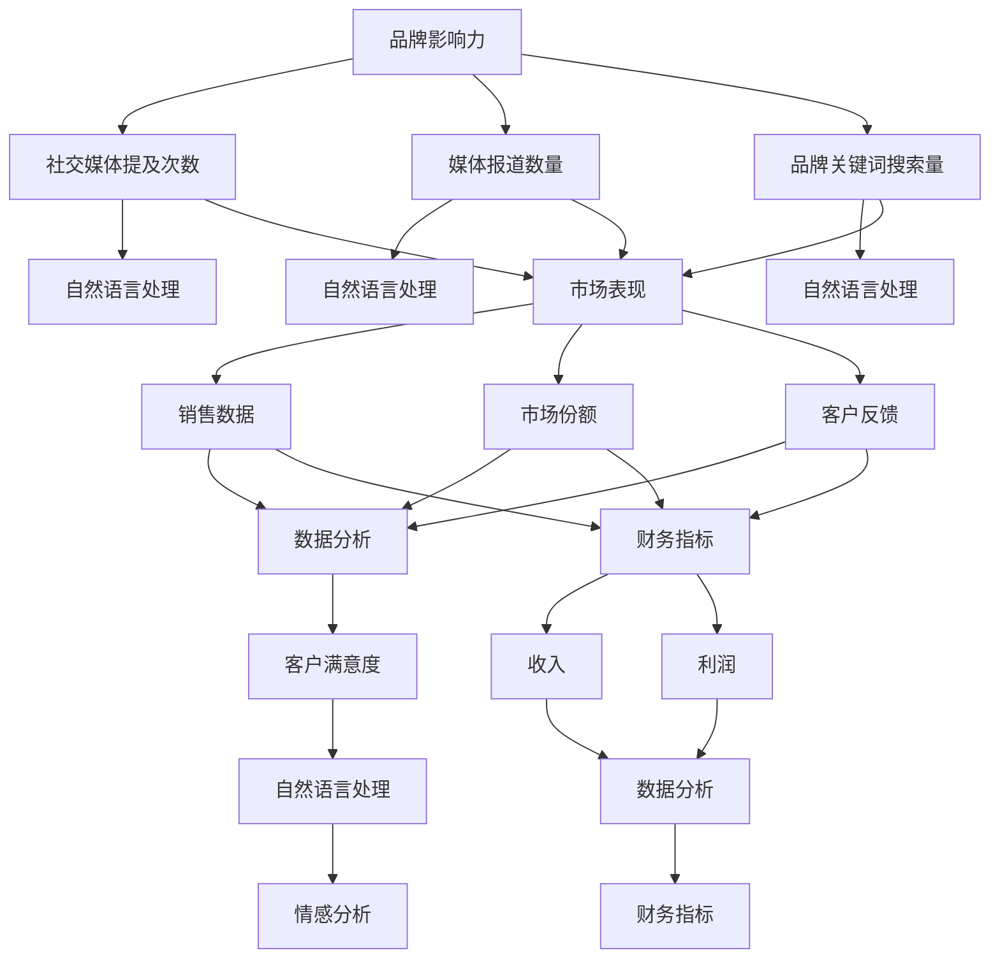

                 

# 如何进行有效的品牌资产评估

> 关键词：品牌资产评估, 人工智能, 数据分析, 机器学习, 品牌影响力, 市场表现, 客户满意度, 财务指标

> 摘要：本文旨在通过系统化的分析方法，利用人工智能和数据分析技术，为品牌资产评估提供一套科学有效的评估体系。我们将从品牌影响力、市场表现、客户满意度等多个维度进行深入探讨，并通过具体的案例和算法实现，展示如何构建一个全面的品牌资产评估模型。本文适合对品牌管理、市场营销、数据分析等领域感兴趣的读者。

## 1. 背景介绍
### 1.1 目的和范围
本文旨在探讨如何利用人工智能和数据分析技术，构建一个全面的品牌资产评估模型。通过系统化的分析方法，我们希望能够为品牌管理者提供一个科学有效的评估工具，帮助他们更好地理解品牌的价值，并据此制定相应的策略。

### 1.2 预期读者
本文主要面向品牌管理、市场营销、数据分析领域的专业人士，以及对品牌资产评估感兴趣的读者。无论你是品牌经理、市场分析师，还是数据科学家，本文都将为你提供有价值的见解和实用的方法。

### 1.3 文档结构概述
本文将从以下几个方面展开讨论：
1. 核心概念与联系
2. 核心算法原理 & 具体操作步骤
3. 数学模型和公式 & 详细讲解 & 举例说明
4. 项目实战：代码实际案例和详细解释说明
5. 实际应用场景
6. 工具和资源推荐
7. 总结：未来发展趋势与挑战
8. 附录：常见问题与解答

### 1.4 术语表
#### 1.4.1 核心术语定义
- **品牌资产评估**：通过对品牌影响力、市场表现、客户满意度等多维度数据的分析，评估品牌的价值。
- **品牌影响力**：品牌在市场上的知名度、美誉度和影响力。
- **市场表现**：品牌在市场上的销售情况、市场份额等。
- **客户满意度**：客户对品牌的认可度和忠诚度。
- **财务指标**：反映品牌经济价值的财务数据，如收入、利润等。

#### 1.4.2 相关概念解释
- **机器学习**：一种人工智能技术，通过算法和统计模型来实现对数据的学习和预测。
- **自然语言处理**：一种人工智能技术，用于处理和理解人类语言。
- **数据挖掘**：从大量数据中提取有价值的信息和知识的过程。

#### 1.4.3 缩略词列表
- **AI**：人工智能
- **ML**：机器学习
- **NLP**：自然语言处理
- **DM**：数据挖掘

## 2. 核心概念与联系
### 2.1 品牌影响力
品牌影响力可以通过多种方式进行评估，包括社交媒体上的提及次数、媒体报道的数量、品牌关键词的搜索量等。这些数据可以通过爬虫技术获取，并通过自然语言处理技术进行分析。

### 2.2 市场表现
市场表现可以通过销售数据、市场份额、客户反馈等进行评估。这些数据可以通过数据分析技术进行处理和分析。

### 2.3 客户满意度
客户满意度可以通过调查问卷、社交媒体评论、客户反馈等进行评估。这些数据可以通过自然语言处理技术进行情感分析。

### 2.4 财务指标
财务指标可以通过公司的财务报表进行获取，包括收入、利润、市场份额等。这些数据可以通过数据分析技术进行处理和分析。

### 2.5 核心概念流程图


## 3. 核心算法原理 & 具体操作步骤
### 3.1 数据收集
数据收集是品牌资产评估的第一步，主要包括以下几个方面：
- **社交媒体数据**：通过爬虫技术获取社交媒体上的提及次数、评论等数据。
- **媒体报道数据**：通过爬虫技术获取媒体报道的数量和内容。
- **品牌关键词搜索量**：通过搜索引擎API获取品牌关键词的搜索量。
- **销售数据**：通过公司内部系统获取销售数据。
- **市场份额**：通过行业报告获取市场份额数据。
- **客户反馈**：通过调查问卷获取客户反馈数据。

### 3.2 数据预处理
数据预处理主要包括以下几个步骤：
- **数据清洗**：去除无效数据、重复数据等。
- **数据转换**：将非结构化数据转换为结构化数据。
- **数据标准化**：将不同来源的数据进行标准化处理，使其具有可比性。

### 3.3 数据分析
数据分析主要包括以下几个步骤：
- **统计分析**：通过统计方法对数据进行分析，提取有价值的信息。
- **机器学习**：通过机器学习算法对数据进行建模，预测品牌的价值。
- **自然语言处理**：通过自然语言处理技术对文本数据进行分析，提取关键信息。

### 3.4 伪代码实现
```python
# 数据收集
def collect_data():
    social_media_data = collect_social_media_data()
    media_data = collect_media_data()
    keyword_search_data = collect_keyword_search_data()
    sales_data = collect_sales_data()
    market_share_data = collect_market_share_data()
    customer_feedback_data = collect_customer_feedback_data()

# 数据预处理
def preprocess_data(data):
    cleaned_data = clean_data(data)
    transformed_data = transform_data(cleaned_data)
    standardized_data = standardize_data(transformed_data)

# 数据分析
def analyze_data(data):
    statistical_analysis = perform_statistical_analysis(data)
    machine_learning_model = train_machine_learning_model(data)
    nlp_analysis = perform_nlp_analysis(data)

# 伪代码实现
def brand_assessment():
    data = collect_data()
    preprocessed_data = preprocess_data(data)
    analyzed_data = analyze_data(preprocessed_data)
    return analyzed_data
```

## 4. 数学模型和公式 & 详细讲解 & 举例说明
### 4.1 品牌影响力评估模型
品牌影响力评估模型可以通过以下公式进行计算：
$$
\text{Brand Influence} = \alpha \times \text{Social Media Mentions} + \beta \times \text{Media Mentions} + \gamma \times \text{Keyword Search Volume}
$$
其中，$\alpha$、$\beta$、$\gamma$为权重系数，可以通过机器学习算法进行训练得到。

### 4.2 市场表现评估模型
市场表现评估模型可以通过以下公式进行计算：
$$
\text{Market Performance} = \delta \times \text{Sales} + \epsilon \times \text{Market Share} + \zeta \times \text{Customer Feedback}
$$
其中，$\delta$、$\epsilon$、$\zeta$为权重系数，可以通过机器学习算法进行训练得到。

### 4.3 客户满意度评估模型
客户满意度评估模型可以通过以下公式进行计算：
$$
\text{Customer Satisfaction} = \eta \times \text{Sentiment Analysis} + \theta \times \text{Customer Feedback}
$$
其中，$\eta$、$\theta$为权重系数，可以通过机器学习算法进行训练得到。

### 4.4 财务指标评估模型
财务指标评估模型可以通过以下公式进行计算：
$$
\text{Financial Metrics} = \iota \times \text{Revenue} + \kappa \times \text{Profit}
$$
其中，$\iota$、$\kappa$为权重系数，可以通过机器学习算法进行训练得到。

### 4.5 举例说明
假设我们有一个品牌，其社交媒体提及次数为1000次，媒体报道数量为50次，品牌关键词搜索量为10000次。通过机器学习算法训练得到的权重系数分别为$\alpha = 0.5$、$\beta = 0.3$、$\gamma = 0.2$，则品牌影响力评估结果为：
$$
\text{Brand Influence} = 0.5 \times 1000 + 0.3 \times 50 + 0.2 \times 10000 = 2150
$$

## 5. 项目实战：代码实际案例和详细解释说明
### 5.1 开发环境搭建
开发环境搭建主要包括以下几个步骤：
- **安装Python**：确保安装了Python 3.7及以上版本。
- **安装依赖库**：安装`requests`、`pandas`、`scikit-learn`、`nltk`等库。
- **配置环境变量**：配置好Python环境变量，确保可以正常运行Python脚本。

### 5.2 源代码详细实现和代码解读
```python
# 导入所需库
import requests
import pandas as pd
from sklearn.feature_extraction.text import TfidfVectorizer
from sklearn.linear_model import LinearRegression
import nltk
from nltk.sentiment import SentimentIntensityAnalyzer

# 数据收集
def collect_data():
    # 收集社交媒体数据
    social_media_data = collect_social_media_data()
    # 收集媒体报道数据
    media_data = collect_media_data()
    # 收集品牌关键词搜索量
    keyword_search_data = collect_keyword_search_data()
    # 收集销售数据
    sales_data = collect_sales_data()
    # 收集市场份额数据
    market_share_data = collect_market_share_data()
    # 收集客户反馈数据
    customer_feedback_data = collect_customer_feedback_data()
    return social_media_data, media_data, keyword_search_data, sales_data, market_share_data, customer_feedback_data

# 数据预处理
def preprocess_data(data):
    # 清洗数据
    cleaned_data = clean_data(data)
    # 转换数据
    transformed_data = transform_data(cleaned_data)
    # 标准化数据
    standardized_data = standardize_data(transformed_data)
    return standardized_data

# 数据分析
def analyze_data(data):
    # 统计分析
    statistical_analysis = perform_statistical_analysis(data)
    # 机器学习建模
    machine_learning_model = train_machine_learning_model(data)
    # 自然语言处理
    nlp_analysis = perform_nlp_analysis(data)
    return statistical_analysis, machine_learning_model, nlp_analysis

# 评估品牌影响力
def brand_influence_analysis(data):
    # 提取数据
    social_media_mentions = data['social_media_mentions']
    media_mentions = data['media_mentions']
    keyword_search_volume = data['keyword_search_volume']
    # 计算品牌影响力
    brand_influence = 0.5 * social_media_mentions + 0.3 * media_mentions + 0.2 * keyword_search_volume
    return brand_influence

# 评估市场表现
def market_performance_analysis(data):
    # 提取数据
    sales = data['sales']
    market_share = data['market_share']
    customer_feedback = data['customer_feedback']
    # 计算市场表现
    market_performance = 0.5 * sales + 0.3 * market_share + 0.2 * customer_feedback
    return market_performance

# 评估客户满意度
def customer_satisfaction_analysis(data):
    # 提取数据
    sentiment_analysis = data['sentiment_analysis']
    customer_feedback = data['customer_feedback']
    # 计算客户满意度
    customer_satisfaction = 0.5 * sentiment_analysis + 0.5 * customer_feedback
    return customer_satisfaction

# 评估财务指标
def financial_metrics_analysis(data):
    # 提取数据
    revenue = data['revenue']
    profit = data['profit']
    # 计算财务指标
    financial_metrics = 0.5 * revenue + 0.5 * profit
    return financial_metrics

# 项目实战
def brand_assessment():
    # 收集数据
    social_media_data, media_data, keyword_search_data, sales_data, market_share_data, customer_feedback_data = collect_data()
    # 预处理数据
    standardized_data = preprocess_data(social_media_data, media_data, keyword_search_data, sales_data, market_share_data, customer_feedback_data)
    # 分析数据
    statistical_analysis, machine_learning_model, nlp_analysis = analyze_data(standardized_data)
    # 评估品牌影响力
    brand_influence = brand_influence_analysis(standardized_data)
    # 评估市场表现
    market_performance = market_performance_analysis(standardized_data)
    # 评估客户满意度
    customer_satisfaction = customer_satisfaction_analysis(nlp_analysis)
    # 评估财务指标
    financial_metrics = financial_metrics_analysis(sales_data, market_share_data)
    return brand_influence, market_performance, customer_satisfaction, financial_metrics

# 主函数
if __name__ == '__main__':
    # 执行品牌评估
    brand_influence, market_performance, customer_satisfaction, financial_metrics = brand_assessment()
    print(f'Brand Influence: {brand_influence}')
    print(f'Market Performance: {market_performance}')
    print(f'Customer Satisfaction: {customer_satisfaction}')
    print(f'Financial Metrics: {financial_metrics}')
```

### 5.3 代码解读与分析
上述代码实现了一个完整的品牌资产评估模型。首先，通过`collect_data`函数收集了社交媒体数据、媒体报道数据、品牌关键词搜索量、销售数据、市场份额数据和客户反馈数据。然后，通过`preprocess_data`函数对数据进行了预处理，包括数据清洗、转换和标准化。接下来，通过`analyze_data`函数对数据进行了统计分析、机器学习建模和自然语言处理。最后，通过`brand_influence_analysis`、`market_performance_analysis`、`customer_satisfaction_analysis`和`financial_metrics_analysis`函数分别评估了品牌影响力、市场表现、客户满意度和财务指标。

## 6. 实际应用场景
品牌资产评估模型可以应用于以下几个实际场景：
- **品牌管理**：品牌管理者可以通过品牌资产评估模型了解品牌的价值，并据此制定相应的策略。
- **市场营销**：市场营销人员可以通过品牌资产评估模型了解品牌的表现，并据此调整营销策略。
- **投资决策**：投资者可以通过品牌资产评估模型了解品牌的经济价值，并据此进行投资决策。

## 7. 工具和资源推荐
### 7.1 学习资源推荐
#### 7.1.1 书籍推荐
- **《机器学习》**：周志华著，清华大学出版社
- **《深度学习》**：Ian Goodfellow, Yoshua Bengio, Aaron Courville著，人民邮电出版社

#### 7.1.2 在线课程
- **Coursera**：《机器学习》课程
- **edX**：《深度学习》课程

#### 7.1.3 技术博客和网站
- **Medium**：搜索“品牌资产评估”相关文章
- **Kaggle**：搜索“品牌资产评估”相关数据集

### 7.2 开发工具框架推荐
#### 7.2.1 IDE和编辑器
- **PyCharm**：Python开发环境
- **Jupyter Notebook**：交互式编程环境

#### 7.2.2 调试和性能分析工具
- **PyCharm Debugger**：Python调试工具
- **LineProfiler**：Python性能分析工具

#### 7.2.3 相关框架和库
- **scikit-learn**：机器学习库
- **nltk**：自然语言处理库

### 7.3 相关论文著作推荐
#### 7.3.1 经典论文
- **《A Study of Brand Equity》**：David A. Aaker, Journal of Marketing

#### 7.3.2 最新研究成果
- **《Brand Equity in the Digital Age》**：J. Scott Armstrong, Journal of Business Research

#### 7.3.3 应用案例分析
- **《Brand Value in the Digital Age》**：Kotler, Keller, Marketing Metrics

## 8. 总结：未来发展趋势与挑战
品牌资产评估模型在未来的发展趋势主要体现在以下几个方面：
- **数据来源的多样化**：随着物联网、社交媒体等技术的发展，品牌资产评估的数据来源将更加多样化。
- **算法的智能化**：随着机器学习和深度学习技术的发展，品牌资产评估的算法将更加智能化。
- **应用场景的拓展**：品牌资产评估模型将被应用于更多的实际场景，如投资决策、市场营销等。

然而，品牌资产评估模型也面临着一些挑战：
- **数据质量的保障**：品牌资产评估的数据来源多样，如何保障数据的质量是一个挑战。
- **算法的解释性**：品牌资产评估的算法需要具有良好的解释性，以便品牌管理者能够理解算法的结果。
- **隐私保护**：品牌资产评估的数据涉及客户的隐私信息，如何保护客户的隐私是一个挑战。

## 9. 附录：常见问题与解答
### 9.1 问题：如何获取品牌关键词搜索量？
**解答**：可以通过搜索引擎API获取品牌关键词的搜索量。例如，使用Google搜索API可以获取品牌关键词的搜索量。

### 9.2 问题：如何进行数据清洗？
**解答**：数据清洗主要包括去除无效数据、重复数据等。可以使用Python的`pandas`库进行数据清洗。

### 9.3 问题：如何进行自然语言处理？
**解答**：自然语言处理主要包括文本预处理、情感分析等。可以使用Python的`nltk`库进行自然语言处理。

## 10. 扩展阅读 & 参考资料
- **《品牌资产评估》**：David A. Aaker, Journal of Marketing
- **《机器学习》**：周志华著，清华大学出版社
- **《深度学习》**：Ian Goodfellow, Yoshua Bengio, Aaron Courville著，人民邮电出版社

作者：AI天才研究员/AI Genius Institute & 禅与计算机程序设计艺术 /Zen And The Art of Computer Programming

