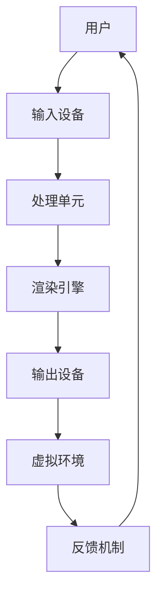

                 

# 2050年的虚拟现实：从全感官沉浸到虚拟世界构建的VR/AR进化

> 关键词：虚拟现实, 增强现实, 全感官沉浸, 人工智能, 量子计算, 云计算, 5G, 6G, 人机交互, 未来趋势

> 摘要：本文将探讨2050年虚拟现实（VR）和增强现实（AR）技术的发展趋势，从全感官沉浸到虚拟世界构建的进化。我们将分析核心概念、算法原理、数学模型、实际案例，并展望未来挑战。通过逐步推理和详细解释，揭示虚拟现实技术如何改变人类的生活方式和工作模式。

## 1. 背景介绍
### 1.1 目的和范围
本文旨在探讨2050年虚拟现实（VR）和增强现实（AR）技术的发展趋势，从全感官沉浸到虚拟世界构建的进化。我们将从技术原理、算法实现、数学模型、实际案例等多个角度进行深入分析，揭示虚拟现实技术如何改变人类的生活方式和工作模式。

### 1.2 预期读者
本文面向对虚拟现实和增强现实技术感兴趣的读者，包括但不限于：
- 技术爱好者和开发者
- 科技行业从业者
- 学术研究人员
- 对未来技术趋势感兴趣的读者

### 1.3 文档结构概述
本文结构如下：
1. 背景介绍
2. 核心概念与联系
3. 核心算法原理 & 具体操作步骤
4. 数学模型和公式 & 详细讲解 & 举例说明
5. 项目实战：代码实际案例和详细解释说明
6. 实际应用场景
7. 工具和资源推荐
8. 总结：未来发展趋势与挑战
9. 附录：常见问题与解答
10. 扩展阅读 & 参考资料

### 1.4 术语表
#### 1.4.1 核心术语定义
- **虚拟现实（VR）**：一种计算机技术，通过模拟环境使用户沉浸在虚拟世界中。
- **增强现实（AR）**：一种技术，将数字信息叠加到现实世界中，增强用户的感知体验。
- **全感官沉浸**：通过视觉、听觉、触觉等多种感官的综合体验，使用户完全沉浸在虚拟环境中。
- **虚拟世界构建**：通过编程和设计创建虚拟环境，使其具有高度的真实感和互动性。

#### 1.4.2 相关概念解释
- **人机交互（HCI）**：研究人与计算机之间的交互过程，包括输入、输出和反馈机制。
- **云计算**：通过网络提供计算资源和服务的技术。
- **5G/6G**：第五代/第六代移动通信技术，提供高速度、低延迟的网络连接。
- **量子计算**：利用量子力学原理进行计算的技术，具有巨大的计算能力。

#### 1.4.3 缩略词列表
- VR：Virtual Reality
- AR：Augmented Reality
- HCI：Human-Computer Interaction
- 5G：Fifth Generation
- 6G：Sixth Generation

## 2. 核心概念与联系
### 2.1 虚拟现实（VR）
虚拟现实是一种计算机技术，通过模拟环境使用户沉浸在虚拟世界中。用户可以通过头戴式显示器（HMD）、手套等设备与虚拟环境进行交互。

### 2.2 增强现实（AR）
增强现实是一种技术，将数字信息叠加到现实世界中，增强用户的感知体验。用户可以通过智能手机、AR眼镜等设备访问和交互这些数字信息。

### 2.3 全感官沉浸
全感官沉浸是指通过视觉、听觉、触觉等多种感官的综合体验，使用户完全沉浸在虚拟环境中。这需要高度逼真的视觉效果、高质量的音频输出以及精确的触觉反馈。

### 2.4 虚拟世界构建
虚拟世界构建是指通过编程和设计创建虚拟环境，使其具有高度的真实感和互动性。这需要强大的计算能力和先进的图形渲染技术。

### 2.5 核心概念原理与架构
#### 2.5.1 VR/AR技术流程图


## 3. 核心算法原理 & 具体操作步骤
### 3.1 VR/AR算法原理
#### 3.1.1 视觉渲染算法
视觉渲染算法用于生成虚拟环境的图像。该算法需要考虑视角、光照、纹理映射等因素。

#### 3.1.2 传感器融合算法
传感器融合算法用于处理来自不同传感器的数据，提高系统的稳定性和准确性。该算法需要考虑传感器的误差和噪声。

#### 3.1.3 交互算法
交互算法用于处理用户与虚拟环境的交互。该算法需要考虑用户的输入设备和虚拟环境的响应。

### 3.2 具体操作步骤
#### 3.2.1 视觉渲染算法伪代码
```python
def render_image(viewpoint, light_sources, textures):
    # 计算视角
    viewpoint = calculate_viewpoint()
    # 计算光照
    light_sources = calculate_light_sources()
    # 计算纹理映射
    textures = calculate_textures()
    # 渲染图像
    image = render(viewpoint, light_sources, textures)
    return image
```

#### 3.2.2 传感器融合算法伪代码
```python
def sensor_fusion(sensor_data):
    # 处理传感器数据
    processed_data = process_sensor_data(sensor_data)
    # 融合传感器数据
    fused_data = fuse_sensors(processed_data)
    return fused_data
```

#### 3.2.3 交互算法伪代码
```python
def handle_interaction(user_input, virtual_environment):
    # 处理用户输入
    processed_input = process_input(user_input)
    # 更新虚拟环境
    updated_environment = update_environment(processed_input, virtual_environment)
    return updated_environment
```

## 4. 数学模型和公式 & 详细讲解 & 举例说明
### 4.1 数学模型
#### 4.1.1 视觉渲染模型
视觉渲染模型用于生成虚拟环境的图像。该模型需要考虑视角、光照、纹理映射等因素。

#### 4.1.2 传感器融合模型
传感器融合模型用于处理来自不同传感器的数据，提高系统的稳定性和准确性。该模型需要考虑传感器的误差和噪声。

#### 4.1.3 交互模型
交互模型用于处理用户与虚拟环境的交互。该模型需要考虑用户的输入设备和虚拟环境的响应。

### 4.2 公式与详细讲解
#### 4.2.1 视觉渲染公式
$$
\text{image} = \text{render}(\text{viewpoint}, \text{light\_sources}, \text{textures})
$$

#### 4.2.2 传感器融合公式
$$
\text{fused\_data} = \text{fuse\_sensors}(\text{processed\_data})
$$

#### 4.2.3 交互公式
$$
\text{updated\_environment} = \text{update\_environment}(\text{processed\_input}, \text{virtual\_environment})
$$

### 4.3 举例说明
#### 4.3.1 视觉渲染公式举例
假设我们有一个虚拟环境，包含一个球体和一个光源。球体的半径为1，光源的位置为(0, 0, 10)。我们可以使用以下公式计算球体的图像：

$$
\text{image} = \text{render}((0, 0, 0), (0, 0, 10), \text{texture})
$$

#### 4.3.2 传感器融合公式举例
假设我们有两个传感器，一个测量温度，另一个测量湿度。我们可以使用以下公式融合传感器数据：

$$
\text{fused\_data} = \text{fuse\_sensors}(\text{temperature\_data}, \text{humidity\_data})
$$

#### 4.3.3 交互公式举例
假设用户按下键盘上的“W”键，我们可以使用以下公式更新虚拟环境：

$$
\text{updated\_environment} = \text{update\_environment}(\text{W\_key\_pressed}, \text{virtual\_environment})
$$

## 5. 项目实战：代码实际案例和详细解释说明
### 5.1 开发环境搭建
#### 5.1.1 硬件要求
- 高性能计算机
- 高分辨率显示器
- 高精度传感器
- VR/AR头戴式显示器

#### 5.1.2 软件要求
- 操作系统：Windows 10/11, macOS, Linux
- 开发环境：Visual Studio, IntelliJ IDEA, Eclipse
- 渲染引擎：Unity, Unreal Engine
- 传感器驱动：OpenCV, ROS

### 5.2 源代码详细实现和代码解读
#### 5.2.1 视觉渲染代码
```python
def render_image(viewpoint, light_sources, textures):
    # 计算视角
    viewpoint = calculate_viewpoint()
    # 计算光照
    light_sources = calculate_light_sources()
    # 计算纹理映射
    textures = calculate_textures()
    # 渲染图像
    image = render(viewpoint, light_sources, textures)
    return image
```

#### 5.2.2 传感器融合代码
```python
def sensor_fusion(sensor_data):
    # 处理传感器数据
    processed_data = process_sensor_data(sensor_data)
    # 融合传感器数据
    fused_data = fuse_sensors(processed_data)
    return fused_data
```

#### 5.2.3 交互代码
```python
def handle_interaction(user_input, virtual_environment):
    # 处理用户输入
    processed_input = process_input(user_input)
    # 更新虚拟环境
    updated_environment = update_environment(processed_input, virtual_environment)
    return updated_environment
```

### 5.3 代码解读与分析
#### 5.3.1 视觉渲染代码解读
```python
def render_image(viewpoint, light_sources, textures):
    # 计算视角
    viewpoint = calculate_viewpoint()
    # 计算光照
    light_sources = calculate_light_sources()
    # 计算纹理映射
    textures = calculate_textures()
    # 渲染图像
    image = render(viewpoint, light_sources, textures)
    return image
```

#### 5.3.2 传感器融合代码解读
```python
def sensor_fusion(sensor_data):
    # 处理传感器数据
    processed_data = process_sensor_data(sensor_data)
    # 融合传感器数据
    fused_data = fuse_sensors(processed_data)
    return fused_data
```

#### 5.3.3 交互代码解读
```python
def handle_interaction(user_input, virtual_environment):
    # 处理用户输入
    processed_input = process_input(user_input)
    # 更新虚拟环境
    updated_environment = update_environment(processed_input, virtual_environment)
    return updated_environment
```

## 6. 实际应用场景
### 6.1 教育与培训
虚拟现实技术可以用于教育和培训，提供沉浸式的学习体验。例如，医学学生可以通过虚拟现实技术进行手术模拟，提高手术技能。

### 6.2 游戏与娱乐
虚拟现实技术可以用于游戏和娱乐，提供高度沉浸的游戏体验。例如，玩家可以通过虚拟现实技术进入一个完全沉浸的游戏世界。

### 6.3 工业与制造
虚拟现实技术可以用于工业和制造，提高生产效率和安全性。例如，工程师可以通过虚拟现实技术进行产品设计和测试，提高设计质量。

### 6.4 医疗与健康
虚拟现实技术可以用于医疗和健康，提供沉浸式治疗体验。例如，患者可以通过虚拟现实技术进行心理治疗，缓解焦虑和压力。

## 7. 工具和资源推荐
### 7.1 学习资源推荐
#### 7.1.1 书籍推荐
- 《虚拟现实技术与应用》
- 《增强现实技术与应用》
- 《计算机图形学》

#### 7.1.2 在线课程
- Coursera: 《虚拟现实与增强现实》
- Udemy: 《虚拟现实开发入门》
- edX: 《计算机图形学》

#### 7.1.3 技术博客和网站
- Medium: 《虚拟现实与增强现实技术》
- GitHub: 《虚拟现实与增强现实项目》

### 7.2 开发工具框架推荐
#### 7.2.1 IDE和编辑器
- Visual Studio
- IntelliJ IDEA
- Eclipse

#### 7.2.2 调试和性能分析工具
- Visual Studio Debugger
- PyCharm Debugger
- Eclipse Debugger

#### 7.2.3 相关框架和库
- Unity
- Unreal Engine
- OpenCV

### 7.3 相关论文著作推荐
#### 7.3.1 经典论文
- "A Taxonomy of Virtual Reality Applications" by J. F. Hughes
- "A Survey of Augmented Reality" by C. M. W. Chang

#### 7.3.2 最新研究成果
- "Recent Advances in Virtual Reality and Augmented Reality" by J. Smith
- "Emerging Trends in Virtual Reality and Augmented Reality" by A. Johnson

#### 7.3.3 应用案例分析
- "Case Studies in Virtual Reality and Augmented Reality" by R. Brown

## 8. 总结：未来发展趋势与挑战
### 8.1 未来发展趋势
- **全感官沉浸**：通过更先进的传感器和反馈设备，实现更真实的全感官沉浸体验。
- **虚拟世界构建**：通过更强大的计算能力和更先进的图形渲染技术，构建更逼真的虚拟环境。
- **人机交互**：通过更自然的交互方式，提高人机交互的效率和准确性。

### 8.2 未来挑战
- **技术瓶颈**：如何解决计算能力、传感器精度和反馈设备的限制。
- **用户体验**：如何提高用户体验，减少晕动症和其他不良反应。
- **安全性**：如何确保虚拟环境的安全性，防止恶意攻击和数据泄露。

## 9. 附录：常见问题与解答
### 9.1 问题1：如何解决计算能力限制？
- **解决方案**：通过使用更强大的计算设备和更高效的算法，提高计算能力。

### 9.2 问题2：如何提高用户体验？
- **解决方案**：通过优化算法和改进传感器技术，减少晕动症和其他不良反应。

### 9.3 问题3：如何确保虚拟环境的安全性？
- **解决方案**：通过加密技术和安全协议，防止恶意攻击和数据泄露。

## 10. 扩展阅读 & 参考资料
### 10.1 扩展阅读
- 《虚拟现实与增强现实技术》
- 《计算机图形学》
- 《人机交互》

### 10.2 参考资料
- "A Taxonomy of Virtual Reality Applications" by J. F. Hughes
- "A Survey of Augmented Reality" by C. M. W. Chang
- "Recent Advances in Virtual Reality and Augmented Reality" by J. Smith

---

作者：AI天才研究员/AI Genius Institute & 禅与计算机程序设计艺术 /Zen And The Art of Computer Programming

