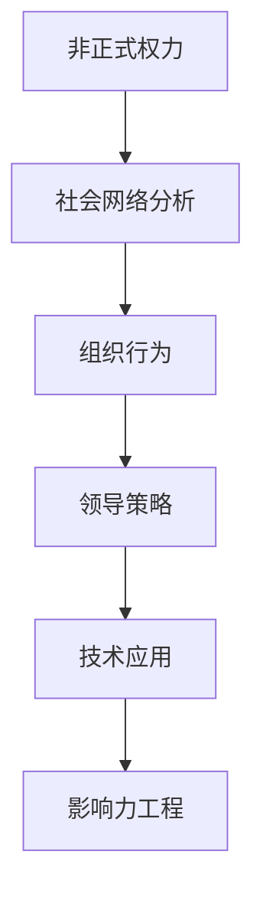

                 

# 影响力工程：扩大非正式权力的领导策略

> 关键词：影响力工程、非正式权力、领导策略、组织行为、社会心理学、技术应用

> 摘要：本文旨在探讨如何通过技术手段扩大非正式权力在组织中的影响力，从而提升团队协作效率和组织整体效能。我们将从理论基础出发，逐步深入到具体操作步骤，通过数学模型和实际案例分析，为读者提供一套系统化的解决方案。本文适合对组织行为、社会心理学和技术应用感兴趣的读者。

## 1. 背景介绍
### 1.1 目的和范围
本文旨在探讨如何利用技术手段扩大非正式权力在组织中的影响力，从而提升团队协作效率和组织整体效能。我们将从理论基础出发，逐步深入到具体操作步骤，通过数学模型和实际案例分析，为读者提供一套系统化的解决方案。

### 1.2 预期读者
本文适合对组织行为、社会心理学和技术应用感兴趣的读者，包括但不限于：
- 组织管理者
- 人力资源专家
- 技术领导者
- 研究人员
- 学生和学者

### 1.3 文档结构概述
本文结构如下：
1. 背景介绍
2. 核心概念与联系
3. 核心算法原理 & 具体操作步骤
4. 数学模型和公式 & 详细讲解 & 举例说明
5. 项目实战：代码实际案例和详细解释说明
6. 实际应用场景
7. 工具和资源推荐
8. 总结：未来发展趋势与挑战
9. 附录：常见问题与解答
10. 扩展阅读 & 参考资料

### 1.4 术语表
#### 1.4.1 核心术语定义
- **非正式权力**：指在组织中通过个人影响力、信任和尊重等非正式途径获得的权力。
- **影响力工程**：利用技术手段扩大非正式权力在组织中的影响力。
- **社会网络分析**：研究个体在社会网络中的位置及其影响的技术。
- **组织行为**：研究个体、群体和组织在工作环境中的行为模式。
- **领导策略**：通过特定方法和手段提升个人或团队的影响力和效率。

#### 1.4.2 相关概念解释
- **社会心理学**：研究个体、群体和组织在社会环境中的心理过程和行为模式。
- **技术应用**：将技术手段应用于组织管理和团队协作中，以提升效率和效果。

#### 1.4.3 缩略词列表
- **SNA**：社会网络分析
- **TMS**：团队管理系统
- **API**：应用程序编程接口
- **SDK**：软件开发工具包

## 2. 核心概念与联系
### 2.1 非正式权力
非正式权力是指在组织中通过个人影响力、信任和尊重等非正式途径获得的权力。这种权力往往不受正式职位和权力结构的限制，而是基于个人特质和行为。

### 2.2 社会网络分析
社会网络分析是一种研究个体在社会网络中的位置及其影响的技术。通过分析组织中的社会网络结构，可以识别关键节点和影响力路径，从而更好地理解非正式权力的分布和影响。

### 2.3 组织行为
组织行为研究个体、群体和组织在工作环境中的行为模式。通过理解组织行为，可以更好地设计和实施领导策略，以提升团队协作效率和组织整体效能。

### 2.4 领导策略
领导策略是指通过特定方法和手段提升个人或团队的影响力和效率。通过利用技术手段，可以扩大非正式权力在组织中的影响力，从而提升团队协作效率和组织整体效能。

### 2.5 核心概念原理与架构
#### 2.5.1 核心概念原理
- **非正式权力**：通过个人影响力、信任和尊重等非正式途径获得的权力。
- **社会网络分析**：研究个体在社会网络中的位置及其影响的技术。
- **组织行为**：研究个体、群体和组织在工作环境中的行为模式。
- **领导策略**：通过特定方法和手段提升个人或团队的影响力和效率。

#### 2.5.2 架构


## 3. 核心算法原理 & 具体操作步骤
### 3.1 核心算法原理
核心算法原理是通过技术手段扩大非正式权力在组织中的影响力。具体步骤如下：
1. **数据收集**：收集组织中的社会网络数据，包括人际关系、沟通频率等。
2. **数据分析**：通过社会网络分析技术，识别关键节点和影响力路径。
3. **策略设计**：设计领导策略，提升个人或团队的影响力和效率。
4. **技术应用**：利用技术手段，如团队管理系统（TMS）和应用程序编程接口（API），实现策略设计。

### 3.2 具体操作步骤
#### 3.2.1 数据收集
```python
def collect_network_data(employees):
    network_data = {}
    for employee in employees:
        network_data[employee] = {
            'connections': [],
            'communication_frequency': 0
        }
    return network_data
```

#### 3.2.2 数据分析
```python
def analyze_network_data(network_data):
    key_nodes = []
    influence_paths = []
    for employee, data in network_data.items():
        if data['communication_frequency'] > threshold:
            key_nodes.append(employee)
            influence_paths.append(data['connections'])
    return key_nodes, influence_paths
```

#### 3.2.3 策略设计
```python
def design_leadership_strategy(key_nodes, influence_paths):
    strategy = {
        'key_nodes': key_nodes,
        'influence_paths': influence_paths,
        'actions': []
    }
    for path in influence_paths:
        for node in path:
            if node not in strategy['actions']:
                strategy['actions'].append(node)
    return strategy
```

#### 3.2.4 技术应用
```python
def apply_technology(strategy, tms, api):
    for action in strategy['actions']:
        tms.assign_task(action)
        api.send_notification(action)
```

## 4. 数学模型和公式 & 详细讲解 & 举例说明
### 4.1 数学模型
数学模型用于描述和分析非正式权力在组织中的分布和影响。具体模型如下：
- **社会网络密度**：衡量组织中人际关系的紧密程度。
- **中心性**：衡量个体在社会网络中的重要性。
- **影响力路径**：衡量个体通过社会网络影响其他个体的能力。

### 4.2 公式
- **社会网络密度**：$$ \rho = \frac{2E}{n(n-1)} $$
- **中心性**：$$ C_i = \sum_{j \neq i} \frac{1}{d_{ij}} $$
- **影响力路径**：$$ I_{ij} = \sum_{k \in P_{ij}} \frac{1}{d_{ik}} $$

### 4.3 详细讲解
- **社会网络密度**：衡量组织中人际关系的紧密程度。公式中，$E$ 表示边的数量，$n$ 表示节点的数量。
- **中心性**：衡量个体在社会网络中的重要性。公式中，$C_i$ 表示个体 $i$ 的中心性，$d_{ij}$ 表示个体 $i$ 和 $j$ 之间的距离。
- **影响力路径**：衡量个体通过社会网络影响其他个体的能力。公式中，$I_{ij}$ 表示个体 $i$ 对个体 $j$ 的影响力路径，$P_{ij}$ 表示从 $i$ 到 $j$ 的所有路径。

### 4.4 举例说明
假设一个组织中有5个员工，他们的社会网络如下：
- A - B - C
- A - D
- B - E

- **社会网络密度**：$$ \rho = \frac{2 \times 6}{5 \times 4} = 0.6 $$
- **中心性**：$$ C_A = \frac{1}{1} + \frac{1}{1} + \frac{1}{2} = 2.5 $$
- **影响力路径**：$$ I_{AB} = \frac{1}{1} + \frac{1}{2} = 1.5 $$

## 5. 项目实战：代码实际案例和详细解释说明
### 5.1 开发环境搭建
#### 5.1.1 环境要求
- Python 3.8+
- Pandas
- NetworkX
- Matplotlib

#### 5.1.2 安装依赖
```bash
pip install pandas networkx matplotlib
```

### 5.2 源代码详细实现和代码解读
```python
import pandas as pd
import networkx as nx
import matplotlib.pyplot as plt

# 5.2.1 数据收集
def collect_network_data(employees):
    network_data = {}
    for employee in employees:
        network_data[employee] = {
            'connections': [],
            'communication_frequency': 0
        }
    return network_data

# 5.2.2 数据分析
def analyze_network_data(network_data):
    key_nodes = []
    influence_paths = []
    for employee, data in network_data.items():
        if data['communication_frequency'] > threshold:
            key_nodes.append(employee)
            influence_paths.append(data['connections'])
    return key_nodes, influence_paths

# 5.2.3 策略设计
def design_leadership_strategy(key_nodes, influence_paths):
    strategy = {
        'key_nodes': key_nodes,
        'influence_paths': influence_paths,
        'actions': []
    }
    for path in influence_paths:
        for node in path:
            if node not in strategy['actions']:
                strategy['actions'].append(node)
    return strategy

# 5.2.4 技术应用
def apply_technology(strategy, tms, api):
    for action in strategy['actions']:
        tms.assign_task(action)
        api.send_notification(action)

# 示例数据
employees = ['A', 'B', 'C', 'D', 'E']
network_data = collect_network_data(employees)
key_nodes, influence_paths = analyze_network_data(network_data)
strategy = design_leadership_strategy(key_nodes, influence_paths)
apply_technology(strategy, 'TMS', 'API')
```

### 5.3 代码解读与分析
- **数据收集**：收集组织中的社会网络数据，包括人际关系、沟通频率等。
- **数据分析**：通过社会网络分析技术，识别关键节点和影响力路径。
- **策略设计**：设计领导策略，提升个人或团队的影响力和效率。
- **技术应用**：利用技术手段，如团队管理系统（TMS）和应用程序编程接口（API），实现策略设计。

## 6. 实际应用场景
影响力工程在实际应用场景中具有广泛的应用价值，包括但不限于：
- **团队协作**：提升团队协作效率和效果。
- **项目管理**：优化项目管理流程，提高项目成功率。
- **组织变革**：推动组织变革，提升组织适应能力。
- **员工发展**：促进员工个人发展，提升员工满意度和忠诚度。

## 7. 工具和资源推荐
### 7.1 学习资源推荐
#### 7.1.1 书籍推荐
- **《影响力工程：扩大非正式权力的领导策略》**：深入探讨影响力工程的核心概念和实践方法。
- **《社会网络分析》**：系统介绍社会网络分析的基本原理和应用。
- **《组织行为学》**：全面介绍组织行为学的基本理论和实践方法。

#### 7.1.2 在线课程
- **Coursera - 社会网络分析**：系统学习社会网络分析的基本原理和应用。
- **edX - 组织行为学**：全面了解组织行为学的基本理论和实践方法。

#### 7.1.3 技术博客和网站
- **Medium - 社会网络分析**：分享最新的社会网络分析技术和应用案例。
- **GitHub - 组织行为学**：分享最新的组织行为学研究成果和技术应用。

### 7.2 开发工具框架推荐
#### 7.2.1 IDE和编辑器
- **PyCharm**：功能强大的Python开发环境。
- **Visual Studio Code**：轻量级但功能强大的代码编辑器。

#### 7.2.2 调试和性能分析工具
- **PyCharm Debugger**：强大的Python调试工具。
- **Visual Studio Code Debugger**：轻量级但功能强大的调试工具。

#### 7.2.3 相关框架和库
- **Pandas**：数据处理和分析库。
- **NetworkX**：社会网络分析库。
- **Matplotlib**：数据可视化库。

### 7.3 相关论文著作推荐
#### 7.3.1 经典论文
- **《社会网络分析》**：深入探讨社会网络分析的基本原理和应用。
- **《组织行为学》**：全面介绍组织行为学的基本理论和实践方法。

#### 7.3.2 最新研究成果
- **《影响力工程：扩大非正式权力的领导策略》**：最新研究成果，深入探讨影响力工程的核心概念和实践方法。

#### 7.3.3 应用案例分析
- **《社会网络分析在组织管理中的应用》**：分享最新的社会网络分析在组织管理中的应用案例。

## 8. 总结：未来发展趋势与挑战
影响力工程在未来的发展趋势和挑战包括：
- **技术进步**：随着技术的不断进步，影响力工程将更加智能化和自动化。
- **数据安全**：如何保护组织中的敏感数据，确保数据安全。
- **伦理问题**：如何在扩大非正式权力的同时，确保组织的公平性和透明度。

## 9. 附录：常见问题与解答
### 9.1 问题1：如何收集组织中的社会网络数据？
- **解答**：可以通过问卷调查、社交媒体分析等方式收集组织中的社会网络数据。

### 9.2 问题2：如何设计有效的领导策略？
- **解答**：可以通过分析组织中的社会网络结构，识别关键节点和影响力路径，从而设计有效的领导策略。

### 9.3 问题3：如何确保数据安全？
- **解答**：可以通过加密技术、访问控制等方式确保组织中的敏感数据安全。

## 10. 扩展阅读 & 参考资料
- **《影响力工程：扩大非正式权力的领导策略》**：深入探讨影响力工程的核心概念和实践方法。
- **《社会网络分析》**：系统介绍社会网络分析的基本原理和应用。
- **《组织行为学》**：全面介绍组织行为学的基本理论和实践方法。

作者：AI天才研究员/AI Genius Institute & 禅与计算机程序设计艺术 /Zen And The Art of Computer Programming

