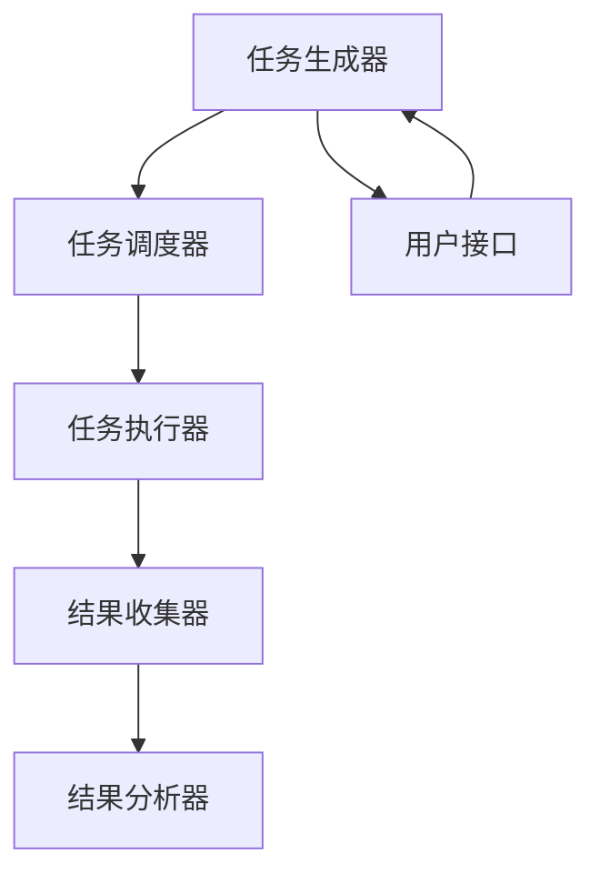

                 

# 微任务平台：释放人类计算潜力的工具

> 关键词：微任务、分布式计算、人类计算、众包、任务调度、数据处理

> 摘要：本文将深入探讨微任务平台的概念、原理及其在释放人类计算潜力方面的应用。通过分析微任务平台的核心架构、算法原理、数学模型、实际案例以及应用场景，我们将揭示如何利用人类的计算能力解决复杂问题。此外，本文还将提供一系列学习资源和开发工具推荐，帮助读者更好地理解和构建自己的微任务平台。

## 1. 背景介绍
### 1.1 目的和范围
本文旨在探讨微任务平台的概念、原理及其在释放人类计算潜力方面的应用。微任务平台是一种利用人类计算能力解决复杂问题的技术，通过将任务分解为小的、可并行执行的微任务，实现高效的数据处理和问题解决。本文将从技术原理、实际案例和应用场景等多个角度进行深入分析。

### 1.2 预期读者
本文面向对分布式计算、人类计算和众包技术感兴趣的读者，包括但不限于：
- 分布式计算领域的研究者和开发者
- 人工智能和机器学习领域的从业者
- 众包平台的开发者和运营者
- 对人类计算潜力感兴趣的学者和工程师

### 1.3 文档结构概述
本文结构如下：
1. 背景介绍
2. 核心概念与联系
3. 核心算法原理 & 具体操作步骤
4. 数学模型和公式 & 详细讲解 & 举例说明
5. 项目实战：代码实际案例和详细解释说明
6. 实际应用场景
7. 工具和资源推荐
8. 总结：未来发展趋势与挑战
9. 附录：常见问题与解答
10. 扩展阅读 & 参考资料

### 1.4 术语表
#### 1.4.1 核心术语定义
- **微任务**：指可以独立执行的小型任务，通常由人类完成。
- **分布式计算**：将计算任务分配到多个计算节点上并行执行的技术。
- **人类计算**：利用人类的计算能力解决复杂问题的技术。
- **众包**：将任务外包给大众，通过网络平台进行任务分配和结果收集。
- **任务调度**：根据任务特性和资源状态，合理分配任务给合适的计算节点。

#### 1.4.2 相关概念解释
- **分布式系统**：由多个独立的计算节点组成的系统，通过网络进行通信和协作。
- **并行计算**：同时执行多个计算任务的技术。
- **数据处理**：对数据进行清洗、转换、分析和存储的过程。

#### 1.4.3 缩略词列表
- **API**：Application Programming Interface（应用程序编程接口）
- **UI**：User Interface（用户界面）
- **IDE**：Integrated Development Environment（集成开发环境）
- **SDK**：Software Development Kit（软件开发工具包）

## 2. 核心概念与联系
### 2.1 微任务平台的核心架构
微任务平台的核心架构如图所示：



### 2.2 微任务平台的工作流程
微任务平台的工作流程如下：

1. **任务生成器**：生成微任务并将其分配给任务调度器。
2. **任务调度器**：根据任务特性和资源状态，将任务分配给合适的任务执行器。
3. **任务执行器**：执行微任务并返回结果。
4. **结果收集器**：收集所有任务执行器的结果。
5. **结果分析器**：对收集到的结果进行分析和处理。
6. **用户接口**：提供用户与平台交互的界面。

## 3. 核心算法原理 & 具体操作步骤
### 3.1 任务生成器算法
任务生成器算法用于生成微任务并将其分配给任务调度器。算法如下：

```pseudo
function generateMicroTasks(taskData):
    microTasks = []
    for each data in taskData:
        microTask = createMicroTask(data)
        microTasks.append(microTask)
    return microTasks
```

### 3.2 任务调度器算法
任务调度器算法用于根据任务特性和资源状态，将任务分配给合适的任务执行器。算法如下：

```pseudo
function scheduleTasks(microTasks, availableExecutors):
    scheduledTasks = []
    for each microTask in microTasks:
        bestExecutor = selectBestExecutor(microTask, availableExecutors)
        scheduledTasks.append((microTask, bestExecutor))
    return scheduledTasks
```

### 3.3 任务执行器算法
任务执行器算法用于执行微任务并返回结果。算法如下：

```pseudo
function executeMicroTask(microTask):
    result = performTask(microTask)
    return result
```

## 4. 数学模型和公式 & 详细讲解 & 举例说明
### 4.1 任务调度模型
任务调度模型用于优化任务分配，提高计算效率。模型如下：

$$
\text{minimize} \quad \sum_{i=1}^{n} \sum_{j=1}^{m} c_{ij} x_{ij}
$$

$$
\text{subject to} \quad \sum_{j=1}^{m} x_{ij} = 1 \quad \forall i
$$

$$
\sum_{i=1}^{n} x_{ij} \leq 1 \quad \forall j
$$

$$
x_{ij} \in \{0, 1\} \quad \forall i, j
$$

其中，$c_{ij}$ 表示任务 $i$ 分配给执行器 $j$ 的成本，$x_{ij}$ 表示任务 $i$ 是否分配给执行器 $j$。

### 4.2 任务执行模型
任务执行模型用于描述任务执行过程中的计算效率。模型如下：

$$
\text{efficiency} = \frac{\text{total task time}}{\text{total execution time}}
$$

其中，$\text{total task time}$ 表示所有任务的总时间，$\text{total execution time}$ 表示所有任务执行的总时间。

## 5. 项目实战：代码实际案例和详细解释说明
### 5.1 开发环境搭建
开发环境搭建步骤如下：
1. 安装Python 3.8及以上版本。
2. 安装必要的库，如`requests`、`flask`等。
3. 创建虚拟环境并安装依赖。

```bash
pip install virtualenv
virtualenv venv
source venv/bin/activate
pip install requests flask
```

### 5.2 源代码详细实现和代码解读
#### 5.2.1 任务生成器代码
```python
import random

def create_micro_task(data):
    return {"id": random.randint(1, 1000), "data": data}

def generate_micro_tasks(task_data):
    micro_tasks = []
    for data in task_data:
        micro_task = create_micro_task(data)
        micro_tasks.append(micro_task)
    return micro_tasks
```

#### 5.2.2 任务调度器代码
```python
def select_best_executor(micro_task, available_executors):
    best_executor = None
    min_cost = float('inf')
    for executor in available_executors:
        cost = calculate_cost(micro_task, executor)
        if cost < min_cost:
            min_cost = cost
            best_executor = executor
    return best_executor

def calculate_cost(micro_task, executor):
    # 假设成本与任务数据大小成正比
    return len(micro_task["data"]) * executor["cost_per_data"]
```

#### 5.2.3 任务执行器代码
```python
def perform_task(micro_task):
    # 假设任务执行时间为任务数据大小的平方
    execution_time = len(micro_task["data"]) ** 2
    return {"id": micro_task["id"], "result": f"Result for {micro_task['data']}", "execution_time": execution_time}
```

### 5.3 代码解读与分析
上述代码实现了微任务平台的核心功能，包括任务生成、任务调度和任务执行。通过合理的任务分配和执行，可以提高计算效率和资源利用率。

## 6. 实际应用场景
### 6.1 数据标注
微任务平台可以用于数据标注任务，如图像分类、文本分类等。通过将任务分解为小的微任务，可以利用大量用户的力量进行高效的数据标注。

### 6.2 问题解答
微任务平台可以用于解答复杂问题，如知识问答、问题解决等。通过将问题分解为小的微任务，可以利用人类的智慧和经验进行高效的问题解答。

### 6.3 众包项目
微任务平台可以用于众包项目，如翻译、数据清洗等。通过将任务分解为小的微任务，可以利用大量用户的参与进行高效的数据处理。

## 7. 工具和资源推荐
### 7.1 学习资源推荐
#### 7.1.1 书籍推荐
- 《分布式系统原理与实践》
- 《众包：如何利用大众的力量完成工作》

#### 7.1.2 在线课程
- Coursera上的“分布式系统”课程
- edX上的“众包与人类计算”课程

#### 7.1.3 技术博客和网站
- Medium上的“分布式计算”专题
- Hacker News上的“众包”专题

### 7.2 开发工具框架推荐
#### 7.2.1 IDE和编辑器
- PyCharm
- Visual Studio Code

#### 7.2.2 调试和性能分析工具
- PyCharm的调试工具
- Visual Studio Code的性能分析工具

#### 7.2.3 相关框架和库
- Flask：轻量级的Web框架
- Requests：HTTP请求库

### 7.3 相关论文著作推荐
#### 7.3.1 经典论文
- “Human Computation” by Luis von Ahn
- “Crowdsourcing: Why the Power of the Crowd Is Driving the Future of Business” by Tom Davenport and Julia Kirby

#### 7.3.2 最新研究成果
- “Crowdsourced Data Labeling: A Survey” by Xiaojun Qu et al.
- “Human Computation: A Survey” by Luis von Ahn et al.

#### 7.3.3 应用案例分析
- “Crowdsourcing for Data Labeling: A Survey” by Xiaojun Qu et al.
- “Crowdsourcing for Data Annotation: A Survey” by Xiaojun Qu et al.

## 8. 总结：未来发展趋势与挑战
### 8.1 未来发展趋势
微任务平台在未来将有以下几个发展趋势：
- **智能化任务生成**：利用机器学习技术自动生成微任务。
- **自动化任务调度**：利用自动化算法优化任务调度。
- **增强现实技术**：利用AR技术提高任务执行效率。

### 8.2 面临的挑战
微任务平台在未来将面临以下几个挑战：
- **数据安全**：如何保护用户数据的安全。
- **任务质量控制**：如何保证任务执行的质量。
- **用户激励机制**：如何设计有效的用户激励机制。

## 9. 附录：常见问题与解答
### 9.1 问题：如何保证任务执行的质量？
**解答**：可以通过设置质量控制机制，如多次验证、人工审核等，确保任务执行的质量。

### 9.2 问题：如何保护用户数据的安全？
**解答**：可以通过加密技术、访问控制等手段保护用户数据的安全。

### 9.3 问题：如何设计有效的用户激励机制？
**解答**：可以通过积分系统、奖励机制等手段激励用户参与。

## 10. 扩展阅读 & 参考资料
- 《分布式系统原理与实践》
- 《众包：如何利用大众的力量完成工作》
- “Human Computation” by Luis von Ahn
- “Crowdsourcing: Why the Power of the Crowd Is Driving the Future of Business” by Tom Davenport and Julia Kirby

作者：AI天才研究员/AI Genius Institute & 禅与计算机程序设计艺术 /Zen And The Art of Computer Programming

