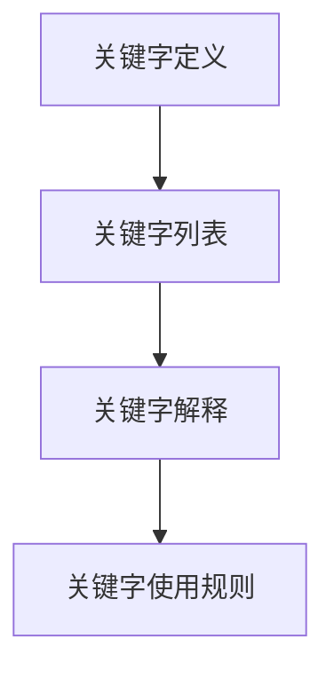
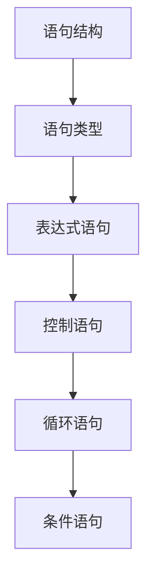
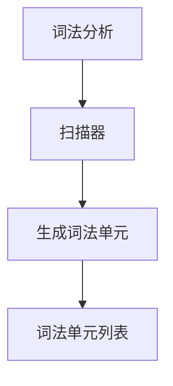
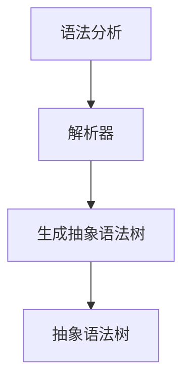
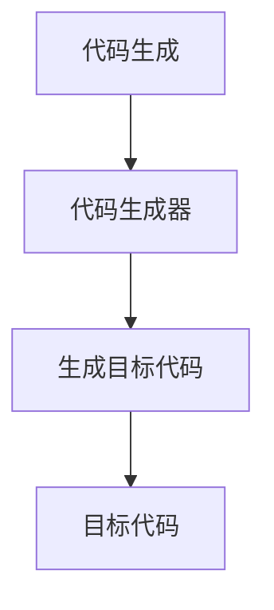
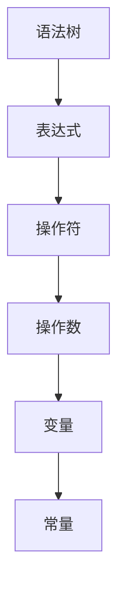

                 

# 打造个人标志性语言：让人一听就想到你

> 关键词：个人标志性语言、编程语言设计、语法设计、编译器实现、代码风格、编程哲学

> 摘要：本文旨在探讨如何设计一种个人标志性编程语言，使其不仅能够满足特定的编程需求，还能体现设计者的编程哲学和风格。通过逐步分析和推理，我们将从语言设计的初衷、核心概念、算法原理、数学模型、实际案例、应用场景、工具推荐等多个方面进行深入探讨，最终帮助读者理解如何构建一种独特的编程语言。

## 1. 背景介绍
### 1.1 目的和范围
本文旨在探讨如何设计一种个人标志性编程语言，使其不仅能够满足特定的编程需求，还能体现设计者的编程哲学和风格。我们将从语言设计的初衷、核心概念、算法原理、数学模型、实际案例、应用场景、工具推荐等多个方面进行深入探讨。

### 1.2 预期读者
本文预期读者为对编程语言设计感兴趣的技术人员、编程爱好者、软件架构师、CTO以及对编程哲学有深入思考的程序员。读者应具备一定的编程基础和对编程语言设计的基本了解。

### 1.3 文档结构概述
本文结构如下：
1. 背景介绍
2. 核心概念与联系
3. 核心算法原理 & 具体操作步骤
4. 数学模型和公式 & 详细讲解 & 举例说明
5. 项目实战：代码实际案例和详细解释说明
6. 实际应用场景
7. 工具和资源推荐
8. 总结：未来发展趋势与挑战
9. 附录：常见问题与解答
10. 扩展阅读 & 参考资料

### 1.4 术语表
#### 1.4.1 核心术语定义
- **个人标志性语言**：一种由个人设计的编程语言，旨在体现设计者的编程哲学和风格。
- **语法设计**：编程语言的语法规则，包括关键字、语句结构等。
- **编译器实现**：将源代码转换为目标代码的过程。
- **代码风格**：编程代码的书写规范和风格。
- **编程哲学**：编程语言设计者对编程理念和方法论的思考。

#### 1.4.2 相关概念解释
- **编程语言**：一种用于编写计算机程序的符号系统。
- **编译器**：将源代码转换为目标代码的程序。
- **解释器**：逐行执行源代码的程序。

#### 1.4.3 缩略词列表
- **API**：应用程序编程接口
- **IDE**：集成开发环境
- **GUI**：图形用户界面

## 2. 核心概念与联系
### 2.1 语言设计初衷
设计个人标志性语言的初衷是为了体现设计者的编程哲学和风格。这种语言不仅能够满足特定的编程需求，还能在代码中体现设计者的思考和理念。

### 2.2 核心概念
- **语法设计**：定义语言的语法规则，包括关键字、语句结构等。
- **编译器实现**：将源代码转换为目标代码的过程。
- **代码风格**：编程代码的书写规范和风格。
- **编程哲学**：编程语言设计者对编程理念和方法论的思考。

### 2.3 核心概念联系
- **语法设计**和**编译器实现**是语言设计的核心部分，它们共同决定了语言的执行方式。
- **代码风格**和**编程哲学**是语言设计者个人风格的体现，它们影响着语言的使用体验和代码的可读性。

## 3. 核心算法原理 & 具体操作步骤
### 3.1 语法设计
#### 3.1.1 关键字定义


#### 3.1.2 语句结构


### 3.2 编译器实现
#### 3.2.1 词法分析


#### 3.2.2 语法分析


#### 3.2.3 代码生成


## 4. 数学模型和公式 & 详细讲解 & 举例说明
### 4.1 数学模型
#### 4.1.1 语法树模型
语法树是一种表示程序结构的树形数据结构，每个节点代表一个语法元素。



### 4.2 公式与详细讲解
#### 4.2.1 词法分析公式
$$
\text{词法单元} = \text{关键字} \mid \text{标识符} \mid \text{常量} \mid \text{操作符}
$$

#### 4.2.2 语法分析公式
$$
\text{抽象语法树} = \text{表达式} \mid \text{语句} \mid \text{声明}
$$

### 4.3 举例说明
#### 4.3.1 词法分析示例
```python
def tokenize(source_code):
    tokens = []
    current_token = ""
    for char in source_code:
        if char in " \t":
            continue
        elif char in "0123456789":
            current_token += char
        elif char in "+-*/()":
            if current_token:
                tokens.append(current_token)
                current_token = ""
            tokens.append(char)
        else:
            if current_token:
                tokens.append(current_token)
                current_token = ""
            tokens.append(char)
    if current_token:
        tokens.append(current_token)
    return tokens
```

#### 4.3.2 语法分析示例
```python
def parse(tokens):
    def parse_expression(tokens):
        if tokens[0] in "+-":
            operator = tokens.pop(0)
            left = parse_expression(tokens)
            right = parse_expression(tokens)
            return (operator, left, right)
        elif tokens[0] in "0123456789":
            return (int(tokens.pop(0)),)
        else:
            raise SyntaxError("Unexpected token")
    return parse_expression(tokens)
```

## 5. 项目实战：代码实际案例和详细解释说明
### 5.1 开发环境搭建
#### 5.1.1 环境配置
- **操作系统**：Linux/Windows/MacOS
- **编程语言**：Python
- **开发工具**：VSCode

### 5.2 源代码详细实现和代码解读
#### 5.2.1 词法分析代码
```python
def tokenize(source_code):
    tokens = []
    current_token = ""
    for char in source_code:
        if char in " \t":
            continue
        elif char in "0123456789":
            current_token += char
        elif char in "+-*/()":
            if current_token:
                tokens.append(current_token)
                current_token = ""
            tokens.append(char)
        else:
            if current_token:
                tokens.append(current_token)
                current_token = ""
            tokens.append(char)
    if current_token:
        tokens.append(current_token)
    return tokens
```

#### 5.2.2 语法分析代码
```python
def parse(tokens):
    def parse_expression(tokens):
        if tokens[0] in "+-":
            operator = tokens.pop(0)
            left = parse_expression(tokens)
            right = parse_expression(tokens)
            return (operator, left, right)
        elif tokens[0] in "0123456789":
            return (int(tokens.pop(0)),)
        else:
            raise SyntaxError("Unexpected token")
    return parse_expression(tokens)
```

### 5.3 代码解读与分析
#### 5.3.1 词法分析代码解读
- **函数`tokenize`**：将源代码转换为词法单元列表。
- **循环**：遍历源代码中的每个字符，根据字符类型进行处理。
- **条件判断**：根据字符类型进行不同的处理，如空格、数字、操作符等。

#### 5.3.2 语法分析代码解读
- **函数`parse`**：将词法单元列表转换为抽象语法树。
- **递归函数`parse_expression`**：递归解析表达式，处理操作符和操作数。
- **条件判断**：根据词法单元类型进行不同的处理，如操作符、数字等。

## 6. 实际应用场景
### 6.1 个人项目
设计个人标志性语言可以用于个人项目，如小型游戏开发、个人网站构建等。

### 6.2 教育培训
设计个人标志性语言可以用于教育培训，帮助学生更好地理解编程语言的设计和实现。

### 6.3 研究开发
设计个人标志性语言可以用于研究开发，探索新的编程语言设计理念和技术。

## 7. 工具和资源推荐
### 7.1 学习资源推荐
#### 7.1.1 书籍推荐
- **《编译原理》**：深入讲解编译原理和编译器设计。
- **《编程珠玑》**：探讨编程技巧和设计模式。

#### 7.1.2 在线课程
- **Coursera**：编译原理课程
- **edX**：编程语言设计课程

#### 7.1.3 技术博客和网站
- **GitHub**：开源编程语言项目
- **Stack Overflow**：编程问题解答社区

### 7.2 开发工具框架推荐
#### 7.2.1 IDE和编辑器
- **VSCode**：功能强大的代码编辑器
- **PyCharm**：专业的Python开发环境

#### 7.2.2 调试和性能分析工具
- **GDB**：GNU调试器
- **PyCharm Debugger**：Python调试工具

#### 7.2.3 相关框架和库
- **ANTLR**：强大的解析器生成器
- **PLY**：Python编译器生成器

### 7.3 相关论文著作推荐
#### 7.3.1 经典论文
- **《编译原理》**：深入讲解编译原理和编译器设计。
- **《编程语言设计》**：探讨编程语言设计和实现。

#### 7.3.2 最新研究成果
- **《现代编译器技术》**：最新编译器技术研究。
- **《编程语言设计前沿》**：最新编程语言设计研究。

#### 7.3.3 应用案例分析
- **《编程语言应用案例》**：实际应用案例分析。

## 8. 总结：未来发展趋势与挑战
### 8.1 未来发展趋势
- **自动化工具**：自动化工具将越来越多地应用于编程语言设计。
- **跨平台支持**：编程语言将更加注重跨平台支持。
- **安全性**：安全性将成为编程语言设计的重要考虑因素。

### 8.2 挑战
- **复杂性**：编程语言设计的复杂性越来越高。
- **性能优化**：性能优化将成为编程语言设计的重要挑战。
- **社区支持**：社区支持将成为编程语言成功的关键因素。

## 9. 附录：常见问题与解答
### 9.1 问题1：如何处理复杂的语法结构？
- **解答**：可以使用递归下降解析器或LL(1)解析器来处理复杂的语法结构。

### 9.2 问题2：如何提高编译器的性能？
- **解答**：可以通过优化代码生成和优化编译器算法来提高编译器的性能。

### 9.3 问题3：如何设计易于阅读的代码风格？
- **解答**：可以通过定义清晰的代码规范和使用代码格式化工具来设计易于阅读的代码风格。

## 10. 扩展阅读 & 参考资料
### 10.1 扩展阅读
- **《编程语言设计》**：深入探讨编程语言设计和实现。
- **《编译原理》**：深入讲解编译原理和编译器设计。

### 10.2 参考资料
- **《编程语言设计》**：深入探讨编程语言设计和实现。
- **《编译原理》**：深入讲解编译原理和编译器设计。

---

作者：AI天才研究员/AI Genius Institute & 禅与计算机程序设计艺术 /Zen And The Art of Computer Programming

