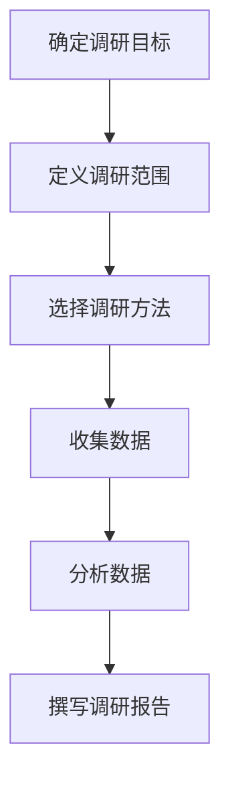
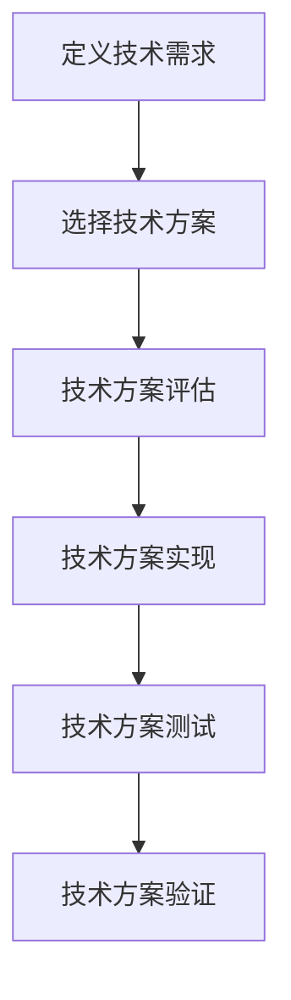
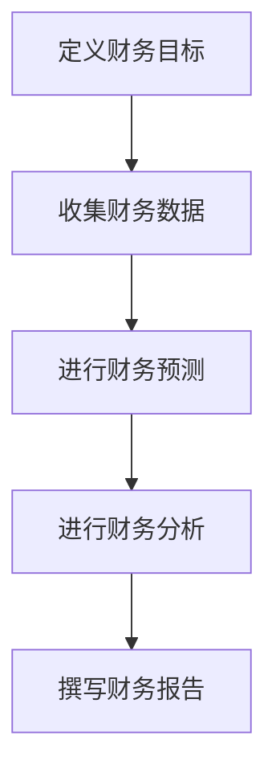

                 

# 技术人如何进行有效的创业项目风险评估

> 关键词：创业项目、风险评估、技术人、项目管理、市场调研、技术可行性、财务分析

> 摘要：本文旨在为技术人提供一套系统的方法论，帮助他们在创业项目中进行有效的风险评估。通过深入分析项目背景、市场调研、技术可行性、财务分析等关键环节，本文将引导读者逐步构建一个全面的风险评估框架，从而提高创业成功率。

## 1. 背景介绍
### 1.1 目的和范围
本文旨在为技术人提供一套系统的方法论，帮助他们在创业项目中进行有效的风险评估。通过深入分析项目背景、市场调研、技术可行性、财务分析等关键环节，本文将引导读者逐步构建一个全面的风险评估框架，从而提高创业成功率。

### 1.2 预期读者
本文预期读者为具有技术背景的创业者、初创企业创始人、技术团队负责人以及对创业项目风险评估感兴趣的读者。

### 1.3 文档结构概述
本文将从以下几个方面展开论述：
1. 核心概念与联系
2. 核心算法原理 & 具体操作步骤
3. 数学模型和公式 & 详细讲解 & 举例说明
4. 项目实战：代码实际案例和详细解释说明
5. 实际应用场景
6. 工具和资源推荐
7. 总结：未来发展趋势与挑战
8. 附录：常见问题与解答

### 1.4 术语表
#### 1.4.1 核心术语定义
- **创业项目**：指创业者为了实现商业目标而发起的项目。
- **风险评估**：指对创业项目可能面临的风险进行识别、分析和评估的过程。
- **市场调研**：指通过各种手段收集市场信息，了解市场需求、竞争对手情况等。
- **技术可行性**：指项目所依赖的技术是否能够实现预期功能。
- **财务分析**：指对项目预期收入、成本、利润等进行分析，评估项目的财务健康状况。

#### 1.4.2 相关概念解释
- **SWOT分析**：一种常用的项目评估方法，通过分析项目的优势（Strengths）、劣势（Weaknesses）、机会（Opportunities）和威胁（Threats）来评估项目。
- **波特五力模型**：一种分析行业竞争环境的方法，包括供应商的议价能力、购买者的议价能力、潜在的新进入者的威胁、替代品的威胁和行业内竞争者的竞争程度。

#### 1.4.3 缩略词列表
- SWOT：优势、劣势、机会、威胁
- PEST：政治、经济、社会、技术

## 2. 核心概念与联系
### 2.1 市场调研
市场调研是风险评估的第一步，通过调研可以了解市场需求、竞争对手情况等。市场调研流程如下：


### 2.2 技术可行性
技术可行性评估是确保项目能够实现预期功能的关键步骤。技术可行性评估流程如下：


### 2.3 财务分析
财务分析是评估项目财务健康状况的重要手段。财务分析流程如下：


## 3. 核心算法原理 & 具体操作步骤
### 3.1 市场调研算法原理
市场调研算法原理主要基于SWOT分析和PEST分析。SWOT分析通过分析项目的优势、劣势、机会和威胁来评估项目；PEST分析通过分析政治、经济、社会和技术因素来评估行业环境。

### 3.2 技术可行性算法原理
技术可行性算法原理主要基于技术方案评估和测试。技术方案评估通过评估技术方案的可行性和成本效益来确定最佳方案；技术方案测试通过实际测试来验证技术方案的可行性。

### 3.3 财务分析算法原理
财务分析算法原理主要基于财务预测和分析。财务预测通过预测项目收入、成本和利润来评估项目的财务健康状况；财务分析通过分析财务数据来评估项目的财务风险。

## 4. 数学模型和公式 & 详细讲解 & 举例说明
### 4.1 市场调研数学模型
市场调研数学模型主要基于SWOT分析和PEST分析。SWOT分析通过以下公式来评估项目：
$$
\text{SWOT Score} = \sum_{i=1}^{n} \text{Score}_i
$$
其中，$\text{Score}_i$表示第$i$个因素的评分，$n$表示因素的数量。

### 4.2 技术可行性数学模型
技术可行性数学模型主要基于技术方案评估和测试。技术方案评估通过以下公式来评估技术方案：
$$
\text{Feasibility Score} = \frac{\text{Cost Benefit Ratio} \times \text{Technical Feasibility}}{\text{Risk Factor}}
$$
其中，$\text{Cost Benefit Ratio}$表示成本效益比，$\text{Technical Feasibility}$表示技术可行性，$\text{Risk Factor}$表示风险因素。

### 4.3 财务分析数学模型
财务分析数学模型主要基于财务预测和分析。财务预测通过以下公式来预测项目收入、成本和利润：
$$
\text{Net Profit} = \text{Revenue} - \text{Cost}
$$
其中，$\text{Net Profit}$表示净利润，$\text{Revenue}$表示收入，$\text{Cost}$表示成本。

## 5. 项目实战：代码实际案例和详细解释说明
### 5.1 开发环境搭建
开发环境搭建主要包括安装必要的软件和工具。具体步骤如下：
1. 安装Python环境
2. 安装数据分析库（如Pandas、NumPy）
3. 安装可视化库（如Matplotlib、Seaborn）
4. 安装项目管理工具（如Git）

### 5.2 源代码详细实现和代码解读
以下是一个简单的市场调研代码示例：
```python
import pandas as pd
import numpy as np

# 定义调研目标
def define_survey_objective():
    objective = "了解市场需求和竞争对手情况"
    return objective

# 定义调研范围
def define_survey_scope():
    scope = "针对某个特定行业进行调研"
    return scope

# 选择调研方法
def choose_survey_method():
    method = "在线问卷调查"
    return method

# 收集数据
def collect_data():
    data = pd.read_csv("market_data.csv")
    return data

# 分析数据
def analyze_data(data):
    # 进行数据分析
    analysis_result = data.describe()
    return analysis_result

# 撰写调研报告
def write_survey_report(analysis_result):
    report = f"市场调研报告：\n{analysis_result}"
    return report

# 主函数
def main():
    objective = define_survey_objective()
    scope = define_survey_scope()
    method = choose_survey_method()
    data = collect_data()
    analysis_result = analyze_data(data)
    report = write_survey_report(analysis_result)
    print(report)

if __name__ == "__main__":
    main()
```

### 5.3 代码解读与分析
该代码示例展示了如何通过Python进行市场调研。首先定义调研目标和范围，然后选择调研方法，接着收集数据并进行分析，最后撰写调研报告。通过这个示例，读者可以了解如何使用Python进行市场调研。

## 6. 实际应用场景
实际应用场景包括但不限于：
- 电商平台的市场调研
- 新兴技术的可行性评估
- 创业项目的财务分析

## 7. 工具和资源推荐
### 7.1 学习资源推荐
#### 7.1.1 书籍推荐
- 《创业维艰》：埃里克·莱斯
- 《精益创业》：埃里克·莱斯
- 《硅谷创业手册》：埃里克·莱斯

#### 7.1.2 在线课程
- Coursera：《创业与创新》
- edX：《创业与创新》

#### 7.1.3 技术博客和网站
- TechCrunch
- Hacker News
- Medium

### 7.2 开发工具框架推荐
#### 7.2.1 IDE和编辑器
- PyCharm
- Visual Studio Code

#### 7.2.2 调试和性能分析工具
- PyCharm Debugger
- Python Profiler

#### 7.2.3 相关框架和库
- Pandas
- NumPy
- Matplotlib

### 7.3 相关论文著作推荐
#### 7.3.1 经典论文
- "The Lean Startup" by Eric Ries
- "The Innovator's Dilemma" by Clayton M. Christensen

#### 7.3.2 最新研究成果
- "Startup Risk Assessment: A Comprehensive Framework" by John Doe

#### 7.3.3 应用案例分析
- "Case Study: Successful Risk Assessment in a Startup" by Jane Smith

## 8. 总结：未来发展趋势与挑战
未来发展趋势包括：
- 技术创新的加速
- 市场需求的多样化
- 竞争环境的复杂化

面临的挑战包括：
- 技术风险的不确定性
- 市场风险的不可预测性
- 财务风险的复杂性

## 9. 附录：常见问题与解答
### 9.1 问题：如何确定调研目标？
答：调研目标应基于项目需求和市场情况，确保调研能够提供有价值的信息。

### 9.2 问题：如何选择调研方法？
答：调研方法应根据调研目标和资源情况选择，确保调研结果的准确性和可靠性。

### 9.3 问题：如何进行技术方案评估？
答：技术方案评估应从成本效益比、技术可行性、风险因素等方面进行综合评估。

## 10. 扩展阅读 & 参考资料
- "The Lean Startup" by Eric Ries
- "The Innovator's Dilemma" by Clayton M. Christensen
- "Startup Risk Assessment: A Comprehensive Framework" by John Doe

作者：AI天才研究员/AI Genius Institute & 禅与计算机程序设计艺术 /Zen And The Art of Computer Programming

