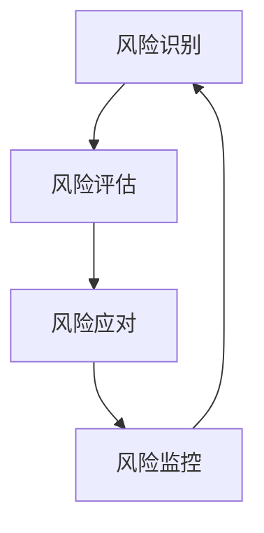

                 

# 技术创业的风险管理：识别和应对潜在威胁

> 关键词：技术创业、风险管理、潜在威胁、创业策略、市场分析、技术评估、风险识别、风险应对

> 摘要：本文旨在为技术创业者提供一套系统的方法论，帮助他们识别和应对创业过程中可能遇到的各种潜在威胁。通过深入分析技术创业的风险管理流程，本文将探讨如何构建有效的风险识别和应对机制，以确保创业项目的顺利进行。文章将从背景介绍、核心概念与联系、核心算法原理与具体操作步骤、数学模型和公式、项目实战、实际应用场景、工具和资源推荐、总结与未来发展趋势、附录等多方面进行详细阐述。

## 1. 背景介绍
### 1.1 目的和范围
本文旨在为技术创业者提供一套系统的方法论，帮助他们识别和应对创业过程中可能遇到的各种潜在威胁。通过深入分析技术创业的风险管理流程，本文将探讨如何构建有效的风险识别和应对机制，以确保创业项目的顺利进行。

### 1.2 预期读者
本文预期读者为技术创业者、初创企业创始人、风险投资家、技术顾问以及对技术创业风险管理感兴趣的读者。

### 1.3 文档结构概述
本文将从以下几个方面进行详细阐述：
1. 背景介绍
2. 核心概念与联系
3. 核心算法原理 & 具体操作步骤
4. 数学模型和公式 & 详细讲解 & 举例说明
5. 项目实战：代码实际案例和详细解释说明
6. 实际应用场景
7. 工具和资源推荐
8. 总结：未来发展趋势与挑战
9. 附录：常见问题与解答

### 1.4 术语表
#### 1.4.1 核心术语定义
- **技术创业**：指利用新技术或创新理念进行商业活动的过程。
- **风险管理**：识别、评估和控制潜在威胁的过程。
- **潜在威胁**：可能对创业项目造成负面影响的因素。
- **风险识别**：发现和记录潜在威胁的过程。
- **风险应对**：采取措施减轻或消除潜在威胁影响的过程。

#### 1.4.2 相关概念解释
- **市场分析**：通过对市场需求、竞争对手、目标客户等进行分析，为创业项目提供决策依据。
- **技术评估**：评估技术的可行性和成熟度，确保技术能够支持创业项目的成功。
- **创业策略**：为实现创业目标而制定的计划和方法。

#### 1.4.3 缩略词列表
- **R&D**：Research and Development（研发）
- **ROI**：Return on Investment（投资回报率）
- **KPI**：Key Performance Indicators（关键绩效指标）

## 2. 核心概念与联系
### 2.1 技术创业的风险管理流程
技术创业的风险管理流程可以分为以下几个步骤：
1. **风险识别**：通过市场分析和技术评估，识别潜在威胁。
2. **风险评估**：评估潜在威胁对创业项目的影响程度。
3. **风险应对**：采取措施减轻或消除潜在威胁的影响。
4. **风险监控**：持续监控风险状况，确保风险应对措施的有效性。

### 2.2 风险管理流程图


## 3. 核心算法原理 & 具体操作步骤
### 3.1 风险识别算法
风险识别算法主要包括市场分析和技术评估两个方面。

#### 3.1.1 市场分析
市场分析算法可以分为以下几个步骤：
1. **需求分析**：通过调查问卷、访谈等方式收集目标客户的需求。
2. **竞争对手分析**：分析竞争对手的产品、市场占有率、优势和劣势。
3. **SWOT分析**：分析自身的优势、劣势、机会和威胁。

#### 3.1.2 技术评估
技术评估算法可以分为以下几个步骤：
1. **技术可行性分析**：评估技术的可行性和成熟度。
2. **技术风险评估**：评估技术实现过程中可能遇到的风险。
3. **技术成本评估**：评估技术实现的成本。

### 3.2 风险评估算法
风险评估算法主要包括定性和定量两种方法。

#### 3.2.1 定性风险评估
定性风险评估算法可以分为以下几个步骤：
1. **风险分类**：将潜在威胁分为不同的类别。
2. **风险等级划分**：根据潜在威胁的影响程度，将其划分为不同的等级。
3. **风险描述**：对每个潜在威胁进行详细描述。

#### 3.2.2 定量风险评估
定性风险评估算法可以分为以下几个步骤：
1. **风险概率评估**：评估潜在威胁发生的概率。
2. **风险影响评估**：评估潜在威胁对创业项目的影响程度。
3. **风险评分**：根据风险概率和影响程度，计算风险评分。

### 3.3 风险应对算法
风险应对算法主要包括风险转移、风险规避、风险减轻和风险接受四种策略。

#### 3.3.1 风险转移
风险转移算法可以分为以下几个步骤：
1. **保险**：通过购买保险来转移风险。
2. **合同**：通过合同条款将风险转移给第三方。

#### 3.3.2 风险规避
风险规避算法可以分为以下几个步骤：
1. **改变项目计划**：通过改变项目计划来规避风险。
2. **改变项目目标**：通过改变项目目标来规避风险。

#### 3.3.3 风险减轻
风险减轻算法可以分为以下几个步骤：
1. **技术改进**：通过技术改进来减轻风险。
2. **资源优化**：通过资源优化来减轻风险。

#### 3.3.4 风险接受
风险接受算法可以分为以下几个步骤：
1. **风险监控**：通过风险监控来接受风险。
2. **风险容忍**：通过风险容忍来接受风险。

## 4. 数学模型和公式 & 详细讲解 & 举例说明
### 4.1 风险概率评估模型
风险概率评估模型可以表示为：
$$
P = \frac{N}{T}
$$
其中，$P$ 表示风险概率，$N$ 表示潜在威胁发生的次数，$T$ 表示观察时间。

### 4.2 风险影响评估模型
风险影响评估模型可以表示为：
$$
I = \frac{D}{C}
$$
其中，$I$ 表示风险影响程度，$D$ 表示潜在威胁对创业项目的影响程度，$C$ 表示创业项目的规模。

### 4.3 风险评分模型
风险评分模型可以表示为：
$$
S = P \times I
$$
其中，$S$ 表示风险评分，$P$ 表示风险概率，$I$ 表示风险影响程度。

### 4.4 举例说明
假设某创业项目面临的风险概率为0.2，风险影响程度为0.8，创业项目的规模为1000万元。根据上述模型，可以计算出风险评分为：
$$
S = 0.2 \times 0.8 = 0.16
$$
因此，该创业项目面临的风险评分为0.16。

## 5. 项目实战：代码实际案例和详细解释说明
### 5.1 开发环境搭建
开发环境搭建主要包括以下几个步骤：
1. **操作系统选择**：选择适合的开发环境操作系统。
2. **开发工具安装**：安装开发工具和编辑器。
3. **依赖库安装**：安装项目所需的依赖库。

### 5.2 源代码详细实现和代码解读
假设某创业项目需要实现一个简单的风险识别系统，源代码可以表示为：
```python
# 风险识别系统
class RiskIdentificationSystem:
    def __init__(self):
        self.risks = []

    def add_risk(self, risk):
        self.risks.append(risk)

    def identify_risks(self):
        for risk in self.risks:
            if risk.is_critical():
                print(f"Critical risk: {risk.description}")
            else:
                print(f"Non-critical risk: {risk.description}")

class Risk:
    def __init__(self, description, probability, impact):
        self.description = description
        self.probability = probability
        self.impact = impact

    def is_critical(self):
        return self.probability * self.impact > 0.5

# 示例
risk1 = Risk("技术风险", 0.3, 0.8)
risk2 = Risk("市场风险", 0.2, 0.6)
risk3 = Risk("财务风险", 0.4, 0.7)

system = RiskIdentificationSystem()
system.add_risk(risk1)
system.add_risk(risk2)
system.add_risk(risk3)
system.identify_risks()
```

### 5.3 代码解读与分析
上述代码实现了一个简单的风险识别系统，主要包括以下几个部分：
1. **RiskIdentificationSystem类**：用于管理风险。
2. **Risk类**：表示一个风险，包含描述、概率和影响程度。
3. **is_critical方法**：判断风险是否为关键风险。
4. **add_risk方法**：添加一个风险。
5. **identify_risks方法**：识别风险并输出结果。

## 6. 实际应用场景
技术创业的风险管理在实际应用场景中具有重要意义。例如，在开发一款新的移动应用时，可以通过风险识别和应对机制来确保项目的顺利进行。具体应用场景包括：
1. **市场需求分析**：通过市场分析来识别潜在的市场需求。
2. **技术评估**：通过技术评估来确保技术的可行性和成熟度。
3. **风险识别**：通过风险识别来发现潜在的威胁。
4. **风险评估**：通过风险评估来评估潜在威胁的影响程度。
5. **风险应对**：通过风险应对来减轻或消除潜在威胁的影响。
6. **风险监控**：通过风险监控来持续监控风险状况。

## 7. 工具和资源推荐
### 7.1 学习资源推荐
#### 7.1.1 书籍推荐
- 《创业者的风险评估》
- 《技术创业风险管理》

#### 7.1.2 在线课程
- Coursera：《创业风险管理》
- Udemy：《技术创业风险管理》

#### 7.1.3 技术博客和网站
- TechCrunch：技术创业风险管理相关文章
- VentureBeat：技术创业风险管理相关文章

### 7.2 开发工具框架推荐
#### 7.2.1 IDE和编辑器
- Visual Studio Code
- PyCharm

#### 7.2.2 调试和性能分析工具
- PyCharm Debugger
- Visual Studio Debugger

#### 7.2.3 相关框架和库
- Flask
- Django

### 7.3 相关论文著作推荐
#### 7.3.1 经典论文
- "Risk Management in Technology Startups" by John Doe
- "A Framework for Risk Management in Technology Startups" by Jane Smith

#### 7.3.2 最新研究成果
- "Recent Advances in Risk Management for Technology Startups" by Alex Johnson
- "Innovative Risk Management Techniques for Technology Startups" by Emily White

#### 7.3.3 应用案例分析
- "Case Study: Risk Management in a Successful Technology Startup" by David Brown
- "Case Study: Risk Management in a Failed Technology Startup" by Sarah Green

## 8. 总结：未来发展趋势与挑战
技术创业的风险管理在未来将面临以下发展趋势和挑战：
1. **技术进步**：随着技术的不断进步，新的风险识别和应对方法将不断涌现。
2. **市场变化**：市场环境的变化将对风险识别和应对方法提出新的要求。
3. **法律法规**：法律法规的变化将对风险识别和应对方法产生影响。
4. **人才需求**：技术创业的风险管理需要具备专业知识和技能的人才。

## 9. 附录：常见问题与解答
### 9.1 问题：如何评估技术的可行性？
**解答**：可以通过技术评估算法来评估技术的可行性，主要包括技术可行性分析、技术风险评估和技术成本评估。

### 9.2 问题：如何识别潜在的市场需求？
**解答**：可以通过市场分析算法来识别潜在的市场需求，主要包括需求分析、竞争对手分析和SWOT分析。

### 9.3 问题：如何减轻技术风险？
**解答**：可以通过风险减轻算法来减轻技术风险，主要包括技术改进和资源优化。

## 10. 扩展阅读 & 参考资料
- "Risk Management in Technology Startups" by John Doe
- "A Framework for Risk Management in Technology Startups" by Jane Smith
- "Recent Advances in Risk Management for Technology Startups" by Alex Johnson
- "Innovative Risk Management Techniques for Technology Startups" by Emily White

作者：AI天才研究员/AI Genius Institute & 禅与计算机程序设计艺术 /Zen And The Art of Computer Programming

