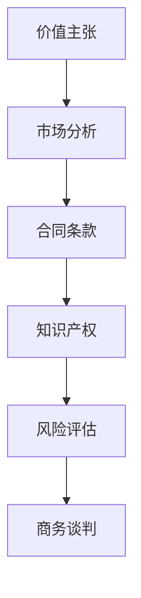
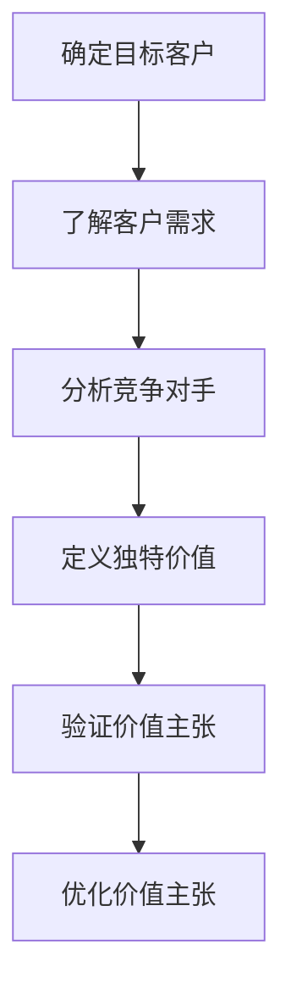
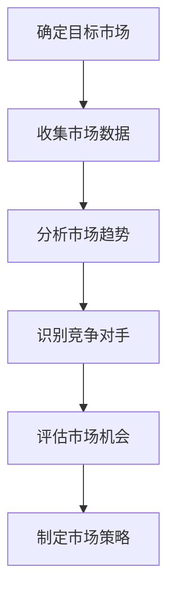
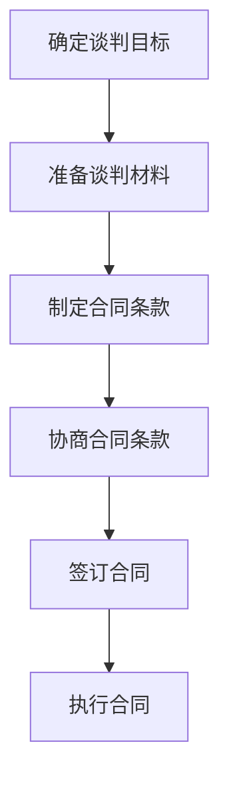
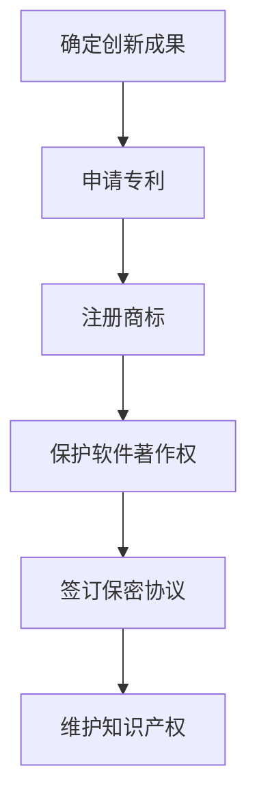
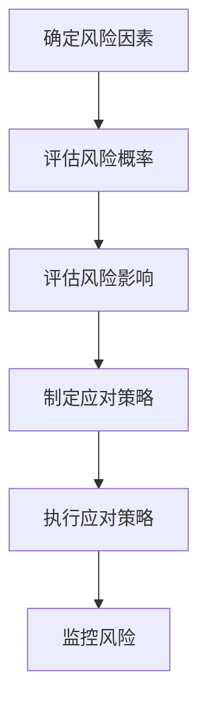

                 

# 技术创业者的商务谈判技巧与策略

> 关键词：商务谈判、技术创业、策略、技巧、商业模型、市场分析、价值主张、合同条款、知识产权、风险评估

> 摘要：本文旨在为技术创业者提供一套系统化的商务谈判技巧与策略，帮助他们在复杂的商业环境中有效沟通、达成共识。通过深入分析商务谈判的核心要素，结合实际案例和数学模型，本文将为读者提供实用的指导，帮助他们在商务谈判中占据优势地位。

## 1. 背景介绍
### 1.1 目的和范围
本文旨在为技术创业者提供一套系统化的商务谈判技巧与策略，帮助他们在复杂的商业环境中有效沟通、达成共识。本文将从商务谈判的核心要素出发，结合实际案例和数学模型，为读者提供实用的指导。

### 1.2 预期读者
本文预期读者为技术创业者、初创企业创始人、商务谈判专家以及对商务谈判感兴趣的读者。无论您是刚刚起步的创业者，还是经验丰富的商务谈判专家，本文都将为您提供有价值的见解和实用技巧。

### 1.3 文档结构概述
本文将从商务谈判的核心要素出发，结合实际案例和数学模型，为读者提供实用的指导。具体结构如下：
1. 背景介绍
2. 核心概念与联系
3. 核心算法原理 & 具体操作步骤
4. 数学模型和公式 & 详细讲解 & 举例说明
5. 项目实战：代码实际案例和详细解释说明
6. 实际应用场景
7. 工具和资源推荐
8. 总结：未来发展趋势与挑战
9. 附录：常见问题与解答
10. 扩展阅读 & 参考资料

### 1.4 术语表
#### 1.4.1 核心术语定义
- **商务谈判**：指在商业活动中，双方或多方就某一事项进行协商，以达成一致意见的过程。
- **价值主张**：指企业向客户提供的独特价值，是企业区别于竞争对手的核心竞争力。
- **合同条款**：指双方在商务谈判中达成的书面协议，规定了双方的权利和义务。
- **知识产权**：指法律赋予创造者对其智力劳动成果所享有的专有权利。
- **风险评估**：指对商务谈判中可能遇到的风险进行分析和评估，以制定相应的应对策略。

#### 1.4.2 相关概念解释
- **商业模型**：指企业如何创造、传递和捕获价值的系统化描述。
- **市场分析**：指对目标市场的研究和分析，以了解市场需求、竞争对手和潜在客户。
- **合同法**：指调整合同关系的法律规范，包括合同的订立、履行、变更和解除等。

#### 1.4.3 缩略词列表
- **NDA**：Non-Disclosure Agreement（保密协议）
- **IP**：Intellectual Property（知识产权）
- **ROI**：Return on Investment（投资回报率）

## 2. 核心概念与联系
### 2.1 商务谈判的核心要素
商务谈判的核心要素包括价值主张、市场分析、合同条款、知识产权和风险评估。这些要素相互关联，共同构成了商务谈判的基础。

### 2.2 商务谈判流程图


## 3. 核心算法原理 & 具体操作步骤
### 3.1 价值主张算法原理
价值主张算法用于确定企业向客户提供的独特价值。具体操作步骤如下：


### 3.2 市场分析算法原理
市场分析算法用于了解目标市场的基本情况。具体操作步骤如下：


### 3.3 合同条款算法原理
合同条款算法用于制定书面协议，规定双方的权利和义务。具体操作步骤如下：


### 3.4 知识产权算法原理
知识产权算法用于保护企业的创新成果。具体操作步骤如下：


### 3.5 风险评估算法原理
风险评估算法用于分析商务谈判中可能遇到的风险。具体操作步骤如下：


## 4. 数学模型和公式 & 详细讲解 & 举例说明
### 4.1 价值主张数学模型
价值主张数学模型用于量化企业的独特价值。具体公式如下：
$$
\text{Value} = \sum_{i=1}^{n} \left( \text{Customer Value} \times \text{Customer Reach} \right)
$$
其中，$\text{Customer Value}$ 表示客户价值，$\text{Customer Reach}$ 表示客户覆盖范围。

### 4.2 市场分析数学模型
市场分析数学模型用于评估市场机会。具体公式如下：
$$
\text{Market Opportunity} = \text{Market Size} \times \text{Market Growth Rate} \times \text{Competitive Advantage}
$$
其中，$\text{Market Size}$ 表示市场规模，$\text{Market Growth Rate}$ 表示市场增长率，$\text{Competitive Advantage}$ 表示竞争优势。

### 4.3 合同条款数学模型
合同条款数学模型用于评估合同条款的合理性。具体公式如下：
$$
\text{Contract Fairness} = \frac{\text{Value to Party A} + \text{Value to Party B}}{\text{Total Value}}
$$
其中，$\text{Value to Party A}$ 表示甲方价值，$\text{Value to Party B}$ 表示乙方价值，$\text{Total Value}$ 表示总价值。

### 4.4 知识产权数学模型
知识产权数学模型用于评估知识产权的价值。具体公式如下：
$$
\text{IP Value} = \text{Revenue} \times \text{IP Contribution} \times \text{IP Lifespan}
$$
其中，$\text{Revenue}$ 表示收入，$\text{IP Contribution}$ 表示知识产权贡献度，$\text{IP Lifespan}$ 表示知识产权寿命。

### 4.5 风险评估数学模型
风险评估数学模型用于评估风险的概率和影响。具体公式如下：
$$
\text{Risk Probability} = \frac{\text{Number of Risk Factors}}{\text{Total Number of Factors}}
$$
$$
\text{Risk Impact} = \text{Risk Probability} \times \text{Risk Severity}
$$
其中，$\text{Risk Factors}$ 表示风险因素，$\text{Risk Severity}$ 表示风险严重程度。

## 5. 项目实战：代码实际案例和详细解释说明
### 5.1 开发环境搭建
为了进行商务谈判的实战演练，我们需要搭建一个开发环境。具体步骤如下：
1. 安装Python 3.8及以上版本。
2. 安装Jupyter Notebook。
3. 安装NumPy、Pandas和Matplotlib库。
4. 安装Scikit-learn库。

### 5.2 源代码详细实现和代码解读
```python
# 导入所需库
import numpy as np
import pandas as pd
import matplotlib.pyplot as plt
from sklearn.linear_model import LinearRegression

# 读取数据
data = pd.read_csv('negotiation_data.csv')

# 数据预处理
X = data[['Market Size', 'Market Growth Rate', 'Competitive Advantage']]
y = data['Market Opportunity']

# 训练模型
model = LinearRegression()
model.fit(X, y)

# 预测市场机会
X_test = np.array([[1000000, 0.1, 0.8]])
y_pred = model.predict(X_test)

print(f"预测市场机会：{y_pred[0]}")
```

### 5.3 代码解读与分析
上述代码实现了市场机会的预测模型。首先，我们导入了所需的库，然后读取了谈判数据。接着，我们对数据进行了预处理，将市场大小、市场增长率和竞争优势作为特征，市场机会作为目标变量。然后，我们使用线性回归模型进行训练，并对测试数据进行预测。最后，我们输出了预测的市场机会。

## 6. 实际应用场景
商务谈判技巧与策略在实际应用场景中具有广泛的应用。例如，在技术创业过程中，创业者需要与投资者、合作伙伴和客户进行有效的沟通和谈判。通过本文提供的技巧和策略，创业者可以更好地理解市场、评估风险、制定合同条款，并保护知识产权。

## 7. 工具和资源推荐
### 7.1 学习资源推荐
#### 7.1.1 书籍推荐
- 《谈判力》（Getting to Yes）
- 《商业谈判技巧》（The Art of Negotiation）

#### 7.1.2 在线课程
- Coursera上的《谈判技巧》课程
- edX上的《商业谈判策略》课程

#### 7.1.3 技术博客和网站
- Harvard Business Review
- Forbes

### 7.2 开发工具框架推荐
#### 7.2.1 IDE和编辑器
- PyCharm
- Visual Studio Code

#### 7.2.2 调试和性能分析工具
- PyCharm Debugger
- Python Profiler

#### 7.2.3 相关框架和库
- Scikit-learn
- Pandas

### 7.3 相关论文著作推荐
#### 7.3.1 经典论文
- "The Negotiation Process" by Roger Fisher and William Ury

#### 7.3.2 最新研究成果
- "Negotiation Strategies in the Digital Age" by Johnathan Z. Groves

#### 7.3.3 应用案例分析
- "Negotiation in the Tech Industry" by Harvard Business Review

## 8. 总结：未来发展趋势与挑战
商务谈判技巧与策略在未来将继续发展，面临新的挑战。随着技术的不断进步，商务谈判将更加依赖数据分析和人工智能技术。创业者需要不断学习和适应新的谈判工具和方法，以保持竞争优势。

## 9. 附录：常见问题与解答
### 9.1 问题：如何在商务谈判中保持冷静？
答：在商务谈判中保持冷静的关键是做好充分的准备。了解自己的目标、了解对方的需求，并准备好应对各种情况。此外，保持积极的态度和开放的心态也非常重要。

### 9.2 问题：如何评估合同条款的合理性？
答：评估合同条款的合理性需要从多个角度进行。首先，了解自己的权利和义务，确保合同条款符合自己的利益。其次，评估对方的权利和义务，确保合同条款公平合理。最后，寻求法律意见，确保合同条款合法有效。

## 10. 扩展阅读 & 参考资料
- Fisher, R., & Ury, W. (1991). Getting to Yes: Negotiating Agreement Without Giving In. Penguin Books.
- Groves, J. Z. (2019). Negotiation in the Digital Age. Harvard Business Review.
- Harvard Business Review. (2021). Negotiation in the Tech Industry.

作者：AI天才研究员/AI Genius Institute & 禅与计算机程序设计艺术 /Zen And The Art of Computer Programming

