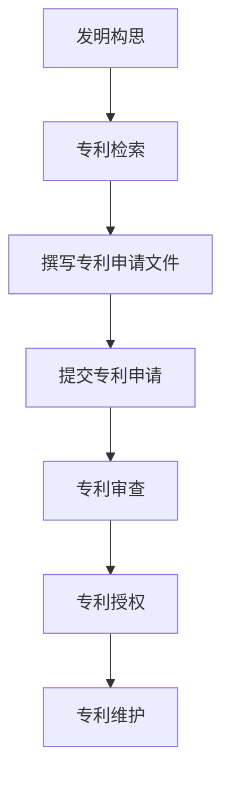
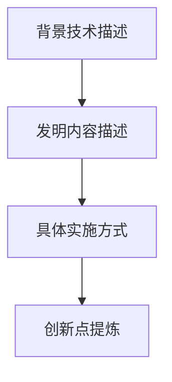

                 

# 技术创新专利战略：保护核心竞争力

> 关键词：技术创新、专利战略、核心竞争力、知识产权、技术保护、法律框架

> 摘要：本文旨在探讨技术创新专利战略的重要性，通过详细分析专利申请流程、核心概念、算法原理、数学模型、实战案例以及应用场景，帮助读者理解如何有效保护和利用技术创新成果，提升企业的核心竞争力。文章将从技术、法律和实践三个维度出发，为读者提供全面的指导和建议。

## 1. 背景介绍
### 1.1 目的和范围
本文旨在深入探讨技术创新专利战略的重要性，通过系统分析专利申请流程、核心概念、算法原理、数学模型、实战案例以及应用场景，帮助读者理解如何有效保护和利用技术创新成果，提升企业的核心竞争力。本文主要面向技术团队、研发人员、知识产权管理人员以及对技术创新专利战略感兴趣的读者。

### 1.2 预期读者
- 技术团队负责人
- 研发人员
- 知识产权管理人员
- 创新创业公司创始人
- 技术爱好者

### 1.3 文档结构概述
本文将按照以下结构展开：
1. 背景介绍
2. 核心概念与联系
3. 核心算法原理 & 具体操作步骤
4. 数学模型和公式 & 详细讲解 & 举例说明
5. 项目实战：代码实际案例和详细解释说明
6. 实际应用场景
7. 工具和资源推荐
8. 总结：未来发展趋势与挑战
9. 附录：常见问题与解答
10. 扩展阅读 & 参考资料

### 1.4 术语表
#### 1.4.1 核心术语定义
- **专利**：一种法律权利，授予发明者在一定期限内对其发明的独占权。
- **专利申请**：向专利局提交的文件，描述发明的技术细节和创新点。
- **专利审查**：专利局对专利申请进行的技术和法律审查。
- **专利授权**：专利局确认发明符合专利法要求，授予专利权。
- **专利侵权**：未经专利权人许可，使用、制造、销售或进口专利产品。
- **专利池**：多个专利权人共同管理的专利集合。
- **专利许可**：专利权人允许他人使用其专利技术的权利。

#### 1.4.2 相关概念解释
- **技术创新**：通过引入新的技术、方法或改进现有技术，提高产品或服务的性能和效率。
- **核心竞争力**：企业内部的独特优势，使其在市场竞争中脱颖而出。
- **知识产权**：包括专利、商标、版权等法律保护形式，用于保护创新成果。

#### 1.4.3 缩略词列表
- **IP**：知识产权
- **PTO**：专利商标局（Patent and Trademark Office）
- **PCT**：专利合作条约（Patent Cooperation Treaty）
- **ISA**：国际检索报告（International Search Report）
- **EPO**：欧洲专利局（European Patent Office）

## 2. 核心概念与联系
### 2.1 专利申请流程
专利申请流程通常包括以下几个步骤：
1. **发明构思**：提出新的技术方案或改进现有技术。
2. **专利检索**：通过专利数据库检查现有技术，确保发明具有新颖性和创造性。
3. **撰写专利申请文件**：准备详细的专利说明书、权利要求书和摘要。
4. **提交专利申请**：向专利局提交专利申请文件。
5. **专利审查**：专利局对申请文件进行技术审查和法律审查。
6. **专利授权**：专利局确认发明符合专利法要求，授予专利权。
7. **专利维护**：定期缴纳年费，保持专利权的有效性。

### 2.2 核心概念原理
专利的核心概念包括新颖性、创造性、实用性。新颖性是指发明在申请日前未被公开；创造性是指发明相对于现有技术具有显著的进步；实用性是指发明能够实际应用并产生有益效果。

### 2.3 核心概念联系
专利申请流程与核心概念原理紧密相关，专利申请文件的撰写需要充分展示发明的新颖性、创造性和实用性，以通过专利审查。



## 3. 核心算法原理 & 具体操作步骤
### 3.1 核心算法原理
专利申请中的核心算法原理主要包括技术方案的描述和创新点的提炼。技术方案的描述需要详细说明发明的技术细节，包括背景技术、发明内容、具体实施方式等。创新点的提炼需要明确发明相对于现有技术的进步和独特之处。

### 3.2 具体操作步骤
1. **背景技术描述**：简要介绍现有技术的背景和存在的问题。
2. **发明内容描述**：详细描述发明的技术方案，包括技术特征、工作原理等。
3. **具体实施方式**：提供具体的实施例，说明如何实现发明的技术方案。
4. **创新点提炼**：明确发明相对于现有技术的进步和独特之处。



## 4. 数学模型和公式 & 详细讲解 & 举例说明
### 4.1 数学模型
专利申请中的数学模型主要用于描述发明的技术特征和创新点。例如，对于一种新的算法，可以使用数学公式来描述其工作原理和性能指标。

### 4.2 公式举例
假设我们有一种新的图像处理算法，其核心公式可以表示为：
$$
f(x) = \frac{1}{1 + e^{-\beta(x - \theta)}}
$$
其中，$x$ 表示输入图像的像素值，$\beta$ 和 $\theta$ 是算法的参数。

### 4.3 详细讲解
该公式描述了一种基于sigmoid函数的图像处理算法，通过调整参数 $\beta$ 和 $\theta$，可以实现不同的图像处理效果。具体操作步骤如下：
1. **参数设置**：根据具体需求设置参数 $\beta$ 和 $\theta$。
2. **图像处理**：将输入图像的每个像素值代入公式，计算输出值。
3. **结果分析**：分析处理后的图像效果，评估算法性能。

## 5. 项目实战：代码实际案例和详细解释说明
### 5.1 开发环境搭建
为了实现上述图像处理算法，我们需要搭建一个开发环境。具体步骤如下：
1. **安装Python**：确保系统中安装了Python 3.8及以上版本。
2. **安装依赖库**：使用pip安装必要的库，如numpy、matplotlib等。
3. **配置开发环境**：设置开发环境，如使用Jupyter Notebook进行开发。

### 5.2 源代码详细实现和代码解读
```python
import numpy as np
import matplotlib.pyplot as plt

def sigmoid(x, beta, theta):
    return 1 / (1 + np.exp(-beta * (x - theta)))

def image_processing(image, beta, theta):
    processed_image = np.zeros_like(image)
    for i in range(image.shape[0]):
        for j in range(image.shape[1]):
            processed_image[i, j] = sigmoid(image[i, j], beta, theta)
    return processed_image

# 示例图像
image = np.random.rand(100, 100)

# 参数设置
beta = 1.0
theta = 0.5

# 图像处理
processed_image = image_processing(image, beta, theta)

# 结果展示
plt.imshow(processed_image, cmap='gray')
plt.show()
```

### 5.3 代码解读与分析
1. **sigmoid函数**：定义了一个sigmoid函数，用于实现图像处理算法的核心公式。
2. **image_processing函数**：定义了一个图像处理函数，通过遍历图像的每个像素值，应用sigmoid函数进行处理。
3. **参数设置**：设置参数 $\beta$ 和 $\theta$，用于调整图像处理效果。
4. **结果展示**：使用matplotlib展示处理后的图像。

## 6. 实际应用场景
### 6.1 图像处理
上述图像处理算法可以应用于多种场景，如医学影像处理、遥感图像分析等。

### 6.2 专利保护
通过申请专利保护该算法，可以确保企业在市场竞争中拥有技术优势，防止他人未经授权使用该技术。

## 7. 工具和资源推荐
### 7.1 学习资源推荐
#### 7.1.1 书籍推荐
- 《专利法》
- 《知识产权管理》
- 《创新与专利战略》

#### 7.1.2 在线课程
- Coursera：知识产权管理课程
- edX：专利法课程

#### 7.1.3 技术博客和网站
- IPWatchdog
- PatentlyO

### 7.2 开发工具框架推荐
#### 7.2.1 IDE和编辑器
- PyCharm
- VSCode

#### 7.2.2 调试和性能分析工具
- PyCharm调试器
- cProfile

#### 7.2.3 相关框架和库
- numpy
- matplotlib

### 7.3 相关论文著作推荐
#### 7.3.1 经典论文
- "The Patent System and Innovation" by Mark A. Lemley

#### 7.3.2 最新研究成果
- "Patent Strategy in the Digital Age" by John R. Allison

#### 7.3.3 应用案例分析
- "Case Studies in Patent Strategy" by David J. Kappos

## 8. 总结：未来发展趋势与挑战
### 8.1 未来发展趋势
- 人工智能和机器学习技术的广泛应用将推动技术创新专利战略的发展。
- 专利池和专利许可将成为企业合作的重要方式。
- 专利审查和法律保护将更加严格和高效。

### 8.2 挑战
- 技术创新速度加快，专利申请和审查周期较长。
- 专利侵权行为日益复杂，需要更加完善的法律保护机制。
- 企业需要不断调整专利战略，以适应市场变化。

## 9. 附录：常见问题与解答
### 9.1 问题1：如何判断发明是否具有新颖性？
- 通过专利数据库检索现有技术，确保发明未被公开。

### 9.2 问题2：如何撰写专利申请文件？
- 详细描述发明的技术方案，明确创新点。

### 9.3 问题3：如何维护专利权？
- 定期缴纳年费，保持专利权的有效性。

## 10. 扩展阅读 & 参考资料
- "Patent Strategy: A Guide to Protecting Your Inventions" by David J. Kappos
- "The Patent System: A Guide for Inventors and Entrepreneurs" by Mark A. Lemley
- "Patent Law and Practice" by John R. Allison

---

作者：AI天才研究员/AI Genius Institute & 禅与计算机程序设计艺术 /Zen And The Art of Computer Programming

