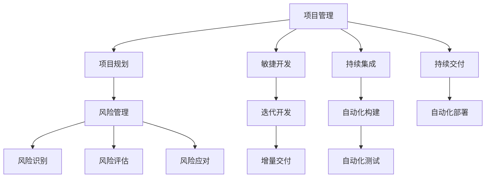

                 

# 技术型创业者的项目管理与交付流程

> 关键词：项目管理, 交付流程, 技术型创业者, 项目生命周期, 敏捷开发, 持续集成, 持续交付, DevOps, 项目规划, 风险管理, 代码质量, 项目监控

> 摘要：本文旨在为技术型创业者提供一套系统化的项目管理与交付流程，涵盖从项目规划到交付的全过程。通过逐步分析和推理，本文将深入探讨项目管理的核心要素，包括项目生命周期、敏捷开发、持续集成与交付、风险管理等关键环节。同时，本文将通过具体的案例和代码示例，帮助读者理解如何在实际项目中应用这些方法，从而提高项目的成功率和交付质量。

## 1. 引言
### 1.1 目的和范围
本文旨在为技术型创业者提供一套系统化的项目管理与交付流程，帮助他们在复杂的技术环境中高效地规划、执行和交付项目。本文将从项目规划、开发、测试、部署到维护的全过程进行详细阐述，涵盖项目生命周期的各个阶段，包括敏捷开发、持续集成与交付、风险管理等关键环节。通过本文，读者将能够理解并应用这些方法，提高项目的成功率和交付质量。

### 1.2 预期读者
本文的预期读者是技术型创业者、项目经理、软件开发人员、产品经理以及任何希望提高项目管理与交付能力的专业人士。无论你是初创公司的创始人，还是大型企业的项目经理，本文都将为你提供实用的指导和建议。

### 1.3 文档结构概述
本文将按照项目管理的生命周期进行组织，分为以下几个主要部分：
1. **背景介绍和环境准备**：介绍项目管理的背景、环境要求和前置知识。
2. **快速入门**：提供项目管理的基本用例、核心算法原理和关键步骤。
3. **核心内容**：详细介绍项目管理的核心主题，包括项目规划、敏捷开发、持续集成与交付、风险管理等。
4. **项目实战/进阶/扩展**：通过具体的源代码和案例，展示如何在实际项目中应用这些方法。
5. **实际应用场景**：通过具体的场景案例，展示项目管理在实际项目中的应用。
6. **工具和资源推荐**：推荐学习资源、开发工具框架和相关论文著作。
7. **总结**：总结项目管理与交付流程的关键点，展望未来发展趋势和挑战。
8. **附录**：提供常见问题与解答，帮助读者解决实际问题。

### 1.4 术语表
#### 1.4.1 核心术语定义
- **项目管理**：指对项目从开始到结束的全过程进行计划、组织、执行、监控和控制的过程。
- **项目生命周期**：项目从启动到结束的整个过程，包括规划、执行、监控和收尾四个阶段。
- **敏捷开发**：一种迭代和增量的软件开发方法，强调快速响应变化和持续交付。
- **持续集成**：将代码集成到共享仓库的过程，每次提交都会自动构建和测试。
- **持续交付**：将代码集成到共享仓库后，自动进行构建、测试和部署的过程。
- **DevOps**：开发和运维的结合，强调自动化和协作，提高软件交付速度和质量。
- **风险管理**：识别、评估和控制项目中的风险，以减少不确定性对项目的影响。

#### 1.4.2 相关概念解释
- **项目规划**：确定项目目标、范围、时间表、资源和预算的过程。
- **项目执行**：按照项目计划进行项目活动，实现项目目标的过程。
- **项目监控**：监控项目进度、成本、质量等指标，确保项目按计划进行。
- **项目收尾**：项目结束后的总结和交付过程，包括项目文档的整理和归档。

#### 1.4.3 缩略词列表
- CI：持续集成
- CD：持续交付
- DevOps：开发运维一体化
- PR：项目规划
- PM：项目管理
- RACI：责任分配矩阵

## 2. 背景介绍和环境准备
### 2.1 技术背景
#### 2.1.1 历史发展
项目管理的历史可以追溯到古代，但现代项目管理起源于20世纪中叶。随着信息技术的发展，项目管理逐渐从传统的瀑布模型向敏捷开发转变。敏捷开发方法强调快速响应变化和持续交付，而持续集成和持续交付则进一步提高了软件开发的效率和质量。

#### 2.1.2 当前状态
当前，项目管理已经成为企业成功的关键因素之一。敏捷开发、持续集成和持续交付等方法已经成为主流，DevOps文化也在不断普及。项目管理工具和平台也日益成熟，为项目管理提供了强大的支持。

#### 2.1.3 未来趋势
未来，项目管理将更加注重自动化和智能化。DevOps将进一步融合，实现开发和运维的无缝协作。人工智能和机器学习将在项目管理中发挥更大的作用，提高项目管理的效率和质量。

### 2.2 环境要求
#### 2.2.1 硬件要求
- 服务器：至少4核CPU，16GB内存，100GB硬盘空间
- 工作站：至少8核CPU，32GB内存，500GB硬盘空间
- 移动设备：支持Android和iOS系统的智能手机和平板电脑

#### 2.2.2 软件要求
- 操作系统：Windows 10、macOS Catalina、Ubuntu 20.04
- 开发环境：Visual Studio Code、IntelliJ IDEA、PyCharm
- 版本控制系统：Git
- 构建工具：Maven、Gradle
- 测试工具：JUnit、Selenium
- 部署工具：Docker、Kubernetes

#### 2.2.3 网络要求
- 稳定的互联网连接
- 高速的局域网连接
- 安全的网络环境

### 2.3 前置知识
#### 2.3.1 基础理论
- 项目管理基础知识
- 敏捷开发方法
- 持续集成和持续交付
- DevOps文化

#### 2.3.2 相关技术栈
- Java、Python、JavaScript
- Spring、Django、React
- Docker、Kubernetes
- Git、Jenkins、Docker Compose

#### 2.3.3 推荐学习路径
1. **项目管理基础知识**：阅读《项目管理知识体系指南》（PMBOK）
2. **敏捷开发方法**：学习《敏捷软件开发》（Agile Software Development）
3. **持续集成和持续交付**：阅读《持续集成与持续交付》（Continuous Integration and Continuous Delivery）
4. **DevOps文化**：学习《DevOps实践》（DevOps Practices）

## 3. 快速入门
### 3.1 基本用例
#### 3.1.1 简单示例
假设我们要开发一个简单的Web应用，功能包括用户注册、登录和查看个人信息。

#### 3.1.2 运行步骤
1. **创建项目结构**：
   ```bash
   mkdir myapp
   cd myapp
   mkdir src
   mkdir tests
   mkdir resources
   ```

2. **初始化Git仓库**：
   ```bash
   git init
   ```

3. **编写代码**：
   ```java
   // src/main/java/com/example/User.java
   package com.example;

   public class User {
       private String username;
       private String password;

       public User(String username, String password) {
           this.username = username;
           this.password = password;
       }

       public String getUsername() {
           return username;
       }

       public String getPassword() {
           return password;
       }
   }
   ```

4. **编写测试代码**：
   ```java
   // src/test/java/com/example/UserTest.java
   package com.example;

   import org.junit.jupiter.api.Test;
   import static org.junit.jupiter.api.Assertions.assertEquals;

   public class UserTest {
       @Test
       public void testUser() {
           User user = new User("testuser", "testpassword");
           assertEquals("testuser", user.getUsername());
           assertEquals("testpassword", user.getPassword());
       }
   }
   ```

5. **构建和运行**：
   ```bash
   mvn clean install
   ```

#### 3.1.3 结果分析
通过上述步骤，我们成功创建了一个简单的Web应用，并编写了基本的单元测试。接下来，我们将进一步探讨核心算法原理和关键步骤。

### 3.2 核心算法原理 & 关键步骤
#### 3.2.1 算法概述
在项目管理中，核心算法主要包括项目规划、敏捷开发、持续集成和持续交付等。这些算法通过迭代和增量的方式，确保项目能够高效地完成。

#### 3.2.2 关键步骤详解
1. **项目规划**：
   - 确定项目目标和范围
   - 制定项目计划和时间表
   - 分配资源和预算
   - 制定风险管理计划

2. **敏捷开发**：
   - 划分迭代周期
   - 每个迭代完成一个可交付的增量
   - 每次迭代后进行回顾和改进

3. **持续集成**：
   - 每次提交代码后自动构建和测试
   - 发现和修复代码问题
   - 保证代码质量

4. **持续交付**：
   - 每次提交代码后自动进行构建、测试和部署
   - 确保代码能够快速、可靠地交付给用户

#### 3.2.3 性能分析
通过持续集成和持续交付，我们可以显著提高项目的性能。具体来说，持续集成可以确保每次提交的代码都是高质量的，而持续交付则可以确保代码能够快速、可靠地交付给用户。这些方法可以显著提高项目的交付速度和质量。

### 3.3 核心概念与联系
#### 3.3.1 概念图谱



