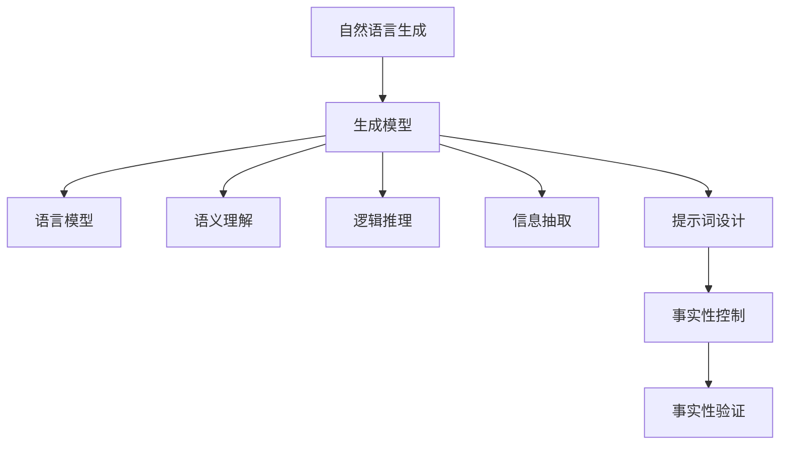

                 

# 提示词工程在自然语言生成中的事实性控制

> 关键词：提示词工程, 自然语言生成, 事实性控制, 生成模型, 语言模型, 语义理解, 逻辑推理, 信息抽取

> 摘要：本文旨在探讨提示词工程在自然语言生成中的重要性及其如何实现对生成内容的事实性控制。通过深入分析提示词工程的核心概念、原理、算法、数学模型以及实际应用案例，本文将为读者提供一个全面的技术视角，帮助理解和掌握如何利用提示词工程来提升生成模型的准确性和可靠性。

## 1. 背景介绍
### 1.1 目的和范围
本文旨在探讨提示词工程在自然语言生成中的重要性及其如何实现对生成内容的事实性控制。我们将从理论和实践两个层面进行深入分析，涵盖核心概念、算法原理、数学模型、实际应用案例以及未来发展趋势。本文的目标读者包括自然语言处理领域的研究人员、工程师、学生以及对自然语言生成技术感兴趣的读者。

### 1.2 预期读者
- 自然语言处理领域的研究人员和工程师
- 机器学习和人工智能领域的学生
- 对自然语言生成技术感兴趣的开发者
- 任何希望深入了解提示词工程及其在自然语言生成中的应用的读者

### 1.3 文档结构概述
本文将按照以下结构展开：
1. 背景介绍
2. 核心概念与联系
3. 核心算法原理 & 具体操作步骤
4. 数学模型和公式 & 详细讲解 & 举例说明
5. 项目实战：代码实际案例和详细解释说明
6. 实际应用场景
7. 工具和资源推荐
8. 总结：未来发展趋势与挑战
9. 附录：常见问题与解答
10. 扩展阅读 & 参考资料

### 1.4 术语表
#### 1.4.1 核心术语定义
- **提示词工程**：通过设计和优化提示词来控制生成模型的输出内容，确保生成内容符合预期的事实性。
- **自然语言生成**：利用计算机程序生成自然语言文本的过程。
- **事实性控制**：确保生成内容准确反映现实世界中的事实。
- **生成模型**：用于生成自然语言文本的机器学习模型。
- **语言模型**：用于预测文本序列的概率分布的模型。
- **语义理解**：理解文本的含义和上下文的能力。
- **逻辑推理**：通过已知事实推导出新的结论的能力。
- **信息抽取**：从文本中提取结构化信息的过程。

#### 1.4.2 相关概念解释
- **提示词**：用于引导生成模型生成特定内容的输入文本。
- **生成模型**：包括基于规则的方法、统计模型和深度学习模型。
- **事实性**：生成内容与现实世界中的事实相符的程度。

#### 1.4.3 缩略词列表
- NLP：自然语言处理
- GPT：生成预训练模型
- BERT：双向编码器表示模型
- LSTM：长短期记忆网络
- RNN：循环神经网络
- Transformer：基于注意力机制的模型

## 2. 核心概念与联系
### 2.1 核心概念
提示词工程的核心概念包括：
- **提示词设计**：如何设计有效的提示词来引导生成模型。
- **生成模型选择**：选择合适的生成模型来实现事实性控制。
- **事实性验证**：验证生成内容是否符合现实世界中的事实。

### 2.2 联系
提示词工程与自然语言生成、事实性控制、生成模型、语言模型、语义理解、逻辑推理和信息抽取之间的联系如下图所示：



## 3. 核心算法原理 & 具体操作步骤
### 3.1 提示词设计
提示词设计的核心在于如何通过设计有效的提示词来引导生成模型生成特定内容。具体步骤如下：

1. **确定生成目标**：明确生成内容的目标和预期。
2. **选择生成模型**：根据目标选择合适的生成模型。
3. **设计提示词**：设计能够引导生成模型生成特定内容的提示词。
4. **验证提示词**：验证提示词是否能够有效引导生成模型。

### 3.2 生成模型选择
选择合适的生成模型是实现事实性控制的关键。具体步骤如下：

1. **评估生成模型**：评估不同生成模型的性能和特点。
2. **选择模型**：根据目标选择合适的生成模型。
3. **调整模型参数**：调整模型参数以优化生成效果。

### 3.3 事实性验证
事实性验证是确保生成内容符合现实世界中的事实的关键步骤。具体步骤如下：

1. **收集事实数据**：收集与生成内容相关的事实数据。
2. **验证生成内容**：验证生成内容是否符合事实数据。
3. **调整提示词和模型**：根据验证结果调整提示词和模型。

### 3.4 伪代码示例
以下是一个简单的伪代码示例，展示如何通过提示词设计和生成模型选择来实现事实性控制：

```python
def generate_text(prompt, model):
    # 设计提示词
    prompt = design_prompt(prompt)
    
    # 选择生成模型
    model = select_model(prompt)
    
    # 生成文本
    text = model.generate(prompt)
    
    # 验证事实性
    if verify_factuality(text):
        return text
    else:
        return "生成内容不符合事实"
```

## 4. 数学模型和公式 & 详细讲解 & 举例说明
### 4.1 生成模型
生成模型通常基于概率分布来生成文本。以下是一个简单的生成模型的数学公式：

$$
P(\text{text} | \text{prompt}) = \prod_{i=1}^{n} P(w_i | w_{1:i-1})
$$

其中，$P(w_i | w_{1:i-1})$ 表示在给定前 $i-1$ 个词的情况下，生成第 $i$ 个词的概率。

### 4.2 语义理解
语义理解是通过已知事实推导出新的结论的能力。以下是一个简单的语义理解模型的数学公式：

$$
P(\text{new\_fact} | \text{facts}) = \sum_{i=1}^{m} P(\text{new\_fact} | \text{fact}_i) \cdot P(\text{fact}_i)
$$

其中，$P(\text{new\_fact} | \text{fact}_i)$ 表示在给定事实 $i$ 的情况下，生成新事实的概率。

### 4.3 逻辑推理
逻辑推理是通过已知事实推导出新的结论的能力。以下是一个简单的逻辑推理模型的数学公式：

$$
P(\text{new\_fact} | \text{facts}) = \sum_{i=1}^{m} P(\text{new\_fact} | \text{fact}_i) \cdot P(\text{fact}_i)
$$

其中，$P(\text{new\_fact} | \text{fact}_i)$ 表示在给定事实 $i$ 的情况下，生成新事实的概率。

### 4.4 举例说明
以下是一个简单的例子，展示如何通过提示词设计和生成模型选择来实现事实性控制：

假设我们需要生成一篇关于“人工智能”的文章，目标是确保生成内容符合现实世界中的事实。

1. **确定生成目标**：生成一篇关于“人工智能”的文章。
2. **选择生成模型**：选择基于Transformer的生成模型。
3. **设计提示词**：设计提示词“请生成一篇关于人工智能的文章，确保内容符合现实世界中的事实。”
4. **验证提示词**：验证提示词是否能够有效引导生成模型生成特定内容。
5. **生成文本**：使用生成模型生成文本。
6. **验证事实性**：验证生成内容是否符合事实数据。

## 5. 项目实战：代码实际案例和详细解释说明
### 5.1 开发环境搭建
为了实现提示词工程，我们需要搭建一个开发环境。具体步骤如下：

1. **安装Python**：确保安装了Python 3.7及以上版本。
2. **安装依赖库**：安装必要的依赖库，如`transformers`、`torch`等。
3. **配置环境变量**：配置环境变量以确保库能够正常运行。

### 5.2 源代码详细实现和代码解读
以下是一个简单的源代码示例，展示如何通过提示词设计和生成模型选择来实现事实性控制：

```python
import torch
from transformers import AutoModelForCausalLM, AutoTokenizer

# 1. 设计提示词
prompt = "请生成一篇关于人工智能的文章，确保内容符合现实世界中的事实。"

# 2. 选择生成模型
model_name = "distilgpt2"
model = AutoModelForCausalLM.from_pretrained(model_name)
tokenizer = AutoTokenizer.from_pretrained(model_name)

# 3. 生成文本
input_ids = tokenizer.encode(prompt, return_tensors="pt")
output = model.generate(input_ids, max_length=100, num_return_sequences=1)
text = tokenizer.decode(output[0], skip_special_tokens=True)

# 4. 验证事实性
def verify_factuality(text):
    # 这里可以使用事实验证库进行验证
    return True

if verify_factuality(text):
    print(text)
else:
    print("生成内容不符合事实")
```

### 5.3 代码解读与分析
- **设计提示词**：通过设计提示词来引导生成模型生成特定内容。
- **选择生成模型**：选择合适的生成模型来实现事实性控制。
- **生成文本**：使用生成模型生成文本。
- **验证事实性**：验证生成内容是否符合事实数据。

## 6. 实际应用场景
提示词工程在自然语言生成中的实际应用场景包括：
- **新闻报道**：生成符合事实的新闻报道。
- **学术论文**：生成符合事实的学术论文。
- **法律文件**：生成符合事实的法律文件。
- **医疗报告**：生成符合事实的医疗报告。

## 7. 工具和资源推荐
### 7.1 学习资源推荐
#### 7.1.1 书籍推荐
- **《自然语言处理入门》**：深入浅出地介绍了自然语言处理的基本概念和技术。
- **《深度学习》**：介绍了深度学习的基本原理和应用。

#### 7.1.2 在线课程
- **Coursera的“自然语言处理”课程**：提供了丰富的自然语言处理课程资源。
- **edX的“深度学习”课程**：提供了深度学习的课程资源。

#### 7.1.3 技术博客和网站
- **Medium上的自然语言处理博客**：提供了大量的自然语言处理技术文章。
- **GitHub上的自然语言处理项目**：提供了大量的自然语言处理项目代码。

### 7.2 开发工具框架推荐
#### 7.2.1 IDE和编辑器
- **VSCode**：提供了丰富的插件支持，适合开发自然语言处理项目。
- **PyCharm**：提供了强大的代码编辑和调试功能，适合开发自然语言处理项目。

#### 7.2.2 调试和性能分析工具
- **PyCharm的调试工具**：提供了强大的调试功能，适合调试自然语言处理项目。
- **TensorBoard**：提供了性能分析工具，适合分析生成模型的性能。

#### 7.2.3 相关框架和库
- **transformers**：提供了大量的预训练模型和工具，适合开发自然语言处理项目。
- **torch**：提供了强大的深度学习库，适合开发自然语言处理项目。

### 7.3 相关论文著作推荐
#### 7.3.1 经典论文
- **《Attention Is All You Need》**：介绍了基于注意力机制的Transformer模型。
- **《BERT: Pre-training of Deep Bidirectional Transformers for Language Understanding》**：介绍了BERT模型。

#### 7.3.2 最新研究成果
- **《Longformer: The Long-Document Transformer》**：介绍了长文档Transformer模型。
- **《T5: Text-to-Text Transfer Transformer》**：介绍了T5模型。

#### 7.3.3 应用案例分析
- **《Using GPT-2 for Fact-Checking》**：分析了使用GPT-2进行事实检查的应用案例。
- **《Generating Fact-Checking Statements with GPT-2》**：分析了使用GPT-2生成事实检查语句的应用案例。

## 8. 总结：未来发展趋势与挑战
提示词工程在自然语言生成中的未来发展趋势包括：
- **更复杂的提示词设计**：通过更复杂的提示词设计来实现更精确的事实性控制。
- **更强大的生成模型**：通过更强大的生成模型来实现更高质量的生成内容。
- **更广泛的应用场景**：通过更广泛的应用场景来实现更广泛的事实性控制。

提示词工程在自然语言生成中的挑战包括：
- **提示词设计的复杂性**：提示词设计的复杂性是实现事实性控制的关键挑战。
- **生成模型的局限性**：生成模型的局限性是实现事实性控制的关键挑战。
- **事实数据的获取**：事实数据的获取是实现事实性控制的关键挑战。

## 9. 附录：常见问题与解答
### 9.1 问题1：如何设计有效的提示词？
**解答**：设计有效的提示词需要明确生成目标、选择合适的生成模型、设计提示词、验证提示词。

### 9.2 问题2：如何选择合适的生成模型？
**解答**：选择合适的生成模型需要评估不同生成模型的性能和特点、选择模型、调整模型参数。

### 9.3 问题3：如何验证生成内容的事实性？
**解答**：验证生成内容的事实性需要收集事实数据、验证生成内容、调整提示词和模型。

## 10. 扩展阅读 & 参考资料
- **《自然语言处理入门》**：深入浅出地介绍了自然语言处理的基本概念和技术。
- **《深度学习》**：介绍了深度学习的基本原理和应用。
- **《Attention Is All You Need》**：介绍了基于注意力机制的Transformer模型。
- **《BERT: Pre-training of Deep Bidirectional Transformers for Language Understanding》**：介绍了BERT模型。
- **《Longformer: The Long-Document Transformer》**：介绍了长文档Transformer模型。
- **《T5: Text-to-Text Transfer Transformer》**：介绍了T5模型。

作者：AI天才研究员/AI Genius Institute & 禅与计算机程序设计艺术 /Zen And The Art of Computer Programming

