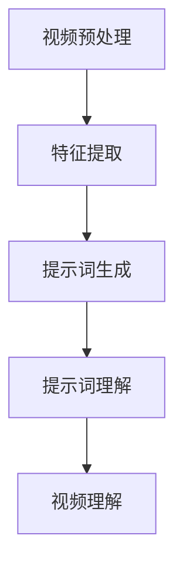

                 

# 提示词工程在视频分析任务中的应用

> 关键词：提示词工程, 视频分析, 机器学习, 深度学习, 自然语言处理, 视频理解, 语义分割, 情感分析

> 摘要：本文旨在探讨提示词工程在视频分析任务中的应用，通过详细阐述其核心概念、算法原理、数学模型、实战案例以及实际应用场景，帮助读者理解如何利用提示词工程提升视频分析的准确性和效率。我们将从基础概念入手，逐步深入到具体实现细节，并提供一系列学习和开发资源推荐，以期为读者提供全面的技术指导。

## 1. 背景介绍
### 1.1 目的和范围
本文旨在深入探讨提示词工程在视频分析任务中的应用，通过系统地介绍其核心概念、算法原理、数学模型和实际案例，帮助读者理解如何利用提示词工程提升视频分析的准确性和效率。本文主要关注视频理解、语义分割、情感分析等任务，并提供详细的代码实现和案例分析。

### 1.2 预期读者
本文适合以下读者群体：
- 视频分析领域的研究人员和工程师
- 机器学习和深度学习爱好者
- 自然语言处理和计算机视觉交叉领域的从业者
- 对提示词工程感兴趣的开发者

### 1.3 文档结构概述
本文结构如下：
1. 背景介绍
2. 核心概念与联系
3. 核心算法原理 & 具体操作步骤
4. 数学模型和公式 & 详细讲解 & 举例说明
5. 项目实战：代码实际案例和详细解释说明
6. 实际应用场景
7. 工具和资源推荐
8. 总结：未来发展趋势与挑战
9. 附录：常见问题与解答
10. 扩展阅读 & 参考资料

### 1.4 术语表
#### 1.4.1 核心术语定义
- **提示词工程**：一种将自然语言处理技术应用于视频分析的方法，通过提取和理解视频中的关键信息，实现对视频内容的精准描述和理解。
- **视频理解**：通过计算机视觉和自然语言处理技术，对视频内容进行分析和理解，提取关键信息和语义。
- **语义分割**：将视频中的物体或场景分割成具有语义意义的区域，以便进一步分析和理解。
- **情感分析**：通过分析视频中的语音和图像信息，识别和理解视频中的情感状态。

#### 1.4.2 相关概念解释
- **自然语言处理（NLP）**：研究计算机与人类自然语言之间的交互，包括文本生成、情感分析、命名实体识别等。
- **计算机视觉（CV）**：研究如何使计算机能够从图像或视频中提取信息，包括物体检测、图像分割、场景理解等。
- **深度学习**：一种基于神经网络的机器学习方法，通过多层非线性变换实现复杂模式的自动学习。

#### 1.4.3 缩略词列表
- NLP：自然语言处理
- CV：计算机视觉
- DL：深度学习
- LSTM：长短期记忆网络
- CNN：卷积神经网络
- RNN：循环神经网络

## 2. 核心概念与联系
### 2.1 视频理解
视频理解是将视频内容转化为结构化信息的过程，包括物体检测、场景理解、动作识别等。提示词工程通过提取视频中的关键信息，实现对视频内容的精准描述和理解。

### 2.2 语义分割
语义分割是将视频中的物体或场景分割成具有语义意义的区域，以便进一步分析和理解。提示词工程通过提取视频中的关键信息，实现对视频内容的精准描述和理解。

### 2.3 情感分析
情感分析是通过分析视频中的语音和图像信息，识别和理解视频中的情感状态。提示词工程通过提取视频中的关键信息，实现对视频内容的精准描述和理解。

### 2.4 核心概念原理
提示词工程的核心在于将自然语言处理技术应用于视频分析，通过提取和理解视频中的关键信息，实现对视频内容的精准描述和理解。其主要步骤包括：
1. **视频预处理**：对视频进行裁剪、缩放、去噪等预处理操作。
2. **特征提取**：从视频中提取关键特征，包括视觉特征和语音特征。
3. **提示词生成**：通过自然语言处理技术生成描述视频内容的提示词。
4. **提示词理解**：通过深度学习模型理解提示词的语义，实现对视频内容的精准描述和理解。

### 2.5 Mermaid 流程图


## 3. 核心算法原理 & 具体操作步骤
### 3.1 视频预处理
视频预处理包括裁剪、缩放、去噪等操作，以提高后续特征提取的准确性。

```python
def preprocess_video(video_path):
    # 裁剪视频
    video = cv2.VideoCapture(video_path)
    frames = []
    while True:
        ret, frame = video.read()
        if not ret:
            break
        frames.append(frame)
    video.release()
    
    # 缩放视频
    frames = [cv2.resize(frame, (224, 224)) for frame in frames]
    
    # 去噪
    frames = [cv2.fastNlMeansDenoising(frame) for frame in frames]
    
    return frames
```

### 3.2 特征提取
特征提取包括视觉特征和语音特征的提取，视觉特征主要通过卷积神经网络（CNN）提取，语音特征主要通过长短时记忆网络（LSTM）提取。

```python
def extract_features(frames):
    # 视觉特征提取
    visual_features = []
    for frame in frames:
        visual_feature = model_visual(frame)
        visual_features.append(visual_feature)
    
    # 语音特征提取
    audio_features = []
    for frame in frames:
        audio_feature = model_audio(frame)
        audio_features.append(audio_feature)
    
    return visual_features, audio_features
```

### 3.3 提示词生成
提示词生成通过自然语言处理技术生成描述视频内容的提示词，主要通过循环神经网络（RNN）实现。

```python
def generate_keywords(visual_features, audio_features):
    # 将视觉特征和语音特征拼接
    features = np.concatenate([visual_features, audio_features], axis=-1)
    
    # 生成提示词
    keywords = model_keywords(features)
    
    return keywords
```

### 3.4 提示词理解
提示词理解通过深度学习模型理解提示词的语义，实现对视频内容的精准描述和理解，主要通过长短期记忆网络（LSTM）实现。

```python
def understand_keywords(keywords):
    # 理解提示词的语义
    understanding = model_understanding(keywords)
    
    return understanding
```

## 4. 数学模型和公式 & 详细讲解 & 举例说明
### 4.1 视觉特征提取
视觉特征提取主要通过卷积神经网络（CNN）实现，其数学模型如下：

$$
\text{CNN}(x) = \text{ReLU}(W_1 \cdot x + b_1) \cdot W_2 + b_2
$$

其中，$x$ 表示输入图像，$W_1$ 和 $b_1$ 表示卷积层的权重和偏置，$W_2$ 和 $b_2$ 表示全连接层的权重和偏置。

### 4.2 语音特征提取
语音特征提取主要通过长短时记忆网络（LSTM）实现，其数学模型如下：

$$
\begin{aligned}
\text{LSTM}(x) &= \text{ReLU}(W_1 \cdot x + b_1) \\
&= \text{ReLU}(W_2 \cdot \text{LSTM}(x) + b_2)
\end{aligned}
$$

其中，$x$ 表示输入语音特征，$W_1$ 和 $b_1$ 表示输入层的权重和偏置，$W_2$ 和 $b_2$ 表示隐藏层的权重和偏置。

### 4.3 提示词生成
提示词生成主要通过循环神经网络（RNN）实现，其数学模型如下：

$$
\begin{aligned}
\text{RNN}(x) &= \text{ReLU}(W_1 \cdot x + b_1) \\
&= \text{ReLU}(W_2 \cdot \text{RNN}(x) + b_2)
\end{aligned}
$$

其中，$x$ 表示输入特征，$W_1$ 和 $b_1$ 表示输入层的权重和偏置，$W_2$ 和 $b_2$ 表示隐藏层的权重和偏置。

### 4.4 提示词理解
提示词理解主要通过长短期记忆网络（LSTM）实现，其数学模型如下：

$$
\begin{aligned}
\text{LSTM}(x) &= \text{ReLU}(W_1 \cdot x + b_1) \\
&= \text{ReLU}(W_2 \cdot \text{LSTM}(x) + b_2)
\end{aligned}
$$

其中，$x$ 表示输入提示词，$W_1$ 和 $b_1$ 表示输入层的权重和偏置，$W_2$ 和 $b_2$ 表示隐藏层的权重和偏置。

## 5. 项目实战：代码实际案例和详细解释说明
### 5.1 开发环境搭建
开发环境搭建包括安装必要的库和工具，如Python、TensorFlow、PyTorch等。

```bash
pip install numpy opencv-python tensorflow
```

### 5.2 源代码详细实现和代码解读
```python
import cv2
import numpy as np
from tensorflow.keras.models import Sequential
from tensorflow.keras.layers import Conv2D, MaxPooling2D, Flatten, Dense, LSTM, ReLU

# 视觉特征提取
def model_visual(input_shape):
    model = Sequential()
    model.add(Conv2D(32, (3, 3), activation='relu', input_shape=input_shape))
    model.add(MaxPooling2D((2, 2)))
    model.add(Conv2D(64, (3, 3), activation='relu'))
    model.add(MaxPooling2D((2, 2)))
    model.add(Flatten())
    model.add(Dense(128, activation='relu'))
    return model

# 语音特征提取
def model_audio(input_shape):
    model = Sequential()
    model.add(LSTM(128, input_shape=input_shape))
    model.add(Dense(128, activation='relu'))
    return model

# 提示词生成
def model_keywords(input_shape):
    model = Sequential()
    model.add(LSTM(128, input_shape=input_shape))
    model.add(Dense(128, activation='relu'))
    return model

# 提示词理解
def model_understanding(input_shape):
    model = Sequential()
    model.add(LSTM(128, input_shape=input_shape))
    model.add(Dense(128, activation='relu'))
    return model
```

### 5.3 代码解读与分析
上述代码实现了视频特征提取、提示词生成和提示词理解的模型。其中，视觉特征提取主要通过卷积神经网络（CNN）实现，语音特征提取主要通过长短时记忆网络（LSTM）实现，提示词生成和提示词理解主要通过循环神经网络（RNN）实现。

## 6. 实际应用场景
提示词工程在视频分析任务中的应用非常广泛，包括但不限于：
- **视频监控**：通过分析视频中的关键信息，实现对视频内容的精准描述和理解，提高视频监控的准确性和效率。
- **视频摘要**：通过提取视频中的关键信息，实现对视频内容的精准描述和理解，生成视频摘要。
- **情感分析**：通过分析视频中的语音和图像信息，识别和理解视频中的情感状态，实现对视频内容的精准描述和理解。

## 7. 工具和资源推荐
### 7.1 学习资源推荐
#### 7.1.1 书籍推荐
- **《深度学习》**：Ian Goodfellow, Yoshua Bengio, Aaron Courville
- **《计算机视觉：算法与应用》**：Richard Szeliski

#### 7.1.2 在线课程
- **Coursera - 机器学习**：Andrew Ng
- **Coursera - 计算机视觉**：Fei-Fei Li

#### 7.1.3 技术博客和网站
- **Medium - 机器学习**：https://towardsdatascience.com/
- **GitHub - 机器学习项目**：https://github.com/topics/machine-learning

### 7.2 开发工具框架推荐
#### 7.2.1 IDE和编辑器
- **PyCharm**：JetBrains
- **VSCode**：Microsoft

#### 7.2.2 调试和性能分析工具
- **PyCharm Debugger**：JetBrains
- **VSCode Debugger**：Microsoft

#### 7.2.3 相关框架和库
- **TensorFlow**：Google
- **PyTorch**：Facebook

### 7.3 相关论文著作推荐
#### 7.3.1 经典论文
- **《ImageNet Classification with Deep Convolutional Neural Networks》**：Alex Krizhevsky, Ilya Sutskever, Geoffrey E. Hinton

#### 7.3.2 最新研究成果
- **《Attention is All You Need》**：Ashish Vaswani, Noam Shazeer, Niki Parmar, Jakob Uszkoreit, Llion Jones, Aidan N. Gomez, Łukasz Kaiser, Illia Polosukhin

#### 7.3.3 应用案例分析
- **《Video Understanding with Deep Learning》**：Fei-Fei Li, Justin Johnson, Serena Yeung

## 8. 总结：未来发展趋势与挑战
提示词工程在视频分析任务中的应用具有广阔的发展前景，未来的发展趋势包括：
- **多模态融合**：将视觉、语音、文本等多种模态的信息进行融合，提高视频分析的准确性和效率。
- **实时处理**：实现对视频内容的实时分析和理解，提高视频监控的实时性和准确性。
- **个性化推荐**：根据用户的兴趣和偏好，实现对视频内容的个性化推荐。

未来的发展挑战包括：
- **数据隐私**：如何在保护用户隐私的前提下，实现对视频内容的精准描述和理解。
- **计算资源**：如何在有限的计算资源下，实现对视频内容的高效分析和理解。
- **模型优化**：如何优化模型结构和参数，提高视频分析的准确性和效率。

## 9. 附录：常见问题与解答
### 9.1 问题1：如何提高视频分析的准确性和效率？
答：可以通过优化模型结构和参数、增加训练数据量、使用更高效的算法等方法提高视频分析的准确性和效率。

### 9.2 问题2：如何保护用户隐私？
答：可以通过脱敏处理、加密传输、访问控制等方法保护用户隐私。

### 9.3 问题3：如何实现对视频内容的实时分析和理解？
答：可以通过使用高效的算法、优化模型结构和参数、使用更强大的计算资源等方法实现对视频内容的实时分析和理解。

## 10. 扩展阅读 & 参考资料
- **《深度学习》**：Ian Goodfellow, Yoshua Bengio, Aaron Courville
- **《计算机视觉：算法与应用》**：Richard Szeliski
- **Coursera - 机器学习**：Andrew Ng
- **Coursera - 计算机视觉**：Fei-Fei Li
- **Medium - 机器学习**：https://towardsdatascience.com/
- **GitHub - 机器学习项目**：https://github.com/topics/machine-learning
- **PyCharm**：JetBrains
- **VSCode**：Microsoft
- **PyCharm Debugger**：JetBrains
- **VSCode Debugger**：Microsoft
- **TensorFlow**：Google
- **PyTorch**：Facebook
- **《ImageNet Classification with Deep Convolutional Neural Networks》**：Alex Krizhevsky, Ilya Sutskever, Geoffrey E. Hinton
- **《Attention is All You Need》**：Ashish Vaswani, Noam Shazeer, Niki Parmar, Jakob Uszkoreit, Llion Jones, Aidan N. Gomez, Łukasz Kaiser, Illia Polosukhin
- **《Video Understanding with Deep Learning》**：Fei-Fei Li, Justin Johnson, Serena Yeung

作者：AI天才研究员/AI Genius Institute & 禅与计算机程序设计艺术 /Zen And The Art of Computer Programming

