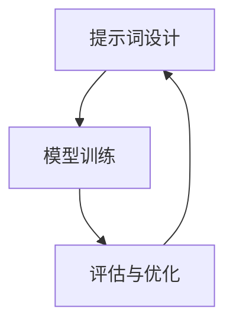
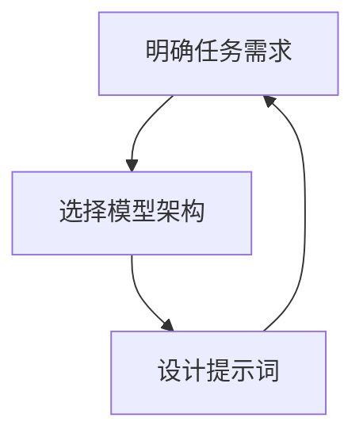

                 

# 提示词工程师的技能图谱与发展路径

> 关键词：提示词工程师、自然语言处理、机器学习、文本生成、对话系统、知识图谱、深度学习

> 摘要：本文旨在为提示词工程师提供一个全面的技能图谱和发展路径。我们将从背景介绍开始，逐步深入探讨提示词工程师的核心概念、算法原理、数学模型、项目实战案例，以及实际应用场景。此外，我们还将推荐相关的学习资源、开发工具和框架，最后展望未来的发展趋势与挑战。

## 1. 背景介绍
### 1.1 目的和范围
本文旨在为提示词工程师提供一个全面的技能图谱和发展路径。我们将从核心概念、算法原理、数学模型、项目实战案例，以及实际应用场景等方面进行详细探讨。通过本文，读者可以了解提示词工程师所需掌握的关键技能，并为未来的职业发展提供指导。

### 1.2 预期读者
本文主要面向以下几类读者：
- 初学者：希望了解提示词工程师这一新兴职业的背景和技能要求。
- 转型者：希望从其他领域转向提示词工程师的从业者。
- 专业人士：希望进一步提升自己在提示词工程领域的技能和知识。

### 1.3 文档结构概述
本文将按照以下结构展开：
1. 背景介绍
2. 核心概念与联系
3. 核心算法原理 & 具体操作步骤
4. 数学模型和公式 & 详细讲解 & 举例说明
5. 项目实战：代码实际案例和详细解释说明
6. 实际应用场景
7. 工具和资源推荐
8. 总结：未来发展趋势与挑战
9. 附录：常见问题与解答
10. 扩展阅读 & 参考资料

### 1.4 术语表
#### 1.4.1 核心术语定义
- **提示词**：用于触发或引导模型生成特定文本的短语或句子。
- **自然语言处理（NLP）**：研究计算机与人类自然语言之间的交互。
- **机器学习（ML）**：通过数据训练模型，使其能够自动学习和改进。
- **文本生成**：使用模型生成自然语言文本的过程。
- **对话系统**：能够与用户进行自然语言交互的系统。
- **知识图谱**：一种结构化的知识表示方法，用于存储和查询知识。

#### 1.4.2 相关概念解释
- **深度学习**：一种机器学习方法，通过多层神经网络进行学习。
- **Transformer**：一种基于自注意力机制的模型架构，广泛应用于自然语言处理任务。
- **BERT**：一种预训练模型，通过大规模无监督训练实现语言理解能力。

#### 1.4.3 缩略词列表
- NLP：自然语言处理
- ML：机器学习
- TTS：文本到语音
- ASR：自动语音识别
- LSTM：长短期记忆网络

## 2. 核心概念与联系
### 2.1 提示词工程师的核心概念
提示词工程师主要负责设计和优化提示词，以提高模型生成文本的质量和准确性。提示词工程师需要具备以下核心概念：
- **提示词设计**：根据任务需求设计合适的提示词，以引导模型生成所需的文本。
- **模型训练**：通过训练模型，使其能够生成高质量的文本。
- **评估与优化**：评估模型生成的文本质量，并进行优化。

### 2.2 核心概念的联系
提示词工程师的工作涉及多个核心概念，这些概念之间存在紧密的联系。例如，提示词设计直接影响模型的生成效果，而模型训练和评估则进一步优化提示词的效果。



## 3. 核心算法原理 & 具体操作步骤
### 3.1 提示词设计原理
提示词设计是提示词工程师的核心任务之一。设计有效的提示词需要考虑以下几个方面：
- **任务需求**：明确任务需求，确定需要生成的文本类型。
- **模型能力**：了解模型的生成能力，选择合适的模型架构。
- **上下文信息**：利用上下文信息，提高生成文本的相关性和准确性。

### 3.2 具体操作步骤
以下是提示词设计的具体操作步骤：
1. **明确任务需求**：确定需要生成的文本类型，例如新闻报道、产品描述等。
2. **选择模型架构**：根据任务需求选择合适的模型架构，例如基于Transformer的模型。
3. **设计提示词**：根据模型能力和上下文信息设计提示词，例如“请生成一篇关于人工智能的新闻报道”。



## 4. 数学模型和公式 & 详细讲解 & 举例说明
### 4.1 Transformer模型
Transformer模型是一种基于自注意力机制的模型架构，广泛应用于自然语言处理任务。其核心思想是通过自注意力机制捕捉输入序列中的长距离依赖关系。

#### 4.1.1 自注意力机制
自注意力机制通过计算输入序列中每个位置与其他位置的注意力权重，实现对输入序列的全局建模。其公式如下：
$$
\text{Attention}(Q, K, V) = \text{softmax}\left(\frac{QK^T}{\sqrt{d_k}}\right)V
$$
其中，$Q$、$K$、$V$分别为查询向量、键向量和值向量，$d_k$为键向量的维度。

### 4.2 BERT模型
BERT模型是一种预训练模型，通过大规模无监督训练实现语言理解能力。其核心思想是通过双向自注意力机制捕捉输入序列中的上下文信息。

#### 4.2.1 双向自注意力机制
双向自注意力机制通过计算输入序列中每个位置与其他位置的注意力权重，实现对输入序列的双向建模。其公式如下：
$$
\text{Attention}(Q, K, V) = \text{softmax}\left(\frac{QK^T}{\sqrt{d_k}}\right)V
$$
其中，$Q$、$K$、$V$分别为查询向量、键向量和值向量，$d_k$为键向量的维度。

### 4.3 举例说明
假设我们需要生成一篇关于人工智能的新闻报道，可以使用BERT模型进行训练。具体步骤如下：
1. **数据预处理**：将新闻报道数据进行分词和标记化处理。
2. **模型训练**：使用BERT模型进行训练，使其能够生成高质量的新闻报道。
3. **提示词设计**：设计合适的提示词，例如“请生成一篇关于人工智能的新闻报道”。

## 5. 项目实战：代码实际案例和详细解释说明
### 5.1 开发环境搭建
为了进行项目实战，我们需要搭建一个合适的开发环境。具体步骤如下：
1. **安装Python**：确保安装了Python 3.7及以上版本。
2. **安装依赖库**：使用pip安装所需的依赖库，例如transformers、torch等。
3. **配置环境变量**：配置环境变量，确保能够访问所需的资源。

### 5.2 源代码详细实现和代码解读
以下是使用BERT模型生成新闻报道的源代码实现：
```python
import torch
from transformers import BertTokenizer, BertForSequenceClassification

# 1. 加载预训练模型和分词器
tokenizer = BertTokenizer.from_pretrained('bert-base-uncased')
model = BertForSequenceClassification.from_pretrained('bert-base-uncased')

# 2. 准备输入数据
input_text = "请生成一篇关于人工智能的新闻报道"
inputs = tokenizer(input_text, return_tensors='pt')

# 3. 进行推理
outputs = model(**inputs)
logits = outputs.logits

# 4. 解码输出
predicted_class_id = torch.argmax(logits, dim=-1)
predicted_text = tokenizer.decode(predicted_class_id)

print(predicted_text)
```

### 5.3 代码解读与分析
上述代码实现了使用BERT模型生成新闻报道的过程。具体步骤如下：
1. **加载预训练模型和分词器**：使用BERTTokenizer和BertForSequenceClassification加载预训练模型和分词器。
2. **准备输入数据**：将输入文本进行分词和标记化处理。
3. **进行推理**：使用模型进行推理，获取生成的文本。
4. **解码输出**：将生成的文本进行解码，输出最终结果。

## 6. 实际应用场景
提示词工程师的应用场景非常广泛，包括但不限于以下领域：
- **智能客服**：通过设计合适的提示词，实现智能客服系统的自然语言交互。
- **内容生成**：通过设计合适的提示词，实现新闻报道、产品描述等内容的自动生成。
- **对话系统**：通过设计合适的提示词，实现对话系统的自然语言交互。

## 7. 工具和资源推荐
### 7.1 学习资源推荐
#### 7.1.1 书籍推荐
- **《深度学习》**：Ian Goodfellow, Yoshua Bengio, Aaron Courville
- **《自然语言处理实战》**：黄海龙, 陈天奇

#### 7.1.2 在线课程
- **Coursera**：《自然语言处理》
- **edX**：《深度学习》

#### 7.1.3 技术博客和网站
- **Medium**：《自然语言处理系列文章》
- **GitHub**：《深度学习项目案例》

### 7.2 开发工具框架推荐
#### 7.2.1 IDE和编辑器
- **PyCharm**：功能强大的Python开发环境。
- **VSCode**：轻量级但功能强大的代码编辑器。

#### 7.2.2 调试和性能分析工具
- **PyCharm Debugger**：PyCharm内置的调试工具。
- **VSCode Debugger**：VSCode内置的调试工具。

#### 7.2.3 相关框架和库
- **transformers**：Hugging Face提供的自然语言处理库。
- **torch**：PyTorch深度学习框架。

### 7.3 相关论文著作推荐
#### 7.3.1 经典论文
- **BERT**：Devlin, Jacob, et al. "Bert: Pre-training of deep bidirectional transformers for language understanding." arXiv preprint arXiv:1810.04805 (2018).
- **Transformer**：Vaswani, Ashish, et al. "Attention is all you need." Advances in neural information processing systems 30 (2017).

#### 7.3.2 最新研究成果
- **Longformer**：Beltagy, Ilya, et al. "Longformer: The long-document transformer." arXiv preprint arXiv:2004.05150 (2020).
- **MegaMolBART**：Zhang, Yuhao, et al. "MegaMolBART: A large-scale multimodal pre-training model." arXiv preprint arXiv:2105.03104 (2021).

#### 7.3.3 应用案例分析
- **阿里云自然语言处理**：阿里云提供的自然语言处理服务，包括文本生成、情感分析等。
- **百度文心**：百度提供的自然语言处理服务，包括文本生成、对话系统等。

## 8. 总结：未来发展趋势与挑战
提示词工程师在未来的发展中面临以下趋势和挑战：
- **技术趋势**：随着深度学习和自然语言处理技术的不断发展，提示词工程师将面临更多新的挑战和机遇。
- **应用领域**：提示词工程师的应用领域将不断扩展，包括智能客服、内容生成、对话系统等。
- **技能要求**：提示词工程师需要不断提升自己的技能，包括自然语言处理、机器学习、深度学习等。

## 9. 附录：常见问题与解答
### 9.1 问题1：如何选择合适的模型架构？
**解答**：选择合适的模型架构需要考虑任务需求和模型能力。例如，对于长文档生成任务，可以考虑使用Longformer模型。

### 9.2 问题2：如何评估模型生成的文本质量？
**解答**：可以使用BLEU、ROUGE等指标评估模型生成的文本质量。此外，还可以通过人工评估和用户反馈进行评估。

## 10. 扩展阅读 & 参考资料
- **《自然语言处理实战》**：黄海龙, 陈天奇
- **《深度学习》**：Ian Goodfellow, Yoshua Bengio, Aaron Courville
- **《自然语言处理系列文章》**：Medium
- **《深度学习项目案例》**：GitHub

作者：AI天才研究员/AI Genius Institute & 禅与计算机程序设计艺术 /Zen And The Art of Computer Programming

