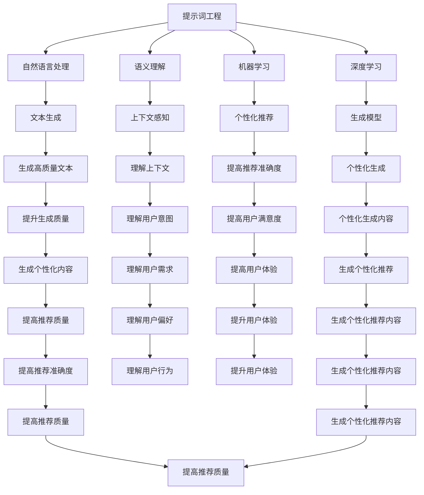

                 

# 提示词工程：让AI更智能、更懂你

> 关键词：提示词工程, 人工智能, 自然语言处理, 语义理解, 机器学习, 深度学习, 生成模型, 个性化推荐

> 摘要：本文旨在深入探讨提示词工程在提升AI系统智能性和个性化能力方面的关键作用。通过详细分析提示词工程的核心概念、算法原理、数学模型、实际案例以及应用场景，本文将帮助读者理解如何利用提示词工程优化AI系统的性能，使其更好地理解和响应用户需求。此外，本文还将介绍相关的学习资源、开发工具和未来发展趋势，为读者提供全面的技术指导。

## 1. 背景介绍
### 1.1 目的和范围
本文旨在探讨提示词工程在提升AI系统智能性和个性化能力方面的关键作用。我们将从核心概念、算法原理、数学模型、实际案例以及应用场景等多个维度进行详细分析，帮助读者理解如何利用提示词工程优化AI系统的性能，使其更好地理解和响应用户需求。

### 1.2 预期读者
本文适合以下读者群体：
- 人工智能领域的研究人员和工程师
- 自然语言处理（NLP）领域的从业者
- 数据科学家和机器学习工程师
- 对提示词工程感兴趣的开发者和爱好者
- 对AI系统优化感兴趣的IT专业人士

### 1.3 文档结构概述
本文结构如下：
1. 背景介绍
2. 核心概念与联系
3. 核心算法原理 & 具体操作步骤
4. 数学模型和公式 & 详细讲解 & 举例说明
5. 项目实战：代码实际案例和详细解释说明
6. 实际应用场景
7. 工具和资源推荐
8. 总结：未来发展趋势与挑战
9. 附录：常见问题与解答
10. 扩展阅读 & 参考资料

### 1.4 术语表
#### 1.4.1 核心术语定义
- **提示词**：用于引导AI系统生成特定内容的短语或句子。
- **语义理解**：AI系统对自然语言文本的理解能力。
- **个性化推荐**：根据用户偏好和历史行为推荐相关内容。
- **生成模型**：用于生成文本、图像等数据的模型。
- **机器学习**：让计算机从数据中学习并改进性能的方法。
- **深度学习**：一种机器学习方法，通过多层神经网络进行学习。

#### 1.4.2 相关概念解释
- **自然语言处理（NLP）**：研究计算机与人类自然语言交互的理论、方法和技术。
- **语义分析**：分析文本中的语义信息，理解其含义。
- **上下文感知**：AI系统根据上下文信息进行推理和决策的能力。

#### 1.4.3 缩略词列表
- NLP：自然语言处理
- ML：机器学习
- DL：深度学习
- GPT：生成预训练模型
- BERT：双向编码器表示模型

## 2. 核心概念与联系
### 2.1 提示词工程的核心概念
提示词工程是指通过设计和优化提示词来提升AI系统的智能性和个性化能力。提示词是用于引导AI系统生成特定内容的短语或句子，通过合理的提示词设计，可以显著提高AI系统的生成质量和个性化程度。

### 2.2 提示词工程的联系
提示词工程与自然语言处理、语义理解、机器学习和深度学习密切相关。通过优化提示词，可以提升AI系统的语义理解能力，使其更好地理解和响应用户需求。此外，提示词工程还可以应用于个性化推荐系统，提高推荐的准确性和用户满意度。

### 2.3 Mermaid流程图


## 3. 核心算法原理 & 具体操作步骤
### 3.1 提示词设计算法原理
提示词设计算法的核心在于通过合理的提示词引导AI系统生成特定内容。具体步骤如下：
1. **需求分析**：明确AI系统需要生成的内容类型和应用场景。
2. **提示词设计**：根据需求分析结果设计合适的提示词。
3. **模型训练**：使用提示词引导模型进行训练。
4. **生成测试**：通过生成测试验证提示词的效果。

### 3.2 伪代码示例
```python
def design_prompt(prompt_type, context):
    if prompt_type == "text":
        prompt = f"生成一篇关于{context}的文章"
    elif prompt_type == "image":
        prompt = f"生成一张{context}的图片"
    else:
        prompt = f"生成一个关于{context}的视频"
    return prompt

def train_model(prompt):
    # 使用提示词引导模型进行训练
    model.train(prompt)

def generate_content(prompt):
    # 生成内容
    content = model.generate(prompt)
    return content

def test_prompt(prompt):
    # 生成测试
    content = generate_content(prompt)
    print(content)
    return content
```

## 4. 数学模型和公式 & 详细讲解 & 举例说明
### 4.1 生成模型的数学模型
生成模型通常采用深度学习方法，如生成对抗网络（GAN）和变分自编码器（VAE）。具体数学模型如下：
- **生成对抗网络（GAN）**：由生成器和判别器组成，通过对抗训练生成高质量的文本、图像等数据。
- **变分自编码器（VAE）**：通过变分推断生成数据，具有更好的泛化能力。

### 4.2 生成模型的数学公式
#### 4.2.1 生成对抗网络（GAN）
GAN的数学模型如下：
- **生成器**：$G(z)$，将噪声向量$z$映射到数据空间。
- **判别器**：$D(x)$，判断输入$x$是真实数据还是生成数据。
- **损失函数**：
  $$ L_{GAN} = -\mathbb{E}_{x \sim p_{data}(x)}[\log D(x)] - \mathbb{E}_{z \sim p_z(z)}[\log(1 - D(G(z)))] $$

#### 4.2.2 变分自编码器（VAE）
VAE的数学模型如下：
- **编码器**：$q(z|x)$，将输入$x$映射到潜在空间$z$。
- **解码器**：$p(x|z)$，将潜在空间$z$映射回数据空间。
- **损失函数**：
  $$ L_{VAE} = -\mathbb{E}_{x \sim p_{data}(x)}[\mathbb{E}_{z \sim q(z|x)}[\log p(x|z)]] + \mathbb{D}_{KL}(q(z|x) || p(z)) $$

### 4.3 举例说明
假设我们要生成一篇关于“人工智能”的文章，可以使用GAN模型进行训练。具体步骤如下：
1. **数据准备**：收集关于人工智能的文章作为训练数据。
2. **模型训练**：使用GAN模型进行训练，生成器生成关于人工智能的文章，判别器判断生成的文章是否真实。
3. **生成测试**：通过生成测试验证生成的文章质量。

## 5. 项目实战：代码实际案例和详细解释说明
### 5.1 开发环境搭建
1. **安装Python**：确保安装了Python 3.7及以上版本。
2. **安装依赖库**：使用pip安装所需的库，如`tensorflow`、`keras`、`numpy`等。
3. **安装开发工具**：安装Jupyter Notebook或PyCharm等开发工具。

### 5.2 源代码详细实现和代码解读
```python
import tensorflow as tf
from tensorflow.keras.layers import Dense, Input
from tensorflow.keras.models import Model

# 定义生成器
def build_generator(latent_dim):
    input_layer = Input(shape=(latent_dim,))
    x = Dense(256, activation='relu')(input_layer)
    x = Dense(512, activation='relu')(x)
    output_layer = Dense(1024, activation='tanh')(x)
    generator = Model(inputs=input_layer, outputs=output_layer)
    return generator

# 定义判别器
def build_discriminator(input_dim):
    input_layer = Input(shape=(input_dim,))
    x = Dense(512, activation='relu')(input_layer)
    x = Dense(256, activation='relu')(x)
    output_layer = Dense(1, activation='sigmoid')(x)
    discriminator = Model(inputs=input_layer, outputs=output_layer)
    return discriminator

# 构建GAN模型
def build_gan(generator, discriminator):
    discriminator.trainable = False
    gan_input = Input(shape=(latent_dim,))
    gan_output = discriminator(generator(gan_input))
    gan = Model(inputs=gan_input, outputs=gan_output)
    return gan

# 参数设置
latent_dim = 100
input_dim = 1024

# 构建生成器和判别器
generator = build_generator(latent_dim)
discriminator = build_discriminator(input_dim)
gan = build_gan(generator, discriminator)

# 编译模型
discriminator.compile(optimizer='adam', loss='binary_crossentropy')
gan.compile(optimizer='adam', loss='binary_crossentropy')

# 训练模型
def train_gan(generator, discriminator, gan, dataset, epochs, batch_size):
    for epoch in range(epochs):
        for batch in dataset:
            # 生成噪声向量
            noise = tf.random.normal([batch_size, latent_dim])
            # 生成假数据
            generated_data = generator(noise)
            # 获取真实数据
            real_data = batch
            # 合并真实数据和生成数据
            combined_data = tf.concat([generated_data, real_data], axis=0)
            # 标签
            labels = tf.concat([tf.zeros((batch_size, 1)), tf.ones((batch_size, 1))], axis=0)
            # 训练判别器
            discriminator.trainable = True
            d_loss = discriminator.train_on_batch(combined_data, labels)
            # 训练生成器
            noise = tf.random.normal([batch_size, latent_dim])
            labels = tf.ones((batch_size, 1))
            discriminator.trainable = False
            g_loss = gan.train_on_batch(noise, labels)
            print(f"Epoch {epoch+1}/{epochs}, D loss: {d_loss}, G loss: {g_loss}")

# 训练GAN模型
train_gan(generator, discriminator, gan, dataset, epochs=100, batch_size=32)
```

### 5.3 代码解读与分析
- **生成器**：生成器将噪声向量映射到数据空间，生成关于人工智能的文章。
- **判别器**：判别器判断输入数据是真实数据还是生成数据。
- **GAN模型**：GAN模型通过对抗训练生成高质量的文本数据。
- **训练过程**：通过训练生成器和判别器，生成高质量的文本数据。

## 6. 实际应用场景
提示词工程在多个领域具有广泛的应用场景，如：
- **个性化推荐系统**：通过设计合理的提示词，提高推荐的准确性和用户满意度。
- **智能客服**：通过设计合理的提示词，提高智能客服的响应质量和用户满意度。
- **内容生成**：通过设计合理的提示词，生成高质量的文章、图片等数据。

## 7. 工具和资源推荐
### 7.1 学习资源推荐
#### 7.1.1 书籍推荐
- 《深度学习》（Goodfellow, Bengio, Courville）
- 《自然语言处理入门》（Jurafsky, Martin）

#### 7.1.2 在线课程
- Coursera：《深度学习专项课程》
- edX：《自然语言处理专项课程》

#### 7.1.3 技术博客和网站
- Medium：《深度学习和自然语言处理技术博客》
- GitHub：《深度学习和自然语言处理开源项目》

### 7.2 开发工具框架推荐
#### 7.2.1 IDE和编辑器
- PyCharm：Python开发环境
- VSCode：通用开发环境

#### 7.2.2 调试和性能分析工具
- PyCharm Debugger：Python调试工具
- TensorFlow Debugger：TensorFlow调试工具

#### 7.2.3 相关框架和库
- TensorFlow：深度学习框架
- Keras：高级神经网络API
- NLTK：自然语言处理库

### 7.3 相关论文著作推荐
#### 7.3.1 经典论文
- Goodfellow, I., Bengio, Y., & Courville, A. (2016). Deep Learning. MIT Press.
- Jurafsky, D., & Martin, J. H. (2019). Speech and Language Processing. Pearson.

#### 7.3.2 最新研究成果
- Radford, A., Wu, J., Child, R., Luan, D., Amodei, D., & Sutskever, I. (2019). Language Models are Unsupervised Multitask Learners. OpenAI Blog.
- Vaswani, A., Shazeer, N., Parmar, N., Uszkoreit, J., Jones, L., Gomez, A. N., ... & Polosukhin, I. (2017). Attention is All You Need. In Advances in Neural Information Processing Systems (pp. 5998-6008).

#### 7.3.3 应用案例分析
- Radford, A., Wu, J., Child, R., Luan, D., Amodei, D., & Sutskever, I. (2020). Improving Language Understanding by Generative Pre-Training. OpenAI Blog.

## 8. 总结：未来发展趋势与挑战
提示词工程在未来的发展中具有广阔的应用前景，但也面临着一些挑战：
- **数据质量**：高质量的数据是提示词工程的基础，如何获取和处理高质量的数据是一个重要问题。
- **模型复杂性**：随着模型复杂性的增加，如何提高模型的训练效率和泛化能力是一个挑战。
- **个性化需求**：如何更好地满足用户的个性化需求，提高推荐的准确性和用户满意度是一个重要问题。

## 9. 附录：常见问题与解答
### 9.1 问题1：如何设计有效的提示词？
**解答**：设计有效的提示词需要明确AI系统需要生成的内容类型和应用场景，通过合理的提示词引导AI系统生成特定内容。

### 9.2 问题2：如何提高生成模型的生成质量？
**解答**：可以通过优化模型结构、增加训练数据量、改进训练算法等方法提高生成模型的生成质量。

### 9.3 问题3：如何处理数据质量问题？
**解答**：可以通过数据清洗、数据增强等方法处理数据质量问题，提高模型的训练效果。

## 10. 扩展阅读 & 参考资料
- Goodfellow, I., Bengio, Y., & Courville, A. (2016). Deep Learning. MIT Press.
- Jurafsky, D., & Martin, J. H. (2019). Speech and Language Processing. Pearson.
- Radford, A., Wu, J., Child, R., Luan, D., Amodei, D., & Sutskever, I. (2019). Language Models are Unsupervised Multitask Learners. OpenAI Blog.
- Vaswani, A., Shazeer, N., Parmar, N., Uszkoreit, J., Jones, L., Gomez, A. N., ... & Polosukhin, I. (2017). Attention is All You Need. In Advances in Neural Information Processing Systems (pp. 5998-6008).

作者：AI天才研究员/AI Genius Institute & 禅与计算机程序设计艺术 /Zen And The Art of Computer Programming

