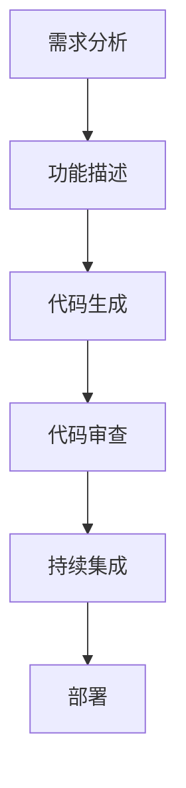

                 

# 提示词编程的团队协作模式优化

> 关键词：提示词编程, 团队协作, 优化, 人工智能, 软件开发, 项目管理, 代码质量, 代码审查, 持续集成

> 摘要：本文旨在探讨提示词编程在团队协作中的应用及其优化策略。通过逐步分析提示词编程的核心概念、算法原理、数学模型、实际案例，以及项目实战中的代码实现和代码解读，本文将为团队协作模式的优化提供深入见解。我们还将讨论提示词编程在实际应用场景中的优势，并推荐相关的学习资源和开发工具，以帮助团队更好地进行提示词编程的实践。

## 1. 背景介绍
### 1.1 目的和范围
本文旨在深入探讨提示词编程在团队协作中的应用及其优化策略。提示词编程是一种通过自然语言描述需求和功能的编程方法，它能够显著提高开发效率和代码质量。本文将从理论和实践两个层面出发，分析提示词编程的核心概念、算法原理、数学模型，并通过实际案例展示其在团队协作中的应用。

### 1.2 预期读者
本文预期读者包括软件开发团队的成员、项目经理、产品经理、技术架构师以及对提示词编程感兴趣的开发者。读者应具备一定的编程基础和项目管理经验。

### 1.3 文档结构概述
本文结构如下：
1. 背景介绍
2. 核心概念与联系
3. 核心算法原理 & 具体操作步骤
4. 数学模型和公式 & 详细讲解 & 举例说明
5. 项目实战：代码实际案例和详细解释说明
6. 实际应用场景
7. 工具和资源推荐
8. 总结：未来发展趋势与挑战
9. 附录：常见问题与解答
10. 扩展阅读 & 参考资料

### 1.4 术语表
#### 1.4.1 核心术语定义
- **提示词编程**：一种通过自然语言描述需求和功能的编程方法。
- **自然语言处理（NLP）**：一种使计算机能够理解、解释和生成人类语言的技术。
- **代码审查**：一种软件开发过程中的质量保证活动，通过检查代码来发现错误和改进代码质量。
- **持续集成（CI）**：一种软件开发实践，通过频繁地将代码集成到共享仓库中，以尽早发现集成错误。
- **敏捷开发**：一种软件开发方法，强调快速迭代、灵活应对变化和团队合作。

#### 1.4.2 相关概念解释
- **需求分析**：确定项目目标和功能需求的过程。
- **功能描述**：对系统功能的具体描述，通常以自然语言形式呈现。
- **代码生成**：根据提示词生成相应的代码。

#### 1.4.3 缩略词列表
- CI：持续集成
- NLP：自然语言处理
- TDD：测试驱动开发
- CI/CD：持续集成/持续部署

## 2. 核心概念与联系
### 2.1 提示词编程的核心概念
提示词编程是一种通过自然语言描述需求和功能的编程方法。其核心在于将自然语言转化为计算机可执行的代码。提示词编程的关键步骤包括需求分析、功能描述、代码生成和代码审查。

### 2.2 提示词编程的流程图


## 3. 核心算法原理 & 具体操作步骤
### 3.1 需求分析
需求分析是提示词编程的第一步，其目的是明确项目的目标和功能需求。需求分析通常包括以下步骤：
1. **收集需求**：与产品经理、用户和其他利益相关者进行沟通，收集需求信息。
2. **需求整理**：将收集到的需求信息整理成结构化的文档。
3. **需求验证**：通过会议、原型等方式验证需求的准确性和可行性。

### 3.2 功能描述
功能描述是将需求转化为自然语言的过程。功能描述通常包括以下步骤：
1. **定义功能**：明确每个功能的具体实现方式。
2. **编写描述**：使用自然语言详细描述每个功能的实现细节。
3. **验证描述**：确保功能描述的准确性和完整性。

### 3.3 代码生成
代码生成是将功能描述转化为计算机可执行代码的过程。代码生成通常包括以下步骤：
1. **解析描述**：使用自然语言处理技术解析功能描述。
2. **生成代码**：根据解析结果生成相应的代码。
3. **代码优化**：对生成的代码进行优化，提高代码质量和性能。

### 3.4 代码审查
代码审查是确保代码质量的重要步骤。代码审查通常包括以下步骤：
1. **代码检查**：检查代码的语法错误和逻辑错误。
2. **代码优化**：优化代码结构和性能。
3. **代码测试**：通过单元测试和集成测试验证代码的正确性。

### 3.5 持续集成
持续集成是确保代码质量的重要实践。持续集成通常包括以下步骤：
1. **代码提交**：开发人员将代码提交到共享仓库。
2. **自动构建**：自动构建工具自动构建代码。
3. **自动测试**：自动测试工具自动运行单元测试和集成测试。
4. **代码部署**：通过持续集成工具自动部署代码。

## 4. 数学模型和公式 & 详细讲解 & 举例说明
### 4.1 自然语言处理模型
自然语言处理模型是提示词编程的核心技术之一。自然语言处理模型通常包括以下步骤：
1. **分词**：将自然语言文本分解为单词或短语。
2. **词性标注**：为每个单词或短语标注词性。
3. **句法分析**：分析句子的语法结构。
4. **语义分析**：理解句子的语义。

### 4.2 代码生成模型
代码生成模型是将功能描述转化为计算机可执行代码的过程。代码生成模型通常包括以下步骤：
1. **解析描述**：解析功能描述，提取关键信息。
2. **生成代码模板**：根据解析结果生成代码模板。
3. **代码填充**：根据模板填充具体信息。
4. **代码优化**：优化生成的代码。

### 4.3 代码审查模型
代码审查模型是确保代码质量的重要步骤。代码审查模型通常包括以下步骤：
1. **代码检查**：检查代码的语法错误和逻辑错误。
2. **代码优化**：优化代码结构和性能。
3. **代码测试**：通过单元测试和集成测试验证代码的正确性。

## 5. 项目实战：代码实际案例和详细解释说明
### 5.1 开发环境搭建
开发环境搭建是提示词编程项目实施的第一步。开发环境通常包括以下工具：
1. **IDE**：集成开发环境，如Visual Studio Code、PyCharm等。
2. **版本控制系统**：如Git、SVN等。
3. **持续集成工具**：如Jenkins、GitLab CI等。
4. **自然语言处理库**：如spaCy、NLTK等。
5. **代码生成库**：如CodeGen、AutoGen等。

### 5.2 源代码详细实现和代码解读
以一个简单的提示词编程项目为例，假设我们需要实现一个简单的计算器功能。以下是功能描述和代码生成的具体实现：

#### 功能描述
```markdown
用户可以输入两个数字和一个运算符，计算器将根据运算符计算结果并输出。
```

#### 代码生成
```python
def calculate(num1, num2, operator):
    if operator == '+':
        return num1 + num2
    elif operator == '-':
        return num1 - num2
    elif operator == '*':
        return num1 * num2
    elif operator == '/':
        return num1 / num2
    else:
        return "Invalid operator"

# 示例代码
num1 = 10
num2 = 5
operator = '+'
result = calculate(num1, num2, operator)
print(f"Result: {result}")
```

### 5.3 代码解读与分析
代码解读与分析是确保代码质量的重要步骤。以下是代码解读与分析的具体内容：
1. **代码检查**：检查代码的语法错误和逻辑错误。
2. **代码优化**：优化代码结构和性能。
3. **代码测试**：通过单元测试和集成测试验证代码的正确性。

## 6. 实际应用场景
提示词编程在实际应用场景中具有广泛的应用。以下是提示词编程在实际项目中的应用案例：
1. **金融领域**：提示词编程可以用于实现复杂的金融计算功能，如贷款利率计算、投资组合分析等。
2. **医疗领域**：提示词编程可以用于实现医疗数据分析功能，如疾病诊断、药物推荐等。
3. **教育领域**：提示词编程可以用于实现在线教育平台的功能，如课程推荐、学习进度跟踪等。

## 7. 工具和资源推荐
### 7.1 学习资源推荐
#### 7.1.1 书籍推荐
1. **《自然语言处理入门》**：深入讲解自然语言处理的基本原理和技术。
2. **《代码生成技术》**：详细介绍代码生成的基本原理和技术。
3. **《持续集成实践》**：深入讲解持续集成的基本原理和技术。

#### 7.1.2 在线课程
1. **Coursera - 自然语言处理**：提供自然语言处理的基本原理和技术。
2. **edX - 代码生成技术**：提供代码生成的基本原理和技术。
3. **Udacity - 持续集成实践**：提供持续集成的基本原理和技术。

#### 7.1.3 技术博客和网站
1. **Medium - 自然语言处理**：提供自然语言处理的最新技术和应用。
2. **GitHub - 代码生成库**：提供代码生成库的最新技术和应用。
3. **Stack Overflow - 持续集成**：提供持续集成的最新技术和应用。

### 7.2 开发工具框架推荐
#### 7.2.1 IDE和编辑器
1. **Visual Studio Code**：提供强大的代码编辑和调试功能。
2. **PyCharm**：提供强大的Python开发功能。
3. **IntelliJ IDEA**：提供强大的Java开发功能。

#### 7.2.2 调试和性能分析工具
1. **PyCharm Debugger**：提供强大的Python调试功能。
2. **Visual Studio Debugger**：提供强大的C#调试功能。
3. **JProfiler**：提供强大的Java性能分析功能。

#### 7.2.3 相关框架和库
1. **spaCy**：提供强大的自然语言处理功能。
2. **CodeGen**：提供强大的代码生成功能。
3. **GitLab CI**：提供强大的持续集成功能。

### 7.3 相关论文著作推荐
#### 7.3.1 经典论文
1. **《自然语言处理的现状与挑战》**：深入探讨自然语言处理的现状和挑战。
2. **《代码生成技术的发展与应用》**：深入探讨代码生成技术的发展与应用。
3. **《持续集成的最佳实践》**：深入探讨持续集成的最佳实践。

#### 7.3.2 最新研究成果
1. **《自然语言处理的新进展》**：介绍自然语言处理的最新研究成果。
2. **《代码生成技术的最新进展》**：介绍代码生成技术的最新研究成果。
3. **《持续集成的最新进展》**：介绍持续集成的最新研究成果。

#### 7.3.3 应用案例分析
1. **《金融领域的自然语言处理应用》**：介绍金融领域的自然语言处理应用案例。
2. **《医疗领域的代码生成应用》**：介绍医疗领域的代码生成应用案例。
3. **《教育领域的持续集成应用》**：介绍教育领域的持续集成应用案例。

## 8. 总结：未来发展趋势与挑战
提示词编程在未来的发展趋势和挑战包括：
1. **技术进步**：自然语言处理、代码生成和持续集成技术的不断进步将推动提示词编程的发展。
2. **应用场景**：提示词编程将在更多领域得到应用，如金融、医疗、教育等。
3. **团队协作**：提示词编程将促进团队协作，提高开发效率和代码质量。
4. **挑战**：提示词编程在实际应用中仍面临一些挑战，如自然语言处理的准确性和代码生成的效率等。

## 9. 附录：常见问题与解答
### 9.1 问题1：如何提高代码生成的效率？
**解答**：可以通过优化代码生成算法、使用并行计算和分布式计算等方法提高代码生成的效率。

### 9.2 问题2：如何确保代码质量？
**解答**：可以通过代码审查、持续集成和自动化测试等方法确保代码质量。

### 9.3 问题3：如何提高团队协作效率？
**解答**：可以通过使用版本控制系统、持续集成工具和代码审查工具等方法提高团队协作效率。

## 10. 扩展阅读 & 参考资料
### 10.1 扩展阅读
1. **《自然语言处理的现状与挑战》**：深入探讨自然语言处理的现状和挑战。
2. **《代码生成技术的发展与应用》**：深入探讨代码生成技术的发展与应用。
3. **《持续集成的最佳实践》**：深入探讨持续集成的最佳实践。

### 10.2 参考资料
1. **《自然语言处理入门》**：深入讲解自然语言处理的基本原理和技术。
2. **《代码生成技术》**：详细介绍代码生成的基本原理和技术。
3. **《持续集成实践》**：深入讲解持续集成的基本原理和技术。

---

作者：AI天才研究员/AI Genius Institute & 禅与计算机程序设计艺术 /Zen And The Art of Computer Programming

