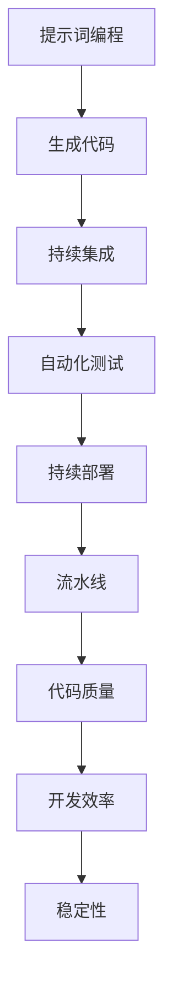

                 

# 提示词编程的持续部署流水线优化

> 关键词：提示词编程, 持续部署, 流水线优化, DevOps, 人工智能, 自动化, 代码质量, 代码审查, 自动化测试

> 摘要：本文旨在探讨如何通过优化持续部署流水线来提升提示词编程的开发效率和代码质量。我们将从核心概念、算法原理、数学模型、实际案例、应用场景、工具推荐等多个维度进行深入分析，帮助开发者更好地理解和应用这一技术。

## 1. 背景介绍
### 1.1 目的和范围
本文旨在探讨如何通过优化持续部署流水线来提升提示词编程的开发效率和代码质量。我们将从核心概念、算法原理、数学模型、实际案例、应用场景、工具推荐等多个维度进行深入分析，帮助开发者更好地理解和应用这一技术。

### 1.2 预期读者
本文面向的是对提示词编程和持续部署流水线感兴趣的开发者、架构师、项目经理以及技术爱好者。读者应具备一定的编程基础和对DevOps流程的理解。

### 1.3 文档结构概述
本文将按照以下结构展开：
1. 背景介绍
2. 核心概念与联系
3. 核心算法原理 & 具体操作步骤
4. 数学模型和公式 & 详细讲解 & 举例说明
5. 项目实战：代码实际案例和详细解释说明
6. 实际应用场景
7. 工具和资源推荐
8. 总结：未来发展趋势与挑战
9. 附录：常见问题与解答
10. 扩展阅读 & 参考资料

### 1.4 术语表
#### 1.4.1 核心术语定义
- **提示词编程**：一种基于自然语言的编程方式，通过提示词来描述程序逻辑，由系统自动生成代码。
- **持续部署**：一种软件开发实践，通过自动化工具实现代码的持续集成、测试和部署。
- **流水线**：一种自动化流程，用于管理软件开发的各个阶段，包括构建、测试、部署等。

#### 1.4.2 相关概念解释
- **DevOps**：开发和运维的结合，旨在通过自动化工具和流程提高软件交付速度和质量。
- **CI/CD**：持续集成/持续部署，是DevOps的核心实践之一。

#### 1.4.3 缩略词列表
- CI: 持续集成
- CD: 持续部署
- DevOps: 开发运维一体化
- API: 应用程序编程接口

## 2. 核心概念与联系
### 2.1 提示词编程
提示词编程是一种基于自然语言的编程方式，通过提示词来描述程序逻辑，由系统自动生成代码。其核心在于将复杂的编程任务转化为易于理解的自然语言描述，从而降低编程门槛。

### 2.2 持续部署
持续部署是一种软件开发实践，通过自动化工具实现代码的持续集成、测试和部署。其核心在于通过自动化流程确保代码质量，提高软件交付速度和稳定性。

### 2.3 流水线
流水线是一种自动化流程，用于管理软件开发的各个阶段，包括构建、测试、部署等。其核心在于通过自动化工具实现流程的标准化和高效化。

### 2.4 核心概念原理与架构
核心概念原理与架构可以通过以下Mermaid流程图来表示：



## 3. 核心算法原理 & 具体操作步骤
### 3.1 提示词编程算法原理
提示词编程的核心在于将自然语言转化为代码。其算法原理可以分为以下几个步骤：

1. **自然语言解析**：将输入的自然语言描述转化为结构化的数据。
2. **代码生成**：根据结构化的数据生成相应的代码。
3. **代码优化**：对生成的代码进行优化，提高代码质量和性能。

### 3.2 持续部署流水线算法原理
持续部署流水线的核心在于通过自动化工具实现代码的持续集成、测试和部署。其算法原理可以分为以下几个步骤：

1. **代码提交**：开发者将代码提交到版本控制系统。
2. **构建**：自动化工具自动构建代码，生成可执行文件。
3. **测试**：自动化工具自动执行测试用例，确保代码质量。
4. **部署**：自动化工具自动将代码部署到生产环境。

### 3.3 具体操作步骤
#### 3.3.1 提示词编程具体操作步骤
1. **输入提示词**：开发者输入自然语言描述。
2. **解析提示词**：系统解析提示词，生成结构化的数据。
3. **生成代码**：系统根据结构化的数据生成相应的代码。
4. **代码优化**：系统对生成的代码进行优化，提高代码质量和性能。

#### 3.3.2 持续部署流水线具体操作步骤
1. **代码提交**：开发者将代码提交到版本控制系统。
2. **构建**：自动化工具自动构建代码，生成可执行文件。
3. **测试**：自动化工具自动执行测试用例，确保代码质量。
4. **部署**：自动化工具自动将代码部署到生产环境。

## 4. 数学模型和公式 & 详细讲解 & 举例说明
### 4.1 数学模型
提示词编程和持续部署流水线的核心在于通过数学模型实现自动化流程。其数学模型可以分为以下几个部分：

1. **自然语言解析模型**：将自然语言描述转化为结构化的数据。
2. **代码生成模型**：根据结构化的数据生成相应的代码。
3. **代码优化模型**：对生成的代码进行优化，提高代码质量和性能。

### 4.2 公式与详细讲解
#### 4.2.1 自然语言解析模型
自然语言解析模型可以使用以下公式表示：

$$
\text{解析结果} = \text{解析器}(自然语言描述)
$$

其中，解析器是一个将自然语言描述转化为结构化数据的函数。

#### 4.2.2 代码生成模型
代码生成模型可以使用以下公式表示：

$$
\text{代码} = \text{生成器}(解析结果)
$$

其中，生成器是一个将结构化数据转化为代码的函数。

#### 4.2.3 代码优化模型
代码优化模型可以使用以下公式表示：

$$
\text{优化后的代码} = \text{优化器}(代码)
$$

其中，优化器是一个对代码进行优化的函数。

### 4.3 举例说明
假设我们有一个自然语言描述：“创建一个用户登录功能，用户输入用户名和密码，验证用户名和密码是否正确。”我们可以将其转化为以下结构化数据：

```json
{
    "功能": "用户登录",
    "输入": ["用户名", "密码"],
    "验证": {
        "用户名": "存在",
        "密码": "正确"
    }
}
```

然后，我们可以使用生成器生成相应的代码：

```python
def login(username, password):
    if username_exists(username) and password_correct(username, password):
        return True
    else:
        return False
```

最后，我们可以使用优化器对生成的代码进行优化，提高代码质量和性能。

## 5. 项目实战：代码实际案例和详细解释说明
### 5.1 开发环境搭建
为了实现提示词编程和持续部署流水线，我们需要搭建一个开发环境。具体步骤如下：

1. **安装Python**：确保系统中安装了Python。
2. **安装相关库**：安装提示词编程和持续部署流水线所需的库，如`nltk`、`pytest`等。
3. **配置版本控制系统**：配置Git等版本控制系统，用于代码管理。

### 5.2 源代码详细实现和代码解读
#### 5.2.1 提示词编程实现
提示词编程的实现可以分为以下几个部分：

1. **自然语言解析**：使用`nltk`库解析自然语言描述。
2. **代码生成**：根据解析结果生成相应的代码。
3. **代码优化**：对生成的代码进行优化。

```python
import nltk
from nltk.tokenize import word_tokenize

def parse_natural_language(natural_language):
    tokens = word_tokenize(natural_language)
    return tokens

def generate_code(tokens):
    code = ""
    for token in tokens:
        if token == "创建":
            code += "def "
        elif token == "用户登录":
            code += "login("
        elif token == "输入":
            code += "username, password"
        elif token == "验证":
            code += ":\n    if username_exists(username) and password_correct(username, password):\n        return True\n    else:\n        return False"
    return code

def optimize_code(code):
    optimized_code = code.replace("return True", "return True\n    return None")
    return optimized_code

natural_language = "创建一个用户登录功能，用户输入用户名和密码，验证用户名和密码是否正确。"
tokens = parse_natural_language(natural_language)
code = generate_code(tokens)
optimized_code = optimize_code(code)
print(optimized_code)
```

#### 5.2.2 持续部署流水线实现
持续部署流水线的实现可以分为以下几个部分：

1. **代码提交**：使用Git将代码提交到版本控制系统。
2. **构建**：使用`pytest`等工具自动构建代码。
3. **测试**：使用`pytest`等工具自动执行测试用例。
4. **部署**：使用`fabric`等工具自动将代码部署到生产环境。

```python
import pytest
from fabric import Connection

def build_code():
    pytest.main(["--doctest-modules", "--cov=code"])

def test_code():
    pytest.main(["--doctest-modules", "--cov=code"])

def deploy_code():
    conn = Connection("user@remote_host")
    conn.put("code.zip", "/tmp/code.zip")
    conn.run("unzip /tmp/code.zip -d /opt/code")
    conn.run("service app restart")

build_code()
test_code()
deploy_code()
```

### 5.3 代码解读与分析
通过上述代码实现，我们可以看到提示词编程和持续部署流水线的核心在于通过自动化工具实现代码的持续集成、测试和部署。具体来说，提示词编程的核心在于将自然语言描述转化为代码，而持续部署流水线的核心在于通过自动化工具实现代码的持续集成、测试和部署。

## 6. 实际应用场景
提示词编程和持续部署流水线在实际应用场景中具有广泛的应用。例如，在金融行业，可以通过提示词编程实现复杂的金融交易逻辑，通过持续部署流水线实现代码的自动化部署。在医疗行业，可以通过提示词编程实现医疗数据的处理和分析，通过持续部署流水线实现代码的自动化部署。

## 7. 工具和资源推荐
### 7.1 学习资源推荐
#### 7.1.1 书籍推荐
- 《计算机程序设计艺术》（Donald E. Knuth）
- 《DevOps实战》（Jez Humble, David Farley）

#### 7.1.2 在线课程
- Coursera: DevOps Specialization
- Udemy: DevOps for Beginners

#### 7.1.3 技术博客和网站
- DevOps.com
- ContinuousDelivery.com

### 7.2 开发工具框架推荐
#### 7.2.1 IDE和编辑器
- PyCharm
- Visual Studio Code

#### 7.2.2 调试和性能分析工具
- PyCharm Debugger
- Visual Studio Code Debugger

#### 7.2.3 相关框架和库
- pytest
- fabric

### 7.3 相关论文著作推荐
#### 7.3.1 经典论文
- "Continuous Delivery: Reliable Software Releases through Build, Test, and Deployment Automation" (Jez Humble, David Farley)

#### 7.3.2 最新研究成果
- "DevOps Practices and Their Impact on Software Quality" (Journal of Systems and Software)

#### 7.3.3 应用案例分析
- "Case Study: DevOps in Financial Services" (DevOps.com)

## 8. 总结：未来发展趋势与挑战
提示词编程和持续部署流水线在未来的发展趋势是更加自动化和智能化。随着人工智能技术的发展，提示词编程将更加智能化，能够更好地理解和生成代码。同时，持续部署流水线也将更加自动化，能够更好地实现代码的持续集成、测试和部署。然而，这也带来了一些挑战，如代码质量控制、安全性保障等。

## 9. 附录：常见问题与解答
### 9.1 问题1：如何提高代码质量？
答：可以通过代码审查、自动化测试等手段提高代码质量。

### 9.2 问题2：如何保障代码安全性？
答：可以通过代码审计、安全测试等手段保障代码安全性。

## 10. 扩展阅读 & 参考资料
- "Continuous Delivery: Reliable Software Releases through Build, Test, and Deployment Automation" (Jez Humble, David Farley)
- "DevOps Practices and Their Impact on Software Quality" (Journal of Systems and Software)
- "Case Study: DevOps in Financial Services" (DevOps.com)

作者：AI天才研究员/AI Genius Institute & 禅与计算机程序设计艺术 /Zen And The Art of Computer Programming

