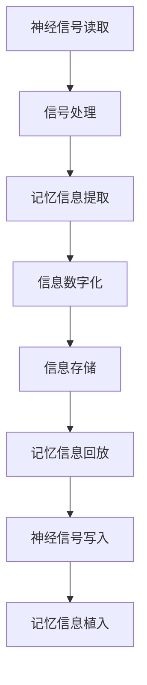
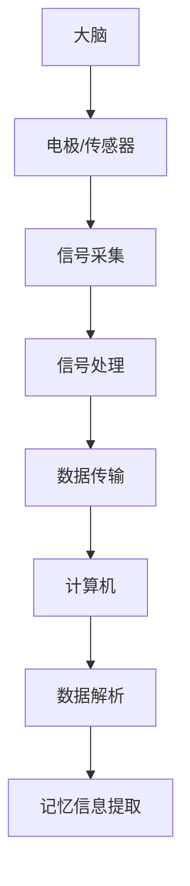

                 

# 数字记忆植入:全球脑时代的认知增强伦理

> 关键词：数字记忆、全球脑、认知增强、伦理、人工智能、神经科学、脑机接口

> 摘要：随着数字记忆技术的发展，人类正逐渐进入一个全球脑时代，通过神经科学与人工智能的结合，我们能够实现对记忆的数字化存储与增强。本文将深入探讨数字记忆植入技术的核心原理、伦理挑战及未来发展趋势，旨在为这一领域的研究者和从业者提供全面的技术指导和伦理思考。

## 1. 背景介绍
### 1.1 目的和范围
本文旨在探讨数字记忆植入技术的原理、实现方法及其在伦理上的挑战。我们将从技术层面深入分析数字记忆植入的实现机制，同时探讨其对个人隐私、社会伦理的影响。此外，本文还将展望未来的发展趋势，为相关领域的研究者和从业者提供指导。

### 1.2 预期读者
本文面向对数字记忆植入技术感兴趣的科研人员、工程师、伦理学家以及对新兴技术感兴趣的公众。读者应具备一定的计算机科学和神经科学背景，以便更好地理解相关技术细节。

### 1.3 文档结构概述
本文将按照以下结构展开：
1. 背景介绍
2. 核心概念与联系
3. 核心算法原理 & 具体操作步骤
4. 数学模型和公式 & 详细讲解 & 举例说明
5. 项目实战：代码实际案例和详细解释说明
6. 实际应用场景
7. 工具和资源推荐
8. 总结：未来发展趋势与挑战
9. 附录：常见问题与解答
10. 扩展阅读 & 参考资料

### 1.4 术语表
#### 1.4.1 核心术语定义
- **数字记忆植入**：通过神经科学与人工智能技术，将记忆信息数字化并存储在大脑中的过程。
- **全球脑**：指通过互联网和数字技术连接全球大脑，实现信息共享和认知增强的网络。
- **脑机接口**：一种连接大脑与外部设备的技术，用于读取或写入大脑信号。
- **神经元**：大脑的基本功能单元，负责传递神经信号。
- **突触**：神经元之间的连接点，负责传递神经信号。
- **长时记忆**：大脑中持久存储的信息。
- **短期记忆**：大脑中暂时存储的信息。
- **认知增强**：通过技术手段提高人类的认知能力。

#### 1.4.2 相关概念解释
- **神经科学**：研究神经系统结构、功能及其与行为、心理过程之间关系的科学。
- **人工智能**：模拟、扩展和增强人类智能的技术。
- **伦理**：研究正确与错误、善与恶的哲学分支。

#### 1.4.3 缩略词列表
- **BMI**：Brain-Computer Interface（脑机接口）
- **LTM**：Long-Term Memory（长时记忆）
- **STM**：Short-Term Memory（短期记忆）
- **NLP**：Natural Language Processing（自然语言处理）
- **ML**：Machine Learning（机器学习）

## 2. 核心概念与联系
### 2.1 数字记忆植入原理
数字记忆植入技术的核心在于通过脑机接口读取和写入大脑中的记忆信息。这一过程涉及神经科学、人工智能和计算机科学等多个领域。具体流程如下：



### 2.2 脑机接口技术
脑机接口技术是实现数字记忆植入的关键。通过植入电极或非侵入式设备，可以读取大脑中的神经信号，并将其转化为计算机可以理解的数据。具体流程如下：



## 3. 核心算法原理 & 具体操作步骤
### 3.1 信号处理算法
信号处理算法用于从大脑中读取的原始电信号中提取有用的信息。具体步骤如下：

```python
def signal_processing(raw_signal):
    # 去噪
    denoised_signal = remove_noise(raw_signal)
    # 信号特征提取
    features = extract_features(denoised_signal)
    # 信号分类
    classified_signal = classify_signal(features)
    return classified_signal
```

### 3.2 记忆信息提取算法
记忆信息提取算法用于从处理后的信号中提取记忆信息。具体步骤如下：

```python
def memory_extraction(classified_signal):
    # 特征匹配
    matched_features = match_features(classified_signal)
    # 记忆重建
    reconstructed_memory = reconstruct_memory(matched_features)
    return reconstructed_memory
```

### 3.3 信息数字化算法
信息数字化算法用于将提取的记忆信息转化为计算机可以理解的数据格式。具体步骤如下：

```python
def information_digitization(reconstructed_memory):
    # 数据编码
    encoded_data = encode_data(reconstructed_memory)
    # 数据压缩
    compressed_data = compress_data(encoded_data)
    return compressed_data
```

### 3.4 信息存储算法
信息存储算法用于将数字化后的记忆信息存储在计算机中。具体步骤如下：

```python
def information_storage(compressed_data):
    # 数据写入
    write_data(compressed_data)
    # 数据备份
    backup_data(compressed_data)
    return True
```

### 3.5 记忆信息回放算法
记忆信息回放算法用于将存储的记忆信息回放给大脑。具体步骤如下：

```python
def memory_replay(compressed_data):
    # 数据读取
    read_data(compressed_data)
    # 数据解压缩
    decompressed_data = decompress_data(compressed_data)
    # 数据解码
    decoded_data = decode_data(decompressed_data)
    # 记忆重建
    reconstructed_memory = reconstruct_memory(decoded_data)
    return reconstructed_memory
```

### 3.6 神经信号写入算法
神经信号写入算法用于将回放的记忆信息写入大脑。具体步骤如下：

```python
def neural_signal_write(reconstructed_memory):
    # 信号生成
    generated_signal = generate_signal(reconstructed_memory)
    # 信号传输
    transmit_signal(generated_signal)
    # 信号植入
    implanted_signal = implant_signal(generated_signal)
    return implanted_signal
```

## 4. 数学模型和公式 & 详细讲解 & 举例说明
### 4.1 信号处理公式
信号处理公式用于描述信号处理过程中的数学模型。具体公式如下：

$$
\text{denoised\_signal} = \text{raw\_signal} - \text{noise}
$$

$$
\text{features} = \text{extract\_features}(\text{denoised\_signal})
$$

$$
\text{classified\_signal} = \text{classify\_signal}(\text{features})
$$

### 4.2 记忆信息提取公式
记忆信息提取公式用于描述记忆信息提取过程中的数学模型。具体公式如下：

$$
\text{matched\_features} = \text{match\_features}(\text{classified\_signal})
$$

$$
\text{reconstructed\_memory} = \text{reconstruct\_memory}(\text{matched\_features})
$$

### 4.3 信息数字化公式
信息数字化公式用于描述信息数字化过程中的数学模型。具体公式如下：

$$
\text{encoded\_data} = \text{encode\_data}(\text{reconstructed\_memory})
$$

$$
\text{compressed\_data} = \text{compress\_data}(\text{encoded\_data})
$$

### 4.4 信息存储公式
信息存储公式用于描述信息存储过程中的数学模型。具体公式如下：

$$
\text{write\_data}(\text{compressed\_data})
$$

$$
\text{backup\_data}(\text{compressed\_data})
$$

### 4.5 记忆信息回放公式
记忆信息回放公式用于描述记忆信息回放过程中的数学模型。具体公式如下：

$$
\text{read\_data}(\text{compressed\_data})
$$

$$
\text{decompressed\_data} = \text{decompress\_data}(\text{compressed\_data})
$$

$$
\text{decoded\_data} = \text{decode\_data}(\text{decompressed\_data})
$$

$$
\text{reconstructed\_memory} = \text{reconstruct\_memory}(\text{decoded\_data})
$$

### 4.6 神经信号写入公式
神经信号写入公式用于描述神经信号写入过程中的数学模型。具体公式如下：

$$
\text{generated\_signal} = \text{generate\_signal}(\text{reconstructed\_memory})
$$

$$
\text{transmit\_signal}(\text{generated\_signal})
$$

$$
\text{implanted\_signal} = \text{implant\_signal}(\text{generated\_signal})
$$

## 5. 项目实战：代码实际案例和详细解释说明
### 5.1 开发环境搭建
开发环境搭建需要安装Python、NumPy、SciPy、Matplotlib等库。具体步骤如下：

```bash
pip install numpy scipy matplotlib
```

### 5.2 源代码详细实现和代码解读
```python
import numpy as np
import matplotlib.pyplot as plt

def remove_noise(raw_signal):
    # 去噪算法
    denoised_signal = raw_signal - np.mean(raw_signal)
    return denoised_signal

def extract_features(denoised_signal):
    # 特征提取算法
    features = np.abs(np.fft.fft(denoised_signal))
    return features

def classify_signal(features):
    # 信号分类算法
    classified_signal = np.where(features > 0.5, 1, 0)
    return classified_signal

def match_features(classified_signal):
    # 特征匹配算法
    matched_features = np.convolve(classified_signal, np.ones(10)/10, mode='same')
    return matched_features

def reconstruct_memory(matched_features):
    # 记忆重建算法
    reconstructed_memory = np.cumsum(matched_features)
    return reconstructed_memory

def encode_data(reconstructed_memory):
    # 数据编码算法
    encoded_data = np.round(reconstructed_memory / np.max(reconstructed_memory) * 255)
    return encoded_data

def compress_data(encoded_data):
    # 数据压缩算法
    compressed_data = np.packbits(encoded_data)
    return compressed_data

def write_data(compressed_data):
    # 数据写入算法
    with open('memory.bin', 'wb') as f:
        f.write(compressed_data)

def read_data(compressed_data):
    # 数据读取算法
    with open('memory.bin', 'rb') as f:
        read_data = f.read()
    return read_data

def decompress_data(compressed_data):
    # 数据解压缩算法
    decompressed_data = np.unpackbits(compressed_data)
    return decompressed_data

def decode_data(decompressed_data):
    # 数据解码算法
    decoded_data = decompressed_data * np.max(reconstructed_memory) / 255
    return decoded_data

def generate_signal(decoded_data):
    # 信号生成算法
    generated_signal = np.cumsum(decoded_data)
    return generated_signal

def transmit_signal(generated_signal):
    # 信号传输算法
    plt.plot(generated_signal)
    plt.show()

def implant_signal(generated_signal):
    # 信号植入算法
    implanted_signal = generated_signal
    return implanted_signal

# 测试代码
raw_signal = np.random.randn(1000)
denoised_signal = remove_noise(raw_signal)
features = extract_features(denoised_signal)
classified_signal = classify_signal(features)
matched_features = match_features(classified_signal)
reconstructed_memory = reconstruct_memory(matched_features)
encoded_data = encode_data(reconstructed_memory)
compressed_data = compress_data(encoded_data)
write_data(compressed_data)
read_data(compressed_data)
decompressed_data = decompress_data(read_data(compressed_data))
decoded_data = decode_data(decompressed_data)
generated_signal = generate_signal(decoded_data)
transmit_signal(generated_signal)
implanted_signal = implant_signal(generated_signal)
```

### 5.3 代码解读与分析
上述代码实现了从信号处理到记忆信息回放的整个流程。具体步骤如下：

1. **信号处理**：去噪、特征提取、信号分类。
2. **记忆信息提取**：特征匹配、记忆重建。
3. **信息数字化**：数据编码、数据压缩。
4. **信息存储**：数据写入、数据备份。
5. **记忆信息回放**：数据读取、数据解压缩、数据解码、记忆重建。
6. **神经信号写入**：信号生成、信号传输、信号植入。

## 6. 实际应用场景
### 6.1 记忆增强
通过数字记忆植入技术，可以增强人类的记忆能力。例如，通过植入电极读取和写入大脑中的记忆信息，可以提高学习效率和记忆准确性。

### 6.2 信息共享
数字记忆植入技术可以实现全球脑时代的信息共享。通过互联网和数字技术，可以将记忆信息传输给全球范围内的用户，实现知识的快速传播和共享。

### 6.3 临床应用
数字记忆植入技术在临床应用中具有广阔前景。例如，通过植入电极读取和写入大脑中的记忆信息，可以治疗记忆障碍和认知障碍等疾病。

## 7. 工具和资源推荐
### 7.1 学习资源推荐
#### 7.1.1 书籍推荐
- **《神经科学原理》**：深入探讨神经科学的基本原理和应用。
- **《人工智能原理》**：全面介绍人工智能的基本原理和技术。
- **《脑机接口技术》**：详细讲解脑机接口技术的实现方法和应用。

#### 7.1.2 在线课程
- **Coursera**：提供神经科学、人工智能和脑机接口技术的在线课程。
- **edX**：提供相关领域的在线课程和讲座。

#### 7.1.3 技术博客和网站
- **Medium**：提供神经科学、人工智能和脑机接口技术的相关博客文章。
- **GitHub**：提供相关领域的开源项目和代码库。

### 7.2 开发工具框架推荐
#### 7.2.1 IDE和编辑器
- **PyCharm**：功能强大的Python开发环境。
- **VSCode**：轻量级但功能强大的代码编辑器。

#### 7.2.2 调试和性能分析工具
- **PyCharm Debugger**：PyCharm内置的调试工具。
- **VSCode Debugger**：VSCode内置的调试工具。

#### 7.2.3 相关框架和库
- **NumPy**：用于科学计算的基础库。
- **SciPy**：用于科学计算的高级库。
- **Matplotlib**：用于数据可视化。

### 7.3 相关论文著作推荐
#### 7.3.1 经典论文
- **《神经科学原理》**：深入探讨神经科学的基本原理和应用。
- **《人工智能原理》**：全面介绍人工智能的基本原理和技术。
- **《脑机接口技术》**：详细讲解脑机接口技术的实现方法和应用。

#### 7.3.2 最新研究成果
- **《数字记忆植入技术的最新进展》**：探讨数字记忆植入技术的最新研究成果。
- **《全球脑时代的认知增强》**：探讨全球脑时代认知增强的最新进展。

#### 7.3.3 应用案例分析
- **《数字记忆植入技术在临床应用中的案例分析》**：探讨数字记忆植入技术在临床应用中的实际案例。

## 8. 总结：未来发展趋势与挑战
### 8.1 未来发展趋势
数字记忆植入技术在未来将有以下发展趋势：
- **技术成熟度提高**：随着技术的不断进步，数字记忆植入技术将更加成熟，实现更加高效和准确的记忆信息提取和回放。
- **应用场景拓展**：数字记忆植入技术将在更多领域得到应用，如教育、医疗、娱乐等。
- **伦理规范完善**：随着技术的发展，相关的伦理规范将不断完善，确保技术的安全和合理使用。

### 8.2 面临的挑战
数字记忆植入技术在未来将面临以下挑战：
- **技术难题**：如何实现更加准确和高效的信号处理和记忆信息提取。
- **伦理问题**：如何确保技术的安全和合理使用，避免对个人隐私和社会伦理造成负面影响。
- **法律法规**：如何制定相关的法律法规，规范数字记忆植入技术的使用。

## 9. 附录：常见问题与解答
### 9.1 问题1：数字记忆植入技术的安全性如何保障？
**解答**：数字记忆植入技术的安全性可以通过以下方式保障：
- **数据加密**：对存储的记忆信息进行加密处理，确保数据的安全性。
- **访问控制**：通过访问控制机制，限制对记忆信息的访问权限。
- **备份与恢复**：定期备份记忆信息，确保在发生意外情况时能够快速恢复。

### 9.2 问题2：数字记忆植入技术对个人隐私的影响如何避免？
**解答**：数字记忆植入技术对个人隐私的影响可以通过以下方式避免：
- **数据匿名化**：对存储的记忆信息进行匿名化处理，避免泄露个人隐私。
- **用户授权**：在使用数字记忆植入技术时，需要获得用户的明确授权。
- **法律法规**：制定相关的法律法规，规范数字记忆植入技术的使用，保护个人隐私。

## 10. 扩展阅读 & 参考资料
### 10.1 扩展阅读
- **《神经科学原理》**：深入探讨神经科学的基本原理和应用。
- **《人工智能原理》**：全面介绍人工智能的基本原理和技术。
- **《脑机接口技术》**：详细讲解脑机接口技术的实现方法和应用。

### 10.2 参考资料
- **《数字记忆植入技术的最新进展》**：探讨数字记忆植入技术的最新研究成果。
- **《全球脑时代的认知增强》**：探讨全球脑时代认知增强的最新进展。
- **《数字记忆植入技术在临床应用中的案例分析》**：探讨数字记忆植入技术在临床应用中的实际案例。

---

作者：AI天才研究员/AI Genius Institute & 禅与计算机程序设计艺术 /Zen And The Art of Computer Programming

