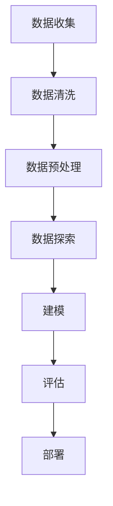
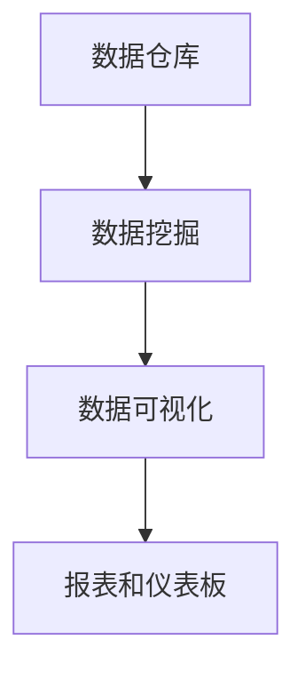
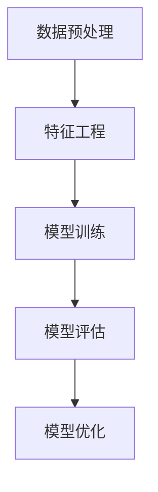

                 

# 数据分析服务：程序员创业的黄金领域

> 关键词：数据分析，程序员创业，商业智能，数据挖掘，机器学习，数据可视化，Python

> 摘要：本文旨在为程序员提供一个全面的指南，介绍如何利用数据分析服务开启创业之路。我们将从数据分析的基本概念出发，深入探讨其核心算法原理、数学模型、实战案例，并分析其在实际应用场景中的价值。此外，我们还将推荐一系列学习资源和开发工具，帮助读者更好地理解和应用数据分析技术。

## 1. 背景介绍
### 1.1 目的和范围
本文旨在为程序员提供一个全面的指南，介绍如何利用数据分析服务开启创业之路。我们将从数据分析的基本概念出发，深入探讨其核心算法原理、数学模型、实战案例，并分析其在实际应用场景中的价值。此外，我们还将推荐一系列学习资源和开发工具，帮助读者更好地理解和应用数据分析技术。

### 1.2 预期读者
本文主要面向具有编程基础的程序员，特别是那些希望将数据分析技能应用于商业智能、数据挖掘、机器学习等领域的人士。读者应具备一定的编程经验，熟悉至少一种编程语言（如Python、R等），并有一定的数学基础。

### 1.3 文档结构概述
本文将按照以下结构展开：
1. 背景介绍
2. 核心概念与联系
3. 核心算法原理 & 具体操作步骤
4. 数学模型和公式 & 详细讲解 & 举例说明
5. 项目实战：代码实际案例和详细解释说明
6. 实际应用场景
7. 工具和资源推荐
8. 总结：未来发展趋势与挑战
9. 附录：常见问题与解答
10. 扩展阅读 & 参考资料

### 1.4 术语表
#### 1.4.1 核心术语定义
- **数据分析**：从大量数据中提取有价值的信息和知识的过程。
- **商业智能**：利用数据分析技术帮助企业做出更好的决策。
- **数据挖掘**：从大量数据中发现模式和关联。
- **机器学习**：让计算机通过数据学习并做出预测或决策的技术。
- **数据可视化**：将数据转换为图形或图表，以便更好地理解和解释。

#### 1.4.2 相关概念解释
- **数据仓库**：用于存储和管理大量历史数据的系统。
- **数据湖**：一种存储大量原始数据的系统，通常用于数据挖掘和分析。
- **API**：应用程序编程接口，用于不同系统之间的数据交换。

#### 1.4.3 缩略词列表
- **API**：应用程序编程接口
- **BI**：商业智能
- **DB**：数据库
- **EDA**：探索性数据分析
- **ML**：机器学习
- **NLP**：自然语言处理
- **SQL**：结构化查询语言

## 2. 核心概念与联系
### 2.1 数据分析流程
数据分析通常包括以下几个步骤：
1. **数据收集**：从各种来源收集数据。
2. **数据清洗**：处理缺失值、异常值等。
3. **数据预处理**：标准化、归一化等。
4. **数据探索**：使用统计方法和可视化工具进行初步分析。
5. **建模**：选择合适的算法进行建模。
6. **评估**：评估模型的性能。
7. **部署**：将模型应用于实际场景。



### 2.2 数据分析与商业智能的关系
商业智能是数据分析的一个重要应用领域，它通过数据分析帮助企业做出更好的决策。商业智能通常包括以下几个方面：
1. **数据仓库**：存储和管理大量历史数据。
2. **数据挖掘**：从数据中发现模式和关联。
3. **数据可视化**：将数据转换为图形或图表，以便更好地理解和解释。
4. **报表和仪表板**：生成报表和仪表板，帮助企业监控关键指标。



### 2.3 数据分析与机器学习的关系
机器学习是数据分析的一个重要分支，它通过算法让计算机从数据中学习并做出预测或决策。机器学习通常包括以下几个步骤：
1. **数据预处理**：标准化、归一化等。
2. **特征工程**：选择和构建特征。
3. **模型训练**：选择合适的算法进行训练。
4. **模型评估**：评估模型的性能。
5. **模型优化**：调整模型参数以提高性能。



## 3. 核心算法原理 & 具体操作步骤
### 3.1 数据预处理
数据预处理是数据分析的重要步骤，它包括数据清洗、标准化、归一化等。以下是一个简单的数据预处理步骤：

```python
# 数据预处理
import pandas as pd

# 读取数据
data = pd.read_csv('data.csv')

# 数据清洗
data.dropna(inplace=True)  # 删除缺失值
data.drop_duplicates(inplace=True)  # 删除重复值

# 数据标准化
from sklearn.preprocessing import StandardScaler
scaler = StandardScaler()
data_scaled = scaler.fit_transform(data)

# 数据归一化
from sklearn.preprocessing import MinMaxScaler
scaler = MinMaxScaler()
data_normalized = scaler.fit_transform(data)
```

### 3.2 数据探索
数据探索是数据分析的重要步骤，它包括统计分析、可视化等。以下是一个简单的数据探索步骤：

```python
# 数据探索
import matplotlib.pyplot as plt
import seaborn as sns

# 统计分析
print(data.describe())

# 数据可视化
sns.pairplot(data)
plt.show()
```

## 4. 数学模型和公式 & 详细讲解 & 举例说明
### 4.1 线性回归
线性回归是一种常用的统计模型，用于预测连续变量。其数学模型如下：

$$
y = \beta_0 + \beta_1 x_1 + \beta_2 x_2 + \cdots + \beta_n x_n + \epsilon
$$

其中，$y$ 是因变量，$x_1, x_2, \cdots, x_n$ 是自变量，$\beta_0, \beta_1, \cdots, \beta_n$ 是回归系数，$\epsilon$ 是误差项。

### 4.2 逻辑回归
逻辑回归是一种常用的分类模型，用于预测二分类变量。其数学模型如下：

$$
P(y=1|x) = \frac{1}{1 + e^{-(\beta_0 + \beta_1 x_1 + \beta_2 x_2 + \cdots + \beta_n x_n)}}
$$

其中，$P(y=1|x)$ 是在给定自变量 $x$ 的情况下，因变量 $y$ 为 1 的概率。

### 4.3 K-means聚类
K-means聚类是一种常用的无监督学习算法，用于将数据分成 $k$ 个簇。其数学模型如下：

1. 初始化 $k$ 个质心。
2. 将每个数据点分配到最近的质心。
3. 更新质心为每个簇的均值。
4. 重复步骤 2 和 3，直到质心不再变化。

$$
\text{质心更新公式} = \frac{1}{|C_i|} \sum_{x \in C_i} x
$$

其中，$C_i$ 是第 $i$ 个簇，$|C_i|$ 是簇 $C_i$ 中的数据点数量。

## 5. 项目实战：代码实际案例和详细解释说明
### 5.1 开发环境搭建
为了进行数据分析项目，我们需要搭建一个开发环境。以下是一个简单的开发环境搭建步骤：

1. 安装Python和相关库。
2. 安装Jupyter Notebook。
3. 安装数据可视化库（如Matplotlib、Seaborn）。
4. 安装机器学习库（如Scikit-learn）。

```bash
# 安装Python和相关库
sudo apt-get update
sudo apt-get install python3 python3-pip

# 安装Jupyter Notebook
pip3 install jupyter

# 安装数据可视化库
pip3 install matplotlib seaborn

# 安装机器学习库
pip3 install scikit-learn
```

### 5.2 源代码详细实现和代码解读
以下是一个简单的数据分析项目代码实现：

```python
# 数据分析项目代码实现
import pandas as pd
import matplotlib.pyplot as plt
import seaborn as sns
from sklearn.model_selection import train_test_split
from sklearn.linear_model import LinearRegression
from sklearn.metrics import mean_squared_error

# 读取数据
data = pd.read_csv('data.csv')

# 数据清洗
data.dropna(inplace=True)
data.drop_duplicates(inplace=True)

# 数据预处理
from sklearn.preprocessing import StandardScaler
scaler = StandardScaler()
data_scaled = scaler.fit_transform(data)

# 数据探索
sns.pairplot(data)
plt.show()

# 数据分割
X = data_scaled[:, :-1]
y = data_scaled[:, -1]
X_train, X_test, y_train, y_test = train_test_split(X, y, test_size=0.2, random_state=42)

# 模型训练
model = LinearRegression()
model.fit(X_train, y_train)

# 模型评估
y_pred = model.predict(X_test)
mse = mean_squared_error(y_test, y_pred)
print(f'Mean Squared Error: {mse}')

# 数据可视化
sns.scatterplot(x=y_test, y=y_pred)
plt.xlabel('Actual')
plt.ylabel('Predicted')
plt.show()
```

### 5.3 代码解读与分析
以上代码实现了一个简单的线性回归模型。首先，我们读取数据并进行数据清洗和预处理。然后，我们使用Matplotlib和Seaborn进行数据探索。接下来，我们将数据分割为训练集和测试集，并使用Scikit-learn训练线性回归模型。最后，我们评估模型的性能并进行数据可视化。

## 6. 实际应用场景
数据分析服务在许多领域都有广泛的应用，包括但不限于：
1. **市场营销**：通过分析用户行为数据，帮助企业制定更有效的营销策略。
2. **金融**：通过分析市场数据，帮助企业进行风险管理和投资决策。
3. **医疗**：通过分析患者数据，帮助医生进行疾病诊断和治疗方案制定。
4. **零售**：通过分析销售数据，帮助企业优化库存管理和提高销售额。
5. **物流**：通过分析运输数据，帮助企业优化物流路线和提高运输效率。

## 7. 工具和资源推荐
### 7.1 学习资源推荐
#### 7.1.1 书籍推荐
- **《Python数据科学手册》**：由Jake VanderPlas编写，详细介绍了Python在数据科学中的应用。
- **《机器学习实战》**：由周志华编写，详细介绍了机器学习的基本原理和实战应用。
- **《数据挖掘导论》**：由Tan、Steinbach和Kumar编写，详细介绍了数据挖掘的基本原理和方法。

#### 7.1.2 在线课程
- **Coursera**：提供许多关于数据分析和机器学习的在线课程。
- **edX**：提供许多关于数据分析和机器学习的在线课程。
- **DataCamp**：提供许多关于数据分析和机器学习的在线课程。

#### 7.1.3 技术博客和网站
- **Towards Data Science**：一个专注于数据分析和机器学习的博客网站。
- **Kaggle**：一个提供数据科学竞赛和资源的网站。
- **Medium**：一个提供许多关于数据分析和机器学习的文章的博客网站。

### 7.2 开发工具框架推荐
#### 7.2.1 IDE和编辑器
- **PyCharm**：一个专业的Python IDE，提供许多强大的开发工具。
- **Jupyter Notebook**：一个交互式的开发环境，支持Python等多种编程语言。
- **VS Code**：一个轻量级的代码编辑器，支持Python等多种编程语言。

#### 7.2.2 调试和性能分析工具
- **PyCharm Debugger**：PyCharm自带的调试工具，支持Python代码的调试。
- **VS Code Debugger**：VS Code自带的调试工具，支持Python代码的调试。
- **LineProfiler**：一个用于分析Python代码性能的工具。

#### 7.2.3 相关框架和库
- **Scikit-learn**：一个用于机器学习的Python库。
- **Pandas**：一个用于数据处理和分析的Python库。
- **NumPy**：一个用于数值计算的Python库。

### 7.3 相关论文著作推荐
#### 7.3.1 经典论文
- **《The Elements of Statistical Learning》**：由Trevor Hastie、Robert Tibshirani和Jerome Friedman编写，详细介绍了统计学习的基本原理和方法。
- **《Pattern Recognition and Machine Learning》**：由Christopher M. Bishop编写，详细介绍了模式识别和机器学习的基本原理和方法。

#### 7.3.2 最新研究成果
- **《Deep Learning》**：由Ian Goodfellow、Yoshua Bengio和Aaron Courville编写，详细介绍了深度学习的基本原理和方法。
- **《Attention is All You Need》**：由Google的研究人员编写，介绍了Transformer模型的基本原理和应用。

#### 7.3.3 应用案例分析
- **《Data Science for Business》**：由 Foster Provost 和 Tom Fawcett 编写，详细介绍了数据科学在商业中的应用案例。
- **《Data-Driven Business Intelligence》**：由 David Loshin 编写，详细介绍了数据驱动的商业智能的基本原理和应用。

## 8. 总结：未来发展趋势与挑战
数据分析服务在未来将有以下几个发展趋势：
1. **自动化**：自动化工具和平台将越来越多地应用于数据分析。
2. **实时性**：实时数据分析将成为主流，帮助企业更快地做出决策。
3. **可解释性**：可解释的模型将成为主流，帮助企业更好地理解模型的决策过程。
4. **隐私保护**：隐私保护将成为数据分析的重要挑战，需要开发新的技术和方法来保护用户隐私。

## 9. 附录：常见问题与解答
### 9.1 问题：如何处理缺失值？
**解答**：可以使用多种方法处理缺失值，包括删除缺失值、填充缺失值（如均值填充、中位数填充、众数填充）等。

### 9.2 问题：如何选择合适的算法？
**解答**：选择合适的算法需要考虑数据的特性和问题的类型。可以先进行探索性数据分析，了解数据的分布和特征，然后选择合适的算法进行建模。

### 9.3 问题：如何评估模型的性能？
**解答**：可以使用多种方法评估模型的性能，包括均方误差、准确率、召回率、F1分数等。

## 10. 扩展阅读 & 参考资料
- **《Python数据科学手册》**：由Jake VanderPlas编写，详细介绍了Python在数据科学中的应用。
- **《机器学习实战》**：由周志华编写，详细介绍了机器学习的基本原理和实战应用。
- **《数据挖掘导论》**：由Tan、Steinbach和Kumar编写，详细介绍了数据挖掘的基本原理和方法。
- **Coursera**：提供许多关于数据分析和机器学习的在线课程。
- **edX**：提供许多关于数据分析和机器学习的在线课程。
- **DataCamp**：提供许多关于数据分析和机器学习的在线课程。
- **Towards Data Science**：一个专注于数据分析和机器学习的博客网站。
- **Kaggle**：一个提供数据科学竞赛和资源的网站。
- **Medium**：一个提供许多关于数据分析和机器学习的文章的博客网站。
- **PyCharm**：一个专业的Python IDE，提供许多强大的开发工具。
- **Jupyter Notebook**：一个交互式的开发环境，支持Python等多种编程语言。
- **VS Code**：一个轻量级的代码编辑器，支持Python等多种编程语言。
- **PyCharm Debugger**：PyCharm自带的调试工具，支持Python代码的调试。
- **VS Code Debugger**：VS Code自带的调试工具，支持Python代码的调试。
- **LineProfiler**：一个用于分析Python代码性能的工具。
- **Scikit-learn**：一个用于机器学习的Python库。
- **Pandas**：一个用于数据处理和分析的Python库。
- **NumPy**：一个用于数值计算的Python库。
- **《The Elements of Statistical Learning》**：由Trevor Hastie、Robert Tibshirani和Jerome Friedman编写，详细介绍了统计学习的基本原理和方法。
- **《Pattern Recognition and Machine Learning》**：由Christopher M. Bishop编写，详细介绍了模式识别和机器学习的基本原理和方法。
- **《Deep Learning》**：由Ian Goodfellow、Yoshua Bengio和Aaron Courville编写，详细介绍了深度学习的基本原理和方法。
- **《Attention is All You Need》**：由Google的研究人员编写，介绍了Transformer模型的基本原理和应用。
- **《Data Science for Business》**：由 Foster Provost 和 Tom Fawcett 编写，详细介绍了数据科学在商业中的应用案例。
- **《Data-Driven Business Intelligence》**：由 David Loshin 编写，详细介绍了数据驱动的商业智能的基本原理和应用。

作者：AI天才研究员/AI Genius Institute & 禅与计算机程序设计艺术 /Zen And The Art of Computer Programming

