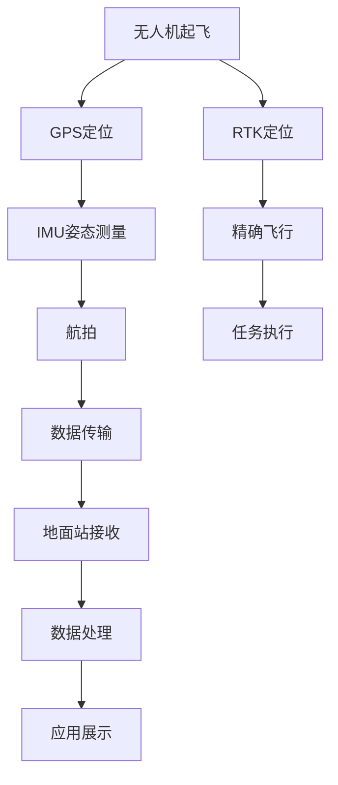
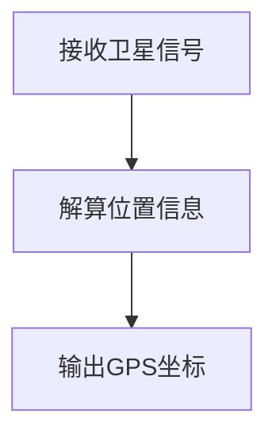
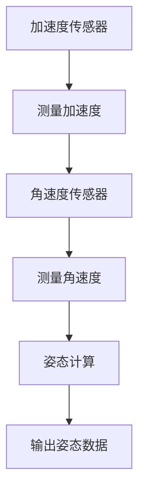
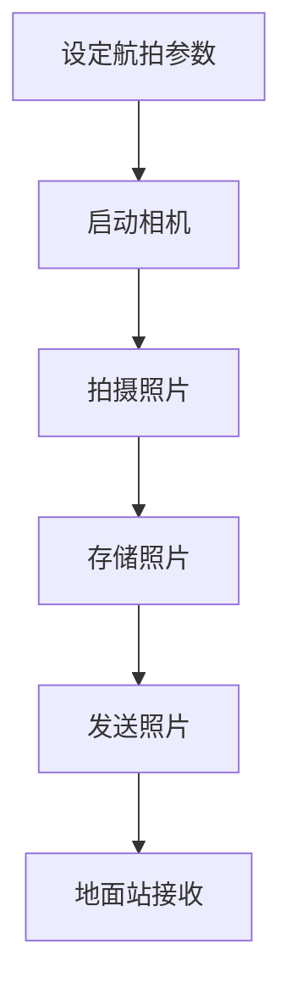
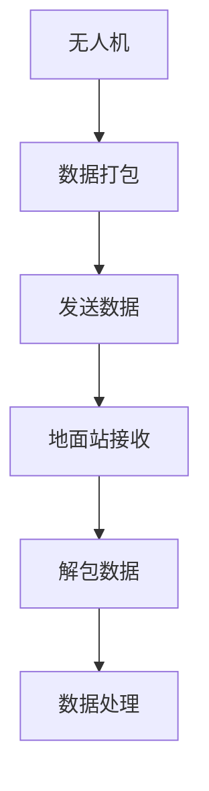
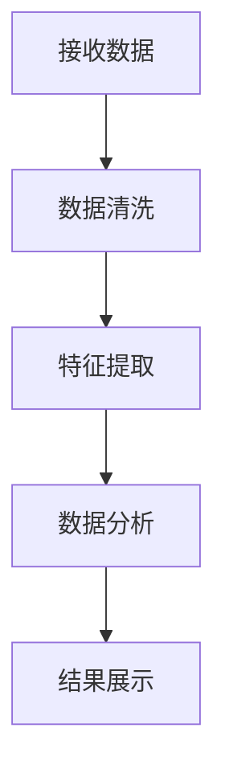

                 

# 无人机创业：空中视角的商业应用

> 关键词：无人机技术, 商业应用, 人工智能, 航空摄影, 物流配送, 农业监测, 环境监测

> 摘要：本文旨在探讨无人机技术在商业领域的应用潜力，通过深入分析无人机技术的核心概念、算法原理、数学模型及实际案例，为创业者提供全面的技术指导。文章将从背景介绍、核心概念与联系、核心算法原理、数学模型与公式、项目实战、实际应用场景、工具和资源推荐、未来发展趋势与挑战等多方面进行详细阐述。

## 1. 背景介绍
### 1.1 目的和范围
本文旨在探讨无人机技术在商业领域的应用潜力，通过深入分析无人机技术的核心概念、算法原理、数学模型及实际案例，为创业者提供全面的技术指导。本文将涵盖无人机技术的基本原理、应用场景、开发流程及未来发展趋势。

### 1.2 预期读者
本文预期读者包括但不限于：
- 创业者：希望利用无人机技术开发新业务的创业者。
- 技术人员：希望深入了解无人机技术的工程师和程序员。
- 研究人员：希望在无人机技术领域进行深入研究的学者。
- 投资者：希望了解无人机技术商业潜力的投资人。

### 1.3 文档结构概述
本文结构如下：
1. 背景介绍
2. 核心概念与联系
3. 核心算法原理 & 具体操作步骤
4. 数学模型和公式 & 详细讲解 & 举例说明
5. 项目实战：代码实际案例和详细解释说明
6. 实际应用场景
7. 工具和资源推荐
8. 总结：未来发展趋势与挑战
9. 附录：常见问题与解答
10. 扩展阅读 & 参考资料

### 1.4 术语表
#### 1.4.1 核心术语定义
- **无人机（UAV）**：无人驾驶航空器，能够自主或远程控制飞行。
- **航拍（Aerial Photography）**：使用无人机进行空中摄影。
- **物流配送（Logistics Delivery）**：利用无人机进行货物配送。
- **农业监测（Agricultural Monitoring）**：利用无人机进行农田监测。
- **环境监测（Environmental Monitoring）**：利用无人机进行环境数据采集。

#### 1.4.2 相关概念解释
- **GPS**：全球定位系统，用于确定无人机的位置。
- **IMU**：惯性测量单元，用于测量无人机的姿态和加速度。
- **RTK**：实时动态差分GPS，提高定位精度。

#### 1.4.3 缩略词列表
- **UAV**：Unmanned Aerial Vehicle
- **GPS**：Global Positioning System
- **IMU**：Inertial Measurement Unit
- **RTK**：Real-Time Kinematic
- **PID**：Proportional-Integral-Derivative
- **SLAM**：Simultaneous Localization and Mapping

## 2. 核心概念与联系
### 无人机技术流程图


## 3. 核心算法原理 & 具体操作步骤
### 3.1 GPS定位算法


### 3.2 IMU姿态测量算法


### 3.3 航拍算法


### 3.4 数据传输算法


### 3.5 数据处理算法


## 4. 数学模型和公式 & 详细讲解 & 举例说明
### 4.1 GPS定位公式
$$
\text{位置} = \text{卫星信号} \times \text{解算算法}
$$

### 4.2 IMU姿态计算公式
$$
\text{姿态} = \text{加速度} \times \text{角速度} \times \text{姿态计算算法}
$$

### 4.3 航拍参数设定
$$
\text{航拍参数} = \text{飞行高度} \times \text{飞行速度} \times \text{拍摄角度}
$$

### 4.4 数据传输速率
$$
\text{传输速率} = \text{数据量} \times \text{传输时间}
$$

## 5. 项目实战：代码实际案例和详细解释说明
### 5.1 开发环境搭建
#### 5.1.1 硬件环境
- **无人机**：选择一款支持RTK定位的无人机。
- **地面站**：搭建一个地面站接收无人机数据。

#### 5.1.2 软件环境
- **操作系统**：Linux或Windows。
- **开发工具**：Python或C++。

### 5.2 源代码详细实现和代码解读
#### 5.2.1 GPS定位代码
```python
import gps_module

def get_gps_location():
    location = gps_module.get_location()
    return location
```

#### 5.2.2 IMU姿态测量代码
```python
import imu_module

def get_imu_attitude():
    attitude = imu_module.get_attitude()
    return attitude
```

#### 5.2.3 航拍代码
```python
import camera_module

def take_photo():
    photo = camera_module.take_photo()
    return photo
```

#### 5.2.4 数据传输代码
```python
import data_transmission_module

def send_data(data):
    data_transmission_module.send_data(data)
```

#### 5.2.5 数据处理代码
```python
import data_processing_module

def process_data(data):
    processed_data = data_processing_module.process_data(data)
    return processed_data
```

### 5.3 代码解读与分析
- **GPS定位代码**：通过调用`gps_module`模块获取无人机的GPS位置。
- **IMU姿态测量代码**：通过调用`imu_module`模块获取无人机的姿态数据。
- **航拍代码**：通过调用`camera_module`模块获取无人机拍摄的照片。
- **数据传输代码**：通过调用`data_transmission_module`模块将数据发送到地面站。
- **数据处理代码**：通过调用`data_processing_module`模块对数据进行处理和分析。

## 6. 实际应用场景
### 6.1 航空摄影
无人机可以用于航拍，为建筑、城市规划、灾害救援等提供空中视角。

### 6.2 物流配送
无人机可以用于快速配送，减少物流成本，提高配送效率。

### 6.3 农业监测
无人机可以用于农田监测，提供作物生长情况、病虫害检测等信息。

### 6.4 环境监测
无人机可以用于环境监测，提供空气质量、水质等数据。

## 7. 工具和资源推荐
### 7.1 学习资源推荐
#### 7.1.1 书籍推荐
- 《无人机技术与应用》
- 《无人机编程与控制》

#### 7.1.2 在线课程
- Coursera：无人机技术与应用
- Udemy：无人机编程与控制

#### 7.1.3 技术博客和网站
- Drone DJI
- Drone World

### 7.2 开发工具框架推荐
#### 7.2.1 IDE和编辑器
- Visual Studio Code
- PyCharm

#### 7.2.2 调试和性能分析工具
- GDB
- Valgrind

#### 7.2.3 相关框架和库
- MAVLink
- OpenCV

### 7.3 相关论文著作推荐
#### 7.3.1 经典论文
- "A Survey of Unmanned Aerial Vehicle Control Systems"
- "Drone Delivery: A Review of the Literature"

#### 7.3.2 最新研究成果
- "Recent Advances in Unmanned Aerial Vehicle Navigation and Control"
- "Drone-Based Environmental Monitoring: A Review"

#### 7.3.3 应用案例分析
- "Case Studies in Drone-Based Logistics and Delivery"
- "Drone-Based Agricultural Monitoring: A Case Study"

## 8. 总结：未来发展趋势与挑战
### 8.1 未来发展趋势
- **技术进步**：无人机技术将更加成熟，性能更加强大。
- **应用场景扩展**：无人机将在更多领域得到应用，如医疗、教育等。
- **法规完善**：无人机法规将更加完善，保障飞行安全。

### 8.2 挑战
- **技术挑战**：无人机技术仍面临许多挑战，如续航能力、安全性等。
- **法规挑战**：无人机法规的制定和执行面临挑战。
- **隐私挑战**：无人机的使用可能引发隐私问题。

## 9. 附录：常见问题与解答
### 9.1 问题：无人机的续航能力如何提高？
- **解答**：可以通过优化电池技术、减小无人机重量、提高飞行效率等方式提高续航能力。

### 9.2 问题：无人机的安全性如何保障？
- **解答**：可以通过加强飞行控制算法、提高传感器精度、完善法规等方式保障无人机的安全性。

### 9.3 问题：无人机的隐私问题如何解决？
- **解答**：可以通过加强数据加密、限制飞行区域、提高用户意识等方式解决无人机的隐私问题。

## 10. 扩展阅读 & 参考资料
- [DJI官网](https://www.dji.com/)
- [Drone World](https://www.drone-world.com/)
- [Coursera无人机技术课程](https://www.coursera.org/courses?query=drone)
- [Udemy无人机编程课程](https://www.udemy.com/topic/drone-programming/)

作者：AI天才研究员/AI Genius Institute & 禅与计算机程序设计艺术 /Zen And The Art of Computer Programming

