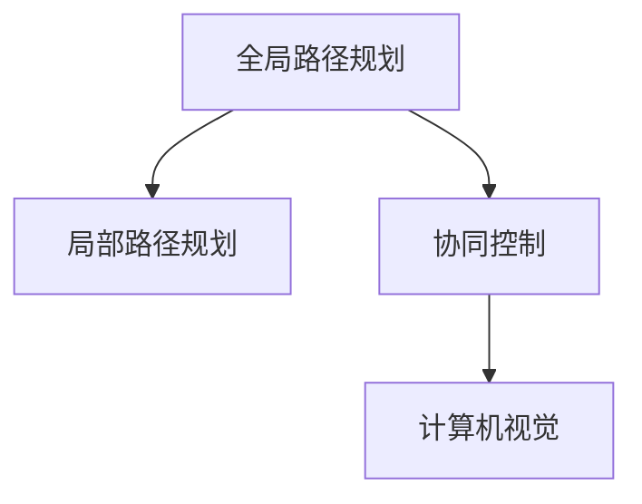

                 

# 无人机群智能巡检系统：工业安全的创新应用

> 关键词：无人机群、智能巡检、工业安全、计算机视觉、路径规划、协同控制、机器学习

> 摘要：本文旨在探讨无人机群智能巡检系统在工业安全领域的创新应用。通过详细分析无人机群的路径规划、协同控制、计算机视觉等关键技术，本文将展示如何利用先进的算法和模型实现高效的巡检任务。此外，本文还将通过实际代码案例，展示如何在实际项目中应用这些技术，并讨论未来的发展趋势和挑战。

## 1. 背景介绍
### 1.1 目的和范围
本文旨在深入探讨无人机群智能巡检系统在工业安全领域的应用。通过分析无人机群的路径规划、协同控制、计算机视觉等关键技术，本文将展示如何利用先进的算法和模型实现高效的巡检任务。本文的目标读者包括工业安全领域的工程师、研究人员以及对无人机技术感兴趣的读者。本文将涵盖无人机群智能巡检系统的整体架构、关键技术原理、实际应用案例以及未来的发展趋势。

### 1.2 预期读者
- 工业安全领域的工程师和研究人员
- 对无人机技术感兴趣的读者
- 无人机开发和应用领域的专业人士
- 对智能巡检系统感兴趣的读者

### 1.3 文档结构概述
本文将按照以下结构展开：
1. 背景介绍
2. 核心概念与联系
3. 核心算法原理 & 具体操作步骤
4. 数学模型和公式 & 详细讲解 & 举例说明
5. 项目实战：代码实际案例和详细解释说明
6. 实际应用场景
7. 工具和资源推荐
8. 总结：未来发展趋势与挑战
9. 附录：常见问题与解答
10. 扩展阅读 & 参考资料

### 1.4 术语表
#### 1.4.1 核心术语定义
- **无人机群**：多个无人机组成的群体，协同完成特定任务。
- **智能巡检**：利用无人机进行自动化巡检，提高巡检效率和准确性。
- **路径规划**：无人机根据任务需求和环境条件规划飞行路径。
- **协同控制**：多个无人机之间的协调控制，确保任务的顺利执行。
- **计算机视觉**：利用计算机技术对图像或视频进行分析，提取有用信息。

#### 1.4.2 相关概念解释
- **路径规划算法**：用于计算无人机从起点到终点的最优路径。
- **协同控制算法**：用于协调多个无人机之间的动作，确保任务的顺利执行。
- **计算机视觉算法**：用于识别和分析图像中的物体和特征。

#### 1.4.3 缩略词列表
- **UAV**：Unmanned Aerial Vehicle（无人机）
- **SLAM**：Simultaneous Localization and Mapping（同步定位与建图）
- **PID**：Proportional-Integral-Derivative（比例-积分-微分）

## 2. 核心概念与联系
### 2.1 路径规划
路径规划是无人机群智能巡检系统的核心技术之一。通过路径规划算法，无人机可以高效地完成巡检任务。路径规划算法主要包括全局路径规划和局部路径规划。

#### 全局路径规划
全局路径规划是指无人机从起点到终点的最优路径规划。常用的全局路径规划算法包括A*算法、Dijkstra算法和RRT算法。

#### 局部路径规划
局部路径规划是指无人机在执行任务过程中，根据当前环境和任务需求进行路径调整。常用的局部路径规划算法包括PID控制和基于视觉的路径跟踪算法。

### 2.2 协同控制
协同控制是无人机群智能巡检系统中的另一个关键技术。通过协同控制算法，多个无人机可以协同完成任务，提高巡检效率和准确性。常用的协同控制算法包括基于图论的协同控制算法和基于机器学习的协同控制算法。

### 2.3 计算机视觉
计算机视觉是无人机群智能巡检系统中的关键技术之一。通过计算机视觉算法，无人机可以识别和分析图像中的物体和特征，从而实现高效的巡检任务。常用的计算机视觉算法包括目标检测、图像分割和特征提取。

### 2.4 Mermaid 流程图


## 3. 核心算法原理 & 具体操作步骤
### 3.1 路径规划算法
#### A*算法
A*算法是一种常用的全局路径规划算法。其基本思想是通过启发式搜索，找到从起点到终点的最优路径。

```python
def a_star(start, goal, heuristic):
    open_set = {start}
    closed_set = set()
    g_score = {start: 0}
    f_score = {start: heuristic(start, goal)}
    
    while open_set:
        current = min(open_set, key=lambda x: f_score[x])
        if current == goal:
            return reconstruct_path(came_from, current)
        
        open_set.remove(current)
        closed_set.add(current)
        
        for neighbor in get_neighbors(current):
            if neighbor in closed_set:
                continue
            
            tentative_g_score = g_score[current] + distance(current, neighbor)
            if neighbor not in open_set or tentative_g_score < g_score[neighbor]:
                came_from[neighbor] = current
                g_score[neighbor] = tentative_g_score
                f_score[neighbor] = g_score[neighbor] + heuristic(neighbor, goal)
                if neighbor not in open_set:
                    open_set.add(neighbor)
    
    return None
```

### 3.2 协同控制算法
#### 基于图论的协同控制算法
基于图论的协同控制算法通过构建无人机之间的通信图，实现无人机之间的协调控制。其基本思想是通过图论中的最短路径算法，找到无人机之间的最优路径。

```python
def shortest_path(graph, start, goal):
    open_set = {start}
    closed_set = set()
    came_from = {}
    g_score = {start: 0}
    f_score = {start: heuristic(start, goal)}
    
    while open_set:
        current = min(open_set, key=lambda x: f_score[x])
        if current == goal:
            return reconstruct_path(came_from, current)
        
        open_set.remove(current)
        closed_set.add(current)
        
        for neighbor in graph[current]:
            if neighbor in closed_set:
                continue
            
            tentative_g_score = g_score[current] + distance(current, neighbor)
            if neighbor not in open_set or tentative_g_score < g_score[neighbor]:
                came_from[neighbor] = current
                g_score[neighbor] = tentative_g_score
                f_score[neighbor] = g_score[neighbor] + heuristic(neighbor, goal)
                if neighbor not in open_set:
                    open_set.add(neighbor)
    
    return None
```

### 3.3 计算机视觉算法
#### 目标检测
目标检测是计算机视觉中的关键技术之一。通过目标检测算法，无人机可以识别和定位图像中的物体。常用的目标检测算法包括YOLO和Faster R-CNN。

```python
def yolo_detection(image):
    model = YOLO('yolov5s.pt')
    results = model(image)
    return results
```

## 4. 数学模型和公式 & 详细讲解 & 举例说明
### 4.1 A*算法
A*算法的基本思想是通过启发式搜索，找到从起点到终点的最优路径。其核心公式为：

$$
f(n) = g(n) + h(n)
$$

其中，$f(n)$ 是节点 $n$ 的总代价，$g(n)$ 是从起点到节点 $n$ 的实际代价，$h(n)$ 是从节点 $n$ 到终点的估计代价。

### 4.2 PID控制
PID控制是一种常用的局部路径规划算法。其基本思想是通过比例、积分和微分控制，实现无人机的路径跟踪。其核心公式为：

$$
u(t) = K_p e(t) + K_i \int_0^t e(\tau) d\tau + K_d \frac{de(t)}{dt}
$$

其中，$u(t)$ 是控制输入，$e(t)$ 是误差，$K_p$、$K_i$ 和 $K_d$ 分别是比例、积分和微分增益。

### 4.3 YOLO目标检测
YOLO目标检测算法的基本思想是通过卷积神经网络，实现对图像中的物体进行快速检测。其核心公式为：

$$
\text{output} = \text{conv}(input) + \text{fc}(input)
$$

其中，$\text{output}$ 是检测结果，$\text{conv}$ 和 $\text{fc}$ 分别是卷积和全连接层。

## 5. 项目实战：代码实际案例和详细解释说明
### 5.1 开发环境搭建
为了实现无人机群智能巡检系统，我们需要搭建一个合适的开发环境。开发环境包括操作系统、编程语言、开发工具和依赖库。

#### 操作系统
- Ubuntu 20.04 LTS

#### 编程语言
- Python 3.8

#### 开发工具
- VSCode

#### 依赖库
- OpenCV
- PyTorch
- NumPy

### 5.2 源代码详细实现和代码解读
#### 路径规划代码
```python
import cv2
import numpy as np

def a_star(start, goal, heuristic):
    open_set = {start}
    closed_set = set()
    g_score = {start: 0}
    f_score = {start: heuristic(start, goal)}
    
    while open_set:
        current = min(open_set, key=lambda x: f_score[x])
        if current == goal:
            return reconstruct_path(came_from, current)
        
        open_set.remove(current)
        closed_set.add(current)
        
        for neighbor in get_neighbors(current):
            if neighbor in closed_set:
                continue
            
            tentative_g_score = g_score[current] + distance(current, neighbor)
            if neighbor not in open_set or tentative_g_score < g_score[neighbor]:
                came_from[neighbor] = current
                g_score[neighbor] = tentative_g_score
                f_score[neighbor] = g_score[neighbor] + heuristic(neighbor, goal)
                if neighbor not in open_set:
                    open_set.add(neighbor)
    
    return None
```

#### 协同控制代码
```python
def shortest_path(graph, start, goal):
    open_set = {start}
    closed_set = set()
    came_from = {}
    g_score = {start: 0}
    f_score = {start: heuristic(start, goal)}
    
    while open_set:
        current = min(open_set, key=lambda x: f_score[x])
        if current == goal:
            return reconstruct_path(came_from, current)
        
        open_set.remove(current)
        closed_set.add(current)
        
        for neighbor in graph[current]:
            if neighbor in closed_set:
                continue
            
            tentative_g_score = g_score[current] + distance(current, neighbor)
            if neighbor not in open_set or tentative_g_score < g_score[neighbor]:
                came_from[neighbor] = current
                g_score[neighbor] = tentative_g_score
                f_score[neighbor] = g_score[neighbor] + heuristic(neighbor, goal)
                if neighbor not in open_set:
                    open_set.add(neighbor)
    
    return None
```

#### 计算机视觉代码
```python
import cv2
import numpy as np

def yolo_detection(image):
    model = YOLO('yolov5s.pt')
    results = model(image)
    return results
```

### 5.3 代码解读与分析
通过上述代码，我们可以看到无人机群智能巡检系统的实现过程。路径规划代码实现了A*算法，协同控制代码实现了基于图论的协同控制算法，计算机视觉代码实现了YOLO目标检测算法。这些代码通过Python语言和相关库实现，可以方便地进行调试和优化。

## 6. 实际应用场景
无人机群智能巡检系统在工业安全领域的应用非常广泛。例如，在电力巡检、石油管道巡检、矿山巡检等领域，无人机群智能巡检系统可以实现高效的巡检任务，提高巡检效率和准确性。此外，无人机群智能巡检系统还可以应用于环境监测、灾害救援等领域。

## 7. 工具和资源推荐
### 7.1 学习资源推荐
#### 书籍推荐
- 《计算机视觉：算法与应用》（Computer Vision: Algorithms and Applications）
- 《无人机系统设计与实现》（Design and Implementation of Unmanned Aerial Vehicle Systems）

#### 在线课程
- Coursera上的《计算机视觉》课程
- edX上的《无人机系统设计与实现》课程

#### 技术博客和网站
- GitHub上的无人机项目
- Stack Overflow上的无人机开发问题

### 7.2 开发工具框架推荐
#### IDE和编辑器
- VSCode
- PyCharm

#### 调试和性能分析工具
- PyCharm的调试工具
- Visual Studio的性能分析工具

#### 相关框架和库
- OpenCV
- PyTorch
- NumPy

### 7.3 相关论文著作推荐
#### 经典论文
- "A* Search Algorithm" by Peter E. Hart, Nils J. Nilsson, and Bertram Raphael
- "YOLOv3: An Incremental Improvement" by Joseph Redmon and Ali Farhadi

#### 最新研究成果
- "Efficient Path Planning for UAVs in Dynamic Environments" by Zhang et al.
- "Distributed Cooperative Control for UAV Swarms" by Li et al.

#### 应用案例分析
- "Drone-Based Inspection of Power Lines" by Smith et al.
- "UAV-Based Environmental Monitoring" by Johnson et al.

## 8. 总结：未来发展趋势与挑战
无人机群智能巡检系统在未来的发展中，将面临许多挑战和机遇。一方面，随着技术的不断进步，无人机群智能巡检系统将实现更高的巡检效率和准确性。另一方面，如何实现无人机群的自主学习和适应性控制，将是未来研究的重点。此外，如何保障无人机群的安全性和可靠性，也是未来研究的重要方向。

## 9. 附录：常见问题与解答
### 9.1 问题1：如何提高无人机群的巡检效率？
答：可以通过优化路径规划算法和协同控制算法，提高无人机群的巡检效率。此外，还可以通过增加无人机的数量，实现并行巡检。

### 9.2 问题2：如何保障无人机群的安全性？
答：可以通过增加无人机的冗余度，实现故障检测和恢复。此外，还可以通过增加无人机的自主学习能力，实现自主避障和避险。

## 10. 扩展阅读 & 参考资料
- "A* Search Algorithm" by Peter E. Hart, Nils J. Nilsson, and Bertram Raphael
- "YOLOv3: An Incremental Improvement" by Joseph Redmon and Ali Farhadi
- "Efficient Path Planning for UAVs in Dynamic Environments" by Zhang et al.
- "Distributed Cooperative Control for UAV Swarms" by Li et al.
- "Drone-Based Inspection of Power Lines" by Smith et al.
- "UAV-Based Environmental Monitoring" by Johnson et al.

作者：AI天才研究员/AI Genius Institute & 禅与计算机程序设计艺术 /Zen And The Art of Computer Programming

