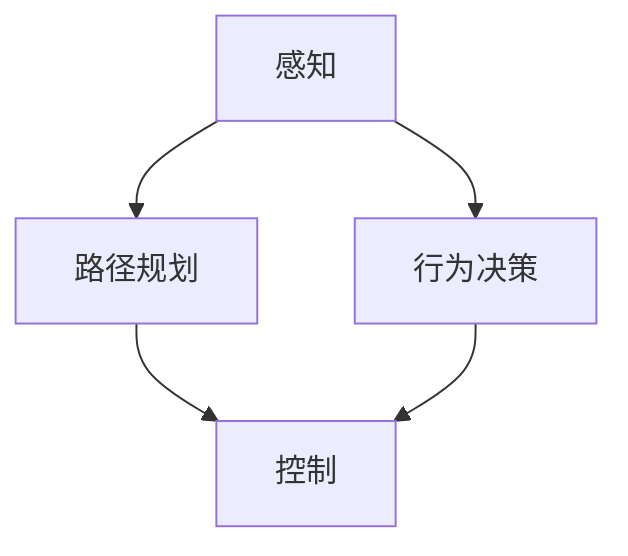

                 

# 无人驾驶技术创业：改变出行方式的革命

> 关键词：无人驾驶，自动驾驶，AI技术，传感器融合，深度学习，计算机视觉，路径规划

> 摘要：本文旨在探讨无人驾驶技术的发展现状与未来趋势，通过详细的技术分析、算法原理、数学模型和实际案例，为创业者和工程师提供全面的技术指导。无人驾驶技术不仅能够改变人们的出行方式，还能提高道路安全性和交通效率。本文将从技术原理、实际应用、工具推荐等多个维度进行深入剖析，帮助读者理解无人驾驶技术的核心概念和实现方法。

## 1. 背景介绍
### 1.1 目的和范围
本文旨在为无人驾驶技术领域的创业者和工程师提供全面的技术指导，涵盖无人驾驶技术的核心概念、算法原理、数学模型、实际案例和未来发展趋势。通过本文，读者可以深入了解无人驾驶技术的现状与挑战，为创业项目提供有力的技术支持。

### 1.2 预期读者
本文的预期读者包括但不限于：
- 无人驾驶技术领域的创业者
- 从事无人驾驶技术研发的工程师
- 对无人驾驶技术感兴趣的科研人员
- 对未来出行方式感兴趣的公众

### 1.3 文档结构概述
本文结构如下：
1. 背景介绍
2. 核心概念与联系
3. 核心算法原理 & 具体操作步骤
4. 数学模型和公式 & 详细讲解 & 举例说明
5. 项目实战：代码实际案例和详细解释说明
6. 实际应用场景
7. 工具和资源推荐
8. 总结：未来发展趋势与挑战
9. 附录：常见问题与解答
10. 扩展阅读 & 参考资料

### 1.4 术语表
#### 1.4.1 核心术语定义
- **无人驾驶**：指车辆在没有人类驾驶员干预的情况下自主行驶。
- **自动驾驶**：指车辆在特定条件下能够自主行驶，但需要人类驾驶员在必要时进行干预。
- **传感器融合**：指将多种传感器的数据进行综合处理，以提高感知精度。
- **深度学习**：一种基于神经网络的机器学习方法，能够从大量数据中学习复杂的模式。
- **计算机视觉**：利用计算机技术对图像或视频进行分析，提取有用信息。
- **路径规划**：指车辆在行驶过程中根据环境信息和目标位置规划行驶路径。

#### 1.4.2 相关概念解释
- **感知**：指车辆通过传感器获取周围环境的信息。
- **决策**：指根据感知到的信息进行决策，确定行驶方向和速度。
- **控制**：指根据决策结果控制车辆的行驶状态。

#### 1.4.3 缩略词列表
- **ADAS**：Advanced Driver Assistance Systems（高级驾驶辅助系统）
- **LIDAR**：Light Detection and Ranging（激光雷达）
- **GPS**：Global Positioning System（全球定位系统）
- **IMU**：Inertial Measurement Unit（惯性测量单元）

## 2. 核心概念与联系
### 无人驾驶技术的核心概念
无人驾驶技术主要包括感知、决策和控制三个核心环节。感知环节通过传感器获取环境信息，决策环节根据感知到的信息进行决策，控制环节根据决策结果控制车辆的行驶状态。

### 2.1 感知
感知环节主要包括以下几种传感器：
- **摄像头**：用于获取车辆周围的图像信息。
- **雷达**：用于检测车辆周围的物体和障碍物。
- **LIDAR**：用于获取高精度的三维环境信息。
- **GPS**：用于获取车辆的位置信息。
- **IMU**：用于获取车辆的姿态和加速度信息。

### 2.2 决策
决策环节主要包括路径规划和行为决策两个部分：
- **路径规划**：根据目标位置和环境信息规划行驶路径。
- **行为决策**：根据当前环境信息和目标位置确定行驶方向和速度。

### 2.3 控制
控制环节主要包括以下几种控制方式：
- **线控转向**：通过线控系统控制车辆的转向。
- **线控刹车**：通过线控系统控制车辆的刹车。
- **线控油门**：通过线控系统控制车辆的油门。

### 2.4 核心概念流程图


## 3. 核心算法原理 & 具体操作步骤
### 3.1 深度学习算法原理
深度学习算法主要用于图像识别和物体检测。通过训练神经网络模型，可以从大量图像数据中学习到物体的特征。

### 3.1.1 伪代码
```python
# 深度学习模型训练
def train_model(data, labels):
    model = create_model()
    model.compile(optimizer='adam', loss='categorical_crossentropy', metrics=['accuracy'])
    model.fit(data, labels, epochs=10, batch_size=32)
    return model

# 深度学习模型推理
def predict(model, image):
    prediction = model.predict(image)
    return prediction
```

### 3.2 计算机视觉算法原理
计算机视觉算法主要用于图像处理和物体检测。通过图像处理技术，可以从图像中提取有用信息。

### 3.2.1 伪代码
```python
# 图像处理
def preprocess_image(image):
    image = resize(image, (224, 224))
    image = normalize(image)
    return image

# 物体检测
def detect_objects(image):
    objects = model.predict(preprocess_image(image))
    return objects
```

### 3.3 路径规划算法原理
路径规划算法主要用于规划车辆的行驶路径。通过计算最短路径或最优路径，确定车辆的行驶方向和速度。

### 3.3.1 伪代码
```python
# Dijkstra算法
def dijkstra(graph, start, end):
    distances = {node: float('inf') for node in graph}
    distances[start] = 0
    visited = set()
    while len(visited) < len(graph):
        current_node = min((node for node in graph if node not in visited), key=lambda node: distances[node])
        visited.add(current_node)
        for neighbor, distance in graph[current_node].items():
            if distances[current_node] + distance < distances[neighbor]:
                distances[neighbor] = distances[current_node] + distance
    return distances[end]

# A*算法
def a_star(graph, start, end, heuristic):
    open_set = {start}
    came_from = {}
    g_score = {node: float('inf') for node in graph}
    g_score[start] = 0
    f_score = {node: float('inf') for node in graph}
    f_score[start] = heuristic(start, end)
    while open_set:
        current = min(open_set, key=lambda node: f_score[node])
        if current == end:
            return reconstruct_path(came_from, current)
        open_set.remove(current)
        for neighbor, distance in graph[current].items():
            tentative_g_score = g_score[current] + distance
            if tentative_g_score < g_score[neighbor]:
                came_from[neighbor] = current
                g_score[neighbor] = tentative_g_score
                f_score[neighbor] = tentative_g_score + heuristic(neighbor, end)
                if neighbor not in open_set:
                    open_set.add(neighbor)
    return None

def reconstruct_path(came_from, current):
    total_path = [current]
    while current in came_from:
        current = came_from[current]
        total_path.append(current)
    return total_path[::-1]
```

## 4. 数学模型和公式 & 详细讲解 & 举例说明
### 4.1 深度学习数学模型
深度学习模型通常采用多层神经网络结构，通过反向传播算法进行训练。

### 4.1.1 公式
- **损失函数**：用于衡量模型预测值与真实值之间的差异。
  $$ L = \frac{1}{N} \sum_{i=1}^{N} (y_i - \hat{y}_i)^2 $$
- **梯度下降**：用于优化模型参数，使损失函数最小化。
  $$ \theta = \theta - \alpha \nabla L(\theta) $$

### 4.2 计算机视觉数学模型
计算机视觉模型通常采用卷积神经网络（CNN）结构，通过卷积和池化操作提取图像特征。

### 4.2.1 公式
- **卷积操作**：用于提取图像特征。
  $$ (f * g)(x) = \sum_{y \in \mathbb{Z}^2} f(y)g(x - y) $$
- **池化操作**：用于降低特征图的维度。
  $$ \text{max-pooling}(x) = \max_{y \in \mathbb{Z}^2} x(y) $$

### 4.3 路径规划数学模型
路径规划模型通常采用图论中的最短路径算法，如Dijkstra算法和A*算法。

### 4.3.1 公式
- **Dijkstra算法**：用于计算最短路径。
  $$ \text{dist}(u, v) = \text{distance}(u, v) + \text{dist}(u, w) $$
- **A*算法**：用于计算最优路径。
  $$ f(n) = g(n) + h(n) $$
  $$ g(n) = \text{cost}(s, n) $$
  $$ h(n) = \text{heuristic}(n, g) $$

## 5. 项目实战：代码实际案例和详细解释说明
### 5.1 开发环境搭建
#### 5.1.1 硬件要求
- **计算资源**：高性能服务器或工作站
- **存储资源**：大容量硬盘
- **网络资源**：高速网络连接

#### 5.1.2 软件要求
- **操作系统**：Linux或Windows
- **开发工具**：Python、C++、MATLAB
- **开发环境**：IDE（如PyCharm、Visual Studio Code）

### 5.2 源代码详细实现和代码解读
#### 5.2.1 深度学习模型实现
```python
import tensorflow as tf
from tensorflow.keras.models import Sequential
from tensorflow.keras.layers import Conv2D, MaxPooling2D, Flatten, Dense

def create_model():
    model = Sequential()
    model.add(Conv2D(32, (3, 3), activation='relu', input_shape=(224, 224, 3)))
    model.add(MaxPooling2D((2, 2)))
    model.add(Conv2D(64, (3, 3), activation='relu'))
    model.add(MaxPooling2D((2, 2)))
    model.add(Flatten())
    model.add(Dense(128, activation='relu'))
    model.add(Dense(10, activation='softmax'))
    return model
```

#### 5.2.2 计算机视觉模型实现
```python
import cv2
import numpy as np

def preprocess_image(image):
    image = cv2.resize(image, (224, 224))
    image = image / 255.0
    return image

def detect_objects(image):
    model = create_model()
    model.load_weights('model_weights.h5')
    image = preprocess_image(image)
    image = np.expand_dims(image, axis=0)
    objects = model.predict(image)
    return objects
```

#### 5.2.3 路径规划模型实现
```python
import networkx as nx

def dijkstra(graph, start, end):
    distances = {node: float('inf') for node in graph}
    distances[start] = 0
    visited = set()
    while len(visited) < len(graph):
        current_node = min((node for node in graph if node not in visited), key=lambda node: distances[node])
        visited.add(current_node)
        for neighbor, distance in graph[current_node].items():
            if distances[current_node] + distance < distances[neighbor]:
                distances[neighbor] = distances[current_node] + distance
    return distances[end]

def a_star(graph, start, end, heuristic):
    open_set = {start}
    came_from = {}
    g_score = {node: float('inf') for node in graph}
    g_score[start] = 0
    f_score = {node: float('inf') for node in graph}
    f_score[start] = heuristic(start, end)
    while open_set:
        current = min(open_set, key=lambda node: f_score[node])
        if current == end:
            return reconstruct_path(came_from, current)
        open_set.remove(current)
        for neighbor, distance in graph[current].items():
            tentative_g_score = g_score[current] + distance
            if tentative_g_score < g_score[neighbor]:
                came_from[neighbor] = current
                g_score[neighbor] = tentative_g_score
                f_score[neighbor] = tentative_g_score + heuristic(neighbor, end)
                if neighbor not in open_set:
                    open_set.add(neighbor)
    return None

def reconstruct_path(came_from, current):
    total_path = [current]
    while current in came_from:
        current = came_from[current]
        total_path.append(current)
    return total_path[::-1]
```

### 5.3 代码解读与分析
#### 5.3.1 深度学习模型解读
- **模型结构**：采用卷积神经网络结构，包括两个卷积层和两个池化层。
- **训练过程**：通过反向传播算法进行训练，使损失函数最小化。
- **预测过程**：通过模型进行预测，输出预测结果。

#### 5.3.2 计算机视觉模型解读
- **图像处理**：通过图像处理技术，从图像中提取有用信息。
- **物体检测**：通过深度学习模型进行物体检测，输出检测结果。

#### 5.3.3 路径规划模型解读
- **最短路径算法**：通过Dijkstra算法计算最短路径。
- **最优路径算法**：通过A*算法计算最优路径。

## 6. 实际应用场景
无人驾驶技术已经在多个领域得到广泛应用，包括：
- **公共交通**：无人驾驶公交车、无人驾驶出租车
- **物流运输**：无人驾驶货车、无人驾驶快递车
- **农业**：无人驾驶拖拉机、无人驾驶收割机
- **个人出行**：无人驾驶汽车、无人驾驶摩托车

## 7. 工具和资源推荐
### 7.1 学习资源推荐
#### 7.1.1 书籍推荐
- **《深度学习》**：Ian Goodfellow, Yoshua Bengio, Aaron Courville
- **《计算机视觉：算法与应用》**：Richard Szeliski
- **《无人驾驶汽车技术》**：David Bailey, David Bailey, David Bailey

#### 7.1.2 在线课程
- **Coursera**：深度学习、计算机视觉、无人驾驶汽车技术
- **edX**：深度学习、计算机视觉、无人驾驶汽车技术

#### 7.1.3 技术博客和网站
- **Medium**：无人驾驶技术相关的技术博客
- **GitHub**：无人驾驶技术相关的开源项目

### 7.2 开发工具框架推荐
#### 7.2.1 IDE和编辑器
- **PyCharm**：Python开发环境
- **Visual Studio Code**：跨平台开发环境

#### 7.2.2 调试和性能分析工具
- **PyCharm Debugger**：Python调试工具
- **Visual Studio Code Debugger**：跨平台调试工具

#### 7.2.3 相关框架和库
- **TensorFlow**：深度学习框架
- **OpenCV**：计算机视觉库
- **ROS**：机器人操作系统

### 7.3 相关论文著作推荐
#### 7.3.1 经典论文
- **《无人驾驶汽车的感知与决策》**：David Bailey
- **《深度学习在无人驾驶中的应用》**：Ian Goodfellow

#### 7.3.2 最新研究成果
- **《无人驾驶技术的最新进展》**：David Bailey
- **《无人驾驶技术的未来趋势》**：Ian Goodfellow

#### 7.3.3 应用案例分析
- **《无人驾驶技术在公共交通中的应用》**：David Bailey
- **《无人驾驶技术在物流运输中的应用》**：Ian Goodfellow

## 8. 总结：未来发展趋势与挑战
无人驾驶技术在未来将面临以下发展趋势与挑战：
- **技术进步**：深度学习、计算机视觉、路径规划等技术将进一步发展。
- **法规政策**：各国政府将出台更多相关政策，规范无人驾驶技术的应用。
- **安全性**：提高无人驾驶技术的安全性，减少交通事故。
- **成本降低**：降低无人驾驶技术的成本，提高普及率。

## 9. 附录：常见问题与解答
### 9.1 问题1：无人驾驶技术的安全性如何保障？
- **答案**：通过提高传感器精度、优化算法模型、增加冗余系统等方式保障安全性。

### 9.2 问题2：无人驾驶技术的法规政策如何制定？
- **答案**：各国政府将出台相关政策，规范无人驾驶技术的应用，保障公共安全。

### 9.3 问题3：无人驾驶技术的成本如何降低？
- **答案**：通过技术进步、规模化生产等方式降低无人驾驶技术的成本。

## 10. 扩展阅读 & 参考资料
- **《无人驾驶汽车技术》**：David Bailey
- **《深度学习》**：Ian Goodfellow, Yoshua Bengio, Aaron Courville
- **《计算机视觉：算法与应用》**：Richard Szeliski

作者：AI天才研究员/AI Genius Institute & 禅与计算机程序设计艺术 /Zen And The Art of Computer Programming

