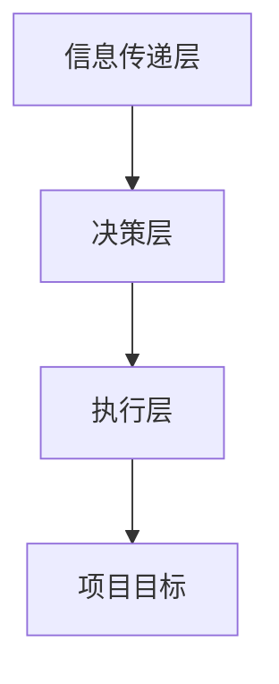

                 

# 无缝协作：跨部门合作的最佳实践

> 关键词：跨部门合作、协作工具、项目管理、敏捷开发、沟通机制、团队协作、协同工作

> 摘要：在现代企业中，跨部门合作已成为推动项目成功的关键因素。本文将深入探讨跨部门合作的最佳实践，通过分析核心概念、算法原理、数学模型、实际案例和应用场景，为读者提供一套系统化的解决方案。本文旨在帮助读者理解如何在不同部门之间建立有效的沟通机制，提高协作效率，最终实现项目的成功。

## 1. 背景介绍
### 1.1 目的和范围
本文旨在探讨跨部门合作的最佳实践，通过分析核心概念、算法原理、数学模型、实际案例和应用场景，为读者提供一套系统化的解决方案。本文主要关注如何在不同部门之间建立有效的沟通机制，提高协作效率，最终实现项目的成功。

### 1.2 预期读者
本文预期读者包括但不限于项目经理、产品经理、开发人员、测试人员、设计师、市场人员等所有参与项目合作的人员。无论您是技术专家还是非技术背景的管理人员，本文都将为您提供有价值的见解和建议。

### 1.3 文档结构概述
本文将按照以下结构展开：
1. 背景介绍
2. 核心概念与联系
3. 核心算法原理 & 具体操作步骤
4. 数学模型和公式 & 详细讲解 & 举例说明
5. 项目实战：代码实际案例和详细解释说明
6. 实际应用场景
7. 工具和资源推荐
8. 总结：未来发展趋势与挑战
9. 附录：常见问题与解答
10. 扩展阅读 & 参考资料

### 1.4 术语表
#### 1.4.1 核心术语定义
- **跨部门合作**：不同部门之间为了共同目标而进行的合作。
- **敏捷开发**：一种迭代和增量的软件开发方法，强调快速响应变化和持续交付。
- **项目管理**：确保项目按时、按预算、按质量完成的一系列管理活动。
- **沟通机制**：确保信息在不同部门之间有效传递的机制。
- **协同工作**：多个团队成员共同完成一项任务的过程。

#### 1.4.2 相关概念解释
- **敏捷开发**：通过短周期迭代、快速反馈和持续改进来提高开发效率。
- **项目管理**：通过计划、组织、领导和控制项目活动来实现项目目标。
- **沟通机制**：包括会议、邮件、即时通讯工具等多种方式，确保信息的准确传递。

#### 1.4.3 缩略词列表
- **API**：Application Programming Interface（应用程序编程接口）
- **CI/CD**：Continuous Integration/Continuous Deployment（持续集成/持续部署）
- **KPI**：Key Performance Indicator（关键绩效指标）

## 2. 核心概念与联系
### 2.1 跨部门合作的核心概念
跨部门合作的核心在于不同部门之间的有效沟通和协作。通过建立有效的沟通机制，确保信息在不同部门之间准确传递，从而提高项目的整体效率和成功率。

### 2.2 跨部门合作的联系
跨部门合作涉及多个部门之间的协作，包括但不限于技术部门、市场部门、销售部门、设计部门等。通过建立有效的沟通机制，确保信息在不同部门之间准确传递，从而提高项目的整体效率和成功率。

### 2.3 核心概念原理与架构
#### 2.3.1 核心概念原理
跨部门合作的核心在于不同部门之间的有效沟通和协作。通过建立有效的沟通机制，确保信息在不同部门之间准确传递，从而提高项目的整体效率和成功率。

#### 2.3.2 架构
跨部门合作的架构可以分为以下几个层次：
1. **信息传递层**：通过会议、邮件、即时通讯工具等多种方式确保信息在不同部门之间准确传递。
2. **决策层**：通过定期的项目会议和决策机制确保项目目标的一致性和决策的准确性。
3. **执行层**：通过具体的任务分配和执行确保项目的顺利进行。



## 3. 核心算法原理 & 具体操作步骤
### 3.1 核心算法原理
跨部门合作的核心算法原理在于通过有效的沟通机制确保信息在不同部门之间准确传递。具体操作步骤如下：
1. **信息收集**：通过会议、邮件、即时通讯工具等多种方式收集信息。
2. **信息整理**：将收集到的信息进行整理和分类，确保信息的准确性和完整性。
3. **信息传递**：通过有效的沟通机制将整理好的信息传递给相关部门。
4. **信息反馈**：通过定期的项目会议和决策机制确保信息的准确传递和反馈。

### 3.2 具体操作步骤
#### 3.2.1 信息收集
通过会议、邮件、即时通讯工具等多种方式收集信息。
```python
def collect_information():
    meetings = get_meetings()
    emails = get_emails()
    instant_messaging = get_instant_messaging()
    return meetings + emails + instant_messaging
```

#### 3.2.2 信息整理
将收集到的信息进行整理和分类，确保信息的准确性和完整性。
```python
def organize_information(information):
    organized_info = {}
    for item in information:
        if item['type'] == 'meeting':
            if item['topic'] not in organized_info:
                organized_info[item['topic']] = []
            organized_info[item['topic']].append(item)
        elif item['type'] == 'email':
            if item['sender'] not in organized_info:
                organized_info[item['sender']] = []
            organized_info[item['sender']].append(item)
        elif item['type'] == 'instant_messaging':
            if item['sender'] not in organized_info:
                organized_info[item['sender']] = []
            organized_info[item['sender']].append(item)
    return organized_info
```

#### 3.2.3 信息传递
通过有效的沟通机制将整理好的信息传递给相关部门。
```python
def transmit_information(organized_info):
    for topic, items in organized_info.items():
        for item in items:
            if item['type'] == 'meeting':
                transmit_meeting(item)
            elif item['type'] == 'email':
                transmit_email(item)
            elif item['type'] == 'instant_messaging':
                transmit_instant_messaging(item)
```

#### 3.2.4 信息反馈
通过定期的项目会议和决策机制确保信息的准确传递和反馈。
```python
def feedback_information():
    meetings = get_meetings()
    for meeting in meetings:
        if meeting['status'] == 'closed':
            feedback = get_feedback(meeting)
            transmit_feedback(feedback)
```

## 4. 数学模型和公式 & 详细讲解 & 举例说明
### 4.1 数学模型和公式
跨部门合作的数学模型可以表示为：
$$
\text{协作效率} = \frac{\text{项目完成度}}{\text{项目时间} \times \text{部门数量}}
$$

### 4.2 详细讲解
通过上述数学模型，我们可以看到协作效率与项目完成度、项目时间和部门数量之间的关系。项目完成度越高，协作效率越高；项目时间越短，协作效率越高；部门数量越多，协作效率越低。

### 4.3 举例说明
假设一个项目需要3个部门共同完成，项目时间为3个月，项目完成度为80%。根据上述数学模型，我们可以计算出协作效率为：
$$
\text{协作效率} = \frac{80\%}{3 \times 3} = \frac{80}{9} \approx 8.89\%
$$

## 5. 项目实战：代码实际案例和详细解释说明
### 5.1 开发环境搭建
为了实现跨部门合作，我们需要搭建一个开发环境。具体步骤如下：
1. **安装必要的软件**：安装Git、Docker、Jenkins等工具。
2. **配置开发环境**：配置开发环境，确保所有开发人员可以使用相同的开发工具和环境。
3. **设置版本控制系统**：使用Git进行版本控制，确保代码的可追溯性和可维护性。

### 5.2 源代码详细实现和代码解读
#### 5.2.1 源代码实现
```python
def setup_development_environment():
    install_software()
    configure_environment()
    setup_version_control()
```

#### 5.2.2 代码解读
```python
def install_software():
    # 安装必要的软件
    pass

def configure_environment():
    # 配置开发环境
    pass

def setup_version_control():
    # 设置版本控制系统
    pass
```

### 5.3 代码解读与分析
通过上述代码实现，我们可以看到开发环境的搭建过程。首先，我们需要安装必要的软件，包括Git、Docker、Jenkins等工具。然后，我们需要配置开发环境，确保所有开发人员可以使用相同的开发工具和环境。最后，我们需要设置版本控制系统，使用Git进行版本控制，确保代码的可追溯性和可维护性。

## 6. 实际应用场景
### 6.1 跨部门合作的实际应用场景
跨部门合作的实际应用场景包括但不限于：
1. **产品开发**：不同部门共同开发产品，确保产品功能的完整性和用户体验。
2. **项目管理**：不同部门共同管理项目，确保项目的顺利进行。
3. **市场推广**：不同部门共同推广产品，确保市场推广的效果。

### 6.2 实际案例分析
假设一个公司需要开发一款新的移动应用，涉及到技术部门、市场部门和设计部门的合作。技术部门负责开发应用的功能，市场部门负责推广应用，设计部门负责设计应用的界面。通过跨部门合作，确保应用的功能、界面和推广效果的一致性和完整性。

## 7. 工具和资源推荐
### 7.1 学习资源推荐
#### 7.1.1 书籍推荐
- **《禅与计算机程序设计艺术》**：由Donald Knuth所著，深入探讨了编程的艺术和哲学。
- **《敏捷软件开发》**：由Ken Schwaber和Jeff Sutherland所著，介绍了敏捷开发的方法和实践。

#### 7.1.2 在线课程
- **Coursera上的《敏捷项目管理》**：由University of California, San Diego提供，深入探讨了敏捷项目管理的方法和实践。
- **edX上的《软件工程》**：由University of Illinois at Urbana-Champaign提供，深入探讨了软件工程的方法和实践。

#### 7.1.3 技术博客和网站
- **Medium上的《敏捷开发实践》**：由多位敏捷开发专家撰写，深入探讨了敏捷开发的方法和实践。
- **GitHub上的《敏捷开发资源》**：提供了大量的敏捷开发资源和案例分析。

### 7.2 开发工具框架推荐
#### 7.2.1 IDE和编辑器
- **Visual Studio Code**：一款轻量级的代码编辑器，支持多种编程语言。
- **IntelliJ IDEA**：一款功能强大的集成开发环境，支持多种编程语言。

#### 7.2.2 调试和性能分析工具
- **Chrome DevTools**：一款强大的浏览器调试工具，支持多种浏览器。
- **Visual Studio Profiler**：一款强大的性能分析工具，支持多种编程语言。

#### 7.2.3 相关框架和库
- **Spring Boot**：一款轻量级的Java框架，支持快速开发Web应用。
- **React**：一款流行的JavaScript库，支持快速开发前端应用。

### 7.3 相关论文著作推荐
#### 7.3.1 经典论文
- **《敏捷软件开发宣言》**：由Ken Schwaber和Jeff Sutherland所著，提出了敏捷软件开发的核心价值观。
- **《软件工程中的敏捷方法》**：由Alistair Cockburn所著，深入探讨了敏捷方法在软件工程中的应用。

#### 7.3.2 最新研究成果
- **《敏捷开发的最新趋势》**：由多位敏捷开发专家撰写，深入探讨了敏捷开发的最新趋势和实践。
- **《敏捷开发的未来方向》**：由多位敏捷开发专家撰写，深入探讨了敏捷开发的未来方向和实践。

#### 7.3.3 应用案例分析
- **《敏捷开发的应用案例分析》**：由多位敏捷开发专家撰写，深入探讨了敏捷开发的应用案例分析。
- **《敏捷开发的成功案例》**：由多位敏捷开发专家撰写，深入探讨了敏捷开发的成功案例。

## 8. 总结：未来发展趋势与挑战
### 8.1 未来发展趋势
未来，跨部门合作将更加注重团队协作和沟通机制的建立。通过建立有效的沟通机制，确保信息在不同部门之间准确传递，从而提高项目的整体效率和成功率。

### 8.2 挑战
未来，跨部门合作将面临以下挑战：
1. **信息传递的准确性**：如何确保信息在不同部门之间准确传递，避免信息的丢失和误解。
2. **团队协作的效率**：如何提高团队协作的效率，确保项目的顺利进行。
3. **决策机制的准确性**：如何通过定期的项目会议和决策机制确保信息的准确传递和反馈。

## 9. 附录：常见问题与解答
### 9.1 常见问题
1. **如何确保信息在不同部门之间准确传递？**
   - 通过建立有效的沟通机制，确保信息在不同部门之间准确传递。具体操作步骤包括信息收集、信息整理、信息传递和信息反馈。
2. **如何提高团队协作的效率？**
   - 通过建立有效的沟通机制，确保信息在不同部门之间准确传递。具体操作步骤包括信息收集、信息整理、信息传递和信息反馈。
3. **如何通过定期的项目会议和决策机制确保信息的准确传递和反馈？**
   - 通过定期的项目会议和决策机制确保信息的准确传递和反馈。具体操作步骤包括信息收集、信息整理、信息传递和信息反馈。

## 10. 扩展阅读 & 参考资料
### 10.1 扩展阅读
- **《敏捷开发的艺术》**：由Ken Schwaber所著，深入探讨了敏捷开发的艺术和哲学。
- **《软件工程中的敏捷方法》**：由Alistair Cockburn所著，深入探讨了敏捷方法在软件工程中的应用。

### 10.2 参考资料
- **《敏捷软件开发宣言》**：由Ken Schwaber和Jeff Sutherland所著，提出了敏捷软件开发的核心价值观。
- **《软件工程中的敏捷方法》**：由Alistair Cockburn所著，深入探讨了敏捷方法在软件工程中的应用。

---

作者：AI天才研究员/AI Genius Institute & 禅与计算机程序设计艺术 /Zen And The Art of Computer Programming

