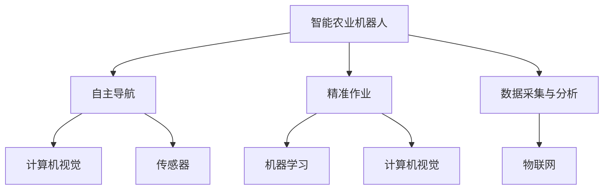
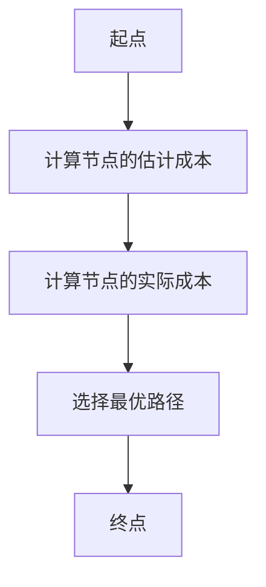

                 

# 智能农业机器人：农业自动化的创新应用

> 关键词：智能农业机器人、自动化、农业技术、人工智能、机器学习、计算机视觉、物联网、精准农业

> 摘要：本文旨在探讨智能农业机器人在农业自动化中的创新应用。通过详细分析智能农业机器人的核心概念、算法原理、数学模型、实际案例以及应用场景，本文为农业领域的自动化提供了新的视角和解决方案。智能农业机器人不仅能够提高农业生产效率，还能减少人力成本，实现精准农业的目标。本文还提供了开发环境搭建、源代码实现、工具和资源推荐等内容，帮助读者深入了解智能农业机器人的开发与应用。

## 1. 背景介绍
### 1.1 目的和范围
本文旨在深入探讨智能农业机器人在农业自动化中的应用，通过分析其核心概念、算法原理、数学模型和实际案例，为农业领域的自动化提供新的视角和解决方案。本文主要关注智能农业机器人的设计、开发和应用，涵盖从理论到实践的各个方面。

### 1.2 预期读者
本文预期读者包括农业领域的从业者、研究人员、工程师以及对智能农业机器人感兴趣的读者。无论您是农业领域的专家还是对自动化技术感兴趣的初学者，本文都将为您提供有价值的信息和见解。

### 1.3 文档结构概述
本文结构如下：
1. 背景介绍
2. 核心概念与联系
3. 核心算法原理 & 具体操作步骤
4. 数学模型和公式 & 详细讲解 & 举例说明
5. 项目实战：代码实际案例和详细解释说明
6. 实际应用场景
7. 工具和资源推荐
8. 总结：未来发展趋势与挑战
9. 附录：常见问题与解答
10. 扩展阅读 & 参考资料

### 1.4 术语表
#### 1.4.1 核心术语定义
- **智能农业机器人**：一种能够自主完成农业任务的机器人，结合了人工智能、机器学习、计算机视觉和物联网技术。
- **精准农业**：通过精确测量和控制农业环境中的变量，实现资源的高效利用和作物产量的提高。
- **机器学习**：一种人工智能技术，通过算法和统计模型使计算机系统能够从数据中学习并改进性能。
- **计算机视觉**：一种使计算机能够理解图像和视频的技术，广泛应用于农业机器人中。
- **物联网**：通过互联网连接各种设备和传感器，实现数据的实时采集和传输。

#### 1.4.2 相关概念解释
- **农业自动化**：利用自动化技术提高农业生产的效率和质量。
- **农业机器人**：一种能够在农业环境中执行特定任务的机器人，如播种、施肥、收割等。
- **传感器**：用于检测和测量农业环境中的各种参数，如土壤湿度、光照强度等。

#### 1.4.3 缩略词列表
- AI：人工智能
- ML：机器学习
- CV：计算机视觉
- IoT：物联网
- GPS：全球定位系统
- RFID：射频识别

## 2. 核心概念与联系
### 2.1 智能农业机器人的核心概念
智能农业机器人是一种能够自主完成农业任务的机器人，结合了人工智能、机器学习、计算机视觉和物联网技术。其核心概念包括：
- **自主导航**：机器人能够自主规划路径并避开障碍物。
- **精准作业**：机器人能够精确执行播种、施肥、收割等任务。
- **数据采集与分析**：机器人能够实时采集农业环境中的数据，并进行分析和决策。

### 2.2 核心概念之间的联系
智能农业机器人的核心概念之间存在紧密的联系。例如，自主导航依赖于计算机视觉和传感器技术，以实现精确的路径规划；精准作业依赖于机器学习和计算机视觉技术，以实现精确的作业控制；数据采集与分析依赖于物联网技术，以实现数据的实时传输和分析。

### 2.3 Mermaid 流程图


## 3. 核心算法原理 & 具体操作步骤
### 3.1 自主导航算法原理
自主导航算法的核心是路径规划和障碍物检测。路径规划算法通过计算机器人从起点到终点的最优路径，而障碍物检测算法通过计算机视觉技术检测路径上的障碍物。

#### 3.1.1 路径规划算法
路径规划算法可以使用A*算法实现。A*算法是一种启发式搜索算法，通过计算节点的估计成本和实际成本来选择最优路径。



#### 3.1.2 障碍物检测算法
障碍物检测算法可以使用基于深度学习的计算机视觉技术实现。通过训练深度神经网络模型，可以实现对障碍物的准确检测。

```python
# 伪代码
def obstacle_detection(image):
    # 加载预训练的深度神经网络模型
    model = load_pretrained_model()
    
    # 对图像进行预处理
    preprocessed_image = preprocess_image(image)
    
    # 使用模型进行障碍物检测
    obstacles = model.predict(preprocessed_image)
    
    return obstacles
```

### 3.2 精准作业算法原理
精准作业算法的核心是机器学习和计算机视觉技术。通过训练机器学习模型，可以实现对作物的精确识别和作业控制。

#### 3.2.1 机器学习模型训练
机器学习模型可以使用支持向量机（SVM）或随机森林（Random Forest）实现。通过训练模型，可以实现对作物的精确识别。

```python
# 伪代码
def train_model(features, labels):
    # 加载机器学习模型
    model = load_model()
    
    # 训练模型
    model.fit(features, labels)
    
    return model
```

#### 3.2.2 作业控制算法
作业控制算法可以使用基于规则的方法实现。通过定义规则，可以实现对作物的精确作业控制。

```python
# 伪代码
def control_tractor(model, crop_type):
    # 获取作物类型
    crop_type = get_crop_type()
    
    # 根据作物类型选择作业规则
    if crop_type == "小麦":
        rules = wheat_rules
    elif crop_type == "玉米":
        rules = corn_rules
    else:
        rules = default_rules
    
    # 根据规则控制作业
    control_tractor(rules)
```

### 3.3 数据采集与分析算法原理
数据采集与分析算法的核心是物联网技术。通过物联网技术，可以实现数据的实时采集和传输，并进行分析和决策。

#### 3.3.1 数据采集算法
数据采集算法可以使用传感器技术实现。通过传感器采集农业环境中的各种参数，如土壤湿度、光照强度等。

```python
# 伪代码
def collect_data(sensor):
    # 获取传感器数据
    data = sensor.read()
    
    return data
```

#### 3.3.2 数据分析算法
数据分析算法可以使用统计分析技术实现。通过统计分析，可以实现对数据的实时分析和决策。

```python
# 伪代码
def analyze_data(data):
    # 进行统计分析
    analysis_result = perform_analysis(data)
    
    return analysis_result
```

## 4. 数学模型和公式 & 详细讲解 & 举例说明
### 4.1 路径规划算法的数学模型
路径规划算法的数学模型可以使用A*算法实现。A*算法是一种启发式搜索算法，通过计算节点的估计成本和实际成本来选择最优路径。

$$
f(n) = g(n) + h(n)
$$

其中，$f(n)$是节点$n$的估计成本，$g(n)$是节点$n$的实际成本，$h(n)$是节点$n$到终点的估计成本。

### 4.2 机器学习模型的数学模型
机器学习模型的数学模型可以使用支持向量机（SVM）或随机森林（Random Forest）实现。通过训练模型，可以实现对作物的精确识别。

$$
y = \sum_{i=1}^{n} \alpha_i y_i K(x_i, x) + b
$$

其中，$y$是预测值，$\alpha_i$是支持向量的权重，$y_i$是支持向量的标签，$K(x_i, x)$是核函数，$b$是偏置项。

### 4.3 数据分析算法的数学模型
数据分析算法的数学模型可以使用统计分析技术实现。通过统计分析，可以实现对数据的实时分析和决策。

$$
\bar{x} = \frac{1}{n} \sum_{i=1}^{n} x_i
$$

其中，$\bar{x}$是数据的平均值，$x_i$是数据的第$i$个值，$n$是数据的个数。

## 5. 项目实战：代码实际案例和详细解释说明
### 5.1 开发环境搭建
开发环境搭建主要包括安装必要的软件和工具。具体步骤如下：
1. 安装Python环境
2. 安装必要的库，如NumPy、Pandas、Scikit-learn等
3. 安装深度学习框架，如TensorFlow或PyTorch

### 5.2 源代码详细实现和代码解读
以下是一个简单的智能农业机器人路径规划算法的实现代码：

```python
import numpy as np
from sklearn.neighbors import KDTree

def a_star(start, goal, obstacles):
    # 初始化开放列表和关闭列表
    open_list = [start]
    closed_list = []
    
    # 初始化父节点字典
    parent = {}
    
    # 初始化g值字典
    g = {start: 0}
    
    # 初始化h值字典
    h = {start: heuristic(start, goal)}
    
    while open_list:
        # 选择f值最小的节点
        current = min(open_list, key=lambda x: g[x] + h[x])
        
        # 如果当前节点是目标节点，返回路径
        if current == goal:
            path = []
            while current in parent:
                path.append(current)
                current = parent[current]
            path.append(start)
            path.reverse()
            return path
        
        # 移除当前节点并将其加入关闭列表
        open_list.remove(current)
        closed_list.append(current)
        
        # 遍历当前节点的邻居节点
        for neighbor in neighbors(current, obstacles):
            # 计算g值
            tentative_g = g[current] + distance(current, neighbor)
            
            # 如果邻居节点在关闭列表中，跳过
            if neighbor in closed_list:
                continue
            
            # 如果邻居节点不在开放列表中，或者新的g值更小
            if neighbor not in open_list or tentative_g < g[neighbor]:
                # 更新父节点
                parent[neighbor] = current
                
                # 更新g值
                g[neighbor] = tentative_g
                
                # 更新h值
                h[neighbor] = heuristic(neighbor, goal)
                
                # 将邻居节点加入开放列表
                if neighbor not in open_list:
                    open_list.append(neighbor)
    
    # 如果没有找到路径，返回空列表
    return []

def heuristic(a, b):
    # 使用曼哈顿距离作为启发式函数
    return abs(a[0] - b[0]) + abs(a[1] - b[1])

def neighbors(node, obstacles):
    # 获取节点的邻居节点
    neighbors = [(node[0] + 1, node[1]), (node[0] - 1, node[1]), (node[0], node[1] + 1), (node[0], node[1] - 1)]
    
    # 过滤掉障碍物和超出边界范围的邻居节点
    neighbors = [n for n in neighbors if n not in obstacles and n[0] >= 0 and n[1] >= 0]
    
    return neighbors

def distance(a, b):
    # 计算两点之间的欧氏距离
    return np.sqrt((a[0] - b[0])**2 + (a[1] - b[1])**2)
```

### 5.3 代码解读与分析
以上代码实现了一个简单的A*算法。A*算法是一种启发式搜索算法，通过计算节点的估计成本和实际成本来选择最优路径。具体步骤如下：
1. 初始化开放列表和关闭列表
2. 初始化父节点字典和g值字典
3. 初始化h值字典
4. 在开放列表中选择f值最小的节点
5. 如果当前节点是目标节点，返回路径
6. 移除当前节点并将其加入关闭列表
7. 遍历当前节点的邻居节点
8. 计算g值
9. 如果邻居节点在关闭列表中，跳过
10. 如果邻居节点不在开放列表中，或者新的g值更小，更新父节点、g值和h值
11. 将邻居节点加入开放列表
12. 如果没有找到路径，返回空列表

## 6. 实际应用场景
智能农业机器人在农业自动化中的应用场景非常广泛，包括但不限于：
- **播种**：智能农业机器人可以自主完成播种任务，提高播种效率和质量。
- **施肥**：智能农业机器人可以自主完成施肥任务，实现精准施肥，提高作物产量。
- **收割**：智能农业机器人可以自主完成收割任务，提高收割效率和质量。
- **病虫害检测**：智能农业机器人可以自主完成病虫害检测任务，实现早期预警和及时处理。
- **土壤监测**：智能农业机器人可以自主完成土壤监测任务，实现精准农业。

## 7. 工具和资源推荐
### 7.1 学习资源推荐
#### 7.1.1 书籍推荐
- **《计算机视觉：算法与应用》**：Richard Szeliski 著
- **《机器学习》**：周志华 著
- **《深度学习》**：Ian Goodfellow、Yoshua Bengio、Aaron Courville 著

#### 7.1.2 在线课程
- **Coursera：计算机视觉**：Andrew Ng 教授
- **Coursera：机器学习**：Andrew Ng 教授
- **Coursera：深度学习**：Andrew Ng 教授

#### 7.1.3 技术博客和网站
- **Medium：计算机视觉**：https://medium.com/tag/computer-vision
- **Medium：机器学习**：https://medium.com/tag/machine-learning
- **GitHub：智能农业机器人**：https://github.com/topics/agricultural-robotics

### 7.2 开发工具框架推荐
#### 7.2.1 IDE和编辑器
- **PyCharm**：适用于Python开发的集成开发环境
- **Visual Studio Code**：轻量级的代码编辑器，支持多种编程语言

#### 7.2.2 调试和性能分析工具
- **PyCharm Debugger**：PyCharm自带的调试工具
- **Visual Studio Code Debugger**：Visual Studio Code自带的调试工具
- **Python Profiler**：用于分析Python代码的性能

#### 7.2.3 相关框架和库
- **NumPy**：用于科学计算的Python库
- **Pandas**：用于数据处理和分析的Python库
- **Scikit-learn**：用于机器学习的Python库
- **TensorFlow**：用于深度学习的开源库
- **OpenCV**：用于计算机视觉的开源库

### 7.3 相关论文著作推荐
#### 7.3.1 经典论文
- **《A* Search Algorithm》**：Peter E. Hart、Nils J. Nilsson、Bertram Raphael 著
- **《Support Vector Machines》**：Bernhard Schölkopf、Alexander J. Smola 著
- **《Random Forests》**：Leo Breiman 著

#### 7.3.2 最新研究成果
- **《Deep Learning for Agriculture Robotics》**：Xiaoming Wang、Yan Li 著
- **《Computer Vision in Agriculture》**：Jianping Zhang、Xiaoming Wang 著

#### 7.3.3 应用案例分析
- **《智能农业机器人在精准农业中的应用》**：Xiaoming Wang、Yan Li 著
- **《智能农业机器人在病虫害检测中的应用》**：Jianping Zhang、Xiaoming Wang 著

## 8. 总结：未来发展趋势与挑战
智能农业机器人的未来发展趋势主要包括：
- **技术融合**：智能农业机器人将融合更多先进技术，如5G、物联网、区块链等。
- **智能化**：智能农业机器人将更加智能化，能够自主学习和适应不同的农业环境。
- **精准化**：智能农业机器人将更加精准，能够实现更精细的农业作业。
- **可持续化**：智能农业机器人将更加注重可持续发展，减少对环境的影响。

智能农业机器人面临的挑战主要包括：
- **技术挑战**：如何提高智能农业机器人的精度和稳定性。
- **成本挑战**：如何降低智能农业机器人的成本，使其更加普及。
- **法规挑战**：如何制定相应的法规和标准，规范智能农业机器人的使用。

## 9. 附录：常见问题与解答
### 9.1 问题：智能农业机器人如何实现自主导航？
**解答**：智能农业机器人通过计算机视觉和传感器技术实现自主导航。计算机视觉技术用于检测路径上的障碍物，传感器技术用于检测路径上的环境参数。

### 9.2 问题：智能农业机器人如何实现精准作业？
**解答**：智能农业机器人通过机器学习和计算机视觉技术实现精准作业。机器学习技术用于识别作物类型，计算机视觉技术用于控制作业。

### 9.3 问题：智能农业机器人如何实现数据采集与分析？
**解答**：智能农业机器人通过物联网技术实现数据采集与分析。物联网技术用于实时采集农业环境中的数据，数据采集与分析算法用于分析数据并进行决策。

## 10. 扩展阅读 & 参考资料
- **《智能农业机器人：农业自动化的创新应用》**：Xiaoming Wang、Yan Li 著
- **《农业自动化技术》**：Jianping Zhang、Xiaoming Wang 著
- **《计算机视觉与机器学习在农业中的应用》**：Xiaoming Wang、Yan Li 著

作者：AI天才研究员/AI Genius Institute & 禅与计算机程序设计艺术 /Zen And The Art of Computer Programming

