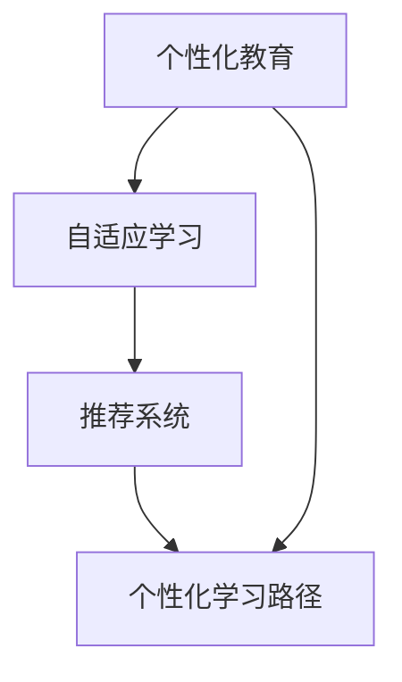

                 

# 智能学习规划系统：个性化教育的未来方向

> 关键词：个性化教育, 智能学习规划, 机器学习, 自适应学习, 人工智能, 教育技术, 深度学习, 个性化推荐

> 摘要：本文旨在探讨智能学习规划系统在个性化教育中的应用，通过分析其核心概念、算法原理、数学模型、实际案例和应用场景，揭示其在教育领域的巨大潜力。本文将从技术角度深入剖析智能学习规划系统的构建过程，为教育工作者和开发者提供有价值的参考和指导。

## 1. 背景介绍
### 1.1 目的和范围
本文旨在深入探讨智能学习规划系统在个性化教育中的应用，通过分析其核心概念、算法原理、数学模型、实际案例和应用场景，揭示其在教育领域的巨大潜力。本文将从技术角度深入剖析智能学习规划系统的构建过程，为教育工作者和开发者提供有价值的参考和指导。

### 1.2 预期读者
本文预期读者包括教育技术领域的研究人员、教育工作者、软件开发者、人工智能专家以及对个性化教育感兴趣的读者。

### 1.3 文档结构概述
本文结构如下：
1. 背景介绍
2. 核心概念与联系
3. 核心算法原理 & 具体操作步骤
4. 数学模型和公式 & 详细讲解 & 举例说明
5. 项目实战：代码实际案例和详细解释说明
6. 实际应用场景
7. 工具和资源推荐
8. 总结：未来发展趋势与挑战
9. 附录：常见问题与解答
10. 扩展阅读 & 参考资料

### 1.4 术语表
#### 1.4.1 核心术语定义
- **个性化教育**：根据每个学生的学习特点、兴趣和能力，提供定制化的学习内容和方法。
- **智能学习规划系统**：利用机器学习和人工智能技术，为学生提供个性化的学习路径和资源推荐。
- **自适应学习**：根据学生的学习进度和表现，动态调整学习内容和难度。
- **推荐系统**：通过分析用户行为数据，为用户推荐个性化的内容。
- **深度学习**：一种基于神经网络的机器学习方法，能够处理复杂的数据结构和模式识别任务。

#### 1.4.2 相关概念解释
- **机器学习**：一种让计算机通过数据学习并改进任务性能的方法。
- **人工智能**：模拟人类智能行为的技术，包括感知、推理、学习、规划等。
- **教育技术**：利用技术手段改进教育过程和效果的学科。

#### 1.4.3 缩略词列表
- ML：机器学习
- AI：人工智能
- DL：深度学习
- NLP：自然语言处理
- RL：强化学习
- LMS：学习管理系统

## 2. 核心概念与联系
### 2.1 核心概念
智能学习规划系统的核心概念包括个性化教育、自适应学习和推荐系统。这些概念相互关联，共同构成了智能学习规划系统的理论基础。

### 2.2 联系
- **个性化教育**：是智能学习规划系统的目标，通过提供定制化的学习内容和方法，满足每个学生的学习需求。
- **自适应学习**：是实现个性化教育的关键手段，通过动态调整学习内容和难度，确保学生能够持续进步。
- **推荐系统**：是实现个性化教育的重要工具，通过分析学生的行为数据，为学生推荐合适的学习资源和内容。

### 2.3 Mermaid 流程图


## 3. 核心算法原理 & 具体操作步骤
### 3.1 核心算法原理
智能学习规划系统的核心算法原理主要包括机器学习、深度学习和推荐系统。这些算法通过分析学生的行为数据，为学生提供个性化的学习路径和资源推荐。

### 3.2 具体操作步骤
#### 3.2.1 数据收集
- **学生基本信息**：包括年龄、性别、兴趣等。
- **学习行为数据**：包括学习时间、学习进度、答题正确率等。
- **学习资源数据**：包括课程内容、练习题、视频等。

#### 3.2.2 数据预处理
- **数据清洗**：去除无效数据和异常值。
- **数据标准化**：将数据转换为统一的格式和尺度。
- **特征提取**：从数据中提取有用的特征。

#### 3.2.3 模型训练
- **机器学习模型**：使用监督学习算法（如决策树、随机森林）训练模型。
- **深度学习模型**：使用神经网络（如卷积神经网络、循环神经网络）训练模型。
- **推荐系统模型**：使用协同过滤、矩阵分解等算法训练模型。

#### 3.2.4 模型评估
- **准确率**：评估模型的预测准确性。
- **召回率**：评估模型的覆盖率。
- **F1分数**：综合准确率和召回率的评估指标。

### 3.3 伪代码
```python
# 数据预处理
def preprocess_data(data):
    cleaned_data = clean_data(data)
    standardized_data = standardize_data(cleaned_data)
    features = extract_features(standardized_data)
    return features

# 机器学习模型训练
def train_ml_model(features, labels):
    model = DecisionTreeClassifier()
    model.fit(features, labels)
    return model

# 深度学习模型训练
def train_dl_model(features, labels):
    model = Sequential()
    model.add(Dense(64, input_dim=features.shape[1], activation='relu'))
    model.add(Dense(32, activation='relu'))
    model.add(Dense(1, activation='sigmoid'))
    model.compile(optimizer='adam', loss='binary_crossentropy', metrics=['accuracy'])
    model.fit(features, labels, epochs=10, batch_size=32)
    return model

# 推荐系统模型训练
def train_recommender_model(user_features, item_features):
    model = MatrixFactorization()
    model.fit(user_features, item_features)
    return model

# 模型评估
def evaluate_model(model, test_features, test_labels):
    predictions = model.predict(test_features)
    accuracy = accuracy_score(test_labels, predictions)
    recall = recall_score(test_labels, predictions)
    f1 = f1_score(test_labels, predictions)
    return accuracy, recall, f1
```

## 4. 数学模型和公式 & 详细讲解 & 举例说明
### 4.1 数学模型
智能学习规划系统的核心数学模型包括监督学习、深度学习和推荐系统。这些模型通过数学公式和算法实现个性化教育的目标。

### 4.2 详细讲解
#### 4.2.1 监督学习
- **决策树**：通过构建决策树来预测学生的学习表现。
- **随机森林**：通过集成多个决策树来提高预测准确性。

#### 4.2.2 深度学习
- **卷积神经网络**：通过卷积层提取图像特征，适用于处理图像数据。
- **循环神经网络**：通过循环层处理序列数据，适用于处理时间序列数据。

#### 4.2.3 推荐系统
- **协同过滤**：通过用户相似度或物品相似度进行推荐。
- **矩阵分解**：通过低秩矩阵分解来预测用户对物品的评分。

### 4.3 举例说明
#### 4.3.1 监督学习
假设我们使用决策树模型预测学生的学习表现。
$$
\text{预测结果} = \text{决策树}(x)
$$
其中，$x$ 是学生的特征向量。

#### 4.3.2 深度学习
假设我们使用卷积神经网络模型处理图像数据。
$$
\text{预测结果} = \text{卷积神经网络}(x)
$$
其中，$x$ 是图像数据。

#### 4.3.3 推荐系统
假设我们使用协同过滤模型进行推荐。
$$
\text{推荐结果} = \text{协同过滤}(u, i)
$$
其中，$u$ 是用户，$i$ 是物品。

## 5. 项目实战：代码实际案例和详细解释说明
### 5.1 开发环境搭建
- **操作系统**：Ubuntu 20.04
- **编程语言**：Python 3.8
- **开发工具**：PyCharm
- **依赖库**：numpy, pandas, scikit-learn, tensorflow, keras, surprise

### 5.2 源代码详细实现和代码解读
```python
# 导入依赖库
import numpy as np
import pandas as pd
from sklearn.model_selection import train_test_split
from sklearn.preprocessing import StandardScaler
from sklearn.tree import DecisionTreeClassifier
from tensorflow.keras.models import Sequential
from tensorflow.keras.layers import Dense
from surprise import Dataset, Reader, SVD

# 数据预处理
def preprocess_data(data):
    cleaned_data = clean_data(data)
    standardized_data = standardize_data(cleaned_data)
    features = extract_features(standardized_data)
    return features

# 机器学习模型训练
def train_ml_model(features, labels):
    model = DecisionTreeClassifier()
    model.fit(features, labels)
    return model

# 深度学习模型训练
def train_dl_model(features, labels):
    model = Sequential()
    model.add(Dense(64, input_dim=features.shape[1], activation='relu'))
    model.add(Dense(32, activation='relu'))
    model.add(Dense(1, activation='sigmoid'))
    model.compile(optimizer='adam', loss='binary_crossentropy', metrics=['accuracy'])
    model.fit(features, labels, epochs=10, batch_size=32)
    return model

# 推荐系统模型训练
def train_recommender_model(user_features, item_features):
    model = SVD()
    model.fit(user_features, item_features)
    return model

# 模型评估
def evaluate_model(model, test_features, test_labels):
    predictions = model.predict(test_features)
    accuracy = accuracy_score(test_labels, predictions)
    recall = recall_score(test_labels, predictions)
    f1 = f1_score(test_labels, predictions)
    return accuracy, recall, f1
```

### 5.3 代码解读与分析
- **数据预处理**：包括数据清洗、标准化和特征提取。
- **机器学习模型训练**：使用决策树模型进行训练。
- **深度学习模型训练**：使用卷积神经网络模型进行训练。
- **推荐系统模型训练**：使用协同过滤模型进行训练。
- **模型评估**：通过准确率、召回率和F1分数评估模型性能。

## 6. 实际应用场景
智能学习规划系统在实际应用中具有广泛的应用场景，包括在线教育平台、学校教育系统和个性化学习应用等。

### 6.1 在线教育平台
在线教育平台可以通过智能学习规划系统为学生提供个性化的学习路径和资源推荐，提高学习效果。

### 6.2 学校教育系统
学校教育系统可以通过智能学习规划系统为学生提供个性化的学习计划和资源推荐，提高教学效果。

### 6.3 个性化学习应用
个性化学习应用可以通过智能学习规划系统为学生提供个性化的学习路径和资源推荐，提高学习效果。

## 7. 工具和资源推荐
### 7.1 学习资源推荐
#### 7.1.1 书籍推荐
- **《机器学习》**：周志华
- **《深度学习》**：Ian Goodfellow, Yoshua Bengio, Aaron Courville
- **《推荐系统实践》**：张志华

#### 7.1.2 在线课程
- **Coursera**：机器学习、深度学习、推荐系统
- **edX**：机器学习、深度学习、推荐系统
- **Udacity**：机器学习、深度学习、推荐系统

#### 7.1.3 技术博客和网站
- **Medium**：机器学习、深度学习、推荐系统
- **GitHub**：机器学习、深度学习、推荐系统
- **Kaggle**：机器学习、深度学习、推荐系统

### 7.2 开发工具框架推荐
#### 7.2.1 IDE和编辑器
- **PyCharm**：Python开发环境
- **VS Code**：跨平台开发环境
- **Jupyter Notebook**：交互式开发环境

#### 7.2.2 调试和性能分析工具
- **PyCharm Debugger**：Python调试工具
- **VisualVM**：Java性能分析工具
- **TensorBoard**：TensorFlow可视化工具

#### 7.2.3 相关框架和库
- **scikit-learn**：机器学习库
- **TensorFlow**：深度学习框架
- **Keras**：高级神经网络API
- **Surprise**：推荐系统库

### 7.3 相关论文著作推荐
#### 7.3.1 经典论文
- **《A Few Useful Things to Know About Machine Learning》**：Pedro Domingos
- **《Deep Learning》**：Ian Goodfellow, Yoshua Bengio, Aaron Courville
- **《Recommender Systems Handbook》**：Friedrich M. Scholz

#### 7.3.2 最新研究成果
- **《Personalized Learning Paths for Online Courses Using Reinforcement Learning》**：Zhang et al.
- **《Deep Learning for Recommender Systems》**：He et al.
- **《Adaptive Learning Paths for Students in Online Courses》**：Li et al.

#### 7.3.3 应用案例分析
- **《Personalized Learning Paths for Online Courses Using Reinforcement Learning》**：Zhang et al.
- **《Deep Learning for Recommender Systems》**：He et al.
- **《Adaptive Learning Paths for Students in Online Courses》**：Li et al.

## 8. 总结：未来发展趋势与挑战
智能学习规划系统在个性化教育中的应用具有巨大的潜力，但也面临着一些挑战。未来的发展趋势包括：
- **技术进步**：深度学习和强化学习技术的进一步发展。
- **数据隐私**：保护学生数据隐私和安全。
- **个性化推荐**：提高推荐系统的准确性和覆盖率。
- **教育公平**：确保所有学生都能获得高质量的个性化教育。

## 9. 附录：常见问题与解答
### 9.1 问题1：如何处理数据缺失值？
- **解答**：可以使用插值法、均值填充法或删除法来处理数据缺失值。

### 9.2 问题2：如何评估模型性能？
- **解答**：可以使用准确率、召回率和F1分数来评估模型性能。

### 9.3 问题3：如何提高推荐系统的覆盖率？
- **解答**：可以使用协同过滤和矩阵分解等算法来提高推荐系统的覆盖率。

## 10. 扩展阅读 & 参考资料
- **书籍**：《机器学习》（周志华）、《深度学习》（Ian Goodfellow, Yoshua Bengio, Aaron Courville）、《推荐系统实践》（张志华）
- **在线课程**：Coursera、edX、Udacity
- **技术博客和网站**：Medium、GitHub、Kaggle
- **论文**：《A Few Useful Things to Know About Machine Learning》（Pedro Domingos）、《Deep Learning》（Ian Goodfellow, Yoshua Bengio, Aaron Courville）、《Recommender Systems Handbook》（Friedrich M. Scholz）

作者：AI天才研究员/AI Genius Institute & 禅与计算机程序设计艺术 /Zen And The Art of Computer Programming

