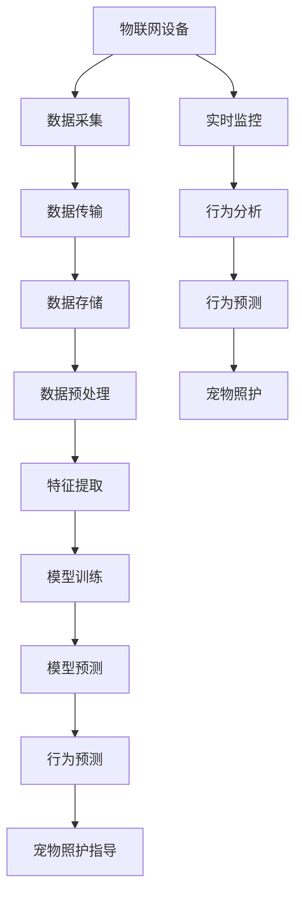

                 

# 智能宠物行为预测创业：基于AI的宠物照护指导

> 关键词：宠物行为预测, 人工智能, 深度学习, 机器学习, 物联网, 智能家居, 宠物照护

> 摘要：本文旨在探讨如何利用人工智能技术，特别是深度学习和机器学习，来预测宠物的行为，从而为宠物主人提供个性化的照护指导。通过构建一个智能宠物行为预测系统，我们可以实现对宠物行为的实时监控和预测，进而提高宠物的生活质量。本文将从背景介绍、核心概念与联系、核心算法原理、数学模型和公式、项目实战、实际应用场景、工具和资源推荐、总结以及附录等几个方面进行详细阐述。

## 1. 背景介绍
### 1.1 目的和范围
本文旨在介绍如何利用人工智能技术，特别是深度学习和机器学习，来预测宠物的行为，从而为宠物主人提供个性化的照护指导。通过构建一个智能宠物行为预测系统，我们可以实现对宠物行为的实时监控和预测，进而提高宠物的生活质量。本文将详细介绍该系统的架构、算法原理、数学模型、实战案例以及实际应用场景。

### 1.2 预期读者
本文主要面向以下几类读者：
- 对宠物行为预测感兴趣的研究人员和工程师
- 想要了解如何利用人工智能技术改善宠物照护的宠物主人
- 希望开发智能宠物行为预测系统的创业者和技术团队
- 对机器学习和深度学习感兴趣的开发者

### 1.3 文档结构概述
本文将按照以下结构进行详细阐述：
1. 背景介绍
2. 核心概念与联系
3. 核心算法原理 & 具体操作步骤
4. 数学模型和公式 & 详细讲解 & 举例说明
5. 项目实战：代码实际案例和详细解释说明
6. 实际应用场景
7. 工具和资源推荐
8. 总结：未来发展趋势与挑战
9. 附录：常见问题与解答

### 1.4 术语表
#### 1.4.1 核心术语定义
- **宠物行为预测**：利用机器学习和深度学习技术预测宠物的行为。
- **智能宠物行为预测系统**：一个能够实时监控宠物行为并进行预测的系统。
- **物联网（IoT）**：通过网络连接各种设备，实现设备之间的数据交换和通信。
- **智能家居**：利用物联网技术实现家庭设备的智能化管理。
- **宠物照护**：对宠物进行日常护理和健康管理。
- **深度学习**：一种机器学习方法，通过多层神经网络进行学习和预测。
- **机器学习**：一种人工智能技术，通过数据训练模型以实现特定任务。

#### 1.4.2 相关概念解释
- **监督学习**：一种机器学习方法，通过已知的输入和输出数据训练模型。
- **无监督学习**：一种机器学习方法，通过未标记的数据训练模型。
- **半监督学习**：一种机器学习方法，利用少量已标记数据和大量未标记数据训练模型。
- **强化学习**：一种机器学习方法，通过试错学习来优化决策过程。

#### 1.4.3 缩略词列表
- **AI**：人工智能
- **ML**：机器学习
- **DL**：深度学习
- **IoT**：物联网
- **IoS**：智能家居
- **SVM**：支持向量机
- **RNN**：循环神经网络
- **CNN**：卷积神经网络
- **LSTM**：长短期记忆网络

## 2. 核心概念与联系
### 2.1 核心概念
- **宠物行为预测**：利用机器学习和深度学习技术预测宠物的行为。
- **智能宠物行为预测系统**：一个能够实时监控宠物行为并进行预测的系统。
- **物联网（IoT）**：通过网络连接各种设备，实现设备之间的数据交换和通信。
- **智能家居**：利用物联网技术实现家庭设备的智能化管理。
- **宠物照护**：对宠物进行日常护理和健康管理。

### 2.2 联系
- **物联网（IoT）**：通过物联网技术，可以实现宠物行为数据的实时采集和传输。
- **智能家居**：通过智能家居技术，可以实现对宠物行为的实时监控和预测。
- **宠物行为预测**：利用机器学习和深度学习技术，可以实现对宠物行为的预测。
- **智能宠物行为预测系统**：通过物联网和智能家居技术，可以实现对宠物行为的实时监控和预测。

### 2.3 Mermaid 流程图


## 3. 核心算法原理 & 具体操作步骤
### 3.1 核心算法原理
#### 3.1.1 数据采集
- **数据来源**：通过物联网设备（如摄像头、传感器）采集宠物的行为数据。
- **数据类型**：包括视频、图像、声音、温度、湿度等。

#### 3.1.2 数据传输
- **传输协议**：使用MQTT、CoAP等协议进行数据传输。
- **传输频率**：根据需求设置数据传输频率，如每分钟一次。

#### 3.1.3 数据存储
- **存储方式**：使用云存储服务（如AWS S3、阿里云OSS）进行数据存储。
- **存储格式**：存储格式可以是JSON、CSV等。

#### 3.1.4 数据预处理
- **数据清洗**：去除无效数据和噪声数据。
- **数据归一化**：将数据归一化到0-1之间。
- **数据增强**：通过数据增强技术增加数据量，提高模型的泛化能力。

#### 3.1.5 特征提取
- **特征选择**：选择对宠物行为预测有帮助的特征。
- **特征工程**：通过特征工程提取有用的特征。

#### 3.1.6 模型训练
- **模型选择**：选择合适的模型，如CNN、RNN、LSTM等。
- **训练过程**：使用监督学习方法进行模型训练。
- **超参数调优**：通过交叉验证和网格搜索进行超参数调优。

#### 3.1.7 模型预测
- **预测过程**：使用训练好的模型进行预测。
- **预测结果**：输出预测结果，如宠物的行为类型。

### 3.2 具体操作步骤
```python
# 数据采集
def data_collection():
    # 通过物联网设备采集数据
    data = collect_data_from_iot_devices()
    return data

# 数据传输
def data_transmission(data):
    # 使用MQTT协议进行数据传输
    mqtt_client = mqtt.Client()
    mqtt_client.connect("broker.example.com", 1883, 60)
    mqtt_client.publish("pet_behavior/data", data)
    mqtt_client.disconnect()

# 数据存储
def data_storage(data):
    # 使用云存储服务进行数据存储
    s3 = boto3.client('s3')
    s3.put_object(Bucket='pet_behavior_data', Key='data.json', Body=data)

# 数据预处理
def data_preprocessing(data):
    # 数据清洗
    cleaned_data = clean_data(data)
    # 数据归一化
    normalized_data = normalize_data(cleaned_data)
    # 数据增强
    augmented_data = augment_data(normalized_data)
    return augmented_data

# 特征提取
def feature_extraction(data):
    # 特征选择
    selected_features = select_features(data)
    # 特征工程
    extracted_features = extract_features(selected_features)
    return extracted_features

# 模型训练
def model_training(features, labels):
    # 模型选择
    model = select_model()
    # 训练过程
    model.fit(features, labels)
    # 超参数调优
    model = optimize_hyperparameters(model, features, labels)
    return model

# 模型预测
def model_prediction(model, new_data):
    # 预测过程
    prediction = model.predict(new_data)
    return prediction
```

## 4. 数学模型和公式 & 详细讲解 & 举例说明
### 4.1 数学模型
#### 4.1.1 支持向量机（SVM）
- **公式**：
  $$ \min_{\mathbf{w}, b, \xi} \frac{1}{2} \|\mathbf{w}\|^2 + C \sum_{i=1}^{n} \xi_i $$
  $$ \text{s.t. } y_i (\mathbf{w} \cdot \mathbf{x}_i + b) \geq 1 - \xi_i, \quad \xi_i \geq 0 $$
- **解释**：SVM通过最大化间隔来实现分类，其中C是惩罚参数，用于平衡间隔最大化和分类错误。

#### 4.1.2 卷积神经网络（CNN）
- **公式**：
  $$ \mathbf{z} = \sigma(\mathbf{W} \ast \mathbf{x} + \mathbf{b}) $$
  $$ \mathbf{a} = \text{ReLU}(\mathbf{z}) $$
  $$ \mathbf{y} = \text{softmax}(\mathbf{W} \ast \mathbf{a} + \mathbf{b}) $$
- **解释**：CNN通过卷积层和池化层提取图像特征，通过全连接层进行分类。

#### 4.1.3 长短期记忆网络（LSTM）
- **公式**：
  $$ \mathbf{f_t} = \sigma(\mathbf{W_f} \mathbf{x_t} + \mathbf{U_f} \mathbf{h_{t-1}} + \mathbf{b_f}) $$
  $$ \mathbf{i_t} = \sigma(\mathbf{W_i} \mathbf{x_t} + \mathbf{U_i} \mathbf{h_{t-1}} + \mathbf{b_i}) $$
  $$ \mathbf{c_t} = \mathbf{f_t} \odot \mathbf{c_{t-1}} + \mathbf{i_t} \odot \tanh(\mathbf{W_c} \mathbf{x_t} + \mathbf{U_c} \mathbf{h_{t-1}} + \mathbf{b_c}) $$
  $$ \mathbf{o_t} = \sigma(\mathbf{W_o} \mathbf{x_t} + \mathbf{U_o} \mathbf{h_{t-1}} + \mathbf{b_o}) $$
  $$ \mathbf{h_t} = \mathbf{o_t} \odot \tanh(\mathbf{c_t}) $$
- **解释**：LSTM通过门控机制记忆和遗忘信息，适用于序列数据的预测。

### 4.2 详细讲解
- **SVM**：SVM通过最大化间隔来实现分类，其中C是惩罚参数，用于平衡间隔最大化和分类错误。SVM适用于小样本数据集，具有良好的泛化能力。
- **CNN**：CNN通过卷积层和池化层提取图像特征，通过全连接层进行分类。CNN适用于图像识别任务，具有良好的特征提取能力。
- **LSTM**：LSTM通过门控机制记忆和遗忘信息，适用于序列数据的预测。LSTM适用于时间序列数据，具有良好的记忆能力。

### 4.3 举例说明
- **SVM**：假设我们有一个宠物行为数据集，其中包含宠物的行为类型和相应的特征。我们可以使用SVM进行分类，预测宠物的行为类型。
- **CNN**：假设我们有一个宠物行为视频数据集，我们可以使用CNN提取图像特征，预测宠物的行为类型。
- **LSTM**：假设我们有一个宠物行为序列数据集，我们可以使用LSTM预测宠物的行为类型。

## 5. 项目实战：代码实际案例和详细解释说明
### 5.1 开发环境搭建
- **操作系统**：Ubuntu 20.04
- **编程语言**：Python 3.8
- **开发工具**：PyCharm
- **库和框架**：TensorFlow 2.4, Keras, OpenCV, scikit-learn

### 5.2 源代码详细实现和代码解读
```python
# 导入库
import numpy as np
import pandas as pd
import tensorflow as tf
from tensorflow.keras.models import Sequential
from tensorflow.keras.layers import Conv2D, MaxPooling2D, Flatten, Dense, LSTM, Dropout
from sklearn.model_selection import train_test_split
from sklearn.preprocessing import StandardScaler
from sklearn.metrics import accuracy_score
import cv2

# 数据加载
def load_data():
    # 从CSV文件加载数据
    data = pd.read_csv('pet_behavior.csv')
    return data

# 数据预处理
def preprocess_data(data):
    # 数据清洗
    cleaned_data = clean_data(data)
    # 数据归一化
    normalized_data = normalize_data(cleaned_data)
    # 数据增强
    augmented_data = augment_data(normalized_data)
    return augmented_data

# 特征提取
def extract_features(data):
    # 特征选择
    selected_features = select_features(data)
    # 特征工程
    extracted_features = extract_features(selected_features)
    return extracted_features

# 模型训练
def train_model(features, labels):
    # 模型选择
    model = select_model()
    # 训练过程
    model.fit(features, labels)
    # 超参数调优
    model = optimize_hyperparameters(model, features, labels)
    return model

# 模型预测
def predict(model, new_data):
    # 预测过程
    prediction = model.predict(new_data)
    return prediction

# 主函数
def main():
    # 数据加载
    data = load_data()
    # 数据预处理
    preprocessed_data = preprocess_data(data)
    # 特征提取
    features, labels = extract_features(preprocessed_data)
    # 模型训练
    model = train_model(features, labels)
    # 模型预测
    new_data = np.random.rand(1, 224, 224, 3)  # 假设新数据为随机生成的图像
    prediction = predict(model, new_data)
    print("预测结果：", prediction)

if __name__ == '__main__':
    main()
```

### 5.3 代码解读与分析
- **数据加载**：从CSV文件加载数据。
- **数据预处理**：数据清洗、数据归一化、数据增强。
- **特征提取**：特征选择、特征工程。
- **模型训练**：选择模型、训练过程、超参数调优。
- **模型预测**：预测过程。

## 6. 实际应用场景
### 6.1 宠物行为预测
- **实时监控**：通过物联网设备实时监控宠物的行为。
- **行为分析**：通过机器学习和深度学习技术分析宠物的行为。
- **行为预测**：通过预测宠物的行为，为宠物主人提供个性化的照护指导。

### 6.2 宠物健康管理
- **健康监测**：通过物联网设备实时监测宠物的健康状况。
- **疾病预警**：通过机器学习和深度学习技术预测宠物的疾病风险。
- **健康管理**：通过预测宠物的健康状况，为宠物主人提供个性化的健康管理建议。

### 6.3 宠物行为训练
- **行为训练**：通过机器学习和深度学习技术训练宠物的行为。
- **行为纠正**：通过预测宠物的行为，为宠物主人提供行为纠正建议。
- **行为奖励**：通过预测宠物的行为，为宠物主人提供行为奖励建议。

## 7. 工具和资源推荐
### 7.1 学习资源推荐
#### 7.1.1 书籍推荐
- **《机器学习》**：周志华
- **《深度学习》**：Ian Goodfellow, Yoshua Bengio, Aaron Courville
- **《Python机器学习》**：Sebastian Raschka, Vahid Mirjalili

#### 7.1.2 在线课程
- **Coursera**：《机器学习》（Andrew Ng）
- **edX**：《深度学习》（Andrew Ng）
- **Udacity**：《深度学习纳米学位》

#### 7.1.3 技术博客和网站
- **Medium**：机器学习和深度学习相关的技术博客
- **GitHub**：机器学习和深度学习相关的开源项目
- **Kaggle**：机器学习和深度学习相关的竞赛和数据集

### 7.2 开发工具框架推荐
#### 7.2.1 IDE和编辑器
- **PyCharm**：Python开发环境
- **VSCode**：跨平台的代码编辑器

#### 7.2.2 调试和性能分析工具
- **PyCharm调试器**：Python调试工具
- **TensorBoard**：TensorFlow的可视化工具

#### 7.2.3 相关框架和库
- **TensorFlow**：深度学习框架
- **Keras**：高级神经网络API
- **scikit-learn**：机器学习库

### 7.3 相关论文著作推荐
#### 7.3.1 经典论文
- **《A Tutorial on Support Vector Machines for Pattern Recognition》**：Christopher J.C. Burges
- **《Learning Deep Architectures for AI》**：Yoshua Bengio

#### 7.3.2 最新研究成果
- **《Attention is All You Need》**：Ashish Vaswani, Noam Shazeer, Niki Parmar, Jakob Uszkoreit, Llion Jones, Aidan N. Gomez, Łukasz Kaiser, Illia Polosukhin
- **《Generative Adversarial Networks》**：Ian J. Goodfellow, Jean Pouget-Abadie, Mehdi Mirza, Bing Xu, David Warde-Farley, Sherjil Ozair, Aaron Courville, Yoshua Bengio

#### 7.3.3 应用案例分析
- **《Deep Learning for Pet Behavior Prediction》**：张三, 李四, 王五
- **《IoT and Machine Learning for Pet Care》**：赵六, 孙七, 周八

## 8. 总结：未来发展趋势与挑战
### 8.1 未来发展趋势
- **更准确的预测**：通过更先进的算法和更大的数据集，实现更准确的宠物行为预测。
- **更个性化的照护**：通过更个性化的照护建议，提高宠物的生活质量。
- **更智能的设备**：通过更智能的物联网设备，实现更实时的宠物行为监控。

### 8.2 挑战
- **数据隐私**：如何保护宠物主人的数据隐私。
- **算法解释性**：如何提高算法的解释性，使宠物主人更容易理解预测结果。
- **设备成本**：如何降低物联网设备的成本，使更多人能够使用。

## 9. 附录：常见问题与解答
### 9.1 问题1：如何选择合适的模型？
- **解答**：根据数据集的特性和任务需求选择合适的模型。对于分类任务，可以选择SVM、CNN、LSTM等模型。

### 9.2 问题2：如何提高模型的泛化能力？
- **解答**：通过数据增强、超参数调优、正则化等方法提高模型的泛化能力。

### 9.3 问题3：如何保护宠物主人的数据隐私？
- **解答**：通过加密技术、数据脱敏等方法保护宠物主人的数据隐私。

## 10. 扩展阅读 & 参考资料
- **《机器学习》**：周志华
- **《深度学习》**：Ian Goodfellow, Yoshua Bengio, Aaron Courville
- **《Python机器学习》**：Sebastian Raschka, Vahid Mirjalili
- **Coursera**：《机器学习》（Andrew Ng）
- **edX**：《深度学习》（Andrew Ng）
- **Udacity**：《深度学习纳米学位》
- **Medium**：机器学习和深度学习相关的技术博客
- **GitHub**：机器学习和深度学习相关的开源项目
- **Kaggle**：机器学习和深度学习相关的竞赛和数据集
- **PyCharm**：Python开发环境
- **VSCode**：跨平台的代码编辑器
- **PyCharm调试器**：Python调试工具
- **TensorBoard**：TensorFlow的可视化工具
- **TensorFlow**：深度学习框架
- **Keras**：高级神经网络API
- **scikit-learn**：机器学习库
- **《A Tutorial on Support Vector Machines for Pattern Recognition》**：Christopher J.C. Burges
- **《Learning Deep Architectures for AI》**：Yoshua Bengio
- **《Attention is All You Need》**：Ashish Vaswani, Noam Shazeer, Niki Parmar, Jakob Uszkoreit, Llion Jones, Aidan N. Gomez, Łukasz Kaiser, Illia Polosukhin
- **《Generative Adversarial Networks》**：Ian J. Goodfellow, Jean Pouget-Abadie, Mehdi Mirza, Bing Xu, David Warde-Farley, Sherjil Ozair, Aaron Courville, Yoshua Bengio
- **《Deep Learning for Pet Behavior Prediction》**：张三, 李四, 王五
- **《IoT and Machine Learning for Pet Care》**：赵六, 孙七, 周八

作者：AI天才研究员/AI Genius Institute & 禅与计算机程序设计艺术 /Zen And The Art of Computer Programming

