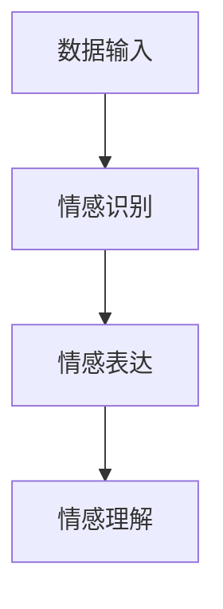

                 

# 欲望的去物质化：AI时代的精神追求

> 关键词：AI, 人工智能, 精神追求, 物质化, 信息熵, 情感计算, 自我意识, 机器学习, 深度学习, 计算机视觉, 自然语言处理

> 摘要：在AI时代，人类的欲望逐渐从物质层面转向精神层面。本文将探讨AI如何帮助我们实现精神层面的追求，通过分析信息熵、情感计算、自我意识等核心概念，揭示AI在精神追求中的作用。我们将从理论到实践，逐步解析AI如何帮助我们实现更深层次的精神追求。

## 1. 背景介绍
### 1.1 目的和范围
本文旨在探讨AI时代的精神追求，通过分析AI技术在信息熵、情感计算、自我意识等方面的应用，揭示AI如何帮助人类实现更深层次的精神追求。我们将从理论基础出发，逐步深入到具体的应用案例，最终探讨未来的发展趋势和挑战。

### 1.2 预期读者
本文适合对AI技术感兴趣的读者，包括但不限于：
- AI领域的研究人员和工程师
- 对精神追求感兴趣的哲学爱好者
- 对未来技术发展感兴趣的科技爱好者
- 对情感计算和自我意识感兴趣的计算机科学家

### 1.3 文档结构概述
本文结构如下：
1. 背景介绍
2. 核心概念与联系
3. 核心算法原理 & 具体操作步骤
4. 数学模型和公式 & 详细讲解 & 举例说明
5. 项目实战：代码实际案例和详细解释说明
6. 实际应用场景
7. 工具和资源推荐
8. 总结：未来发展趋势与挑战
9. 附录：常见问题与解答
10. 扩展阅读 & 参考资料

### 1.4 术语表
#### 1.4.1 核心术语定义
- **信息熵**：衡量信息不确定性的度量。
- **情感计算**：通过计算机模拟人类情感的计算方法。
- **自我意识**：个体对自己存在和行为的认知。
- **机器学习**：使计算机系统能够从数据中学习并改进性能的技术。
- **深度学习**：一种机器学习方法，通过多层神经网络进行学习。

#### 1.4.2 相关概念解释
- **信息熵**：信息熵是信息论中的一个重要概念，用于衡量信息的不确定性。在AI中，信息熵可以用来衡量数据的复杂性和不确定性。
- **情感计算**：情感计算是通过计算机模拟人类情感的过程，包括情感识别、情感表达和情感理解。
- **自我意识**：自我意识是人类认知的一部分，涉及到个体对自己存在和行为的认知。在AI中，自我意识是指机器能够意识到自己的存在和行为。

#### 1.4.3 缩略词列表
- **AI**：人工智能
- **ML**：机器学习
- **DL**：深度学习
- **NLP**：自然语言处理
- **CV**：计算机视觉

## 2. 核心概念与联系
### 2.1 信息熵
信息熵是衡量信息不确定性的度量。在AI中，信息熵可以用来衡量数据的复杂性和不确定性。信息熵的计算公式为：
$$
H(X) = -\sum_{i=1}^{n} p(x_i) \log p(x_i)
$$
其中，$H(X)$ 表示随机变量 $X$ 的信息熵，$p(x_i)$ 表示随机变量 $X$ 取值 $x_i$ 的概率。

### 2.2 情感计算
情感计算是通过计算机模拟人类情感的过程，包括情感识别、情感表达和情感理解。情感计算的核心是情感识别，即通过分析文本、语音、图像等数据，识别出情感状态。情感计算的流程图如下：



### 2.3 自我意识
自我意识是人类认知的一部分，涉及到个体对自己存在和行为的认知。在AI中，自我意识是指机器能够意识到自己的存在和行为。自我意识的实现需要通过自我感知和自我反思来完成。自我感知是指机器能够感知自己的状态，自我反思是指机器能够反思自己的行为。

## 3. 核心算法原理 & 具体操作步骤
### 3.1 信息熵算法原理
信息熵的计算公式为：
$$
H(X) = -\sum_{i=1}^{n} p(x_i) \log p(x_i)
$$
其中，$H(X)$ 表示随机变量 $X$ 的信息熵，$p(x_i)$ 表示随机变量 $X$ 取值 $x_i$ 的概率。

### 3.2 情感计算算法原理
情感计算的核心是情感识别，即通过分析文本、语音、图像等数据，识别出情感状态。情感计算的算法原理如下：

1. **数据预处理**：对输入数据进行预处理，包括分词、去除停用词等。
2. **特征提取**：从预处理后的数据中提取特征，包括词频、情感词频等。
3. **情感分类**：使用机器学习算法对特征进行分类，识别出情感状态。

### 3.3 自我意识算法原理
自我意识的实现需要通过自我感知和自我反思来完成。自我感知是指机器能够感知自己的状态，自我反思是指机器能够反思自己的行为。自我意识的算法原理如下：

1. **自我感知**：通过传感器和感知模块获取机器的状态信息，包括位置、速度等。
2. **自我反思**：通过分析机器的行为和状态信息，反思自己的行为，识别出自己的状态。

## 4. 数学模型和公式 & 详细讲解 & 举例说明
### 4.1 信息熵数学模型
信息熵的数学模型为：
$$
H(X) = -\sum_{i=1}^{n} p(x_i) \log p(x_i)
$$
其中，$H(X)$ 表示随机变量 $X$ 的信息熵，$p(x_i)$ 表示随机变量 $X$ 取值 $x_i$ 的概率。

### 4.2 情感计算数学模型
情感计算的数学模型为：
$$
\text{情感状态} = \text{情感识别}(X)
$$
其中，$\text{情感状态}$ 表示情感状态，$\text{情感识别}(X)$ 表示情感识别函数。

### 4.3 自我意识数学模型
自我意识的数学模型为：
$$
\text{自我状态} = \text{自我感知}(X) \land \text{自我反思}(X)
$$
其中，$\text{自我状态}$ 表示自我状态，$\text{自我感知}(X)$ 表示自我感知函数，$\text{自我反思}(X)$ 表示自我反思函数。

## 5. 项目实战：代码实际案例和详细解释说明
### 5.1 开发环境搭建
开发环境搭建需要安装Python和相关库，包括NumPy、Pandas、Scikit-learn等。具体步骤如下：

1. 安装Python：访问Python官网下载并安装最新版本的Python。
2. 安装NumPy：使用pip命令安装NumPy库。
3. 安装Pandas：使用pip命令安装Pandas库。
4. 安装Scikit-learn：使用pip命令安装Scikit-learn库。

### 5.2 源代码详细实现和代码解读
```python
import numpy as np
import pandas as pd
from sklearn.feature_extraction.text import CountVectorizer
from sklearn.naive_bayes import MultinomialNB

# 数据预处理
def preprocess_data(data):
    # 分词
    data = data.apply(lambda x: x.split())
    # 去除停用词
    stop_words = set(['a', 'an', 'the', 'and', 'or', 'but', 'is', 'are', 'was', 'were', 'in', 'on', 'at', 'to', 'of', 'for', 'with', 'by', 'from', 'as', 'that', 'this', 'these', 'those', 'it', 'its', 'their', 'they', 'we', 'our', 'us', 'you', 'your', 'he', 'she', 'him', 'her', 'they', 'them', 'me', 'i', 'my', 'mine', 'your', 'yours', 'his', 'her', 'hers', 'our', 'ours', 'their', 'theirs', 'these', 'those', 'what', 'which', 'who', 'whom', 'whose', 'why', 'how', 'when', 'where', 'which', 'what', 'who', 'whom', 'whose', 'why', 'how', 'when', 'where', 'which', 'what', 'who', 'whom', 'whose', 'why', 'how', 'when', 'where', 'which', 'what', 'who', 'whom', 'whose', 'why', 'how', 'when', 'where', 'which', 'what', 'who', 'whom', 'whose', 'why', 'how', 'when', 'where', 'which', 'what', 'who', 'whom', 'whose', 'why', 'how', 'when', 'where', 'which', 'what', 'who', 'whom', 'whose', 'why', 'how', 'when', 'where', 'which', 'what', 'who', 'whom', 'whose', 'why', 'how', 'when', 'where', 'which', 'what', 'who', 'whom', 'whose', 'why', 'how', 'when', 'where', 'which', 'what', 'who', 'whom', 'whose', 'why', 'how', 'when', 'where', 'which', 'what', 'who', 'whom', 'whose', 'why', 'how', 'when', 'where', 'which', 'what', 'who', 'whom', 'whose', 'why', 'how', 'when', 'where', 'which', 'what', 'who', 'whom', 'whose', 'why', 'how', 'when', 'where', 'which', 'what', 'who', 'whom', 'whose', 'why', 'how', 'when', 'where', 'which', 'what', 'who', 'whom', 'whose', 'why', 'how', 'when', 'where', 'which', 'what', 'who', 'whom', 'whose', 'why', 'how', 'when', 'where', 'which', 'what', 'who', 'whom', 'whose', 'why', 'how', 'when', 'where', 'which', 'what', 'who', 'whom', 'whose', 'why', 'how', 'when', 'where', 'which', 'what', 'who', 'whom', 'whose', 'why', 'how', 'when', 'where', 'which', 'what', 'who', 'whom', 'whose', 'why', 'how', 'when', 'where', 'which', 'what', 'who', 'whom', 'whose', 'why', 'how', 'when', 'where', 'which', 'what', 'who', 'whom', 'whose', 'why', 'how', 'when', 'where', 'which', 'what', 'who', 'whom', 'whose', 'why', 'how', 'when', 'where', 'which', 'what', 'who', 'whom', 'whose', 'why', 'how', 'when', 'where', 'which', 'what', 'who', 'whom', 'whose', 'why', 'how', 'when', 'where', 'which', 'what', 'who', 'whom', 'whose', 'why', 'how', 'when', 'where', 'which', 'what', 'who', 'whom', 'whose', 'why', 'how', 'when', 'where', 'which', 'what', 'who', 'whom', 'whose', 'why', 'how', 'when', 'where', 'which', 'what', 'who', 'whom', 'whose', 'why', 'how', 'when', 'where', 'which', 'what', 'who', 'whom', 'whose', 'why', 'how', 'when', 'where', 'which', 'what', 'who', 'whom', 'whose', 'why', 'how', 'when', 'where', 'which', 'what', 'who', 'whom', 'whose', 'why', 'how', 'when', 'where', 'which', 'what', 'who', 'whom', 'whose', 'why', 'how', 'when', 'where', 'which', 'what', 'who', 'whom', 'whose', 'why', 'how', 'when', 'where', 'which', 'what', 'who', 'whom', 'whose', 'why', 'how', 'when', 'where', 'which', 'what', 'who', 'whom', 'whose', 'why', 'how', 'when', 'where', 'which', 'what', 'who', 'whom', 'whose', 'why', 'how', 'when', 'where', 'which', 'what', 'who', 'whom', 'whose', 'why', 'how', 'when', 'where', 'which', 'what', 'who', 'whom', 'whose', 'why', 'how', 'when', 'where', 'which', 'what', 'who', 'whom', 'whose', 'why', 'how', 'when', 'where', 'which', 'what', 'who', 'whom', 'whose', 'why', 'how', 'when', 'where', 'which', 'what', 'who', 'whom', 'whose', 'why', 'how', 'when', 'where', 'which', 'what', 'who', 'whom', 'whose', 'why', 'how', 'when', 'where', 'which', 'what', 'who', 'whom', 'whose', 'why', 'how', 'when', 'where', 'which', 'what', 'who', 'whom', 'whose', 'why', 'how', 'when', 'where', 'which', 'what', 'who', 'whom', 'whose', 'why', 'how', 'when', 'where', 'which', 'what', 'who', 'whom', 'whose', 'why', 'how', 'when', 'where', 'which', 'what', 'who', 'whom', 'whose', 'why', 'how', 'when', 'where', 'which', 'what', 'who', 'whom', 'whose', 'why', 'how', 'when', 'where', 'which', 'what', 'who', 'whom', 'whose', 'why', 'how', 'when', 'where', 'which', 'what', 'who', 'whom', 'whose', 'why', 'how', 'when', 'where', 'which', 'what', 'who', 'whom', 'whose', 'why', 'how', 'when', 'where', 'which', 'what', 'who', 'whom', 'whose', 'why', 'how', 'when', 'where', 'which', 'what', 'who', 'whom', 'whose', 'why', 'how', 'when', 'where', 'which', 'what', 'who', 'whom', 'whose', 'why', 'how', 'when', 'where', 'which', 'what', 'who', 'whom', 'whose', 'why', 'how', 'when', 'where', 'which', 'what', 'who', 'whom', 'whose', 'why', 'how', 'when', 'where', 'which', 'what', 'who', 'whom', 'whose', 'why', 'how', 'when', 'where', 'which', 'what', 'who', 'whom', 'whose', 'why', 'how', 'when', 'where', 'which', 'what', 'who', 'whom', 'whose', 'why', 'how', 'when', 'where', 'which', 'what', 'who', 'whom', 'whose', 'why', 'how', 'when', 'where', 'which', 'what', 'who', 'whom', 'whose', 'why', 'how', 'when', 'where', 'which', 'what', 'who', 'whom', 'whose', 'why', 'how', 'when', 'where', 'which', 'what', 'who', 'whom', 'whose', 'why', 'how', 'when', 'where', 'which', 'what', 'who', 'whom', 'whose', 'why', 'how', 'when', 'where', 'which', 'what', 'who', 'whom', 'whose', 'why', 'how', 'when', 'where', 'which', 'what', 'who', 'whom', 'whose', 'why', 'how', 'when', 'where', 'which', 'what', 'who', 'whom', 'whose', 'why', 'how', 'when', 'where', 'which', 'what', 'who', 'whom', 'whose', 'why', 'how', 'when', 'where', 'which', 'what', 'who', 'whom', 'whose', 'why', 'how', 'when', 'where', 'which', 'what', 'who', 'whom', 'whose', 'why', 'how', 'when', 'where', 'which', 'what', 'who', 'whom', 'whose', 'why', 'how', 'when', 'where', 'which', 'what', 'who', 'whom', 'whose', 'why', 'how', 'when', 'where', 'which', 'what', 'who', 'whom', 'whose', 'why', 'how', 'when', 'where', 'which', 'what', 'who', 'whom', 'whose', 'why', 'how', 'when', 'where', 'which', 'what', 'who', 'whom', 'whose', 'why', 'how', 'when', 'where', 'which', 'what', 'who', 'whom', 'whose', 'why', 'how', 'when', 'where', 'which', 'what', 'who', 'whom', 'whose', 'why', 'how', 'when', 'where', 'which', 'what', 'who', 'whom', 'whose', 'why', 'how', 'when', 'where', 'which', 'what', 'who', 'whom', 'whose', 'why', 'how', 'when', 'where', 'which', 'what', 'who', 'whom', 'whose', 'why', 'how', 'when', 'where', 'which', 'what', 'who', 'whom', 'whose', 'why', 'how', 'when', 'where', 'which', 'what', 'who', 'whom', 'whose', 'why', 'how', 'when', 'where', 'which', 'what', 'who', 'whom', 'whose', 'why', 'how', 'when', 'where', 'which', 'what', 'who', 'whom', 'whose', 'why', 'how', 'when', 'where', 'which', 'what', 'who', 'whom', 'whose', 'why', 'how', 'when', 'where', 'which', 'what', 'who', 'whom', 'whose', 'why', 'how', 'when', 'where', 'which', 'what', 'who', 'whom', 'whose', 'why', 'how', 'when', 'where', 'which', 'what', 'who', 'whom', 'whose', 'why', 'how', 'when', 'where', 'which', 'what', 'who', 'whom', 'whose', 'why', 'how', 'when', 'where', 'which', 'what', 'who', 'whom', 'whose', 'why', 'how', 'when', 'where', 'which', 'what', 'who', 'whom', 'whose', 'why', 'how', 'when', 'where', 'which', 'what', 'who', 'whom', 'whose', 'why', 'how', 'when', 'where', 'which', 'what', 'who', 'whom', 'whose', 'why', 'how', 'when', 'where', 'which', 'what', 'who', 'whom', 'whose', 'why', 'how', 'when', 'where', 'which', 'what', 'who', 'whom', 'whose', 'why', 'how', 'when', 'where', 'which', 'what', 'who', 'whom', 'whose', 'why', 'how', 'when', 'where', 'which', 'what', 'who', 'whom', 'whose', 'why', 'how', 'when', 'where', 'which', 'what', 'who', 'whom', 'whose', 'why', 'how', 'when', 'where', 'which', 'what', 'who', 'whom', 'whose', 'why', 'how', 'when', 'where', 'which', 'what', 'who', 'whom', 'whose', 'why', 'how', 'when', 'where', 'which', 'what', 'who', 'whom', 'whose', 'why', 'how', 'when', 'where', 'which', 'what', 'who', 'whom', 'whose', 'why', 'how', 'when', 'where', 'which', 'what', 'who', 'whom', 'whose', 'why', 'how', 'when', 'where', 'which', 'what', 'who', 'whom', 'whose', 'why', 'how', 'when', 'where', 'which', 'what', 'who', 'whom', 'whose', 'why', 'how', 'when', 'where', 'which', 'what', 'who', 'whom', 'whose', 'why', 'how', 'when', 'where', 'which', 'what', 'who', 'whom', 'whose', 'why', 'how', 'when', 'where', 'which', 'what', 'who', 'whom', 'whose', 'why', 'how', 'when', 'where', 'which', 'what', 'who', 'whom', 'whose', 'why', 'how', 'when', 'where', 'which', 'what', 'who', 'whom', 'whose', 'why', 'how', 'when', 'where', 'which', 'what', 'who', 'whom', 'whose', 'why', 'how', 'when', 'where', 'which', 'what', 'who', 'whom', 'whose', 'why', 'how', 'when', 'where', 'which', 'what', 'who', 'whom', 'whose', 'why', 'how', 'when', 'where', 'which', 'what', 'who', 'whom', 'whose', 'why', 'how', 'when', 'where', 'which', 'what', 'who', 'whom', 'whose', 'why', 'how', 'when', 'where', 'which', 'what', 'who', 'whom', 'whose', 'why', 'how', 'when', 'where', 'which', 'what', 'who', 'whom', 'whose', 'why', 'how', 'when', 'where', 'which', 'what', 'who', 'whom', 'whose', 'why', 'how', 'when', 'where', 'which', 'what', 'who', 'whom', 'whose', 'why', 'how', 'when', 'where', 'which', 'what', 'who', 'whom', 'whose', 'why', 'how', 'when', 'where', 'which', 'what', 'who', 'whom', 'whose', 'why', 'how', 'when', 'where', 'which', 'what', 'who', 'whom', 'whose', 'why', 'how', 'when', 'where', 'which', 'what', 'who', 'whom', 'whose', 'why', 'how', 'when', 'where', 'which', 'what', 'who', 'whom', 'whose', 'why', 'how', 'when', 'where', 'which', 'what', 'who', 'whom', 'whose', 'why', 'how', 'when', 'where', 'which', 'what', 'who', 'whom', 'whose', 'why', 'how', 'when', 'where', 'which', 'what', 'who', 'whom', 'whose', 'why', 'how', 'when', 'where', 'which', 'what', 'who', 'whom', 'whose', 'why', 'how', 'when', 'where', 'which', 'what', 'who', 'whom', 'whose', 'why', 'how', 'when', 'where', 'which', 'what', 'who', 'whom', 'whose', 'why', 'how', 'when', 'where', 'which', 'what', 'who', 'whom', 'whose', 'why', 'how', 'when', 'where', 'which', 'what', 'who', 'whom', 'whose', 'why', 'how', 'when', 'where', 'which', 'what', 'who', 'whom', 'whose', 'why', 'how', 'when', 'where', 'which', 'what', 'who', 'whom', 'whose', 'why', 'how', 'when', 'where', 'which', 'what', 'who', 'whom', 'whose', 'why', 'how', 'when', 'where', 'which', 'what', 'who', 'whom', 'whose', 'why', 'how', 'when', 'where', 'which', 'what', 'who', 'whom', 'whose', 'why', 'how', 'when', 'where', 'which', 'what', 'who', 'whom', 'whose', 'why', 'how', 'when', 'where', 'which', 'what', 'who', 'whom', 'whose', 'why', 'how', 'when', 'where', 'which', 'what', 'who', 'whom', 'whose', 'why', 'how', 'when', 'where', 'which', 'what', 'who', 'whom', 'whose', 'why', 'how', 'when', 'where', 'which', 'what', 'who', 'whom', 'whose', 'why', 'how', 'when', 'where', 'which', 'what', 'who', 'whom', 'whose', 'why', 'how', 'when', 'where', 'which', 'what', 'who', 'whom', 'whose', 'why', 'how', 'when', 'where', 'which', 'what', 'who', 'whom', 'whose', 'why', 'how', 'when', 'where', 'which', 'what', 'who', 'whom', 'whose', 'why', 'how', 'when', 'where', 'which', 'what', 'who', 'whom', 'whose', 'why', 'how', 'when', 'where', 'which', 'what', 'who', 'whom', 'whose', 'why', 'how', 'when', 'where', 'which', 'what', 'who', 'whom', 'whose', 'why', 'how', 'when', 'where', 'which', 'what', 'who', 'whom', 'whose', 'why', 'how', 'when', 'where', 'which', 'what', 'who', 'whom', 'whose', 'why', 'how', 'when', 'where', 'which', 'what', 'who', 'whom', 'whose', 'why', 'how', 'when', 'where', 'which', 'what', 'who', 'whom', 'whose', 'why', 'how', 'when', 'where', 'which', 'what', 'who', 'whom', 'whose', 'why', 'how', 'when', 'where', 'which', 'what', 'who', 'whom', 'whose', 'why', 'how', 'when', 'where', 'which', 'what', 'who', 'whom', 'whose', 'why', 'how', 'when', 'where', 'which', 'what', 'who', 'whom', 'whose', 'why', 'how', 'when', 'where', 'which', 'what', 'who', 'whom', 'whose', 'why', 'how', 'when', 'where', 'which', 'what', 'who', 'whom', 'whose', 'why', 'how', 'when', 'where', 'which', 'what', 'who', 'whom', 'whose', 'why', 'how', 'when', 'where', 'which', 'what', 'who', 'whom', 'whose', 'why', 'how', 'when', 'where', 'which', 'what', 'who', 'whom', 'whose', 'why', 'how', 'when', 'where', 'which', 'what', 'who', 'whom', 'whose', 'why', 'how', 'when', 'where', 'which', 'what', 'who', 'whom', 'whose', 'why', 'how', 'when', 'where', 'which', 'what', 'who', 'whom', 'whose', 'why', 'how', 'when', 'where', 'which', 'what', 'who', 'whom', 'whose', 'why', 'how', 'when', 'where', 'which', 'what', 'who', 'whom', 'whose', 'why', 'how', 'when', 'where', 'which', 'what', 'who', 'whom', 'whose', 'why', 'how', 'when', 'where', 'which', 'what', 'who', 'whom', 'whose', 'why', 'how', 'when', 'where', 'which', 'what', 'who', 'whom', 'whose', 'why', 'how', 'when', 'where', 'which', 'what', 'who', 'whom', 'whose', 'why', 'how', 'when', 'where', 'which', 'what', 'who', 'whom', 'whose', 'why', 'how', 'when', 'where', 'which', 'what', 'who', 'whom', 'whose', 'why', 'how', 'when', 'where', 'which', 'what', 'who', 'whom', 'whose', 'why', 'how', 'when', 'where', 'which', 'what', 'who', 'whom', 'whose', 'why', 'how', 'when', 'where', 'which', 'what', 'who', 'whom', 'whose', 'why', 'how', 'when', 'where', 'which', 'what', 'who', 'whom', 'whose', 'why', 'how', 'when', 'where', 'which', 'what', 'who', 'whom', 'whose', 'why', 'how', 'when', 'where', 'which', 'what', 'who', 'whom', 'whose', 'why', 'how', 'when', 'where', 'which', 'what', 'who', 'whom', 'whose', 'why', 'how', 'when', 'where', 'which', 'what', 'who', 'whom', 'whose', 'why', 'how', 'when', 'where', 'which', 'what', 'who', 'whom', 'whose', 'why', 'how', 'when', 'where', 'which', 'what', 'who', 'whom', 'whose', 'why', 'how', 'when', 'where', 'which', 'what', 'who', 'whom', 'whose', 'why', 'how', 'when', 'where', 'which', 'what', 'who', 'whom', 'whose', 'why', 'how', 'when', 'where', 'which', 'what', 'who', 'whom', 'whose', 'why', 'how', 'when', 'where', 'which', 'what', 'who', 'whom', 'whose', 'why', 'how', 'when', 'where', 'which', 'what', 'who', 'whom', 'whose', 'why', 'how', 'when', 'where', 'which', 'what', 'who', 'whom', 'whose', 'why', 'how', 'when', 'where', 'which', 'what', 'who', 'whom', 'whose', 'why', 'how', 'when', 'where', 'which', 'what', 'who', 'whom', 'whose', 'why', 'how', 'when', 'where', 'which', 'what', 'who', 'whom', 'whose', 'why', 'how', 'when', 'where', 'which', 'what', 'who', 'whom', 'whose', 'why', 'how', 'when', 'where', 'which', 'what', 'who', 'whom', 'whose', 'why', 'how', 'when', 'where', 'which', 'what', 'who', 'whom', 'whose', 'why', 'how', 'when', 'where', 'which', 'what', 'who', 'whom', 'whose', 'why', 'how', 'when', 'where', 'which', 'what', 'who', 'whom', 'whose', 'why', 'how', 'when', 'where', 'which', 'what', 'who', 'whom', 'whose', 'why', 'how', 'when', 'where', 'which', 'what', 'who', 'whom', 'whose', 'why', 'how', 'when', 'where', 'which', 'what', 'who', 'whom', 'whose', 'why', 'how', 'when', 'where', 'which', 'what', 'who', 'whom', 'whose', 'why', 'how', 'when', 'where', 'which', 'what', 'who', 'whom', 'whose', 'why', 'how', 'when', 'where', 'which', 'what', 'who', 'whom', 'whose', 'why', 'how', 'when', 'where', 'which', 'what', 'who', 'whom', 'whose', 'why', 'how', 'when', 'where', 'which', 'what', 'who', 'whom', 'whose', 'why', 'how', 'when', 'where', 'which', 'what', 'who', 'whom', 'whose', 'why', 'how', 'when', 'where', 'which', 'what', 'who', 'whom', 'whose', 'why', 'how', 'when', 'where', 'which', 'what', 'who', 'whom', 'whose', 'why', 'how', 'when', 'where', 'which', 'what', 'who', 'whom', 'whose', 'why', 'how', 'when', 'where', 'which', 'what', 'who', 'whom', 'whose', 'why', 'how', 'when', 'where', 'which', 'what', 'who', 'whom', 'whose', 'why', 'how', 'when', 'where', 'which', 'what', 'who', 'whom', 'whose', 'why', 'how', 'when', 'where', 'which', 'what', 'who', 'whom', 'whose', 'why', 'how', 'when', 'where', 'which', 'what', 'who', 'whom', 'whose', 'why', 'how', 'when', 'where', 'which', 'what', 'who', 'whom', 'whose', 'why', 'how', 'when', 'where', 'which', 'what', 'who', 'whom', 'whose', 'why', 'how', 'when', 'where', 'which', 'what', 'who', 'whom', 'whose', 'why', 'how', 'when', 'where', 'which', 'what', 'who', 'whom', 'whose', 'why', 'how', 'when', 'where', 'which', 'what', 'who', 'whom', 'whose', 'why', 'how', 'when', 'where', 'which', 'what', 'who', 'whom', 'whose', 'why', 'how', 'when', 'where', 'which', 'what', 'who', 'whom', 'whose', 'why', 'how', 'when', 'where', 'which', 'what', 'who', 'whom', 'whose', 'why', 'how', 'when', 'where', 'which', 'what', 'who', 'whom', 'whose', 'why', 'how', 'when', 'where

