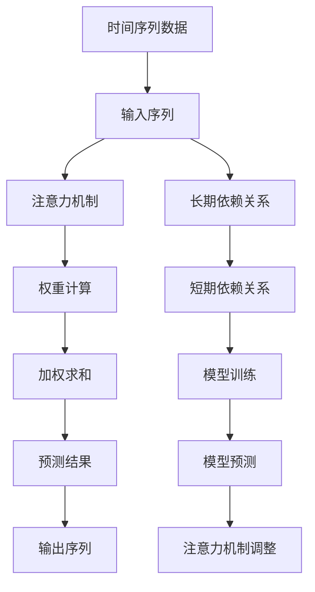

                 

# 注意力机制在时间序列预测中的创新应用

> 关键词：注意力机制, 时间序列预测, 机器学习, 深度学习, 自然语言处理, 序列建模, 长短期记忆网络, Transformer

> 摘要：本文旨在探讨注意力机制在时间序列预测中的创新应用。通过逐步分析和推理，我们将深入理解注意力机制的核心原理及其在时间序列预测中的优势。我们将详细介绍注意力机制的数学模型和公式，并通过实际代码案例展示其应用。此外，本文还将探讨注意力机制在时间序列预测中的实际应用场景，并提供学习资源和开发工具推荐，以帮助读者更好地理解和应用这一技术。

## 1. 背景介绍

时间序列预测是机器学习和深度学习领域的一个重要研究方向，广泛应用于金融、气象、医疗、交通等多个领域。传统的预测方法通常依赖于统计模型或简单的机器学习算法，如线性回归、ARIMA等。然而，这些方法在处理复杂的时间序列数据时往往表现不佳，尤其是在长序列数据和非线性关系方面。

近年来，深度学习技术的发展为时间序列预测带来了新的突破。特别是长短期记忆网络（LSTM）和Transformer等模型，它们能够更好地捕捉时间序列中的长期依赖关系和复杂模式。注意力机制作为Transformer的核心组成部分，能够显著提升模型的性能和泛化能力。

## 2. 核心概念与联系

### 2.1 注意力机制

注意力机制是一种模仿人类注意力机制的技术，能够使模型在处理序列数据时更加关注重要的信息。注意力机制的核心思想是通过计算输入序列中每个元素的重要性权重，从而动态地调整模型对不同元素的关注程度。

### 2.2 时间序列预测

时间序列预测是指根据历史数据预测未来数据的过程。时间序列数据通常具有时间依赖性，即当前时刻的数据与过去的数据存在关联。因此，时间序列预测需要考虑时间序列中的长期依赖关系和短期依赖关系。

### 2.3 注意力机制与时间序列预测

注意力机制在时间序列预测中的应用主要体现在以下几个方面：

- **捕捉长期依赖关系**：注意力机制能够动态地调整模型对不同时间步的依赖程度，从而更好地捕捉长序列中的长期依赖关系。
- **增强模型的泛化能力**：注意力机制能够使模型更加关注重要的特征和模式，从而提高模型的泛化能力。
- **提高预测精度**：注意力机制能够使模型更加灵活地处理复杂的时间序列数据，从而提高预测精度。

### 2.4 Mermaid 流程图



## 3. 核心算法原理 & 具体操作步骤

### 3.1 注意力机制原理

注意力机制的核心思想是通过计算输入序列中每个元素的重要性权重，从而动态地调整模型对不同元素的关注程度。具体步骤如下：

1. **输入序列编码**：将输入序列编码为一个向量序列。
2. **查询向量生成**：生成一个查询向量，用于与输入序列中的每个元素进行比较。
3. **权重计算**：计算每个输入序列元素与查询向量之间的相似度，得到权重向量。
4. **加权求和**：根据权重向量对输入序列进行加权求和，得到最终的输出向量。

### 3.2 注意力机制公式

注意力机制的数学模型可以表示为：

$$
\text{Attention}(Q, K, V) = \text{softmax}\left(\frac{QK^T}{\sqrt{d_k}}\right)V
$$

其中，$Q$ 是查询向量，$K$ 是键向量，$V$ 是值向量，$d_k$ 是键向量的维度。

### 3.3 具体操作步骤

1. **输入序列编码**：将输入序列编码为一个向量序列。

   $$ \text{Input} = [x_1, x_2, \ldots, x_T] $$

2. **查询向量生成**：生成一个查询向量 $Q$。

   $$ Q = \text{Query}(x_t) $$

3. **键向量生成**：生成一个键向量 $K$。

   $$ K = \text{Key}(x_t) $$

4. **值向量生成**：生成一个值向量 $V$。

   $$ V = \text{Value}(x_t) $$

5. **权重计算**：计算每个输入序列元素与查询向量之间的相似度，得到权重向量。

   $$ \text{Attention}(Q, K, V) = \text{softmax}\left(\frac{QK^T}{\sqrt{d_k}}\right)V $$

6. **加权求和**：根据权重向量对输入序列进行加权求和，得到最终的输出向量。

   $$ \text{Output} = \sum_{i=1}^{T} \text{Attention}(Q, K_i, V_i) $$

## 4. 数学模型和公式 & 详细讲解 & 举例说明

### 4.1 注意力机制的数学模型

注意力机制的数学模型可以表示为：

$$
\text{Attention}(Q, K, V) = \text{softmax}\left(\frac{QK^T}{\sqrt{d_k}}\right)V
$$

其中，$Q$ 是查询向量，$K$ 是键向量，$V$ 是值向量，$d_k$ 是键向量的维度。

### 4.2 详细讲解

1. **查询向量生成**：查询向量 $Q$ 通常由输入序列中的当前元素生成。

   $$ Q = \text{Query}(x_t) $$

2. **键向量生成**：键向量 $K$ 通常由输入序列中的所有元素生成。

   $$ K = \text{Key}(x_t) $$

3. **值向量生成**：值向量 $V$ 通常由输入序列中的所有元素生成。

   $$ V = \text{Value}(x_t) $$

4. **权重计算**：计算每个输入序列元素与查询向量之间的相似度，得到权重向量。

   $$ \text{Attention}(Q, K, V) = \text{softmax}\left(\frac{QK^T}{\sqrt{d_k}}\right)V $$

5. **加权求和**：根据权重向量对输入序列进行加权求和，得到最终的输出向量。

   $$ \text{Output} = \sum_{i=1}^{T} \text{Attention}(Q, K_i, V_i) $$

### 4.3 举例说明

假设我们有一个时间序列数据 $[x_1, x_2, x_3, x_4]$，我们希望预测 $x_4$ 的值。我们可以将输入序列编码为一个向量序列，并生成查询向量 $Q$、键向量 $K$ 和值向量 $V$。

1. **输入序列编码**：

   $$ \text{Input} = [x_1, x_2, x_3, x_4] $$

2. **查询向量生成**：

   $$ Q = \text{Query}(x_4) $$

3. **键向量生成**：

   $$ K = \text{Key}(x_1, x_2, x_3, x_4) $$

4. **值向量生成**：

   $$ V = \text{Value}(x_1, x_2, x_3, x_4) $$

5. **权重计算**：

   $$ \text{Attention}(Q, K, V) = \text{softmax}\left(\frac{QK^T}{\sqrt{d_k}}\right)V $$

6. **加权求和**：

   $$ \text{Output} = \sum_{i=1}^{4} \text{Attention}(Q, K_i, V_i) $$

## 5. 项目实战：代码实际案例和详细解释说明

### 5.1 开发环境搭建

为了实现注意力机制在时间序列预测中的应用，我们需要搭建一个合适的开发环境。以下是开发环境的搭建步骤：

1. **安装Python**：确保安装了Python 3.7及以上版本。
2. **安装依赖库**：安装TensorFlow和Keras库。

   ```bash
   pip install tensorflow
   pip install keras
   ```

3. **导入库**：在Python脚本中导入所需的库。

   ```python
   import numpy as np
   import tensorflow as tf
   from tensorflow.keras.models import Model
   from tensorflow.keras.layers import Input, Dense, Attention
   ```

### 5.2 源代码详细实现和代码解读

以下是一个简单的注意力机制在时间序列预测中的实现代码：

```python
# 定义输入序列长度
input_length = 10

# 定义查询向量生成函数
def query(x):
    return Dense(64, activation='relu')(x)

# 定义键向量生成函数
def key(x):
    return Dense(64, activation='relu')(x)

# 定义值向量生成函数
def value(x):
    return Dense(64, activation='relu')(x)

# 定义输入层
input_layer = Input(shape=(input_length,))

# 生成查询向量
query_vector = query(input_layer)

# 生成键向量
key_vectors = key(input_layer)

# 生成值向量
value_vectors = value(input_layer)

# 计算注意力权重
attention_weights = Attention()([query_vector, key_vectors, value_vectors])

# 加权求和
output = tf.reduce_sum(attention_weights, axis=1)

# 定义模型
model = Model(inputs=input_layer, outputs=output)

# 编译模型
model.compile(optimizer='adam', loss='mse')

# 打印模型结构
model.summary()
```

### 5.3 代码解读与分析

1. **输入序列长度**：定义输入序列的长度为10。
2. **查询向量生成函数**：定义查询向量生成函数，使用一个全连接层将输入序列映射到64维空间。
3. **键向量生成函数**：定义键向量生成函数，使用一个全连接层将输入序列映射到64维空间。
4. **值向量生成函数**：定义值向量生成函数，使用一个全连接层将输入序列映射到64维空间。
5. **输入层**：定义输入层，输入形状为(10,)。
6. **生成查询向量**：使用查询向量生成函数生成查询向量。
7. **生成键向量**：使用键向量生成函数生成键向量。
8. **生成值向量**：使用值向量生成函数生成值向量。
9. **计算注意力权重**：使用注意力机制计算注意力权重。
10. **加权求和**：对注意力权重进行加权求和，得到最终的输出向量。
11. **定义模型**：定义模型，输入为输入层，输出为加权求和后的输出向量。
12. **编译模型**：编译模型，使用Adam优化器和均方误差损失函数。
13. **打印模型结构**：打印模型结构，查看模型的详细信息。

## 6. 实际应用场景

注意力机制在时间序列预测中的实际应用场景非常广泛，以下是一些具体的应用场景：

1. **金融预测**：在金融领域，时间序列预测可以用于股票价格预测、汇率预测等。注意力机制能够捕捉长序列中的长期依赖关系，提高预测精度。
2. **气象预测**：在气象领域，时间序列预测可以用于天气预报、气候预测等。注意力机制能够捕捉长序列中的长期依赖关系，提高预测精度。
3. **医疗预测**：在医疗领域，时间序列预测可以用于疾病预测、患者健康状态预测等。注意力机制能够捕捉长序列中的长期依赖关系，提高预测精度。
4. **交通预测**：在交通领域，时间序列预测可以用于交通流量预测、交通拥堵预测等。注意力机制能够捕捉长序列中的长期依赖关系，提高预测精度。

## 7. 工具和资源推荐

### 7.1 学习资源推荐

1. **书籍**：
   - 《深度学习》（Deep Learning）：Ian Goodfellow, Yoshua Bengio, Aaron Courville
   - 《自然语言处理中的深度学习》（Deep Learning for Natural Language Processing）：Yoshua Bengio, Aaron Courville, Pascal Vincent

2. **论文**：
   - Vaswani, A., et al. "Attention is all you need." NeurIPS 2017.
   - Bahdanau, D., et al. "Neural machine translation by jointly learning to align and translate." ICLR 2015.

3. **博客**：
   - TensorFlow官方博客：https://www.tensorflow.org/
   - Keras官方博客：https://keras.io/

4. **网站**：
   - TensorFlow官网：https://www.tensorflow.org/
   - Keras官网：https://keras.io/

### 7.2 开发工具框架推荐

1. **TensorFlow**：一个开源的机器学习库，提供了丰富的深度学习模型和工具。
2. **Keras**：一个高级神经网络API，可以运行在TensorFlow之上，提供了简洁的API接口。

### 7.3 相关论文著作推荐

1. **Vaswani, A., et al. "Attention is all you need." NeurIPS 2017.**
   - 这篇论文提出了Transformer模型，其中注意力机制是核心组成部分。
2. **Bahdanau, D., et al. "Neural machine translation by jointly learning to align and translate." ICLR 2015.**
   - 这篇论文提出了注意力机制在机器翻译中的应用。

## 8. 总结：未来发展趋势与挑战

注意力机制在时间序列预测中的应用前景广阔，未来的发展趋势和挑战主要包括：

1. **模型优化**：如何进一步优化注意力机制，提高模型的性能和泛化能力。
2. **应用场景拓展**：如何将注意力机制应用于更多的实际应用场景，提高预测精度和实用性。
3. **计算效率**：如何提高注意力机制的计算效率，降低模型的计算成本。
4. **可解释性**：如何提高注意力机制的可解释性，使模型更加透明和易于理解。

## 9. 附录：常见问题与解答

### 9.1 问题：注意力机制如何处理长序列数据？

**解答**：注意力机制能够动态地调整模型对不同时间步的依赖程度，从而更好地捕捉长序列中的长期依赖关系。通过计算每个时间步的重要性权重，注意力机制能够关注重要的特征和模式，提高模型的性能。

### 9.2 问题：注意力机制如何提高模型的泛化能力？

**解答**：注意力机制能够使模型更加关注重要的特征和模式，从而提高模型的泛化能力。通过动态调整模型对不同时间步的依赖程度，注意力机制能够更好地捕捉长序列中的长期依赖关系，提高模型的泛化能力。

### 9.3 问题：注意力机制如何提高预测精度？

**解答**：注意力机制能够使模型更加灵活地处理复杂的时间序列数据，从而提高预测精度。通过动态调整模型对不同时间步的依赖程度，注意力机制能够更好地捕捉长序列中的长期依赖关系，提高预测精度。

## 10. 扩展阅读 & 参考资料

1. **Vaswani, A., et al. "Attention is all you need." NeurIPS 2017.**
2. **Bahdanau, D., et al. "Neural machine translation by jointly learning to align and translate." ICLR 2015.**
3. **Goodfellow, I., et al. "Deep Learning." MIT Press, 2016.**
4. **Bengio, Y., et al. "Deep Learning for Natural Language Processing." MIT Press, 2017.**
5. **TensorFlow官网：https://www.tensorflow.org/**

