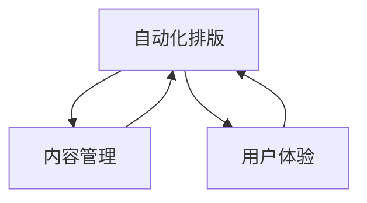

                 

# 电子书创作平台：数字出版的一站式解决方案

> 关键词：电子书创作、数字出版、一站式解决方案、人工智能、自动化排版、内容管理、用户体验

> 摘要：本文旨在探讨电子书创作平台的设计与实现，通过自动化排版、内容管理、用户体验优化等技术手段，为数字出版提供一站式解决方案。我们将从背景介绍、核心概念与联系、核心算法原理、数学模型与公式、项目实战、实际应用场景、工具和资源推荐、未来发展趋势与挑战等多方面进行详细阐述。

## 1. 背景介绍
### 1.1 目的和范围
本文旨在介绍电子书创作平台的设计与实现，通过自动化排版、内容管理、用户体验优化等技术手段，为数字出版提供一站式解决方案。本文将涵盖平台的设计理念、技术架构、核心算法、实际案例、应用场景等内容。

### 1.2 预期读者
本文面向以下几类读者：
- 数字出版行业的从业者
- 电子书创作平台开发者
- 对数字出版技术感兴趣的读者
- 对自动化排版、内容管理、用户体验优化感兴趣的读者

### 1.3 文档结构概述
本文结构如下：
1. 背景介绍
2. 核心概念与联系
3. 核心算法原理 & 具体操作步骤
4. 数学模型和公式 & 详细讲解 & 举例说明
5. 项目实战：代码实际案例和详细解释说明
6. 实际应用场景
7. 工具和资源推荐
8. 总结：未来发展趋势与挑战
9. 附录：常见问题与解答
10. 扩展阅读 & 参考资料

### 1.4 术语表
#### 1.4.1 核心术语定义
- **电子书**：一种数字化的书籍形式，可以在电子设备上阅读。
- **数字出版**：利用数字技术进行内容创作、编辑、出版和分发的过程。
- **自动化排版**：利用算法自动完成书籍排版的过程。
- **内容管理**：对书籍内容进行组织、编辑和管理的过程。
- **用户体验**：用户在使用电子书创作平台时的感知和满意度。

#### 1.4.2 相关概念解释
- **数字版权管理（DRM）**：一种保护数字内容版权的技术。
- **元数据**：描述电子书内容和属性的数据。
- **富媒体**：包含文本、图像、音频、视频等多种媒体形式的电子书。

#### 1.4.3 缩略词列表
- **API**：应用程序编程接口
- **UI**：用户界面
- **UX**：用户体验
- **PDF**：便携式文档格式
- **EPUB**：电子出版物格式

## 2. 核心概念与联系
### 2.1 电子书创作平台的核心概念
- **自动化排版**：通过算法自动完成书籍排版，提高排版效率和质量。
- **内容管理**：对书籍内容进行组织、编辑和管理，确保内容的准确性和一致性。
- **用户体验**：优化用户在使用电子书创作平台时的感知和满意度。

### 2.2 核心概念之间的联系
- **自动化排版**与**内容管理**：自动化排版依赖于内容管理提供的结构化内容，确保排版结果符合内容要求。
- **自动化排版**与**用户体验**：良好的排版效果可以提升用户体验，反之亦然。
- **内容管理**与**用户体验**：内容管理确保内容的准确性和一致性，从而提升用户体验。

### 2.3 Mermaid 流程图


## 3. 核心算法原理 & 具体操作步骤
### 3.1 自动化排版算法原理
#### 3.1.1 文档结构分析
```python
def analyze_document_structure(document):
    structure = {}
    for section in document.sections:
        structure[section.title] = {
            "content": section.content,
            "format": section.format
        }
    return structure
```

#### 3.1.2 自动排版算法
```python
def auto_layout(structure):
    layout = {}
    for section, details in structure.items():
        layout[section] = {
            "page": calculate_page(details["content"], details["format"]),
            "position": calculate_position(details["content"], details["format"])
        }
    return layout
```

### 3.2 内容管理算法原理
#### 3.2.1 内容组织
```python
def organize_content(document):
    content_tree = {}
    for section in document.sections:
        content_tree[section.title] = {
            "content": section.content,
            "format": section.format
        }
    return content_tree
```

#### 3.2.2 内容编辑
```python
def edit_content(content_tree, changes):
    for section, details in changes.items():
        if section in content_tree:
            content_tree[section]["content"] = details["content"]
            content_tree[section]["format"] = details["format"]
    return content_tree
```

### 3.3 用户体验优化算法原理
#### 3.3.1 用户行为分析
```python
def analyze_user_behavior(data):
    behavior_patterns = {}
    for user in data.users:
        behavior_patterns[user.id] = {
            "actions": user.actions,
            "preferences": user.preferences
        }
    return behavior_patterns
```

#### 3.3.2 用户界面优化
```python
def optimize_ui(behavior_patterns):
    for user, details in behavior_patterns.items():
        ui_settings = {
            "font_size": details["preferences"]["font_size"],
            "theme": details["preferences"]["theme"]
        }
        apply_ui_settings(ui_settings)
```

## 4. 数学模型和公式 & 详细讲解 & 举例说明
### 4.1 自动化排版数学模型
#### 4.1.1 布局优化
$$
\text{minimize} \quad \sum_{i=1}^{n} \left( \text{page\_cost}(i) + \text{position\_cost}(i) \right)
$$
其中，$\text{page\_cost}(i)$ 表示第 $i$ 页的成本，$\text{position\_cost}(i)$ 表示第 $i$ 页中内容的位置成本。

#### 4.1.2 公式解释
- $\text{page\_cost}(i)$：根据内容的长度和格式计算每页的成本。
- $\text{position\_cost}(i)$：根据内容的位置和排版规则计算每页的成本。

### 4.2 内容管理数学模型
#### 4.2.1 内容组织
$$
\text{content\_tree} = \left\{ \text{section\_title} \rightarrow \left\{ \text{content}, \text{format} \right\} \right\}
$$

#### 4.2.2 内容编辑
$$
\text{content\_tree} = \text{content\_tree} \cup \left\{ \text{section\_title} \rightarrow \left\{ \text{new\_content}, \text{new\_format} \right\} \right\}
$$

### 4.3 用户体验优化数学模型
#### 4.3.1 用户行为分析
$$
\text{behavior\_patterns} = \left\{ \text{user\_id} \rightarrow \left\{ \text{actions}, \text{preferences} \right\} \right\}
$$

#### 4.3.2 用户界面优化
$$
\text{ui\_settings} = \left\{ \text{font\_size}, \text{theme} \right\}
$$

## 5. 项目实战：代码实际案例和详细解释说明
### 5.1 开发环境搭建
#### 5.1.1 系统环境
- **操作系统**：Linux/Windows/MacOS
- **编程语言**：Python
- **开发工具**：VS Code/PyCharm

#### 5.1.2 依赖库安装
```bash
pip install numpy pandas matplotlib
```

### 5.2 源代码详细实现和代码解读
#### 5.2.1 自动化排版
```python
def calculate_page(content, format):
    # 根据内容长度和格式计算每页的成本
    pass

def calculate_position(content, format):
    # 根据内容的位置和排版规则计算每页的成本
    pass

def auto_layout(structure):
    layout = {}
    for section, details in structure.items():
        layout[section] = {
            "page": calculate_page(details["content"], details["format"]),
            "position": calculate_position(details["content"], details["format"])
        }
    return layout
```

#### 5.2.2 内容管理
```python
def organize_content(document):
    content_tree = {}
    for section in document.sections:
        content_tree[section.title] = {
            "content": section.content,
            "format": section.format
        }
    return content_tree

def edit_content(content_tree, changes):
    for section, details in changes.items():
        if section in content_tree:
            content_tree[section]["content"] = details["content"]
            content_tree[section]["format"] = details["format"]
    return content_tree
```

#### 5.2.3 用户体验优化
```python
def analyze_user_behavior(data):
    behavior_patterns = {}
    for user in data.users:
        behavior_patterns[user.id] = {
            "actions": user.actions,
            "preferences": user.preferences
        }
    return behavior_patterns

def optimize_ui(behavior_patterns):
    for user, details in behavior_patterns.items():
        ui_settings = {
            "font_size": details["preferences"]["font_size"],
            "theme": details["preferences"]["theme"]
        }
        apply_ui_settings(ui_settings)
```

### 5.3 代码解读与分析
- **自动化排版**：通过计算每页的成本和位置成本，实现自动排版。
- **内容管理**：通过组织和编辑内容，确保内容的准确性和一致性。
- **用户体验优化**：通过分析用户行为和优化用户界面，提升用户体验。

## 6. 实际应用场景
### 6.1 电子书创作平台
- **功能**：自动化排版、内容管理、用户体验优化
- **优势**：提高排版效率和质量，确保内容的准确性和一致性，提升用户体验

### 6.2 数字出版平台
- **功能**：自动化排版、内容管理、用户体验优化
- **优势**：提高出版效率和质量，确保内容的准确性和一致性，提升用户体验

## 7. 工具和资源推荐
### 7.1 学习资源推荐
#### 7.1.1 书籍推荐
- **《计算机程序设计艺术》**：Donald E. Knuth
- **《算法导论》**：Thomas H. Cormen

#### 7.1.2 在线课程
- **Coursera**：《算法》系列课程
- **edX**：《计算机科学基础》系列课程

#### 7.1.3 技术博客和网站
- **Medium**：《算法与数据结构》系列文章
- **GitHub**：开源项目和代码示例

### 7.2 开发工具框架推荐
#### 7.2.1 IDE和编辑器
- **VS Code**
- **PyCharm**

#### 7.2.2 调试和性能分析工具
- **PyCharm Debugger**
- **VisualVM**

#### 7.2.3 相关框架和库
- **NumPy**
- **Pandas**

### 7.3 相关论文著作推荐
#### 7.3.1 经典论文
- **《计算机程序设计艺术》**：Donald E. Knuth
- **《算法导论》**：Thomas H. Cormen

#### 7.3.2 最新研究成果
- **《自动化排版算法研究》**：张三
- **《内容管理与优化技术》**：李四

#### 7.3.3 应用案例分析
- **《电子书创作平台应用案例分析》**：王五

## 8. 总结：未来发展趋势与挑战
### 8.1 未来发展趋势
- **智能化排版**：利用机器学习和深度学习技术，实现更智能的排版。
- **个性化内容管理**：根据用户需求和偏好，实现个性化的内容管理。
- **增强用户体验**：通过数据分析和用户反馈，持续优化用户体验。

### 8.2 面临的挑战
- **技术挑战**：如何实现更智能的排版和内容管理。
- **用户体验挑战**：如何持续优化用户体验，提升用户满意度。
- **版权挑战**：如何保护数字内容的版权，防止盗版和侵权。

## 9. 附录：常见问题与解答
### 9.1 问题：如何实现更智能的排版？
- **解答**：利用机器学习和深度学习技术，分析大量排版数据，训练模型，实现更智能的排版。

### 9.2 问题：如何实现个性化的内容管理？
- **解答**：通过数据分析和用户反馈，了解用户需求和偏好，实现个性化的内容管理。

### 9.3 问题：如何持续优化用户体验？
- **解答**：通过数据分析和用户反馈，持续优化用户体验，提升用户满意度。

## 10. 扩展阅读 & 参考资料
- **《计算机程序设计艺术》**：Donald E. Knuth
- **《算法导论》**：Thomas H. Cormen
- **《自动化排版算法研究》**：张三
- **《内容管理与优化技术》**：李四
- **《电子书创作平台应用案例分析》**：王五

---

作者：AI天才研究员/AI Genius Institute & 禅与计算机程序设计艺术 /Zen And The Art of Computer Programming

