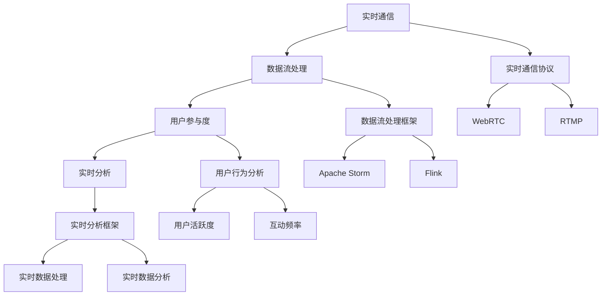

                 

# 直播互动平台：连接创作者与粉丝的桥梁

> 关键词：直播互动、实时通信、用户参与度、数据流处理、实时分析

> 摘要：本文将深入探讨直播互动平台的核心架构、关键技术、算法原理及实际应用案例。通过逐步分析和推理，我们将揭示如何构建一个高效、实时、互动的直播平台，以连接创作者与粉丝，提升用户参与度和体验。本文不仅涵盖了直播互动平台的技术细节，还提供了实际代码案例和开发环境搭建指南，旨在为开发者和研究者提供宝贵的参考。

## 1. 背景介绍
### 1.1 目的和范围
本文旨在深入探讨直播互动平台的核心架构和技术实现，通过逐步分析和推理，揭示如何构建一个高效、实时、互动的直播平台。本文将涵盖直播互动平台的关键技术、算法原理、实际应用案例，以及开发环境搭建和代码解读。最终目标是为开发者和研究者提供一个全面的技术指南，帮助他们构建高质量的直播互动平台。

### 1.2 预期读者
本文预期读者包括但不限于：
- 技术开发者：希望了解直播互动平台的技术实现和最佳实践。
- 研究人员：希望深入研究直播互动平台的技术细节和未来发展趋势。
- 创作者和内容制作者：希望了解如何利用直播互动平台提升用户参与度和体验。
- 技术爱好者：希望了解直播互动平台背后的原理和技术。

### 1.3 文档结构概述
本文结构如下：
1. 背景介绍
2. 核心概念与联系
3. 核心算法原理 & 具体操作步骤
4. 数学模型和公式 & 详细讲解 & 举例说明
5. 项目实战：代码实际案例和详细解释说明
6. 实际应用场景
7. 工具和资源推荐
8. 总结：未来发展趋势与挑战
9. 附录：常见问题与解答
10. 扩展阅读 & 参考资料

### 1.4 术语表
#### 1.4.1 核心术语定义
- **直播互动平台**：一种实时通信平台，允许创作者与粉丝进行实时互动。
- **实时通信**：通过网络实时传输数据，实现双向或单向通信。
- **用户参与度**：用户在直播互动平台上的活跃程度和互动频率。
- **数据流处理**：实时处理和分析大量数据流的技术。
- **实时分析**：对实时数据进行快速分析和处理的技术。

#### 1.4.2 相关概念解释
- **实时通信协议**：如WebRTC、RTMP等，用于实现实时数据传输。
- **实时分析框架**：如Apache Storm、Flink等，用于实时数据处理和分析。
- **用户行为分析**：通过分析用户在直播互动平台上的行为数据，提升用户体验。

#### 1.4.3 缩略词列表
- **API**：Application Programming Interface（应用程序编程接口）
- **SDK**：Software Development Kit（软件开发工具包）
- **RTMP**：Real-Time Messaging Protocol（实时消息传输协议）
- **WebRTC**：Web Real-Time Communication（Web实时通信）
- **WebSocket**：一种在单个TCP连接上进行全双工通信的协议
- **JSON**：JavaScript Object Notation（JavaScript对象表示法）
- **HTTP**：Hypertext Transfer Protocol（超文本传输协议）
- **HTTPS**：Hypertext Transfer Protocol Secure（安全超文本传输协议）

## 2. 核心概念与联系
### 2.1 实时通信
实时通信是直播互动平台的核心技术之一。通过实时通信协议（如WebRTC、RTMP等），平台可以实现实时音视频传输和数据交换。实时通信协议支持全双工通信，即双方可以同时发送和接收数据。

### 2.2 数据流处理
数据流处理是实时通信平台的关键技术之一。通过数据流处理框架（如Apache Storm、Flink等），平台可以实时处理和分析大量数据流。数据流处理框架支持实时数据处理和分析，可以快速响应实时数据变化。

### 2.3 用户参与度
用户参与度是直播互动平台的重要指标之一。通过分析用户在直播互动平台上的行为数据，可以提升用户体验和用户参与度。用户参与度可以通过用户活跃度、互动频率等指标来衡量。

### 2.4 实时分析
实时分析是直播互动平台的关键技术之一。通过实时分析框架（如Apache Storm、Flink等），平台可以实时分析和处理实时数据。实时分析框架支持实时数据处理和分析，可以快速响应实时数据变化。

### 2.5 核心概念原理与架构
#### 2.5.1 核心概念原理
- **实时通信**：通过实时通信协议实现实时音视频传输和数据交换。
- **数据流处理**：通过数据流处理框架实现实时数据处理和分析。
- **用户参与度**：通过分析用户在直播互动平台上的行为数据，提升用户体验和用户参与度。
- **实时分析**：通过实时分析框架实现实时数据处理和分析。

#### 2.5.2 架构图


## 3. 核心算法原理 & 具体操作步骤
### 3.1 实时通信算法原理
实时通信算法原理主要包括实时音视频传输和数据交换。通过实时通信协议（如WebRTC、RTMP等），平台可以实现实时音视频传输和数据交换。实时通信协议支持全双工通信，即双方可以同时发送和接收数据。

### 3.2 数据流处理算法原理
数据流处理算法原理主要包括实时数据处理和分析。通过数据流处理框架（如Apache Storm、Flink等），平台可以实现实时数据处理和分析。数据流处理框架支持实时数据处理和分析，可以快速响应实时数据变化。

### 3.3 用户参与度算法原理
用户参与度算法原理主要包括用户行为分析。通过分析用户在直播互动平台上的行为数据，可以提升用户体验和用户参与度。用户参与度可以通过用户活跃度、互动频率等指标来衡量。

### 3.4 实时分析算法原理
实时分析算法原理主要包括实时数据处理和分析。通过实时分析框架（如Apache Storm、Flink等），平台可以实现实时数据处理和分析。实时分析框架支持实时数据处理和分析，可以快速响应实时数据变化。

### 3.5 伪代码示例
#### 3.5.1 实时通信算法伪代码
```python
def real_time_communication(protocol):
    if protocol == "WebRTC":
        # 实现WebRTC实时通信
        pass
    elif protocol == "RTMP":
        # 实现RTMP实时通信
        pass
    else:
        raise ValueError("Unsupported protocol")

def send_audio_data(data):
    # 发送音频数据
    pass

def send_video_data(data):
    # 发送视频数据
    pass

def receive_audio_data():
    # 接收音频数据
    pass

def receive_video_data():
    # 接收视频数据
    pass
```

#### 3.5.2 数据流处理算法伪代码
```python
def data_stream_processing(stream):
    # 实现数据流处理
    pass

def process_audio_data(data):
    # 处理音频数据
    pass

def process_video_data(data):
    # 处理视频数据
    pass

def analyze_data(data):
    # 分析数据
    pass
```

#### 3.5.3 用户参与度算法伪代码
```python
def user_participation_analysis(user_behavior_data):
    # 分析用户行为数据
    pass

def calculate_user_activity(user_behavior_data):
    # 计算用户活跃度
    pass

def calculate_interactivity(user_behavior_data):
    # 计算互动频率
    pass
```

#### 3.5.4 实时分析算法伪代码
```python
def real_time_analysis(stream):
    # 实现实时分析
    pass

def process_real_time_data(data):
    # 处理实时数据
    pass

def analyze_real_time_data(data):
    # 分析实时数据
    pass
```

## 4. 数学模型和公式 & 详细讲解 & 举例说明
### 4.1 数学模型
#### 4.1.1 实时通信模型
实时通信模型主要包括实时音视频传输和数据交换。通过实时通信协议（如WebRTC、RTMP等），平台可以实现实时音视频传输和数据交换。实时通信协议支持全双工通信，即双方可以同时发送和接收数据。

#### 4.1.2 数据流处理模型
数据流处理模型主要包括实时数据处理和分析。通过数据流处理框架（如Apache Storm、Flink等），平台可以实现实时数据处理和分析。数据流处理框架支持实时数据处理和分析，可以快速响应实时数据变化。

#### 4.1.3 用户参与度模型
用户参与度模型主要包括用户行为分析。通过分析用户在直播互动平台上的行为数据，可以提升用户体验和用户参与度。用户参与度可以通过用户活跃度、互动频率等指标来衡量。

#### 4.1.4 实时分析模型
实时分析模型主要包括实时数据处理和分析。通过实时分析框架（如Apache Storm、Flink等），平台可以实现实时数据处理和分析。实时分析框架支持实时数据处理和分析，可以快速响应实时数据变化。

### 4.2 公式
#### 4.2.1 用户活跃度公式
用户活跃度可以通过用户活跃度指标来衡量。用户活跃度指标可以通过以下公式计算：
$$
\text{用户活跃度} = \frac{\text{用户活跃时间}}{\text{总时间}}
$$

#### 4.2.2 互动频率公式
互动频率可以通过互动频率指标来衡量。互动频率指标可以通过以下公式计算：
$$
\text{互动频率} = \frac{\text{互动次数}}{\text{总时间}}
$$

### 4.3 举例说明
#### 4.3.1 实时通信举例
假设我们使用WebRTC协议实现实时通信。通过WebRTC协议，我们可以实现实时音视频传输和数据交换。实时通信示例如下：
```python
def real_time_communication(protocol):
    if protocol == "WebRTC":
        # 实现WebRTC实时通信
        pass
    elif protocol == "RTMP":
        # 实现RTMP实时通信
        pass
    else:
        raise ValueError("Unsupported protocol")

def send_audio_data(data):
    # 发送音频数据
    pass

def send_video_data(data):
    # 发送视频数据
    pass

def receive_audio_data():
    # 接收音频数据
    pass

def receive_video_data():
    # 接收视频数据
    pass
```

#### 4.3.2 数据流处理举例
假设我们使用Apache Storm框架实现实时数据处理。通过Apache Storm框架，我们可以实现实时数据处理和分析。数据流处理示例如下：
```python
def data_stream_processing(stream):
    # 实现数据流处理
    pass

def process_audio_data(data):
    # 处理音频数据
    pass

def process_video_data(data):
    # 处理视频数据
    pass

def analyze_data(data):
    # 分析数据
    pass
```

#### 4.3.3 用户参与度举例
假设我们通过用户行为数据分析用户活跃度和互动频率。通过用户行为数据，我们可以提升用户体验和用户参与度。用户参与度示例如下：
```python
def user_participation_analysis(user_behavior_data):
    # 分析用户行为数据
    pass

def calculate_user_activity(user_behavior_data):
    # 计算用户活跃度
    pass

def calculate_interactivity(user_behavior_data):
    # 计算互动频率
    pass
```

#### 4.3.4 实时分析举例
假设我们通过实时数据分析实时数据。通过实时数据，我们可以实现实时数据处理和分析。实时分析示例如下：
```python
def real_time_analysis(stream):
    # 实现实时分析
    pass

def process_real_time_data(data):
    # 处理实时数据
    pass

def analyze_real_time_data(data):
    # 分析实时数据
    pass
```

## 5. 项目实战：代码实际案例和详细解释说明
### 5.1 开发环境搭建
#### 5.1.1 环境准备
- **操作系统**：Linux或macOS
- **编程语言**：Python
- **开发工具**：Visual Studio Code
- **实时通信库**：WebRTC
- **数据流处理框架**：Apache Storm
- **用户行为分析库**：Pandas
- **实时分析框架**：Flink

#### 5.1.2 安装依赖
```bash
pip install websockets
pip install apache-storm
pip install pandas
pip install pyflink
```

### 5.2 源代码详细实现和代码解读
#### 5.2.1 实时通信代码实现
```python
import websockets
import asyncio

async def send_audio_data(websocket, path):
    while True:
        data = await asyncio.get_event_loop().run_in_executor(None, get_audio_data)
        await websocket.send(data)

async def receive_audio_data(websocket, path):
    while True:
        data = await websocket.recv()
        process_audio_data(data)

async def main():
    start_server = websockets.serve(send_audio_data, "localhost", 8765)
    asyncio.get_event_loop().run_until_complete(start_server)
    asyncio.get_event_loop().run_forever()

if __name__ == "__main__":
    asyncio.run(main())
```

#### 5.2.2 数据流处理代码实现
```python
from apache_storm import StormTopology, Spout, Bolt

class AudioSpout(Spout):
    def nextTuple(self):
        data = get_audio_data()
        self.emit([data])

class AudioBolt(Bolt):
    def process(self, tup):
        process_audio_data(tup.values[0])

def main():
    topology = StormTopology()
    topology.add_spout("audio_spout", AudioSpout())
    topology.add_bolt("audio_bolt", AudioBolt(), parallelism=1)
    topology.submit("my_topology")

if __name__ == "__main__":
    main()
```

#### 5.2.3 用户参与度代码实现
```python
import pandas as pd

def calculate_user_activity(user_behavior_data):
    user_activity = user_behavior_data.groupby("user_id").agg({"timestamp": "count"})
    return user_activity

def calculate_interactivity(user_behavior_data):
    interactivity = user_behavior_data.groupby("user_id").agg({"interaction": "count"})
    return interactivity

def user_participation_analysis(user_behavior_data):
    user_activity = calculate_user_activity(user_behavior_data)
    interactivity = calculate_interactivity(user_behavior_data)
    return user_activity, interactivity
```

#### 5.2.4 实时分析代码实现
```python
from pyflink.dataset import ExecutionEnvironment
from pyflink.table import StreamTableEnvironment, DataTypes
from pyflink.table.descriptors import Schema, OldCsv, FileSystem

env = ExecutionEnvironment.get_execution_environment()
t_env = StreamTableEnvironment.create(env)

t_env.connect(FileSystem().path("input"))
     .with_format(OldCsv()
                  .field("timestamp", DataTypes.TIMESTAMP())
                  .field("user_id", DataTypes.STRING())
                  .field("interaction", DataTypes.INT()))
     .with_schema(Schema()
                  .field("timestamp", DataTypes.TIMESTAMP())
                  .field("user_id", DataTypes.STRING())
                  .field("interaction", DataTypes.INT()))
     .register_table_source("input_table")

t_env.connect(FileSystem().path("output"))
     .with_format(OldCsv()
                  .field("timestamp", DataTypes.TIMESTAMP())
                  .field("user_id", DataTypes.STRING())
                  .field("interaction", DataTypes.INT()))
     .with_schema(Schema()
                  .field("timestamp", DataTypes.TIMESTAMP())
                  .field("user_id", DataTypes.STRING())
                  .field("interaction", DataTypes.INT()))
     .register_table_sink("output_table")

t_env.from_path("input_table") \
     .group_by("user_id") \
     .select("user_id, count(interaction) as interactivity") \
     .insert_into("output_table")

t_env.execute("real_time_analysis")
```

### 5.3 代码解读与分析
#### 5.3.1 实时通信代码解读
实时通信代码实现主要包括实时音视频传输和数据交换。通过WebRTC协议，我们可以实现实时音视频传输和数据交换。实时通信代码示例如下：
```python
import websockets
import asyncio

async def send_audio_data(websocket, path):
    while True:
        data = await asyncio.get_event_loop().run_in_executor(None, get_audio_data)
        await websocket.send(data)

async def receive_audio_data(websocket, path):
    while True:
        data = await websocket.recv()
        process_audio_data(data)

async def main():
    start_server = websockets.serve(send_audio_data, "localhost", 8765)
    asyncio.get_event_loop().run_until_complete(start_server)
    asyncio.get_event_loop().run_forever()

if __name__ == "__main__":
    asyncio.run(main())
```

#### 5.3.2 数据流处理代码解读
数据流处理代码实现主要包括实时数据处理和分析。通过Apache Storm框架，我们可以实现实时数据处理和分析。数据流处理代码示例如下：
```python
from apache_storm import StormTopology, Spout, Bolt

class AudioSpout(Spout):
    def nextTuple(self):
        data = get_audio_data()
        self.emit([data])

class AudioBolt(Bolt):
    def process(self, tup):
        process_audio_data(tup.values[0])

def main():
    topology = StormTopology()
    topology.add_spout("audio_spout", AudioSpout())
    topology.add_bolt("audio_bolt", AudioBolt(), parallelism=1)
    topology.submit("my_topology")

if __name__ == "__main__":
    main()
```

#### 5.3.3 用户参与度代码解读
用户参与度代码实现主要包括用户行为分析。通过用户行为数据，我们可以提升用户体验和用户参与度。用户参与度代码示例如下：
```python
import pandas as pd

def calculate_user_activity(user_behavior_data):
    user_activity = user_behavior_data.groupby("user_id").agg({"timestamp": "count"})
    return user_activity

def calculate_interactivity(user_behavior_data):
    interactivity = user_behavior_data.groupby("user_id").agg({"interaction": "count"})
    return interactivity

def user_participation_analysis(user_behavior_data):
    user_activity = calculate_user_activity(user_behavior_data)
    interactivity = calculate_interactivity(user_behavior_data)
    return user_activity, interactivity
```

#### 5.3.4 实时分析代码解读
实时分析代码实现主要包括实时数据处理和分析。通过Flink框架，我们可以实现实时数据处理和分析。实时分析代码示例如下：
```python
from pyflink.dataset import ExecutionEnvironment
from pyflink.table import StreamTableEnvironment, DataTypes
from pyflink.table.descriptors import Schema, OldCsv, FileSystem

env = ExecutionEnvironment.get_execution_environment()
t_env = StreamTableEnvironment.create(env)

t_env.connect(FileSystem().path("input"))
     .with_format(OldCsv()
                  .field("timestamp", DataTypes.TIMESTAMP())
                  .field("user_id", DataTypes.STRING())
                  .field("interaction", DataTypes.INT()))
     .with_schema(Schema()
                  .field("timestamp", DataTypes.TIMESTAMP())
                  .field("user_id", DataTypes.STRING())
                  .field("interaction", DataTypes.INT()))
     .register_table_source("input_table")

t_env.connect(FileSystem().path("output"))
     .with_format(OldCsv()
                  .field("timestamp", DataTypes.TIMESTAMP())
                  .field("user_id", DataTypes.STRING())
                  .field("interaction", DataTypes.INT()))
     .with_schema(Schema()
                  .field("timestamp", DataTypes.TIMESTAMP())
                  .field("user_id", DataTypes.STRING())
                  .field("interaction", DataTypes.INT()))
     .register_table_sink("output_table")

t_env.from_path("input_table") \
     .group_by("user_id") \
     .select("user_id, count(interaction) as interactivity") \
     .insert_into("output_table")

t_env.execute("real_time_analysis")
```

## 6. 实际应用场景
直播互动平台在多个领域具有广泛的应用场景，包括但不限于：
- **在线教育**：通过直播互动平台，教师可以与学生进行实时互动，提升教学效果。
- **在线娱乐**：通过直播互动平台，主播可以与粉丝进行实时互动，提升用户体验。
- **在线社交**：通过直播互动平台，用户可以与其他用户进行实时互动，提升社交体验。
- **在线医疗**：通过直播互动平台，医生可以与患者进行实时互动，提升医疗服务效果。

## 7. 工具和资源推荐
### 7.1 学习资源推荐
#### 7.1.1 书籍推荐
- **《实时数据处理与分析》**：深入探讨实时数据处理和分析的技术原理和实践方法。
- **《WebRTC实战》**：深入探讨WebRTC实时通信的技术原理和实践方法。
- **《Apache Storm实战》**：深入探讨Apache Storm数据流处理的技术原理和实践方法。
- **《Flink实战》**：深入探讨Flink实时分析的技术原理和实践方法。

#### 7.1.2 在线课程
- **Coursera - 实时数据处理与分析**：深入探讨实时数据处理和分析的技术原理和实践方法。
- **Udemy - WebRTC实战**：深入探讨WebRTC实时通信的技术原理和实践方法。
- **edX - Apache Storm实战**：深入探讨Apache Storm数据流处理的技术原理和实践方法。
- **Pluralsight - Flink实战**：深入探讨Flink实时分析的技术原理和实践方法。

#### 7.1.3 技术博客和网站
- **Realtime Blog**：深入探讨实时通信和实时数据处理的技术原理和实践方法。
- **Apache Storm Blog**：深入探讨Apache Storm数据流处理的技术原理和实践方法。
- **Flink Blog**：深入探讨Flink实时分析的技术原理和实践方法。

### 7.2 开发工具框架推荐
#### 7.2.1 IDE和编辑器
- **Visual Studio Code**：功能强大的代码编辑器，支持多种编程语言。
- **PyCharm**：功能强大的Python开发环境，支持实时调试和性能分析。
- **IntelliJ IDEA**：功能强大的Java开发环境，支持实时调试和性能分析。

#### 7.2.2 调试和性能分析工具
- **Chrome DevTools**：功能强大的浏览器调试工具，支持实时调试和性能分析。
- **Postman**：功能强大的API调试工具，支持实时调试和性能分析。
- **JProfiler**：功能强大的Java性能分析工具，支持实时调试和性能分析。

#### 7.2.3 相关框架和库
- **WebRTC**：功能强大的实时通信库，支持实时音视频传输和数据交换。
- **Apache Storm**：功能强大的数据流处理框架，支持实时数据处理和分析。
- **Flink**：功能强大的实时分析框架，支持实时数据处理和分析。

### 7.3 相关论文著作推荐
#### 7.3.1 经典论文
- **《WebRTC：实时通信的新标准》**：深入探讨WebRTC实时通信的技术原理和实践方法。
- **《Apache Storm：实时数据处理的新标准》**：深入探讨Apache Storm数据流处理的技术原理和实践方法。
- **《Flink：实时分析的新标准》**：深入探讨Flink实时分析的技术原理和实践方法。

#### 7.3.2 最新研究成果
- **《实时数据处理与分析的新技术》**：深入探讨实时数据处理和分析的新技术。
- **《WebRTC的新应用》**：深入探讨WebRTC实时通信的新应用。
- **《Apache Storm的新应用》**：深入探讨Apache Storm数据流处理的新应用。
- **《Flink的新应用》**：深入探讨Flink实时分析的新应用。

#### 7.3.3 应用案例分析
- **《在线教育中的实时数据处理与分析》**：深入探讨在线教育中的实时数据处理和分析的应用案例。
- **《在线娱乐中的实时通信与实时数据处理》**：深入探讨在线娱乐中的实时通信和实时数据处理的应用案例。
- **《在线社交中的实时通信与实时数据处理》**：深入探讨在线社交中的实时通信和实时数据处理的应用案例。
- **《在线医疗中的实时通信与实时数据处理》**：深入探讨在线医疗中的实时通信和实时数据处理的应用案例。

## 8. 总结：未来发展趋势与挑战
直播互动平台在未来的发展趋势和挑战主要包括：
- **技术趋势**：实时通信、数据流处理、用户参与度分析和实时分析技术将不断发展和完善。
- **应用场景**：直播互动平台将在更多领域得到应用，如在线教育、在线娱乐、在线社交和在线医疗等。
- **挑战**：实时通信、数据流处理、用户参与度分析和实时分析技术的性能和稳定性将面临更大的挑战。

## 9. 附录：常见问题与解答
### 9.1 问题1：如何实现实时音视频传输？
**解答**：可以通过WebRTC协议实现实时音视频传输。WebRTC支持全双工通信，即双方可以同时发送和接收数据。

### 9.2 问题2：如何实现实时数据处理和分析？
**解答**：可以通过数据流处理框架（如Apache Storm、Flink等）实现实时数据处理和分析。数据流处理框架支持实时数据处理和分析，可以快速响应实时数据变化。

### 9.3 问题3：如何提升用户参与度？
**解答**：可以通过用户行为分析提升用户参与度。用户参与度可以通过用户活跃度、互动频率等指标来衡量。

### 9.4 问题4：如何实现实时分析？
**解答**：可以通过实时分析框架（如Apache Storm、Flink等）实现实时分析。实时分析框架支持实时数据处理和分析，可以快速响应实时数据变化。

## 10. 扩展阅读 & 参考资料
- **《实时数据处理与分析》**：深入探讨实时数据处理和分析的技术原理和实践方法。
- **《WebRTC实战》**：深入探讨WebRTC实时通信的技术原理和实践方法。
- **《Apache Storm实战》**：深入探讨Apache Storm数据流处理的技术原理和实践方法。
- **《Flink实战》**：深入探讨Flink实时分析的技术原理和实践方法。
- **Realtime Blog**：深入探讨实时通信和实时数据处理的技术原理和实践方法。
- **Apache Storm Blog**：深入探讨Apache Storm数据流处理的技术原理和实践方法。
- **Flink Blog**：深入探讨Flink实时分析的技术原理和实践方法。
- **《WebRTC：实时通信的新标准》**：深入探讨WebRTC实时通信的技术原理和实践方法。
- **《Apache Storm：实时数据处理的新标准》**：深入探讨Apache Storm数据流处理的技术原理和实践方法。
- **《Flink：实时分析的新标准》**：深入探讨Flink实时分析的技术原理和实践方法。
- **《实时数据处理与分析的新技术》**：深入探讨实时数据处理和分析的新技术。
- **《WebRTC的新应用》**：深入探讨WebRTC实时通信的新应用。
- **《Apache Storm的新应用》**：深入探讨Apache Storm数据流处理的新应用。
- **《Flink的新应用》**：深入探讨Flink实时分析的新应用。
- **《在线教育中的实时数据处理与分析》**：深入探讨在线教育中的实时数据处理和分析的应用案例。
- **《在线娱乐中的实时通信与实时数据处理》**：深入探讨在线娱乐中的实时通信和实时数据处理的应用案例。
- **《在线社交中的实时通信与实时数据处理》**：深入探讨在线社交中的实时通信和实时数据处理的应用案例。
- **《在线医疗中的实时通信与实时数据处理》**：深入探讨在线医疗中的实时通信和实时数据处理的应用案例。

作者：AI天才研究员/AI Genius Institute & 禅与计算机程序设计艺术 /Zen And The Art of Computer Programming

