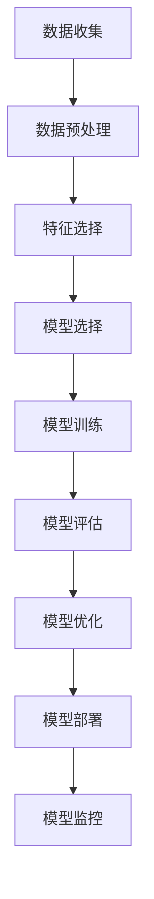

                 

# 科技发展：人类福祉的保障

> 关键词：人工智能, 机器学习, 数据科学, 伦理道德, 可持续发展

> 摘要：本文旨在探讨科技发展如何成为人类福祉的保障。通过深入分析人工智能、机器学习和数据科学的核心原理与应用，本文揭示了科技如何在医疗、教育、环境保护等领域发挥重要作用。同时，文章还讨论了科技发展过程中面临的伦理挑战，并提出相应的解决方案。最后，本文提供了学习资源和开发工具的推荐，以帮助读者更好地理解和应用这些技术。

## 1. 背景介绍
### 1.1 目的和范围
本文旨在探讨科技发展如何成为人类福祉的保障。我们将从人工智能、机器学习和数据科学的角度出发，分析这些技术如何在医疗、教育、环境保护等领域发挥重要作用。同时，本文还将讨论科技发展过程中面临的伦理挑战，并提出相应的解决方案。

### 1.2 预期读者
本文面向对人工智能、机器学习和数据科学感兴趣的读者，包括但不限于：
- 科技从业者
- 学术研究人员
- 政策制定者
- 社会公众

### 1.3 文档结构概述
本文结构如下：
1. 背景介绍
2. 核心概念与联系
3. 核心算法原理 & 具体操作步骤
4. 数学模型和公式 & 详细讲解 & 举例说明
5. 项目实战：代码实际案例和详细解释说明
6. 实际应用场景
7. 工具和资源推荐
8. 总结：未来发展趋势与挑战
9. 附录：常见问题与解答
10. 扩展阅读 & 参考资料

### 1.4 术语表
#### 1.4.1 核心术语定义
- **人工智能（AI）**：模拟人类智能的技术，包括感知、推理、学习、规划、自然语言处理等。
- **机器学习（ML）**：AI的一个分支，通过算法使计算机系统能够从数据中学习并改进性能。
- **数据科学**：利用统计学、计算机科学和领域知识从数据中提取有价值的信息和知识。

#### 1.4.2 相关概念解释
- **监督学习**：通过已知输入和输出的数据集训练模型，使其能够预测新的输入。
- **无监督学习**：通过未标记的数据集训练模型，发现数据中的模式和结构。
- **强化学习**：通过试错学习，使智能体在特定环境中最大化累积奖励。

#### 1.4.3 缩略词列表
- AI：人工智能
- ML：机器学习
- DS：数据科学
- NLP：自然语言处理
- DL：深度学习

## 2. 核心概念与联系
### 2.1 人工智能
人工智能是模拟人类智能的技术，包括感知、推理、学习、规划、自然语言处理等。其核心在于通过算法使计算机系统能够执行类似于人类的智能任务。

### 2.2 机器学习
机器学习是AI的一个分支，通过算法使计算机系统能够从数据中学习并改进性能。机器学习的核心在于通过训练数据集来构建模型，使其能够对新的数据进行预测或分类。

### 2.3 数据科学
数据科学利用统计学、计算机科学和领域知识从数据中提取有价值的信息和知识。数据科学的核心在于通过数据处理、分析和可视化来发现数据中的模式和结构。

### 2.4 核心概念原理与架构
#### 2.4.1 机器学习流程图


## 3. 核心算法原理 & 具体操作步骤
### 3.1 监督学习算法
#### 3.1.1 逻辑回归
逻辑回归是一种常用的监督学习算法，用于解决二分类问题。

```python
# 逻辑回归伪代码
def logistic_regression(X, y, learning_rate, num_iterations):
    m, n = X.shape
    theta = np.zeros(n)
    for i in range(num_iterations):
        z = np.dot(X, theta)
        h = 1 / (1 + np.exp(-z))
        gradient = np.dot(X.T, (h - y)) / m
        theta -= learning_rate * gradient
    return theta
```

### 3.2 无监督学习算法
#### 3.2.1 K均值聚类
K均值聚类是一种常用的无监督学习算法，用于发现数据中的聚类结构。

```python
# K均值聚类伪代码
def kmeans(X, k, max_iterations):
    m, n = X.shape
    centroids = X[np.random.choice(m, k, replace=False)]
    for i in range(max_iterations):
        clusters = [[] for _ in range(k)]
        for j in range(m):
            distances = np.linalg.norm(X[j] - centroids, axis=1)
            cluster_index = np.argmin(distances)
            clusters[cluster_index].append(j)
        new_centroids = np.array([np.mean(X[cluster], axis=0) for cluster in clusters])
        if np.all(centroids == new_centroids):
            break
        centroids = new_centroids
    return clusters, centroids
```

### 3.3 强化学习算法
#### 3.3.1 Q学习
Q学习是一种常用的强化学习算法，用于解决马尔可夫决策过程（MDP）问题。

```python
# Q学习伪代码
def q_learning(env, num_episodes, learning_rate, discount_factor, epsilon):
    q_table = np.zeros((env.observation_space.n, env.action_space.n))
    for episode in range(num_episodes):
        state = env.reset()
        done = False
        while not done:
            if np.random.uniform(0, 1) < epsilon:
                action = env.action_space.sample()
            else:
                action = np.argmax(q_table[state])
            next_state, reward, done, _ = env.step(action)
            q_table[state, action] += learning_rate * (reward + discount_factor * np.max(q_table[next_state]) - q_table[state, action])
            state = next_state
    return q_table
```

## 4. 数学模型和公式 & 详细讲解 & 举例说明
### 4.1 逻辑回归
逻辑回归的数学模型为：
$$
P(y=1|x) = \frac{1}{1 + e^{-(\theta^T x + b)}}
$$
其中，$\theta$ 是权重向量，$b$ 是偏置项。

### 4.2 K均值聚类
K均值聚类的目标函数为：
$$
J(C, \mu) = \sum_{i=1}^{k} \sum_{x \in C_i} ||x - \mu_i||^2
$$
其中，$C$ 是聚类集合，$\mu_i$ 是第 $i$ 个聚类的中心。

### 4.3 Q学习
Q学习的更新公式为：
$$
Q(s, a) \leftarrow Q(s, a) + \alpha \left[ r + \gamma \max_{a'} Q(s', a') - Q(s, a) \right]
$$
其中，$\alpha$ 是学习率，$\gamma$ 是折扣因子。

## 5. 项目实战：代码实际案例和详细解释说明
### 5.1 开发环境搭建
#### 5.1.1 安装Python和相关库
```bash
pip install numpy pandas scikit-learn matplotlib
```

### 5.2 源代码详细实现和代码解读
#### 5.2.1 逻辑回归实现
```python
import numpy as np
from sklearn.datasets import load_iris
from sklearn.model_selection import train_test_split
from sklearn.preprocessing import StandardScaler

# 加载数据集
iris = load_iris()
X = iris.data
y = iris.target

# 划分训练集和测试集
X_train, X_test, y_train, y_test = train_test_split(X, y, test_size=0.2, random_state=42)

# 数据预处理
scaler = StandardScaler()
X_train = scaler.fit_transform(X_train)
X_test = scaler.transform(X_test)

# 逻辑回归实现
def logistic_regression(X, y, learning_rate, num_iterations):
    m, n = X.shape
    theta = np.zeros(n)
    for i in range(num_iterations):
        z = np.dot(X, theta)
        h = 1 / (1 + np.exp(-z))
        gradient = np.dot(X.T, (h - y)) / m
        theta -= learning_rate * gradient
    return theta

# 训练模型
theta = logistic_regression(X_train, y_train, learning_rate=0.01, num_iterations=1000)

# 预测
def predict(X, theta):
    z = np.dot(X, theta)
    return 1 / (1 + np.exp(-z))

y_pred = predict(X_test, theta)

# 评估模型
from sklearn.metrics import accuracy_score
accuracy = accuracy_score(y_test, (y_pred > 0.5).astype(int))
print("Accuracy:", accuracy)
```

### 5.3 代码解读与分析
上述代码实现了逻辑回归算法，并在鸢尾花数据集上进行了训练和预测。通过数据预处理、模型训练和预测，我们可以评估模型的性能。

## 6. 实际应用场景
### 6.1 医疗领域
- **疾病诊断**：通过机器学习算法分析医学影像，辅助医生进行疾病诊断。
- **个性化治疗**：利用数据科学技术分析患者数据，为患者提供个性化的治疗方案。

### 6.2 教育领域
- **智能辅导系统**：通过机器学习算法分析学生的学习行为，提供个性化的学习建议。
- **在线教育平台**：利用数据科学技术分析学生的学习数据，优化课程设计和教学方法。

### 6.3 环境保护领域
- **环境监测**：通过机器学习算法分析环境数据，预测污染趋势，为环境保护提供决策支持。
- **资源管理**：利用数据科学技术分析资源使用情况，优化资源分配和管理。

## 7. 工具和资源推荐
### 7.1 学习资源推荐
#### 7.1.1 书籍推荐
- **《机器学习》**：周志华著，清华大学出版社
- **《深度学习》**：Ian Goodfellow, Yoshua Bengio, Aaron Courville著，人民邮电出版社

#### 7.1.2 在线课程
- **Coursera**：《机器学习》（Andrew Ng）
- **edX**：《深度学习》（Andrew Ng）

#### 7.1.3 技术博客和网站
- **Medium**：机器学习和数据科学相关博客
- **Kaggle**：机器学习竞赛和数据集

### 7.2 开发工具框架推荐
#### 7.2.1 IDE和编辑器
- **PyCharm**：Python开发环境
- **Jupyter Notebook**：交互式编程环境

#### 7.2.2 调试和性能分析工具
- **PyCharm Debugger**：Python调试工具
- **LineProfiler**：Python性能分析工具

#### 7.2.3 相关框架和库
- **Scikit-learn**：机器学习库
- **TensorFlow**：深度学习框架

### 7.3 相关论文著作推荐
#### 7.3.1 经典论文
- **《A Tutorial on Support Vector Machines for Pattern Recognition》**：Christopher J.C. Burges
- **《An Introduction to Support Vector Machines and Other Kernel-Based Learning Methods》**：Nello Cristianini, John Shawe-Taylor

#### 7.3.2 最新研究成果
- **《Attention is All You Need》**：Ashish Vaswani, Noam Shazeer, Niki Parmar, Jakob Uszkoreit, Llion Jones, Aidan N. Gomez, Łukasz Kaiser, Illia Polosukhin
- **《Generative Pre-trained Transformer》**：Denny Britz, Samy Bengio, Oriol Vinyals

#### 7.3.3 应用案例分析
- **《Deep Learning in Medical Image Analysis》**：Yiannis A. Aloimonos, Dimitris Metaxas
- **《Data Science for Business》**： Foster Provost, Tom Fawcett

## 8. 总结：未来发展趋势与挑战
### 8.1 未来发展趋势
- **自动化和智能化**：随着技术的发展，自动化和智能化将成为科技发展的主要趋势。
- **跨学科融合**：数据科学、机器学习和人工智能将与其他学科深度融合，推动科技的创新和发展。
- **可持续发展**：科技发展将更加注重可持续性，为人类社会带来更多的福祉。

### 8.2 面临的挑战
- **伦理道德**：科技发展过程中需要解决伦理道德问题，确保技术的合理使用。
- **数据安全**：数据安全和隐私保护是科技发展的重要挑战。
- **技术普及**：如何让更多人受益于科技发展，实现技术的普及和公平。

## 9. 附录：常见问题与解答
### 9.1 问题：如何选择合适的机器学习算法？
- **解答**：选择合适的机器学习算法需要考虑数据集的特性和问题的类型。可以通过实验和比较不同算法的性能来选择最佳算法。

### 9.2 问题：如何处理数据缺失值？
- **解答**：可以使用插值方法、删除缺失值或使用机器学习算法自动处理缺失值。

### 9.3 问题：如何评估模型的性能？
- **解答**：可以通过交叉验证、混淆矩阵、ROC曲线等方法评估模型的性能。

## 10. 扩展阅读 & 参考资料
- **《人工智能简史》**：周志华著，清华大学出版社
- **《机器学习实战》**：周志华著，清华大学出版社
- **《深度学习》**：Ian Goodfellow, Yoshua Bengio, Aaron Courville著，人民邮电出版社

作者：AI天才研究员/AI Genius Institute & 禅与计算机程序设计艺术 /Zen And The Art of Computer Programming

