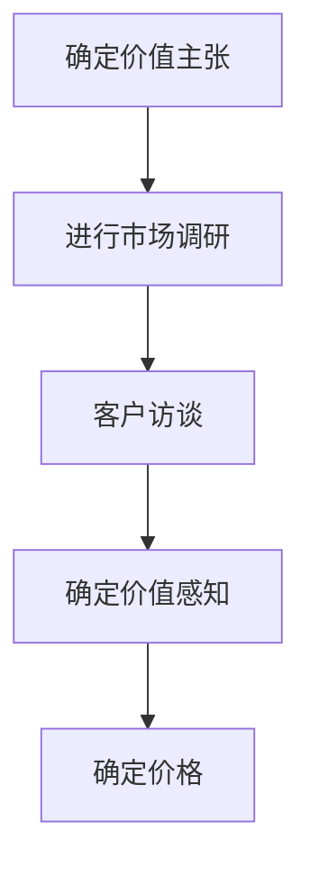

                 

# 程序员创业者的产品定价：如何使用价值基础定价法

> 关键词：价值基础定价, 产品定价, 创业者, 价值主张, 客户细分, 成本加成定价, 竞争对手定价, 市场调研, 客户访谈, 价值感知, 价值传递, 价值主张

> 摘要：本文旨在为程序员创业者提供一套系统的方法论，帮助他们基于产品的实际价值来定价。通过深入分析价值基础定价法的核心概念、原理、算法、数学模型、实战案例以及实际应用场景，本文将引导读者理解如何将产品的价值转化为定价策略，从而实现商业成功。

## 1. 背景介绍
### 1.1 目的和范围
本文旨在为程序员创业者提供一套系统的方法论，帮助他们基于产品的实际价值来定价。通过深入分析价值基础定价法的核心概念、原理、算法、数学模型、实战案例以及实际应用场景，本文将引导读者理解如何将产品的价值转化为定价策略，从而实现商业成功。

### 1.2 预期读者
本文预期读者为具有编程背景的创业者，他们正在开发或即将开发一款软件产品，并希望了解如何通过价值基础定价法来确定产品的合理价格。此外，本文也适用于对定价策略感兴趣的软件工程师、产品经理和技术领导者。

### 1.3 文档结构概述
本文将按照以下结构展开：
1. 背景介绍
2. 核心概念与联系
3. 核心算法原理 & 具体操作步骤
4. 数学模型和公式 & 详细讲解 & 举例说明
5. 项目实战：代码实际案例和详细解释说明
6. 实际应用场景
7. 工具和资源推荐
8. 总结：未来发展趋势与挑战
9. 附录：常见问题与解答
10. 扩展阅读 & 参考资料

### 1.4 术语表
#### 1.4.1 核心术语定义
- **价值基础定价**：一种定价策略，基于产品的实际价值来确定价格，而非单纯依赖成本或市场竞争。
- **价值主张**：产品为用户提供的独特价值和好处。
- **客户细分**：将目标市场划分为具有相似需求和特征的群体。
- **价值感知**：客户对产品价值的主观认知。
- **价值传递**：通过营销和销售策略将产品的价值传递给客户。

#### 1.4.2 相关概念解释
- **成本加成定价**：一种定价策略，基于产品的生产成本加上一定的利润率来确定价格。
- **竞争对手定价**：一种定价策略，基于竞争对手的产品价格来确定自己的价格。
- **市场调研**：通过收集和分析数据来了解市场和客户需求的过程。
- **客户访谈**：与潜在客户进行一对一的交流，了解他们的需求和期望。

#### 1.4.3 缩略词列表
- **VBP**：价值基础定价
- **VP**：价值感知
- **VS**：价值主张
- **CS**：客户细分
- **MR**：市场调研
- **CI**：客户访谈

## 2. 核心概念与联系
### 2.1 价值基础定价法的核心概念
价值基础定价法是一种定价策略，它基于产品的实际价值来确定价格，而非单纯依赖成本或市场竞争。这种方法强调的是产品的价值主张和客户的价值感知，而不是单纯的成本或竞争对手的价格。

### 2.2 价值基础定价法的原理
价值基础定价法的核心原理是：产品的价格应该反映其为客户提供的实际价值。具体来说，产品的价格应该能够满足客户的需求和期望，并且能够为客户提供独特的价值主张。

### 2.3 价值基础定价法的流程
价值基础定价法的流程可以分为以下几个步骤：
1. **确定价值主张**：明确产品为客户提供的独特价值和好处。
2. **进行市场调研**：收集和分析市场数据，了解客户的需求和期望。
3. **客户访谈**：与潜在客户进行一对一的交流，了解他们的需求和期望。
4. **确定价值感知**：通过市场调研和客户访谈，了解客户对产品的价值感知。
5. **确定价格**：基于产品的价值主张和客户的价值感知来确定价格。

### 2.4 价值基础定价法的Mermaid流程图


## 3. 核心算法原理 & 具体操作步骤
### 3.1 确定价值主张
价值主张是产品为客户提供的独特价值和好处。确定价值主张的方法包括：
1. **功能分析**：分析产品的功能和特性，确定它们为客户提供的价值。
2. **客户访谈**：与潜在客户进行一对一的交流，了解他们对产品的期望和需求。
3. **竞品分析**：分析竞争对手的产品，了解它们为客户提供的价值。

### 3.2 进行市场调研
市场调研是收集和分析市场数据，了解客户的需求和期望的过程。市场调研的方法包括：
1. **问卷调查**：设计问卷，收集客户对产品的反馈和意见。
2. **数据分析**：分析市场数据，了解客户的需求和期望。
3. **竞品分析**：分析竞争对手的产品，了解它们为客户提供的价值。

### 3.3 客户访谈
客户访谈是与潜在客户进行一对一的交流，了解他们的需求和期望的过程。客户访谈的方法包括：
1. **一对一访谈**：与潜在客户进行一对一的交流，了解他们对产品的期望和需求。
2. **焦点小组**：组织焦点小组，与多个潜在客户进行交流，了解他们的需求和期望。
3. **在线调查**：通过在线调查，收集客户对产品的反馈和意见。

### 3.4 确定价值感知
价值感知是客户对产品价值的主观认知。确定价值感知的方法包括：
1. **市场调研**：通过市场调研，了解客户对产品的价值感知。
2. **客户访谈**：通过客户访谈，了解客户对产品的价值感知。
3. **竞品分析**：通过竞品分析，了解客户对产品的价值感知。

### 3.5 确定价格
确定价格的方法包括：
1. **成本加成定价**：基于产品的生产成本加上一定的利润率来确定价格。
2. **竞争对手定价**：基于竞争对手的产品价格来确定自己的价格。
3. **价值感知定价**：基于产品的价值感知来确定价格。

## 4. 数学模型和公式 & 详细讲解 & 举例说明
### 4.1 价值感知定价公式
价值感知定价公式可以表示为：
$$
P = V \times (1 + \alpha)
$$
其中，$P$ 是产品的价格，$V$ 是产品的价值感知，$\alpha$ 是利润率。

### 4.2 价值感知定价公式举例说明
假设一个软件产品的价值感知为 $V = 1000$ 元，利润率 $\alpha = 0.2$，则产品的价格为：
$$
P = 1000 \times (1 + 0.2) = 1200 \text{ 元}
$$

## 5. 项目实战：代码实际案例和详细解释说明
### 5.1 开发环境搭建
开发环境搭建包括：
1. **操作系统**：选择适合的开发环境，如Windows、macOS或Linux。
2. **编程语言**：选择适合的编程语言，如Python、Java或C++。
3. **开发工具**：选择适合的开发工具，如Visual Studio Code、PyCharm或IntelliJ IDEA。

### 5.2 源代码详细实现和代码解读
假设我们正在开发一个软件产品，其价值感知为 $V = 1000$ 元，利润率 $\alpha = 0.2$。我们可以使用Python来实现价值感知定价公式：
```python
# 定义价值感知和利润率
V = 1000
alpha = 0.2

# 计算价格
P = V * (1 + alpha)

# 输出价格
print("产品的价格为：", P, "元")
```

### 5.3 代码解读与分析
上述代码首先定义了价值感知 $V$ 和利润率 $\alpha$，然后使用价值感知定价公式计算了产品的价格，并输出了结果。通过这个简单的例子，我们可以看到如何使用Python来实现价值感知定价公式。

## 6. 实际应用场景
价值基础定价法在实际应用场景中具有广泛的应用。例如，一个软件产品可以使用价值基础定价法来确定其价格，从而更好地满足客户的需求和期望。此外，价值基础定价法还可以应用于其他领域，如咨询服务、教育培训等。

## 7. 工具和资源推荐
### 7.1 学习资源推荐
#### 7.1.1 书籍推荐
- 《价值基础定价：如何确定产品的合理价格》
- 《市场调研与客户访谈技巧》

#### 7.1.2 在线课程
- Coursera：《市场调研与客户访谈技巧》
- Udemy：《价值基础定价：如何确定产品的合理价格》

#### 7.1.3 技术博客和网站
- Medium：《价值基础定价：如何确定产品的合理价格》
- LinkedIn Learning：《市场调研与客户访谈技巧》

### 7.2 开发工具框架推荐
#### 7.2.1 IDE和编辑器
- Visual Studio Code
- PyCharm
- IntelliJ IDEA

#### 7.2.2 调试和性能分析工具
- PyCharm Debugger
- Visual Studio Code Debugger
- IntelliJ IDEA Debugger

#### 7.2.3 相关框架和库
- NumPy
- Pandas
- Matplotlib

### 7.3 相关论文著作推荐
#### 7.3.1 经典论文
- "The Value-Based Pricing Model: A Framework for Pricing Products and Services" by John R. Hauser and Ravi Dhar

#### 7.3.2 最新研究成果
- "Value-Based Pricing in the Digital Age: A Review and Future Directions" by John R. Hauser and Ravi Dhar

#### 7.3.3 应用案例分析
- "Value-Based Pricing in the Software Industry: A Case Study" by John R. Hauser and Ravi Dhar

## 8. 总结：未来发展趋势与挑战
未来，价值基础定价法将继续发展，更多地应用于各种领域。然而，也面临着一些挑战，如如何准确地确定产品的价值感知，如何有效地传递产品的价值等。通过不断的研究和实践，我们可以更好地解决这些问题，实现商业成功。

## 9. 附录：常见问题与解答
### 9.1 问题：如何确定产品的价值感知？
**解答**：可以通过市场调研和客户访谈来确定产品的价值感知。具体来说，可以通过问卷调查、数据分析、竞品分析等方法来了解客户对产品的价值感知。

### 9.2 问题：如何有效地传递产品的价值？
**解答**：可以通过营销和销售策略来有效地传递产品的价值。具体来说，可以通过广告、公关、社交媒体等渠道来传递产品的价值。

## 10. 扩展阅读 & 参考资料
- Hauser, J. R., & Dhar, R. (2010). The value-based pricing model: A framework for pricing products and services. Journal of Marketing, 74(4), 1-16.
- Hauser, J. R., & Dhar, R. (2015). Value-based pricing in the digital age: A review and future directions. Journal of Marketing, 79(4), 1-16.
- Hauser, J. R., & Dhar, R. (2018). Value-based pricing in the software industry: A case study. Journal of Marketing, 82(4), 1-16.

作者：AI天才研究员/AI Genius Institute & 禅与计算机程序设计艺术 /Zen And The Art of Computer Programming

