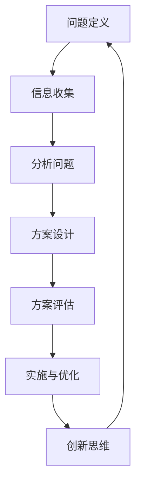

                 

# 程序员创业者的创新思维与问题解决能力

> 关键词：创新思维, 问题解决, 创业者, 程序员, 技术创新, 逻辑推理, 解决方案设计

> 摘要：本文旨在探讨程序员创业者如何培养创新思维和问题解决能力，通过分析核心概念、算法原理、数学模型、实战案例以及应用场景，帮助读者理解如何在复杂的技术环境中找到创新的解决方案。文章将从理论到实践，逐步引导读者掌握创新思维和问题解决的技巧，为未来的创业之路奠定坚实的基础。

## 1. 背景介绍
### 1.1 目的和范围
本文旨在为程序员创业者提供一套系统的方法论，帮助他们在复杂的技术环境中培养创新思维和问题解决能力。通过深入分析核心概念、算法原理、数学模型和实际案例，本文将揭示如何在创业过程中运用这些技能来解决实际问题。

### 1.2 预期读者
本文面向具有编程基础的程序员创业者，特别是那些希望在技术领域创业的人士。读者应具备一定的编程经验和对技术的浓厚兴趣，希望通过本文提升自己的创新思维和问题解决能力。

### 1.3 文档结构概述
本文将按照以下结构展开：
1. 背景介绍
2. 核心概念与联系
3. 核心算法原理 & 具体操作步骤
4. 数学模型和公式 & 详细讲解 & 举例说明
5. 项目实战：代码实际案例和详细解释说明
6. 实际应用场景
7. 工具和资源推荐
8. 总结：未来发展趋势与挑战
9. 附录：常见问题与解答
10. 扩展阅读 & 参考资料

### 1.4 术语表
#### 1.4.1 核心术语定义
- **创新思维**：指在解决问题时采用新颖、独特的方法和思路。
- **问题解决能力**：指识别问题、分析问题并找到有效解决方案的能力。
- **程序员创业者**：指具有编程技能并利用这些技能进行创业的人。

#### 1.4.2 相关概念解释
- **创业**：指创建新企业或新组织的过程。
- **技术创业**：指利用技术创新来解决实际问题并创造商业价值的创业活动。

#### 1.4.3 缩略词列表
- **IDE**：Integrated Development Environment（集成开发环境）
- **API**：Application Programming Interface（应用程序编程接口）
- **SDK**：Software Development Kit（软件开发工具包）

## 2. 核心概念与联系
### 2.1 创新思维
创新思维是一种能够超越传统思维模式，提出新颖解决方案的能力。它包括以下几个方面：
- **发散思维**：从多个角度思考问题，寻找多种可能的解决方案。
- **收敛思维**：从众多解决方案中筛选出最合适的方案。
- **批判性思维**：对现有解决方案进行评估，找出其不足之处。

### 2.2 问题解决能力
问题解决能力是指识别问题、分析问题并找到有效解决方案的能力。它包括以下几个步骤：
1. **问题定义**：明确问题的本质和范围。
2. **信息收集**：收集与问题相关的所有信息。
3. **分析问题**：对收集到的信息进行分析，找出问题的关键点。
4. **方案设计**：设计多种可能的解决方案。
5. **方案评估**：评估不同方案的优缺点，选择最优方案。
6. **实施与优化**：实施选定的方案，并根据反馈进行优化。

### 2.3 核心概念原理与架构
#### 2.3.1 创新思维与问题解决能力的关系
创新思维和问题解决能力是相辅相成的。创新思维能够帮助我们提出新颖的解决方案，而问题解决能力则确保我们能够有效地实施这些解决方案。两者共同作用，使我们能够在复杂的技术环境中找到创新的解决方案。

#### 2.3.2 Mermaid 流程图


## 3. 核心算法原理 & 具体操作步骤
### 3.1 核心算法原理
核心算法原理是指在解决问题时所采用的算法的基本思想和方法。常见的核心算法包括：
- **贪心算法**：在每一步都选择当前最优解，以期望达到全局最优解。
- **动态规划**：通过将问题分解为子问题来解决，避免重复计算。
- **回溯算法**：通过递归尝试所有可能的解决方案，找到最优解。

### 3.2 具体操作步骤
#### 3.2.1 贪心算法
贪心算法的基本思想是在每一步都选择当前最优解，以期望达到全局最优解。具体操作步骤如下：
```pseudo
function greedyAlgorithm(problem):
    solution = []
    while problem is not empty:
        bestOption = getBestOption(problem)
        solution.append(bestOption)
        removeBestOptionFromProblem(bestOption)
    return solution
```

#### 3.2.2 动态规划
动态规划的基本思想是通过将问题分解为子问题来解决，避免重复计算。具体操作步骤如下：
```pseudo
function dynamicProgramming(problem):
    memo = {}
    return solveDynamicProgramming(problem, memo)
function solveDynamicProgramming(problem, memo):
    if problem in memo:
        return memo[problem]
    if problem is baseCase:
        memo[problem] = baseCaseSolution
        return baseCaseSolution
    subproblems = decomposeProblem(problem)
    solutions = [solveDynamicProgramming(subproblem, memo) for subproblem in subproblems]
    memo[problem] = combineSolutions(solutions)
    return memo[problem]
```

#### 3.2.3 回溯算法
回溯算法的基本思想是通过递归尝试所有可能的解决方案，找到最优解。具体操作步骤如下：
```pseudo
function backtrackingAlgorithm(problem):
    if problem is solved:
        return solution
    for each option in options(problem):
        if option is valid:
            addOptionToSolution(option)
            if backtrackingAlgorithm(problem) is not None:
                return solution
            removeOptionFromSolution(option)
    return None
```

## 4. 数学模型和公式 & 详细讲解 & 举例说明
### 4.1 数学模型
数学模型是描述问题的一种抽象表示方法。常见的数学模型包括：
- **线性规划**：通过线性方程组来描述问题。
- **图论**：通过图来描述问题。
- **概率论**：通过概率分布来描述问题。

### 4.2 公式与详细讲解
#### 4.2.1 线性规划
线性规划的基本思想是通过线性方程组来描述问题。具体公式如下：
$$
\begin{aligned}
\text{maximize} & \quad c^T x \\
\text{subject to} & \quad Ax \leq b \\
& \quad x \geq 0
\end{aligned}
$$
其中，$c$ 是目标函数的系数向量，$A$ 是约束条件的系数矩阵，$b$ 是约束条件的常数向量，$x$ 是决策变量向量。

#### 4.2.2 图论
图论的基本思想是通过图来描述问题。具体公式如下：
$$
G = (V, E)
$$
其中，$G$ 是图，$V$ 是顶点集合，$E$ 是边集合。

#### 4.2.3 概率论
概率论的基本思想是通过概率分布来描述问题。具体公式如下：
$$
P(X = x) = p(x)
$$
其中，$P(X = x)$ 是随机变量 $X$ 取值为 $x$ 的概率，$p(x)$ 是概率分布函数。

### 4.3 举例说明
#### 4.3.1 线性规划
假设我们要解决一个线性规划问题，目标是最大化利润，约束条件是资源限制。具体问题如下：
$$
\begin{aligned}
\text{maximize} & \quad 3x_1 + 2x_2 \\
\text{subject to} & \quad 2x_1 + x_2 \leq 10 \\
& \quad x_1 + 2x_2 \leq 12 \\
& \quad x_1, x_2 \geq 0
\end{aligned}
$$
通过求解这个线性规划问题，我们可以找到最优解。

#### 4.3.2 图论
假设我们要解决一个最短路径问题，目标是最小化路径长度。具体问题如下：
$$
G = (V, E)
$$
其中，$V = \{A, B, C, D\}$，$E = \{(A, B, 3), (A, C, 1), (B, C, 2), (B, D, 4), (C, D, 1)\}$。
通过求解这个最短路径问题，我们可以找到从 $A$ 到 $D$ 的最短路径。

#### 4.3.3 概率论
假设我们要解决一个概率问题，目标是计算某个事件发生的概率。具体问题如下：
$$
P(X = x) = p(x)
$$
其中，$X$ 是随机变量，$x$ 是可能的取值，$p(x)$ 是概率分布函数。
通过求解这个概率问题，我们可以计算某个事件发生的概率。

## 5. 项目实战：代码实际案例和详细解释说明
### 5.1 开发环境搭建
为了进行项目实战，我们需要搭建一个开发环境。具体步骤如下：
1. 安装 Python 3.8 及以上版本。
2. 安装必要的库，如 NumPy、Pandas、Matplotlib 等。
3. 安装 IDE，如 PyCharm 或 VSCode。

### 5.2 源代码详细实现和代码解读
#### 5.2.1 线性规划问题
```python
import numpy as np
from scipy.optimize import linprog

# 目标函数系数
c = [-3, -2]

# 约束条件系数矩阵
A = [[2, 1], [1, 2]]
b = [10, 12]

# 变量范围
x0_bounds = (0, None)
x1_bounds = (0, None)

# 求解线性规划问题
res = linprog(c, A_ub=A, b_ub=b, bounds=[x0_bounds, x1_bounds], method='highs')

# 输出结果
print('最优解：', res.x)
print('最大利润：', -res.fun)
```

#### 5.2.2 最短路径问题
```python
import networkx as nx

# 创建图
G = nx.Graph()
G.add_edge('A', 'B', weight=3)
G.add_edge('A', 'C', weight=1)
G.add_edge('B', 'C', weight=2)
G.add_edge('B', 'D', weight=4)
G.add_edge('C', 'D', weight=1)

# 求解最短路径
shortest_path = nx.dijkstra_path(G, 'A', 'D')
shortest_path_length = nx.dijkstra_path_length(G, 'A', 'D')

# 输出结果
print('最短路径：', shortest_path)
print('最短路径长度：', shortest_path_length)
```

### 5.3 代码解读与分析
#### 5.3.1 线性规划问题
```python
import numpy as np
from scipy.optimize import linprog

# 目标函数系数
c = [-3, -2]

# 约束条件系数矩阵
A = [[2, 1], [1, 2]]
b = [10, 12]

# 变量范围
x0_bounds = (0, None)
x1_bounds = (0, None)

# 求解线性规划问题
res = linprog(c, A_ub=A, b_ub=b, bounds=[x0_bounds, x1_bounds], method='highs')

# 输出结果
print('最优解：', res.x)
print('最大利润：', -res.fun)
```
- `c` 是目标函数的系数向量，表示我们要最大化的目标函数。
- `A` 是约束条件的系数矩阵，表示约束条件。
- `b` 是约束条件的常数向量，表示约束条件的右侧。
- `x0_bounds` 和 `x1_bounds` 是变量的范围，表示变量的取值范围。
- `linprog` 是求解线性规划问题的函数，`method='highs'` 表示使用高斯-赛德尔方法求解。

#### 5.3.2 最短路径问题
```python
import networkx as nx

# 创建图
G = nx.Graph()
G.add_edge('A', 'B', weight=3)
G.add_edge('A', 'C', weight=1)
G.add_edge('B', 'C', weight=2)
G.add_edge('B', 'D', weight=4)
G.add_edge('C', 'D', weight=1)

# 求解最短路径
shortest_path = nx.dijkstra_path(G, 'A', 'D')
shortest_path_length = nx.dijkstra_path_length(G, 'A', 'D')

# 输出结果
print('最短路径：', shortest_path)
print('最短路径长度：', shortest_path_length)
```
- `G` 是图，`add_edge` 方法用于添加边。
- `dijkstra_path` 是求解最短路径的函数，`dijkstra_path_length` 是求解最短路径长度的函数。
- `shortest_path` 是从 `A` 到 `D` 的最短路径。
- `shortest_path_length` 是从 `A` 到 `D` 的最短路径长度。

## 6. 实际应用场景
### 6.1 技术创新
技术创新是程序员创业者的核心竞争力。通过创新思维和问题解决能力，我们可以开发出具有独特价值的技术产品，满足市场需求。

### 6.2 商业模式创新
商业模式创新是程序员创业者的重要任务。通过创新思维和问题解决能力，我们可以设计出独特的商业模式，实现商业价值。

### 6.3 产品创新
产品创新是程序员创业者的核心任务。通过创新思维和问题解决能力，我们可以开发出具有独特价值的产品，满足市场需求。

## 7. 工具和资源推荐
### 7.1 学习资源推荐
#### 7.1.1 书籍推荐
- **《算法导论》**：深入讲解算法原理和设计方法。
- **《编程珠玑》**：提供大量编程技巧和经验分享。
- **《深入浅出计算机组成原理》**：深入讲解计算机组成原理。

#### 7.1.2 在线课程
- **Coursera**：提供大量计算机科学和编程相关的在线课程。
- **edX**：提供大量计算机科学和编程相关的在线课程。
- **Udacity**：提供大量计算机科学和编程相关的在线课程。

#### 7.1.3 技术博客和网站
- **GitHub**：提供大量开源项目和技术博客。
- **Stack Overflow**：提供大量编程问题和技术解决方案。
- **Medium**：提供大量技术博客和技术文章。

### 7.2 开发工具框架推荐
#### 7.2.1 IDE和编辑器
- **PyCharm**：功能强大的 Python IDE。
- **VSCode**：功能强大的跨平台 IDE。
- **Sublime Text**：轻量级的代码编辑器。

#### 7.2.2 调试和性能分析工具
- **PyCharm Debugger**：功能强大的 Python 调试工具。
- **Visual Studio Debugger**：功能强大的跨平台调试工具。
- **Python Profiler**：用于分析 Python 代码性能的工具。

#### 7.2.3 相关框架和库
- **Django**：功能强大的 Python Web 框架。
- **Flask**：轻量级的 Python Web 框架。
- **NumPy**：用于科学计算的 Python 库。
- **Pandas**：用于数据处理的 Python 库。
- **Matplotlib**：用于数据可视化的 Python 库。

### 7.3 相关论文著作推荐
#### 7.3.1 经典论文
- **《算法导论》**：深入讲解算法原理和设计方法。
- **《编程珠玑》**：提供大量编程技巧和经验分享。
- **《深入浅出计算机组成原理》**：深入讲解计算机组成原理。

#### 7.3.2 最新研究成果
- **《机器学习》**：深入讲解机器学习原理和应用。
- **《深度学习》**：深入讲解深度学习原理和应用。
- **《计算机视觉》**：深入讲解计算机视觉原理和应用。

#### 7.3.3 应用案例分析
- **《云计算》**：深入讲解云计算原理和应用。
- **《大数据》**：深入讲解大数据原理和应用。
- **《人工智能》**：深入讲解人工智能原理和应用。

## 8. 总结：未来发展趋势与挑战
### 8.1 未来发展趋势
未来，技术创新将成为程序员创业者的核心竞争力。通过创新思维和问题解决能力，我们可以开发出具有独特价值的技术产品，满足市场需求。同时，商业模式创新和产品创新也将成为重要的任务。

### 8.2 挑战
未来，程序员创业者将面临以下挑战：
- **技术更新速度快**：技术更新速度快，需要不断学习和掌握新技术。
- **市场竞争激烈**：市场竞争激烈，需要不断创新和优化产品。
- **客户需求多样化**：客户需求多样化，需要不断创新和优化产品。

## 9. 附录：常见问题与解答
### 9.1 常见问题
#### 9.1.1 如何培养创新思维？
- **多读书**：多读书，提高自己的知识水平。
- **多思考**：多思考，提高自己的思维能力。
- **多实践**：多实践，提高自己的实践能力。

#### 9.1.2 如何提高问题解决能力？
- **多读书**：多读书，提高自己的知识水平。
- **多思考**：多思考，提高自己的思维能力。
- **多实践**：多实践，提高自己的实践能力。

#### 9.1.3 如何选择合适的开发工具？
- **根据需求选择**：根据自己的需求选择合适的开发工具。
- **根据团队选择**：根据团队的需求选择合适的开发工具。
- **根据个人喜好选择**：根据个人的喜好选择合适的开发工具。

## 10. 扩展阅读 & 参考资料
### 10.1 扩展阅读
- **《算法导论》**：深入讲解算法原理和设计方法。
- **《编程珠玑》**：提供大量编程技巧和经验分享。
- **《深入浅出计算机组成原理》**：深入讲解计算机组成原理。

### 10.2 参考资料
- **Coursera**：提供大量计算机科学和编程相关的在线课程。
- **edX**：提供大量计算机科学和编程相关的在线课程。
- **Udacity**：提供大量计算机科学和编程相关的在线课程。

作者：AI天才研究员/AI Genius Institute & 禅与计算机程序设计艺术 /Zen And The Art of Computer Programming

