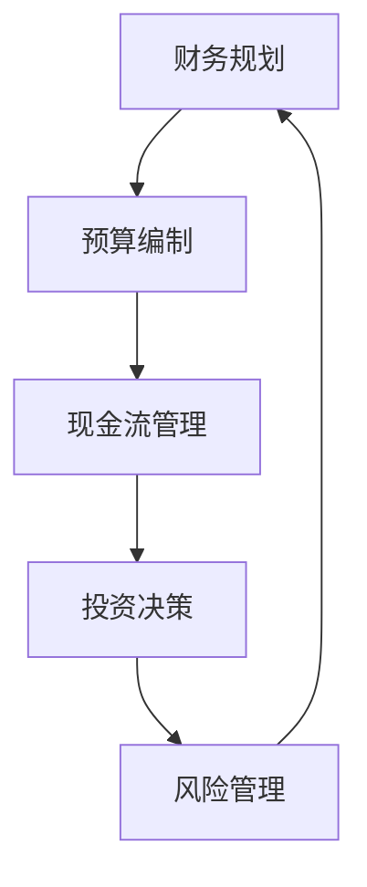

                 

# 程序员创业者的财务规划与管理

> 关键词：财务规划, 创业, 程序员, 财务管理, 投资, 风险管理, 资金流, 财务模型, 创业者

> 摘要：本文旨在为程序员创业者提供一套系统的财务规划与管理方法。通过深入分析财务规划的核心概念、原理和实际操作步骤，结合数学模型和具体案例，帮助创业者更好地理解财务规划的重要性，并掌握有效的财务管理技巧。本文将从财务规划的目的和范围出发，逐步介绍财务规划的关键步骤，包括预算编制、现金流管理、投资决策、风险管理等，并提供实际案例和工具推荐，帮助读者在创业过程中实现财务稳健和可持续发展。

## 1. 背景介绍
### 1.1 目的和范围
本文旨在为程序员创业者提供一套系统的财务规划与管理方法。通过深入分析财务规划的核心概念、原理和实际操作步骤，结合数学模型和具体案例，帮助创业者更好地理解财务规划的重要性，并掌握有效的财务管理技巧。本文将涵盖财务规划的目的、范围、预期读者以及文档结构概述，并定义相关术语。

### 1.2 预期读者
本文预期读者为具有编程背景的创业者，特别是那些刚刚起步或正在寻求扩展业务的程序员。读者应具备一定的财务基础知识，但不一定需要深厚的财务背景。本文旨在帮助这些读者更好地理解财务规划的重要性，并提供实用的财务管理技巧。

### 1.3 文档结构概述
本文将按照以下结构展开：
1. 背景介绍
2. 核心概念与联系
3. 核心算法原理 & 具体操作步骤
4. 数学模型和公式 & 详细讲解 & 举例说明
5. 项目实战：代码实际案例和详细解释说明
6. 实际应用场景
7. 工具和资源推荐
8. 总结：未来发展趋势与挑战
9. 附录：常见问题与解答
10. 扩展阅读 & 参考资料

### 1.4 术语表
#### 1.4.1 核心术语定义
- **财务规划**：制定和实施一系列策略，以实现企业的财务目标。
- **预算编制**：根据企业的财务目标和业务计划，制定详细的财务计划。
- **现金流管理**：管理企业的现金流入和流出，确保资金的充足和合理使用。
- **投资决策**：根据企业的财务状况和市场情况，选择合适的投资项目。
- **风险管理**：识别、评估和控制企业面临的财务风险。
- **财务模型**：通过数学模型和工具，模拟和预测企业的财务状况。

#### 1.4.2 相关概念解释
- **财务目标**：企业希望通过财务规划实现的具体目标，如盈利、增长、现金流稳定等。
- **财务报表**：反映企业财务状况的文件，包括资产负债表、利润表和现金流量表。
- **财务比率**：通过财务报表中的数据计算得出的比率，用于评估企业的财务状况。

#### 1.4.3 缩略词列表
- **CF**：现金流
- **ROI**：投资回报率
- **NPV**：净现值
- **IRR**：内部收益率
- **EBITDA**：息税折旧摊销前利润

## 2. 核心概念与联系
### 2.1 财务规划的核心概念
财务规划是企业财务管理的重要组成部分，旨在通过一系列策略和措施，实现企业的财务目标。财务规划的核心概念包括财务目标、预算编制、现金流管理、投资决策和风险管理。

### 2.2 财务规划的联系
财务规划是一个系统的过程，各个环节相互关联，共同作用于企业的财务目标。预算编制是财务规划的基础，现金流管理确保资金的充足和合理使用，投资决策选择合适的投资项目，风险管理控制企业面临的财务风险。

### 2.3 Mermaid 流程图


## 3. 核心算法原理 & 具体操作步骤
### 3.1 预算编制
预算编制是财务规划的基础，通过制定详细的财务计划，确保企业的财务目标得以实现。预算编制的具体操作步骤如下：

1. **确定财务目标**：明确企业的财务目标，如盈利、增长、现金流稳定等。
2. **收集历史数据**：收集企业的历史财务数据，包括收入、成本、费用等。
3. **制定预算计划**：根据历史数据和财务目标，制定详细的预算计划。
4. **审批和调整**：将预算计划提交给管理层审批，并根据反馈进行调整。

### 3.2 现金流管理
现金流管理是确保企业资金充足和合理使用的关键。现金流管理的具体操作步骤如下：

1. **编制现金流量表**：根据企业的财务活动，编制现金流量表。
2. **分析现金流**：分析现金流量表中的数据，识别现金流入和流出的主要来源。
3. **制定现金流计划**：根据分析结果，制定详细的现金流计划。
4. **监控和调整**：定期监控现金流计划的执行情况，并根据实际情况进行调整。

### 3.3 投资决策
投资决策是选择合适的投资项目，以实现企业的财务目标。投资决策的具体操作步骤如下：

1. **确定投资目标**：明确投资的目标，如盈利、增长、现金流稳定等。
2. **评估投资项目**：评估潜在的投资项目，包括市场分析、风险评估等。
3. **选择投资项目**：根据评估结果，选择合适的投资项目。
4. **监控和调整**：定期监控投资项目的执行情况，并根据实际情况进行调整。

### 3.4 风险管理
风险管理是识别、评估和控制企业面临的财务风险。风险管理的具体操作步骤如下：

1. **识别风险**：识别企业面临的财务风险，如市场风险、信用风险等。
2. **评估风险**：评估风险的大小和影响，确定风险等级。
3. **制定风险管理策略**：根据风险评估结果，制定风险管理策略。
4. **监控和调整**：定期监控风险管理策略的执行情况，并根据实际情况进行调整。

## 4. 数学模型和公式 & 详细讲解 & 举例说明
### 4.1 数学模型
财务规划中的数学模型主要用于模拟和预测企业的财务状况。常见的数学模型包括现金流模型、投资决策模型和风险管理模型。

### 4.2 公式
#### 4.2.1 现金流模型
现金流模型用于模拟企业的现金流入和流出。现金流模型的公式如下：

$$
CF = I - O
$$

其中，$CF$ 表示现金流，$I$ 表示现金流入，$O$ 表示现金流出。

#### 4.2.2 投资决策模型
投资决策模型用于评估潜在的投资项目。投资决策模型的公式如下：

$$
NPV = \sum_{t=0}^{n} \frac{C_t}{(1+r)^t}
$$

其中，$NPV$ 表示净现值，$C_t$ 表示第 $t$ 年的现金流，$r$ 表示折现率，$n$ 表示投资期。

#### 4.2.3 风险管理模型
风险管理模型用于评估和控制企业面临的财务风险。风险管理模型的公式如下：

$$
R = \frac{V - E}{E}
$$

其中，$R$ 表示风险度，$V$ 表示实际损失，$E$ 表示预期损失。

### 4.3 举例说明
#### 4.3.1 现金流模型
假设某企业的现金流入为 $I = 10000$ 元，现金流出为 $O = 8000$ 元，则该企业的现金流为：

$$
CF = 10000 - 8000 = 2000 \text{ 元}
$$

#### 4.3.2 投资决策模型
假设某企业的投资期为 $n = 5$ 年，折现率为 $r = 0.1$，每年的现金流分别为 $C_0 = 1000$，$C_1 = 2000$，$C_2 = 3000$，$C_3 = 4000$，$C_4 = 5000$，$C_5 = 6000$，则该企业的净现值为：

$$
NPV = \frac{1000}{(1+0.1)^0} + \frac{2000}{(1+0.1)^1} + \frac{3000}{(1+0.1)^2} + \frac{4000}{(1+0.1)^3} + \frac{5000}{(1+0.1)^4} + \frac{6000}{(1+0.1)^5} \approx 14487 \text{ 元}
$$

#### 4.3.3 风险管理模型
假设某企业的实际损失为 $V = 1000$ 元，预期损失为 $E = 800$ 元，则该企业的风险度为：

$$
R = \frac{1000 - 800}{800} = 0.25
$$

## 5. 项目实战：代码实际案例和详细解释说明
### 5.1 开发环境搭建
为了实现财务规划，我们需要搭建一个开发环境。开发环境包括编程语言、开发工具和相关库。

#### 5.1.1 编程语言
选择 Python 作为开发语言，因为 Python 具有丰富的库和强大的数据处理能力。

#### 5.1.2 开发工具
选择 PyCharm 作为开发工具，因为 PyCharm 提供了强大的代码编辑和调试功能。

#### 5.1.3 相关库
安装 Pandas 和 NumPy 库，用于数据处理和数值计算。

### 5.2 源代码详细实现和代码解读
#### 5.2.1 现金流模型
```python
import pandas as pd

def calculate_cash_flow(inflows, outflows):
    cash_flow = inflows - outflows
    return cash_flow

# 示例数据
inflows = [10000, 12000, 15000, 18000, 20000]
outflows = [8000, 9000, 10000, 11000, 12000]

# 计算现金流
cash_flow = calculate_cash_flow(inflows, outflows)
print("现金流:", cash_flow)
```

#### 5.2.2 投资决策模型
```python
def calculate_net_present_value(future_cash_flows, discount_rate):
    npv = sum([cash_flow / (1 + discount_rate) ** t for t, cash_flow in enumerate(future_cash_flows)])
    return npv

# 示例数据
future_cash_flows = [1000, 2000, 3000, 4000, 5000, 6000]
discount_rate = 0.1

# 计算净现值
npv = calculate_net_present_value(future_cash_flows, discount_rate)
print("净现值:", npv)
```

#### 5.2.3 风险管理模型
```python
def calculate_risk(actual_loss, expected_loss):
    risk = (actual_loss - expected_loss) / expected_loss
    return risk

# 示例数据
actual_loss = 1000
expected_loss = 800

# 计算风险度
risk = calculate_risk(actual_loss, expected_loss)
print("风险度:", risk)
```

### 5.3 代码解读与分析
上述代码实现了现金流模型、投资决策模型和风险管理模型。通过这些模型，我们可以模拟和预测企业的财务状况，从而更好地进行财务规划。

## 6. 实际应用场景
财务规划在实际应用场景中具有广泛的应用。例如，企业可以通过财务规划来制定预算计划、管理现金流、选择投资项目和控制风险。通过财务规划，企业可以实现财务目标，提高财务管理水平，实现可持续发展。

## 7. 工具和资源推荐
### 7.1 学习资源推荐
#### 7.1.1 书籍推荐
- 《财务规划与管理》
- 《投资决策与风险管理》
- 《现金流管理》

#### 7.1.2 在线课程
- Coursera 的《财务规划与管理》课程
- edX 的《投资决策与风险管理》课程

#### 7.1.3 技术博客和网站
- 财务规划与管理博客
- 投资决策与风险管理网站

### 7.2 开发工具框架推荐
#### 7.2.1 IDE和编辑器
- PyCharm
- VSCode

#### 7.2.2 调试和性能分析工具
- PyCharm 的调试工具
- Python 的 cProfile 库

#### 7.2.3 相关框架和库
- Pandas
- NumPy

### 7.3 相关论文著作推荐
#### 7.3.1 经典论文
- 《财务规划与管理》经典论文
- 《投资决策与风险管理》经典论文

#### 7.3.2 最新研究成果
- 最新财务规划与管理研究成果
- 最新投资决策与风险管理研究成果

#### 7.3.3 应用案例分析
- 财务规划与管理应用案例分析
- 投资决策与风险管理应用案例分析

## 8. 总结：未来发展趋势与挑战
未来财务规划的发展趋势包括数字化转型、智能化管理、风险管理的精细化等。同时，财务规划也面临着数据安全、隐私保护、技术更新等挑战。通过不断学习和实践，我们可以更好地应对这些挑战，实现财务规划的持续发展。

## 9. 附录：常见问题与解答
### 9.1 问题：如何制定详细的预算计划？
**解答**：制定详细的预算计划需要收集历史数据，明确财务目标，并根据实际情况进行调整。

### 9.2 问题：如何管理现金流？
**解答**：管理现金流需要编制现金流量表，分析现金流，制定现金流计划，并定期监控和调整。

### 9.3 问题：如何选择合适的投资项目？
**解答**：选择合适的投资项目需要评估潜在的投资项目，包括市场分析、风险评估等。

### 9.4 问题：如何控制企业面临的财务风险？
**解答**：控制企业面临的财务风险需要识别风险，评估风险，制定风险管理策略，并定期监控和调整。

## 10. 扩展阅读 & 参考资料
- 《财务规划与管理》
- 《投资决策与风险管理》
- 《现金流管理》
- Coursera 的《财务规划与管理》课程
- edX 的《投资决策与风险管理》课程
- 财务规划与管理博客
- 投资决策与风险管理网站
- 《财务规划与管理》经典论文
- 《投资决策与风险管理》经典论文
- 最新财务规划与管理研究成果
- 最新投资决策与风险管理研究成果
- 财务规划与管理应用案例分析
- 投资决策与风险管理应用案例分析

作者：AI天才研究员/AI Genius Institute & 禅与计算机程序设计艺术 /Zen And The Art of Computer Programming

