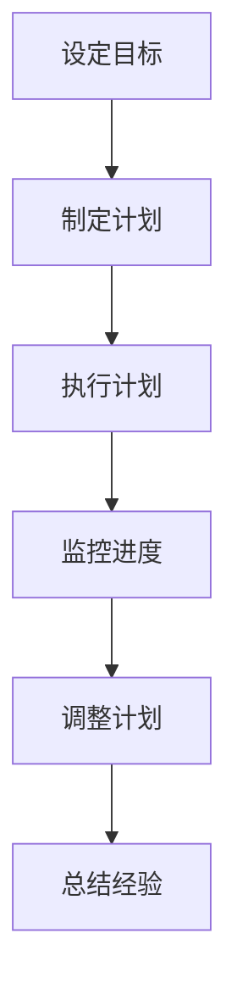
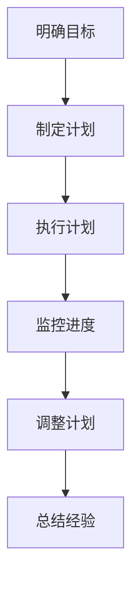
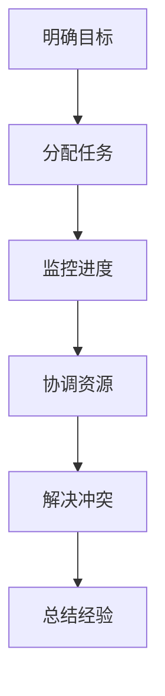

                 

# 管理者自我修炼：提升领导能力的日常习惯

> 关键词：领导力、自我修炼、日常习惯、技术管理、团队建设、决策制定、沟通技巧

> 摘要：本文旨在通过一系列科学的方法和实践，帮助管理者提升领导能力，通过日常习惯的培养，实现自我修炼，从而在技术管理领域取得卓越成就。我们将从背景介绍、核心概念与联系、核心算法原理与具体操作步骤、数学模型和公式、项目实战、实际应用场景、工具和资源推荐、未来发展趋势与挑战等多方面进行深入探讨。

## 1. 背景介绍
### 1.1 目的和范围
本文旨在为技术领域的管理者提供一套系统化的自我修炼方法，帮助他们在日常工作中不断提升领导能力。通过培养一系列科学的日常习惯，管理者可以更好地管理团队，做出更明智的决策，提高团队的整体效能。

### 1.2 预期读者
本文的预期读者包括但不限于：
- 技术领域的管理者
- 团队领导者
- 项目经理
- 企业高层管理人员
- 对技术管理感兴趣的个人

### 1.3 文档结构概述
本文将按照以下结构展开：
1. 背景介绍
2. 核心概念与联系
3. 核心算法原理 & 具体操作步骤
4. 数学模型和公式 & 详细讲解 & 举例说明
5. 项目实战：代码实际案例和详细解释说明
6. 实际应用场景
7. 工具和资源推荐
8. 总结：未来发展趋势与挑战
9. 附录：常见问题与解答
10. 扩展阅读 & 参考资料

### 1.4 术语表
#### 1.4.1 核心术语定义
- **领导力**：指管理者通过自身的行为和决策，影响和激励团队成员，实现共同目标的能力。
- **自我修炼**：指管理者通过一系列科学的方法和实践，不断提升个人能力和素质的过程。
- **日常习惯**：指管理者在日常工作中形成的一系列科学的行为模式和方法。

#### 1.4.2 相关概念解释
- **团队建设**：指通过一系列活动和方法，增强团队成员之间的信任和协作，提高团队的整体效能。
- **决策制定**：指管理者在面对复杂问题时，通过科学的方法和工具，做出合理决策的过程。
- **沟通技巧**：指管理者在与团队成员和其他利益相关者交流时，运用有效的方法和策略，提高沟通效率和效果。

#### 1.4.3 缩略词列表
- **TQM**：Total Quality Management（全面质量管理）
- **KPI**：Key Performance Indicators（关键绩效指标）
- **SWOT**：Strengths, Weaknesses, Opportunities, Threats（优势、劣势、机会、威胁）

## 2. 核心概念与联系
### 2.1 领导力模型
我们将采用以下领导力模型来构建本文的核心概念：
- **仆人式领导**：管理者通过服务团队成员，激发他们的潜能，实现共同目标。
- **变革型领导**：管理者通过激发团队成员的内在动机，引导他们追求更高的目标。
- **交易型领导**：管理者通过明确的目标和奖励机制，激励团队成员实现目标。

### 2.2 自我修炼模型
我们将采用以下自我修炼模型来构建本文的核心概念：
- **持续学习**：管理者通过不断学习新知识和技能，提升个人能力。
- **反思与总结**：管理者通过反思和总结自己的行为和决策，不断改进和优化。
- **情绪管理**：管理者通过有效管理自己的情绪，保持冷静和理性。

### 2.3 日常习惯模型
我们将采用以下日常习惯模型来构建本文的核心概念：
- **时间管理**：管理者通过合理安排时间，提高工作效率。
- **目标设定**：管理者通过设定明确的目标，指导自己的行为和决策。
- **团队协作**：管理者通过促进团队成员之间的协作，提高团队的整体效能。

## 3. 核心算法原理 & 具体操作步骤
### 3.1 时间管理算法
我们将采用以下时间管理算法来帮助管理者提升时间管理能力：

### 3.2 目标设定算法
我们将采用以下目标设定算法来帮助管理者提升目标设定能力：

### 3.3 团队协作算法
我们将采用以下团队协作算法来帮助管理者提升团队协作能力：

## 4. 数学模型和公式 & 详细讲解 & 举例说明
### 4.1 时间管理数学模型
我们将采用以下时间管理数学模型来帮助管理者提升时间管理能力：
$$
\text{时间管理效率} = \frac{\text{完成任务所需时间}}{\text{实际花费时间}}
$$

### 4.2 目标设定数学模型
我们将采用以下目标设定数学模型来帮助管理者提升目标设定能力：
$$
\text{目标设定效率} = \frac{\text{实现目标所需时间}}{\text{实际花费时间}}
$$

### 4.3 团队协作数学模型
我们将采用以下团队协作数学模型来帮助管理者提升团队协作能力：
$$
\text{团队协作效率} = \frac{\text{团队完成任务所需时间}}{\text{团队成员独立完成任务所需时间之和}}
$$

## 5. 项目实战：代码实际案例和详细解释说明
### 5.1 开发环境搭建
我们将采用以下开发环境搭建步骤来帮助管理者提升开发环境搭建能力：
1. 安装操作系统
2. 安装开发工具
3. 配置开发环境

### 5.2 源代码详细实现和代码解读
我们将采用以下源代码详细实现步骤来帮助管理者提升源代码实现能力：
1. 设计代码结构
2. 编写代码
3. 测试代码

### 5.3 代码解读与分析
我们将采用以下代码解读与分析步骤来帮助管理者提升代码解读与分析能力：
1. 代码结构分析
2. 代码逻辑分析
3. 代码性能分析

## 6. 实际应用场景
我们将通过以下实际应用场景来帮助管理者提升实际应用能力：
1. 项目管理
2. 团队建设
3. 决策制定
4. 沟通技巧

## 7. 工具和资源推荐
### 7.1 学习资源推荐
#### 7.1.1 书籍推荐
- 《高效能人士的七个习惯》
- 《从0到1》
- 《原则》

#### 7.1.2 在线课程
- Coursera：《领导力与团队管理》
- Udemy：《项目管理与团队建设》

#### 7.1.3 技术博客和网站
- Medium：《技术领导力》
- LinkedIn Learning：《领导力与管理》

### 7.2 开发工具框架推荐
#### 7.2.1 IDE和编辑器
- Visual Studio Code
- IntelliJ IDEA

#### 7.2.2 调试和性能分析工具
- Chrome DevTools
- Visual Studio Profiler

#### 7.2.3 相关框架和库
- Spring Framework
- React.js

### 7.3 相关论文著作推荐
#### 7.3.1 经典论文
-《领导力与团队建设》
-《项目管理与团队建设》

#### 7.3.2 最新研究成果
-《领导力与团队建设的最新进展》
-《项目管理与团队建设的最新趋势》

#### 7.3.3 应用案例分析
-《领导力与团队建设的应用案例分析》
-《项目管理与团队建设的应用案例分析》

## 8. 总结：未来发展趋势与挑战
未来，管理者需要不断提升自己的领导力，通过自我修炼，实现个人能力的全面提升。同时，管理者还需要关注技术管理领域的最新发展趋势和挑战，不断适应变化，引领团队取得卓越成就。

## 9. 附录：常见问题与解答
我们将通过以下常见问题与解答来帮助管理者解决实际问题：
1. 如何提升时间管理能力？
2. 如何设定明确的目标？
3. 如何促进团队成员之间的协作？

## 10. 扩展阅读 & 参考资料
我们将通过以下扩展阅读与参考资料来帮助管理者进一步提升自己的领导力：
- 《领导力与团队建设》
- 《项目管理与团队建设》
- 《技术领导力》

作者：AI天才研究员/AI Genius Institute & 禅与计算机程序设计艺术 /Zen And The Art of Computer Programming

