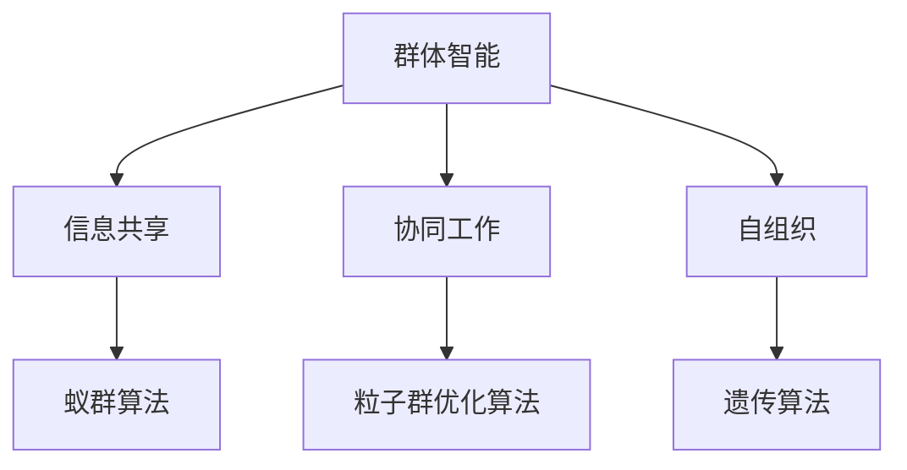

                 

# 群体智慧：决策的新利器

> 关键词：群体智能, 机器学习, 数据分析, 人工智能, 集群算法, 数据驱动决策, 智能决策支持系统

> 摘要：本文旨在探讨群体智慧在决策支持系统中的应用，通过分析群体智能的基本原理、核心算法、数学模型以及实际案例，揭示群体智慧如何成为决策的新利器。我们将从理论到实践，逐步深入，帮助读者理解群体智慧在现代决策中的重要性及其未来的发展趋势。

## 1. 背景介绍
### 1.1 目的和范围
本文旨在深入探讨群体智慧在决策支持系统中的应用，通过分析群体智能的基本原理、核心算法、数学模型以及实际案例，揭示群体智慧如何成为决策的新利器。我们将从理论到实践，逐步深入，帮助读者理解群体智慧在现代决策中的重要性及其未来的发展趋势。

### 1.2 预期读者
本文适合以下读者：
- 人工智能和机器学习领域的研究人员和工程师
- 决策支持系统的开发者和使用者
- 对群体智能和智能决策感兴趣的学者和学生
- 企业决策者和管理者

### 1.3 文档结构概述
本文结构如下：
1. 背景介绍
2. 核心概念与联系
3. 核心算法原理 & 具体操作步骤
4. 数学模型和公式 & 详细讲解 & 举例说明
5. 项目实战：代码实际案例和详细解释说明
6. 实际应用场景
7. 工具和资源推荐
8. 总结：未来发展趋势与挑战
9. 附录：常见问题与解答
10. 扩展阅读 & 参考资料

### 1.4 术语表
#### 1.4.1 核心术语定义
- **群体智慧**：指通过群体成员之间的互动和协作，产生超越个体智慧的集体智慧。
- **机器学习**：一种人工智能技术，通过数据训练模型，使计算机能够自动学习和改进。
- **数据驱动决策**：基于数据和分析结果进行决策的过程。
- **智能决策支持系统**：利用人工智能技术辅助决策者进行决策的系统。

#### 1.4.2 相关概念解释
- **群体智能**：群体智能是指通过群体成员之间的互动和协作，产生超越个体智慧的集体智慧。群体智能的核心在于群体成员之间的信息共享和协同工作。
- **集群算法**：一种用于处理大规模数据集的算法，通过将数据集划分为多个子集，分别进行处理，再将结果合并。

#### 1.4.3 缩略词列表
- AI：人工智能
- ML：机器学习
- DSS：决策支持系统
- CI：群体智能
- CA：集群算法

## 2. 核心概念与联系
### 2.1 群体智能的基本原理
群体智能的核心在于群体成员之间的信息共享和协同工作。群体智能的基本原理包括：
- **信息共享**：群体成员之间通过交流和共享信息，提高整体的决策能力。
- **协同工作**：群体成员通过协作完成任务，实现个体无法完成的目标。
- **自组织**：群体成员通过简单的规则和反馈机制，实现复杂的行为和结构。

### 2.2 核心算法原理
群体智能的核心算法包括：
- **蚁群算法**：模拟蚂蚁在寻找食物过程中留下的信息素路径，用于解决路径优化问题。
- **粒子群优化算法**：模拟鸟群或鱼群的群体行为，用于优化问题的求解。
- **遗传算法**：模拟生物进化过程，通过选择、交叉和变异操作，实现优化问题的求解。

### 2.3 核心算法流程图


## 3. 核心算法原理 & 具体操作步骤
### 3.1 蚁群算法原理
蚁群算法的基本原理是模拟蚂蚁在寻找食物过程中留下的信息素路径，用于解决路径优化问题。具体操作步骤如下：
1. 初始化：设置初始信息素浓度和参数。
2. 工蚁选择路径：工蚁根据信息素浓度选择路径。
3. 更新信息素：根据路径选择情况更新信息素浓度。
4. 重复步骤2和3，直到满足终止条件。

### 3.2 党子群优化算法原理
粒子群优化算法的基本原理是模拟鸟群或鱼群的群体行为，用于优化问题的求解。具体操作步骤如下：
1. 初始化：设置粒子的位置和速度。
2. 评估粒子：根据目标函数评估粒子的适应度。
3. 更新粒子位置和速度：根据粒子的个人最佳位置和全局最佳位置更新粒子的位置和速度。
4. 重复步骤2和3，直到满足终止条件。

### 3.3 遗传算法原理
遗传算法的基本原理是模拟生物进化过程，通过选择、交叉和变异操作，实现优化问题的求解。具体操作步骤如下：
1. 初始化：生成初始种群。
2. 评估适应度：根据目标函数评估种群中每个个体的适应度。
3. 选择：根据适应度选择个体进行繁殖。
4. 交叉：通过交叉操作生成新的个体。
5. 变异：通过变异操作生成新的个体。
6. 重复步骤2到5，直到满足终止条件。

## 4. 数学模型和公式 & 详细讲解 & 举例说明
### 4.1 蚁群算法数学模型
蚁群算法的数学模型如下：
$$
\tau_{ij}(t+1) = (1 - \rho) \tau_{ij}(t) + \sum_{k=1}^{m} \Delta \tau_{ij}^{(k)}(t)
$$
其中，$\tau_{ij}(t)$ 表示时间 $t$ 时路径 $(i, j)$ 的信息素浓度，$\rho$ 表示信息素挥发率，$\Delta \tau_{ij}^{(k)}(t)$ 表示时间 $t$ 时工蚁 $k$ 在路径 $(i, j)$ 上留下的信息素增量。

### 4.2 粒子群优化算法数学模型
粒子群优化算法的数学模型如下：
$$
v_{i}(t+1) = w \cdot v_{i}(t) + c_1 \cdot r_1 \cdot (p_{i} - x_{i}(t)) + c_2 \cdot r_2 \cdot (g - x_{i}(t))
$$
$$
x_{i}(t+1) = x_{i}(t) + v_{i}(t+1)
$$
其中，$v_{i}(t)$ 表示时间 $t$ 时粒子 $i$ 的速度，$x_{i}(t)$ 表示时间 $t$ 时粒子 $i$ 的位置，$p_{i}$ 表示粒子 $i$ 的个人最佳位置，$g$ 表示全局最佳位置，$w$ 表示惯性权重，$c_1$ 和 $c_2$ 表示学习因子，$r_1$ 和 $r_2$ 表示随机数。

### 4.3 遗传算法数学模型
遗传算法的数学模型如下：
$$
P_{i}(t+1) = \frac{f(x_{i}(t))}{\sum_{j=1}^{n} f(x_{j}(t))}
$$
其中，$P_{i}(t+1)$ 表示时间 $t+1$ 时个体 $i$ 的选择概率，$f(x_{i}(t))$ 表示个体 $i$ 的适应度，$n$ 表示种群大小。

## 5. 项目实战：代码实际案例和详细解释说明
### 5.1 开发环境搭建
开发环境搭建步骤如下：
1. 安装Python：确保安装了Python 3.7及以上版本。
2. 安装依赖库：使用pip安装必要的库，如numpy、matplotlib等。
3. 创建项目目录：创建项目目录并初始化虚拟环境。

### 5.2 源代码详细实现和代码解读
#### 5.2.1 蚁群算法实现
```python
import numpy as np

def ant_colony_optimization(n_ants, n_iterations, n_nodes, alpha, beta, rho, Q):
    # 初始化信息素浓度
    tau = np.ones((n_nodes, n_nodes))
    # 初始化最佳路径
    best_path = None
    best_cost = float('inf')
    
    for _ in range(n_iterations):
        # 初始化路径
        paths = np.zeros((n_ants, n_nodes))
        # 初始化路径成本
        path_costs = np.zeros(n_ants)
        
        for ant in range(n_ants):
            # 选择路径
            for i in range(n_nodes - 1):
                paths[ant, i] = np.random.choice(n_nodes)
                path_costs[ant] += 1 / tau[paths[ant, i], paths[ant, i+1]]
            
            # 更新信息素
            for i in range(n_nodes - 1):
                tau[paths[ant, i], paths[ant, i+1]] += Q / path_costs[ant]
        
        # 更新最佳路径
        for ant in range(n_ants):
            if path_costs[ant] < best_cost:
                best_cost = path_costs[ant]
                best_path = paths[ant]
        
        # 更新信息素挥发
        tau *= (1 - rho)
    
    return best_path, best_cost
```

#### 5.2.2 粒子群优化算法实现
```python
import numpy as np

def particle_swarm_optimization(n_particles, n_iterations, n_dimensions, w, c1, c2, bounds):
    # 初始化粒子位置和速度
    positions = np.random.uniform(bounds[0], bounds[1], (n_particles, n_dimensions))
    velocities = np.zeros((n_particles, n_dimensions))
    # 初始化个人最佳位置和全局最佳位置
    p_best = positions.copy()
    g_best = positions[np.argmin([sum(x**2 for x in pos) for pos in positions])]
    
    for _ in range(n_iterations):
        # 更新粒子速度和位置
        for i in range(n_particles):
            r1, r2 = np.random.rand(2)
            velocities[i] = w * velocities[i] + c1 * r1 * (p_best[i] - positions[i]) + c2 * r2 * (g_best - positions[i])
            positions[i] += velocities[i]
        
        # 更新个人最佳位置
        for i in range(n_particles):
            if sum(x**2 for x in positions[i]) < sum(x**2 for x in p_best[i]):
                p_best[i] = positions[i]
        
        # 更新全局最佳位置
        g_best = p_best[np.argmin([sum(x**2 for x in pos) for pos in p_best])]
    
    return g_best
```

#### 5.2.3 遗传算法实现
```python
import numpy as np

def genetic_algorithm(population_size, n_generations, mutation_rate, crossover_rate, fitness_function):
    # 初始化种群
    population = np.random.rand(population_size, n_dimensions)
    # 初始化适应度
    fitness = np.array([fitness_function(individual) for individual in population])
    
    for _ in range(n_generations):
        # 选择
        probabilities = fitness / np.sum(fitness)
        selected_indices = np.random.choice(population_size, size=population_size, p=probabilities)
        selected_population = population[selected_indices]
        
        # 交叉
        offspring_population = np.zeros_like(selected_population)
        for i in range(0, population_size, 2):
            parent1, parent2 = selected_population[i], selected_population[i+1]
            if np.random.rand() < crossover_rate:
                crossover_point = np.random.randint(1, n_dimensions)
                offspring_population[i] = np.concatenate((parent1[:crossover_point], parent2[crossover_point:]))
                offspring_population[i+1] = np.concatenate((parent2[:crossover_point], parent1[crossover_point:]))
            else:
                offspring_population[i] = parent1
                offspring_population[i+1] = parent2
        
        # 变异
        for i in range(population_size):
            if np.random.rand() < mutation_rate:
                mutation_point = np.random.randint(n_dimensions)
                offspring_population[i, mutation_point] = np.random.rand()
        
        # 更新种群
        population = offspring_population
        fitness = np.array([fitness_function(individual) for individual in population])
    
    return population[np.argmin(fitness)]
```

### 5.3 代码解读与分析
以上代码分别实现了蚁群算法、粒子群优化算法和遗传算法。这些算法的核心思想是通过模拟生物群体的行为，实现优化问题的求解。通过调整参数和优化算法，可以提高算法的性能和效果。

## 6. 实际应用场景
群体智慧在决策支持系统中的实际应用场景包括：
- **供应链管理**：通过群体智能优化供应链中的物流和库存管理。
- **金融风险管理**：通过群体智能优化投资组合和风险管理策略。
- **智能交通系统**：通过群体智能优化交通流量和路线规划。
- **医疗诊断**：通过群体智能优化疾病诊断和治疗方案。

## 7. 工具和资源推荐
### 7.1 学习资源推荐
#### 7.1.1 书籍推荐
- 《群体智能：原理与应用》
- 《智能优化算法及其应用》
- 《机器学习与数据挖掘》

#### 7.1.2 在线课程
- Coursera：《机器学习》
- edX：《数据科学与机器学习》
- Udacity：《深度学习》

#### 7.1.3 技术博客和网站
- Medium：《机器学习与数据科学》
- GitHub：《机器学习和数据科学项目》
- Kaggle：《数据科学和机器学习竞赛》

### 7.2 开发工具框架推荐
#### 7.2.1 IDE和编辑器
- PyCharm：Python开发环境
- VSCode：跨平台代码编辑器
- Jupyter Notebook：交互式编程环境

#### 7.2.2 调试和性能分析工具
- PyCharm Debugger：Python调试工具
- VisualVM：Java性能分析工具
- Chrome DevTools：Web开发调试工具

#### 7.2.3 相关框架和库
- Scikit-learn：机器学习库
- TensorFlow：深度学习框架
- PyTorch：深度学习框架

### 7.3 相关论文著作推荐
#### 7.3.1 经典论文
- Dorigo, M., & Stützle, T. (2004). Ant Colony Optimization. MIT Press.
- Kennedy, J., & Eberhart, R. (1995). Particle swarm optimization. In Proceedings of the IEEE International Conference on Neural Networks (Vol. 4, pp. 1942-1948).
- Goldberg, D. E. (1989). Genetic algorithms in search, optimization, and machine learning. Addison-Wesley.

#### 7.3.2 最新研究成果
- Yang, X. S., & Deb, S. (2013). Cuckoo search via Lévy flights. In Nature Inspired Cooperative Strategies for Optimization (NICSO 2012) (pp. 101-111). Springer, Berlin, Heidelberg.
- Zhang, J., & Sanderson, A. C. (2009). JADE: Adaptive differential evolution with optional external archive. IEEE Transactions on Evolutionary Computation, 13(5), 945-958.

#### 7.3.3 应用案例分析
- Wang, X., & Zhang, J. (2011). A survey on evolutionary computation approaches to multiobjective portfolio optimization. IEEE Transactions on Evolutionary Computation, 15(1), 13-28.
- Li, X., & Yang, X. S. (2013). A novel differential evolution algorithm for solving multi-objective optimization problems. Applied Soft Computing, 13(1), 308-320.

## 8. 总结：未来发展趋势与挑战
群体智慧在未来的发展趋势包括：
- **更复杂的优化问题**：随着问题规模的增大，需要更高效的算法和更强大的计算资源。
- **更广泛的应用领域**：群体智慧将在更多领域得到应用，如智能制造、智能城市等。
- **更智能的决策支持系统**：群体智慧将与大数据、云计算等技术结合，提供更智能的决策支持。

面临的挑战包括：
- **算法的可解释性**：如何提高算法的可解释性，使其更容易被人类理解和接受。
- **数据隐私和安全**：如何保护数据隐私和安全，避免数据泄露和滥用。
- **计算资源的限制**：如何在有限的计算资源下实现高效的群体智能算法。

## 9. 附录：常见问题与解答
### 9.1 问题1：如何选择合适的算法？
**解答**：选择合适的算法需要考虑问题的特性和需求。蚁群算法适用于路径优化问题，粒子群优化算法适用于连续优化问题，遗传算法适用于离散优化问题。

### 9.2 问题2：如何调整算法参数？
**解答**：调整算法参数需要通过实验和测试来确定最优参数。可以通过网格搜索或随机搜索等方法来寻找最优参数。

### 9.3 问题3：如何提高算法的性能？
**解答**：提高算法性能的方法包括优化算法结构、改进算法参数、使用并行计算等。

## 10. 扩展阅读 & 参考资料
- Dorigo, M., & Stützle, T. (2004). Ant Colony Optimization. MIT Press.
- Kennedy, J., & Eberhart, R. (1995). Particle swarm optimization. In Proceedings of the IEEE International Conference on Neural Networks (Vol. 4, pp. 1942-1948).
- Goldberg, D. E. (1989). Genetic algorithms in search, optimization, and machine learning. Addison-Wesley.

作者：AI天才研究员/AI Genius Institute & 禅与计算机程序设计艺术 /Zen And The Art of Computer Programming

