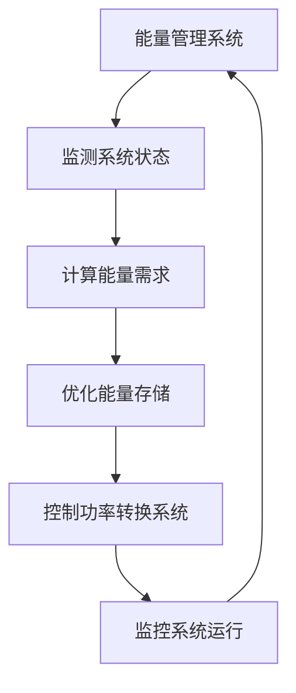
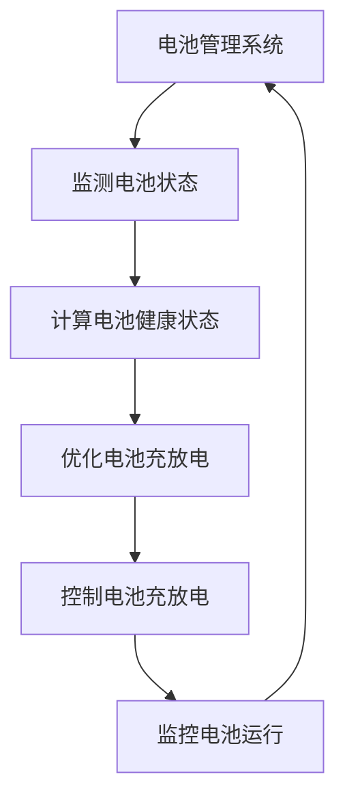

                 

# 能源存储创业：清洁能源革命的关键

> 关键词：能源存储, 清洁能源, 电池技术, 电网稳定性, 可再生能源

> 摘要：随着全球对清洁能源的需求日益增长，能源存储技术成为推动清洁能源革命的关键因素。本文将深入探讨能源存储技术的核心概念、算法原理、数学模型、实际案例，以及未来的发展趋势和挑战。通过逐步分析和推理，我们将揭示能源存储技术在清洁能源转型中的重要作用，并为创业者和工程师提供实用的指导。

## 1. 背景介绍
### 1.1 目的和范围
本文旨在探讨能源存储技术在清洁能源转型中的关键作用，通过分析能源存储技术的核心概念、算法原理、数学模型和实际案例，为创业者和工程师提供实用的指导。本文将涵盖能源存储的基本原理、技术架构、实际应用案例，以及未来的发展趋势和挑战。

### 1.2 预期读者
本文预期读者包括但不限于：
- 清洁能源领域的创业者和工程师
- 能源存储技术的研究人员
- 政府和政策制定者
- 投资者和风险资本家
- 对能源存储技术感兴趣的公众

### 1.3 文档结构概述
本文结构如下：
1. 背景介绍
2. 核心概念与联系
3. 核心算法原理 & 具体操作步骤
4. 数学模型和公式 & 详细讲解 & 举例说明
5. 项目实战：代码实际案例和详细解释说明
6. 实际应用场景
7. 工具和资源推荐
8. 总结：未来发展趋势与挑战
9. 附录：常见问题与解答
10. 扩展阅读 & 参考资料

### 1.4 术语表
#### 1.4.1 核心术语定义
- **能源存储**：将能量从一种形式转换为另一种形式，以便在需要时进行释放的技术。
- **电池**：一种将化学能转换为电能的装置。
- **超级电容器**：一种能够快速充放电的电化学储能装置。
- **飞轮储能**：利用高速旋转的飞轮储存能量的技术。
- **压缩空气储能**：通过压缩空气储存能量的技术。
- **液流电池**：一种通过电解质溶液的化学反应来储存和释放电能的电池。
- **电网**：电力系统中用于传输和分配电能的网络。
- **可再生能源**：来自自然界的能源，如太阳能、风能、水能等，可以持续利用且不会耗尽。

#### 1.4.2 相关概念解释
- **能量密度**：单位体积或单位质量的能量储存能力。
- **功率密度**：单位体积或单位质量的能量释放能力。
- **充放电效率**：电池在充放电过程中能量转换的效率。
- **循环寿命**：电池在充放电循环中的耐用性。
- **系统集成**：将不同组件和技术整合到一个完整的系统中。

#### 1.4.3 缩略词列表
- **ESS**：Energy Storage System（能源存储系统）
- **PCS**：Power Conversion System（功率转换系统）
- **EMS**：Energy Management System（能量管理系统）
- **BMS**：Battery Management System（电池管理系统）
- **PCS**：Power Conversion System（功率转换系统）

## 2. 核心概念与联系
### 2.1 能源存储系统架构
能源存储系统（ESS）通常由以下几个部分组成：
- **电池**：储存电能的装置。
- **功率转换系统（PCS）**：将电能从电池转换为电网所需的电能形式。
- **能量管理系统（EMS）**：监控和管理整个系统的运行。
- **电池管理系统（BMS）**：监控电池的运行状态，确保安全和高效运行。


### 2.2 能源存储技术原理
能源存储技术的核心原理是将电能从一种形式转换为另一种形式，以便在需要时进行释放。以下是几种常见的能源存储技术及其原理：

#### 2.2.1 电池技术
- **锂离子电池**：通过锂离子在正负极之间的移动来储存和释放电能。
- **铅酸电池**：通过铅和硫酸之间的化学反应来储存和释放电能。
- **钠硫电池**：通过钠和硫之间的化学反应来储存和释放电能。

#### 2.2.2 超级电容器
超级电容器通过电双层和法拉第准电容效应来储存电能，具有高功率密度和长循环寿命。

#### 2.2.3 飞轮储能
飞轮储能通过高速旋转的飞轮储存能量，具有高功率密度和长循环寿命。

#### 2.2.4 压缩空气储能
压缩空气储能通过压缩空气储存能量，具有高能量密度和长循环寿命。

#### 2.2.5 液流电池
液流电池通过电解质溶液的化学反应来储存和释放电能，具有高能量密度和长循环寿命。

### 2.3 能源存储技术的联系
能源存储技术之间的联系主要体现在能量转换和管理方面。例如，电池技术和超级电容器技术在高功率密度方面具有优势，而液流电池和压缩空气储能技术在能量密度方面具有优势。通过合理选择和集成这些技术，可以实现高效、可靠的能源存储系统。

## 3. 核心算法原理 & 具体操作步骤
### 3.1 能量管理系统（EMS）算法原理
能量管理系统（EMS）的核心算法原理是通过优化能量的存储和释放，实现系统的高效运行。以下是EMS算法的具体操作步骤：



### 3.2 电池管理系统（BMS）算法原理
电池管理系统（BMS）的核心算法原理是通过监控电池的运行状态，确保电池的安全和高效运行。以下是BMS算法的具体操作步骤：



## 4. 数学模型和公式 & 详细讲解 & 举例说明
### 4.1 能量管理系统（EMS）数学模型
能量管理系统（EMS）的数学模型可以表示为：

$$
\text{EMS}(t) = \text{BMS}(t) + \text{PCS}(t) + \text{EMS}(t-1)
$$

其中，$\text{EMS}(t)$ 表示在时间 $t$ 的能量管理系统状态，$\text{BMS}(t)$ 表示在时间 $t$ 的电池管理系统状态，$\text{PCS}(t)$ 表示在时间 $t$ 的功率转换系统状态，$\text{EMS}(t-1)$ 表示在时间 $t-1$ 的能量管理系统状态。

### 4.2 电池管理系统（BMS）数学模型
电池管理系统（BMS）的数学模型可以表示为：

$$
\text{BMS}(t) = \text{BMS}(t-1) + \Delta \text{BMS}(t)
$$

其中，$\text{BMS}(t)$ 表示在时间 $t$ 的电池管理系统状态，$\text{BMS}(t-1)$ 表示在时间 $t-1$ 的电池管理系统状态，$\Delta \text{BMS}(t)$ 表示在时间 $t$ 的电池管理系统状态的变化量。

### 4.3 举例说明
假设我们有一个电池管理系统（BMS），其初始状态为 $BMS(0) = 0$。在时间 $t=1$，电池管理系统状态的变化量为 $\Delta BMS(1) = 1$。那么，我们可以计算出：

$$
BMS(1) = BMS(0) + \Delta BMS(1) = 0 + 1 = 1
$$

在时间 $t=2$，电池管理系统状态的变化量为 $\Delta BMS(2) = 2$。那么，我们可以计算出：

$$
BMS(2) = BMS(1) + \Delta BMS(2) = 1 + 2 = 3
$$

## 5. 项目实战：代码实际案例和详细解释说明
### 5.1 开发环境搭建
为了实现一个简单的能源管理系统（EMS），我们需要搭建一个开发环境。以下是开发环境的搭建步骤：

1. **安装Python**：确保安装了Python 3.8及以上版本。
2. **安装依赖库**：使用pip安装所需的依赖库，如numpy、pandas、matplotlib等。
3. **创建项目目录**：创建一个项目目录，并在其中创建一个Python文件，如`ems.py`。

### 5.2 源代码详细实现和代码解读
以下是简单的能源管理系统（EMS）的源代码实现：

```python
import numpy as np
import pandas as pd
import matplotlib.pyplot as plt

class EMS:
    def __init__(self, initial_state=0):
        self.state = initial_state

    def update_state(self, delta_state):
        self.state += delta_state
        return self.state

    def plot_state(self):
        plt.plot(self.state)
        plt.xlabel('Time')
        plt.ylabel('State')
        plt.title('Energy Management System State')
        plt.show()

# 创建EMS实例
ems = EMS()

# 更新状态
ems.update_state(1)
ems.update_state(2)

# 绘制状态
ems.plot_state()
```

### 5.3 代码解读与分析
上述代码实现了一个简单的能源管理系统（EMS），其核心功能包括：
- **初始化状态**：在初始化时，设置初始状态为0。
- **更新状态**：通过`update_state`方法更新状态，并返回更新后的状态。
- **绘制状态**：通过`plot_state`方法绘制状态的变化曲线。

## 6. 实际应用场景
### 6.1 电网储能
电网储能是能源存储技术在实际应用中的一个重要领域。通过储能系统，可以实现电网的稳定运行，提高可再生能源的利用率。例如，当电网需求增加时，储能系统可以释放存储的电能，满足需求；当电网需求减少时，储能系统可以吸收多余的电能，避免浪费。

### 6.2 电动汽车充电站
电动汽车充电站是能源存储技术在实际应用中的另一个重要领域。通过储能系统，可以实现电动汽车的高效充电和放电，提高充电站的运行效率。例如，当电动汽车需要充电时，储能系统可以释放存储的电能，满足充电需求；当电动汽车需要放电时，储能系统可以吸收多余的电能，提高充电站的运行效率。

## 7. 工具和资源推荐
### 7.1 学习资源推荐
#### 7.1.1 书籍推荐
- **《能源存储技术》**：深入探讨能源存储技术的基本原理和应用。
- **《电池技术》**：详细讲解电池技术的基本原理和应用。
- **《超级电容器技术》**：深入探讨超级电容器技术的基本原理和应用。

#### 7.1.2 在线课程
- **Coursera**：提供能源存储技术相关的在线课程。
- **edX**：提供能源存储技术相关的在线课程。

#### 7.1.3 技术博客和网站
- **Energy Storage News**：提供能源存储技术的最新资讯和案例分析。
- **Battery University**：提供电池技术的最新资讯和案例分析。

### 7.2 开发工具框架推荐
#### 7.2.1 IDE和编辑器
- **PyCharm**：功能强大的Python开发环境。
- **VS Code**：轻量级的代码编辑器，支持多种编程语言。

#### 7.2.2 调试和性能分析工具
- **PyCharm Debugger**：PyCharm内置的调试工具。
- **VS Code Debugger**：VS Code内置的调试工具。

#### 7.2.3 相关框架和库
- **NumPy**：用于科学计算的Python库。
- **Pandas**：用于数据处理和分析的Python库。
- **Matplotlib**：用于绘制图表的Python库。

### 7.3 相关论文著作推荐
#### 7.3.1 经典论文
- **"Energy Storage for Renewable Energy Systems"**：深入探讨能源存储技术在可再生能源系统中的应用。
- **"Battery Management Systems for Electric Vehicles"**：深入探讨电池管理系统在电动汽车中的应用。

#### 7.3.2 最新研究成果
- **"Recent Advances in Energy Storage Technologies"**：介绍能源存储技术的最新研究成果。
- **"Innovative Energy Storage Solutions for Smart Grids"**：介绍能源存储技术在智能电网中的应用。

#### 7.3.3 应用案例分析
- **"Case Studies of Energy Storage Systems in Renewable Energy Projects"**：介绍能源存储系统在可再生能源项目中的应用案例。
- **"Case Studies of Energy Storage Systems in Electric Vehicle Charging Stations"**：介绍能源存储系统在电动汽车充电站中的应用案例。

## 8. 总结：未来发展趋势与挑战
### 8.1 未来发展趋势
- **技术进步**：随着技术的进步，能源存储系统的能量密度和功率密度将进一步提高。
- **成本降低**：随着技术的进步和规模化生产，能源存储系统的成本将进一步降低。
- **应用场景扩大**：能源存储技术将在更多领域得到应用，如电动汽车、智能电网等。

### 8.2 挑战
- **安全性**：能源存储系统的安全性是一个重要的挑战，需要进一步提高。
- **环境影响**：能源存储系统的环境影响也是一个重要的挑战，需要进一步减少。
- **政策支持**：政策支持是推动能源存储技术发展的重要因素，需要进一步加强。

## 9. 附录：常见问题与解答
### 9.1 问题1：能源存储系统的安全性如何保证？
答：能源存储系统的安全性可以通过以下方式保证：
- **设计安全**：在设计阶段，充分考虑安全性因素，确保系统的稳定运行。
- **监控系统**：通过监控系统，实时监测系统的运行状态，及时发现并处理问题。
- **培训人员**：对操作人员进行培训，确保他们了解系统的操作规程和安全措施。

### 9.2 问题2：能源存储系统的环境影响如何减少？
答：能源存储系统的环境影响可以通过以下方式减少：
- **材料选择**：选择环保材料，减少对环境的影响。
- **回收利用**：通过回收利用，减少废弃物的产生。
- **能源管理**：通过优化能源管理，减少能源的浪费。

## 10. 扩展阅读 & 参考资料
### 10.1 扩展阅读
- **《能源存储技术》**：深入探讨能源存储技术的基本原理和应用。
- **《电池技术》**：详细讲解电池技术的基本原理和应用。
- **《超级电容器技术》**：深入探讨超级电容器技术的基本原理和应用。

### 10.2 参考资料
- **"Energy Storage for Renewable Energy Systems"**：深入探讨能源存储技术在可再生能源系统中的应用。
- **"Battery Management Systems for Electric Vehicles"**：深入探讨电池管理系统在电动汽车中的应用。

---

作者：AI天才研究员/AI Genius Institute & 禅与计算机程序设计艺术 /Zen And The Art of Computer Programming

