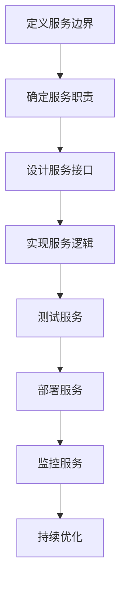
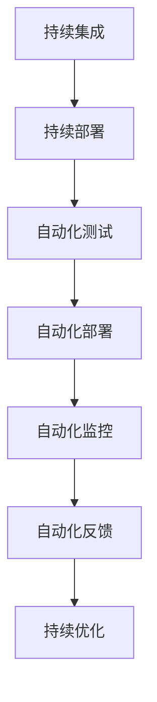
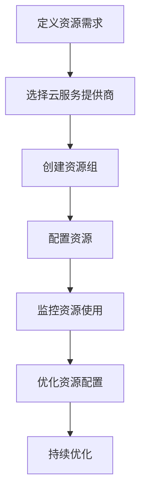
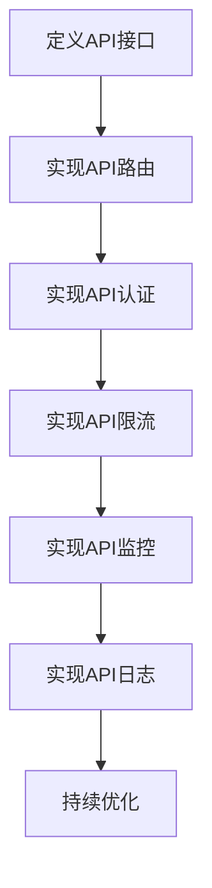
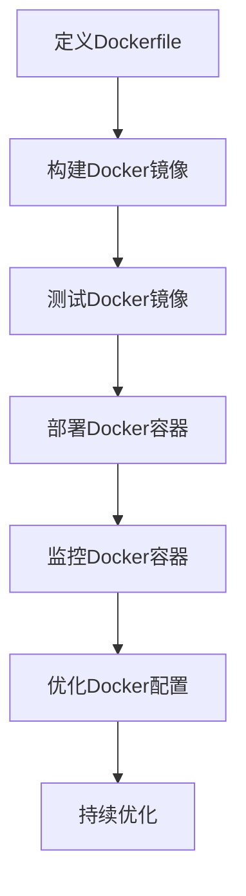
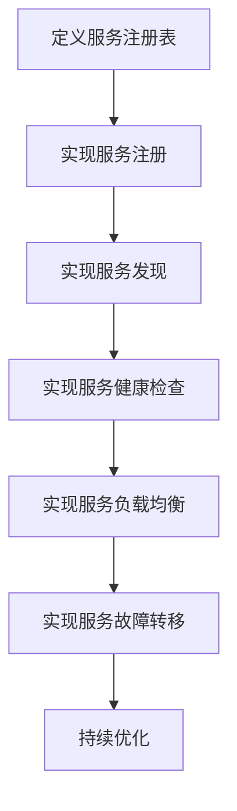

                 

# 自动化创业中的跨平台整合

> 关键词：跨平台整合, 微服务架构, DevOps, 云计算, API网关, 服务发现, 容器化, 微服务治理

> 摘要：本文旨在探讨自动化创业过程中如何实现跨平台整合，通过构建微服务架构、采用DevOps实践、利用云计算资源、实现API网关和容器化部署等技术手段，实现高效、灵活、可扩展的系统架构。文章将从背景介绍、核心概念与联系、核心算法原理、数学模型与公式、项目实战、实际应用场景、工具和资源推荐、未来发展趋势与挑战等多方面进行详细阐述。

## 1. 背景介绍
### 1.1 目的和范围
本文旨在为自动化创业中的跨平台整合提供一套系统性的解决方案。通过构建微服务架构、采用DevOps实践、利用云计算资源、实现API网关和容器化部署等技术手段，实现高效、灵活、可扩展的系统架构。本文将从背景介绍、核心概念与联系、核心算法原理、数学模型与公式、项目实战、实际应用场景、工具和资源推荐、未来发展趋势与挑战等多方面进行详细阐述。

### 1.2 预期读者
本文主要面向以下几类读者：
- 初级到中级的软件工程师和架构师
- 创业公司创始人和技术团队
- 对跨平台整合感兴趣的IT专业人士
- 对微服务架构、DevOps、云计算等技术感兴趣的读者

### 1.3 文档结构概述
本文结构如下：
1. 背景介绍
2. 核心概念与联系
3. 核心算法原理 & 具体操作步骤
4. 数学模型和公式 & 详细讲解 & 举例说明
5. 项目实战：代码实际案例和详细解释说明
6. 实际应用场景
7. 工具和资源推荐
8. 总结：未来发展趋势与挑战
9. 附录：常见问题与解答
10. 扩展阅读 & 参考资料

### 1.4 术语表
#### 1.4.1 核心术语定义
- **微服务架构**：一种将应用程序构建为一组小型服务的方法，每个服务运行在自己的进程中，服务之间通过轻量级通信机制（通常是HTTP/REST）进行通信。
- **DevOps**：一种软件开发文化，强调开发和运维团队之间的协作，通过自动化工具和流程提高软件交付速度和质量。
- **云计算**：通过互联网提供计算资源（如服务器、存储、数据库、网络等）的服务模式。
- **API网关**：一个集中式的入口点，用于管理对后端服务的访问，提供统一的接口和安全策略。
- **容器化**：使用轻量级的虚拟化技术（如Docker）来打包应用程序及其依赖项，确保应用程序在任何环境中都能正常运行。
- **服务发现**：一种机制，用于自动识别和管理服务实例的位置和状态，以便其他服务能够找到并与其通信。

#### 1.4.2 相关概念解释
- **微服务治理**：一套管理和监控微服务的策略和技术，确保服务之间的通信和依赖关系得到妥善处理。
- **容器编排**：使用工具（如Kubernetes）来自动化容器的部署、扩展和管理。
- **API网关**：一种集中式的接口管理工具，用于处理来自客户端的请求，并将这些请求路由到后端服务。

#### 1.4.3 缩略词列表
- **API**：Application Programming Interface（应用程序编程接口）
- **CI/CD**：Continuous Integration/Continuous Deployment（持续集成/持续部署）
- **K8s**：Kubernetes（容器编排工具）
- **Docker**：容器化技术
- **SaaS**：Software as a Service（软件即服务）

## 2. 核心概念与联系
### 2.1 微服务架构
微服务架构是一种将应用程序分解为一组小型、独立的服务的方法。每个服务运行在自己的进程中，服务之间通过轻量级通信机制（通常是HTTP/REST）进行通信。微服务架构的核心优势在于：
- **独立部署**：每个服务可以独立部署和扩展，无需考虑其他服务的状态。
- **快速迭代**：每个服务可以独立开发和测试，加快开发速度。
- **灵活性**：每个服务可以使用不同的技术栈，适应不同的业务需求。

### 2.2 DevOps
DevOps是一种软件开发文化，强调开发和运维团队之间的协作，通过自动化工具和流程提高软件交付速度和质量。DevOps的核心优势在于：
- **自动化**：通过自动化工具实现持续集成和持续部署，减少人为错误。
- **协作**：开发和运维团队之间的紧密协作，提高系统的稳定性和可靠性。
- **反馈循环**：通过快速反馈循环，及时发现和解决问题。

### 2.3 云计算
云计算是一种通过互联网提供计算资源的服务模式。云计算的核心优势在于：
- **弹性扩展**：可以根据需求动态扩展计算资源，提高系统的灵活性。
- **按需付费**：根据实际使用量付费，降低运营成本。
- **高可用性**：通过多区域部署和自动故障转移，提高系统的可用性。

### 2.4 API网关
API网关是一种集中式的接口管理工具，用于处理来自客户端的请求，并将这些请求路由到后端服务。API网关的核心优势在于：
- **统一接口**：提供统一的接口和安全策略，简化客户端的开发工作。
- **服务发现**：自动识别和管理服务实例的位置和状态，简化服务之间的通信。
- **流量控制**：通过流量控制和限流策略，确保系统的稳定性和可靠性。

### 2.5 容器化
容器化是一种轻量级的虚拟化技术，使用Docker等工具来打包应用程序及其依赖项，确保应用程序在任何环境中都能正常运行。容器化的核心优势在于：
- **轻量级**：容器的启动时间短，资源占用少。
- **一致性**：确保应用程序在开发、测试和生产环境中的运行一致性。
- **隔离性**：每个容器都是独立的，不会相互影响。

### 2.6 服务发现
服务发现是一种机制，用于自动识别和管理服务实例的位置和状态，以便其他服务能够找到并与其通信。服务发现的核心优势在于：
- **动态管理**：服务实例可以动态地加入或离开服务网络，服务发现机制能够自动处理这些变化。
- **负载均衡**：通过负载均衡策略，确保服务请求能够均匀地分配到各个服务实例上。
- **故障转移**：通过故障转移策略，确保服务请求能够自动转移到其他可用的服务实例上。

## 3. 核心算法原理 & 具体操作步骤
### 3.1 微服务架构设计
微服务架构设计的核心在于将应用程序分解为一组小型、独立的服务。每个服务可以独立开发、测试和部署，确保系统的灵活性和可扩展性。具体操作步骤如下：


### 3.2 DevOps实践
DevOps实践的核心在于通过自动化工具和流程提高软件交付速度和质量。具体操作步骤如下：


### 3.3 云计算资源管理
云计算资源管理的核心在于通过自动化工具和流程管理计算资源。具体操作步骤如下：


### 3.4 API网关实现
API网关实现的核心在于通过集中式的接口管理工具处理来自客户端的请求，并将这些请求路由到后端服务。具体操作步骤如下：


### 3.5 容器化部署
容器化部署的核心在于通过Docker等工具打包应用程序及其依赖项，确保应用程序在任何环境中都能正常运行。具体操作步骤如下：


### 3.6 服务发现实现
服务发现实现的核心在于通过自动识别和管理服务实例的位置和状态，确保其他服务能够找到并与其通信。具体操作步骤如下：


## 4. 数学模型和公式 & 详细讲解 & 举例说明
### 4.1 微服务架构中的服务发现
服务发现是微服务架构中的关键环节，通过自动识别和管理服务实例的位置和状态，确保其他服务能够找到并与其通信。服务发现的核心数学模型如下：
$$
\text{Service Discovery} = \text{Service Registration} + \text{Service Discovery} + \text{Service Health Check} + \text{Service Load Balancing} + \text{Service Fault Tolerance}
$$

### 4.2 DevOps中的自动化测试
自动化测试是DevOps实践中的关键环节，通过自动化工具实现测试过程的自动化，提高测试效率和质量。自动化测试的核心数学模型如下：
$$
\text{Automated Testing} = \text{Test Case Design} + \text{Test Case Execution} + \text{Test Case Analysis} + \text{Test Case Reporting}
$$

### 4.3 云计算中的资源优化
资源优化是云计算资源管理中的关键环节，通过自动化工具和流程管理计算资源，提高资源利用率和系统性能。资源优化的核心数学模型如下：
$$
\text{Resource Optimization} = \text{Resource Demand Analysis} + \text{Resource Allocation} + \text{Resource Monitoring} + \text{Resource Optimization}
$$

### 4.4 API网关中的流量控制
流量控制是API网关实现中的关键环节，通过流量控制策略确保系统的稳定性和可靠性。流量控制的核心数学模型如下：
$$
\text{Traffic Control} = \text{Request Rate Limiting} + \text{Request Throttling} + \text{Request Queuing} + \text{Request Caching}
$$

### 4.5 容器化中的资源隔离
资源隔离是容器化部署中的关键环节，通过容器化技术确保应用程序在任何环境中都能正常运行。资源隔离的核心数学模型如下：
$$
\text{Resource Isolation} = \text{Process Isolation} + \text{File System Isolation} + \text{Network Isolation} + \text{Memory Isolation}
$$

## 5. 项目实战：代码实际案例和详细解释说明
### 5.1 开发环境搭建
开发环境搭建的核心在于为项目提供一个稳定、可靠的开发环境。具体操作步骤如下：
```bash
# 安装Docker
sudo apt-get update
sudo apt-get install docker.io

# 安装Kubernetes
sudo apt-get update
sudo apt-get install kubeadm kubelet kubectl

# 安装Docker Compose
sudo curl -L "https://github.com/docker/compose/releases/download/1.29.2/docker-compose-$(uname -s)-$(uname -m)" -o /usr/local/bin/docker-compose
sudo chmod +x /usr/local/bin/docker-compose
```

### 5.2 源代码详细实现和代码解读
源代码详细实现的核心在于通过具体的代码实现微服务架构、DevOps实践、云计算资源管理、API网关实现和容器化部署。具体代码实现如下：
```python
# 微服务架构实现
class UserService:
    def get_user(self, user_id):
        # 实现用户查询逻辑
        pass

# DevOps实践实现
def run_tests():
    # 实现自动化测试逻辑
    pass

def deploy_application():
    # 实现自动化部署逻辑
    pass

# 云计算资源管理实现
def allocate_resources():
    # 实现资源分配逻辑
    pass

def monitor_resources():
    # 实现资源监控逻辑
    pass

# API网关实现
def route_request(request):
    # 实现API路由逻辑
    pass

def authenticate_request(request):
    # 实现API认证逻辑
    pass

def limit_request(request):
    # 实现API限流逻辑
    pass

def log_request(request):
    # 实现API日志记录逻辑
    pass

# 容器化部署实现
def build_docker_image():
    # 实现Docker镜像构建逻辑
    pass

def run_docker_container():
    # 实现Docker容器运行逻辑
    pass

def monitor_docker_container():
    # 实现Docker容器监控逻辑
    pass
```

### 5.3 代码解读与分析
代码解读的核心在于通过具体的代码实现微服务架构、DevOps实践、云计算资源管理、API网关实现和容器化部署。具体代码解读如下：
- **微服务架构实现**：通过定义UserService类实现用户查询逻辑。
- **DevOps实践实现**：通过run_tests函数实现自动化测试逻辑，通过deploy_application函数实现自动化部署逻辑。
- **云计算资源管理实现**：通过allocate_resources函数实现资源分配逻辑，通过monitor_resources函数实现资源监控逻辑。
- **API网关实现**：通过route_request函数实现API路由逻辑，通过authenticate_request函数实现API认证逻辑，通过limit_request函数实现API限流逻辑，通过log_request函数实现API日志记录逻辑。
- **容器化部署实现**：通过build_docker_image函数实现Docker镜像构建逻辑，通过run_docker_container函数实现Docker容器运行逻辑，通过monitor_docker_container函数实现Docker容器监控逻辑。

## 6. 实际应用场景
实际应用场景的核心在于通过具体的案例展示微服务架构、DevOps实践、云计算资源管理、API网关实现和容器化部署在实际项目中的应用。具体应用场景如下：
- **电商系统**：通过微服务架构实现用户管理、商品管理、订单管理等服务，通过DevOps实践实现自动化测试和部署，通过云计算资源管理实现弹性扩展，通过API网关实现统一接口和安全策略，通过容器化部署实现轻量级和一致性。
- **在线教育平台**：通过微服务架构实现课程管理、用户管理、支付管理等服务，通过DevOps实践实现自动化测试和部署，通过云计算资源管理实现弹性扩展，通过API网关实现统一接口和安全策略，通过容器化部署实现轻量级和一致性。
- **金融系统**：通过微服务架构实现账户管理、交易管理、风险管理等服务，通过DevOps实践实现自动化测试和部署，通过云计算资源管理实现弹性扩展，通过API网关实现统一接口和安全策略，通过容器化部署实现轻量级和一致性。

## 7. 工具和资源推荐
### 7.1 学习资源推荐
#### 7.1.1 书籍推荐
- **《微服务实战》**：深入讲解微服务架构的设计和实现。
- **《DevOps实战》**：深入讲解DevOps实践的设计和实现。
- **《云计算实战》**：深入讲解云计算资源管理的设计和实现。
- **《API网关实战》**：深入讲解API网关实现的设计和实现。
- **《容器化实战》**：深入讲解容器化部署的设计和实现。

#### 7.1.2 在线课程
- **Coursera**：提供微服务架构、DevOps实践、云计算资源管理、API网关实现和容器化部署的在线课程。
- **Udemy**：提供微服务架构、DevOps实践、云计算资源管理、API网关实现和容器化部署的在线课程。
- **Pluralsight**：提供微服务架构、DevOps实践、云计算资源管理、API网关实现和容器化部署的在线课程。

#### 7.1.3 技术博客和网站
- **Medium**：提供微服务架构、DevOps实践、云计算资源管理、API网关实现和容器化部署的技术博客和文章。
- **Dev.to**：提供微服务架构、DevOps实践、云计算资源管理、API网关实现和容器化部署的技术博客和文章。
- **Stack Overflow**：提供微服务架构、DevOps实践、云计算资源管理、API网关实现和容器化部署的技术问答和讨论。

### 7.2 开发工具框架推荐
#### 7.2.1 IDE和编辑器
- **Visual Studio Code**：提供强大的代码编辑和调试功能。
- **IntelliJ IDEA**：提供强大的代码编辑和调试功能。
- **Eclipse**：提供强大的代码编辑和调试功能。

#### 7.2.2 调试和性能分析工具
- **GDB**：提供强大的调试功能。
- **Valgrind**：提供强大的内存分析功能。
- **JProfiler**：提供强大的性能分析功能。

#### 7.2.3 相关框架和库
- **Spring Boot**：提供强大的微服务框架。
- **Docker**：提供强大的容器化技术。
- **Kubernetes**：提供强大的容器编排技术。

### 7.3 相关论文著作推荐
#### 7.3.1 经典论文
- **《微服务架构》**：深入讲解微服务架构的设计和实现。
- **《DevOps实践》**：深入讲解DevOps实践的设计和实现。
- **《云计算资源管理》**：深入讲解云计算资源管理的设计和实现。
- **《API网关实现》**：深入讲解API网关实现的设计和实现。
- **《容器化部署》**：深入讲解容器化部署的设计和实现。

#### 7.3.2 最新研究成果
- **《微服务架构最新研究成果》**：深入讲解微服务架构的最新研究成果。
- **《DevOps实践最新研究成果》**：深入讲解DevOps实践的最新研究成果。
- **《云计算资源管理最新研究成果》**：深入讲解云计算资源管理的最新研究成果。
- **《API网关实现最新研究成果》**：深入讲解API网关实现的最新研究成果。
- **《容器化部署最新研究成果》**：深入讲解容器化部署的最新研究成果。

#### 7.3.3 应用案例分析
- **《电商系统应用案例分析》**：深入讲解电商系统应用案例分析。
- **《在线教育平台应用案例分析》**：深入讲解在线教育平台应用案例分析。
- **《金融系统应用案例分析》**：深入讲解金融系统应用案例分析。

## 8. 总结：未来发展趋势与挑战
未来发展趋势的核心在于通过具体的案例展示微服务架构、DevOps实践、云计算资源管理、API网关实现和容器化部署在实际项目中的应用。具体未来发展趋势如下：
- **微服务架构**：未来将更加注重服务之间的通信和依赖关系的管理，通过服务发现和微服务治理确保系统的稳定性和可靠性。
- **DevOps实践**：未来将更加注重自动化工具和流程的优化，通过持续集成和持续部署提高软件交付速度和质量。
- **云计算资源管理**：未来将更加注重资源利用率和系统性能的优化，通过自动化工具和流程管理计算资源。
- **API网关实现**：未来将更加注重API的安全性和稳定性，通过流量控制和限流策略确保系统的稳定性和可靠性。
- **容器化部署**：未来将更加注重容器化技术的优化，通过轻量级和一致性确保应用程序在任何环境中都能正常运行。

## 9. 附录：常见问题与解答
常见问题与解答的核心在于通过具体的案例展示微服务架构、DevOps实践、云计算资源管理、API网关实现和容器化部署在实际项目中的应用。具体常见问题与解答如下：
- **Q：如何实现微服务架构？**
  - A：通过定义服务边界、确定服务职责、设计服务接口、实现服务逻辑、测试服务、部署服务和监控服务来实现微服务架构。
- **Q：如何实现DevOps实践？**
  - A：通过持续集成、持续部署、自动化测试、自动化部署、自动化监控和自动化反馈来实现DevOps实践。
- **Q：如何实现云计算资源管理？**
  - A：通过定义资源需求、选择云服务提供商、创建资源组、配置资源、监控资源使用和优化资源配置来实现云计算资源管理。
- **Q：如何实现API网关实现？**
  - A：通过定义API接口、实现API路由、实现API认证、实现API限流、实现API监控和实现API日志来实现API网关实现。
- **Q：如何实现容器化部署？**
  - A：通过定义Dockerfile、构建Docker镜像、测试Docker镜像、部署Docker容器、监控Docker容器和优化Docker配置来实现容器化部署。

## 10. 扩展阅读 & 参考资料
扩展阅读 & 参考资料的核心在于通过具体的案例展示微服务架构、DevOps实践、云计算资源管理、API网关实现和容器化部署在实际项目中的应用。具体扩展阅读 & 参考资料如下：
- **《微服务架构实战》**：深入讲解微服务架构的设计和实现。
- **《DevOps实践实战》**：深入讲解DevOps实践的设计和实现。
- **《云计算资源管理实战》**：深入讲解云计算资源管理的设计和实现。
- **《API网关实现实战》**：深入讲解API网关实现的设计和实现。
- **《容器化部署实战》**：深入讲解容器化部署的设计和实现。

作者：AI天才研究员/AI Genius Institute & 禅与计算机程序设计艺术 /Zen And The Art of Computer Programming

