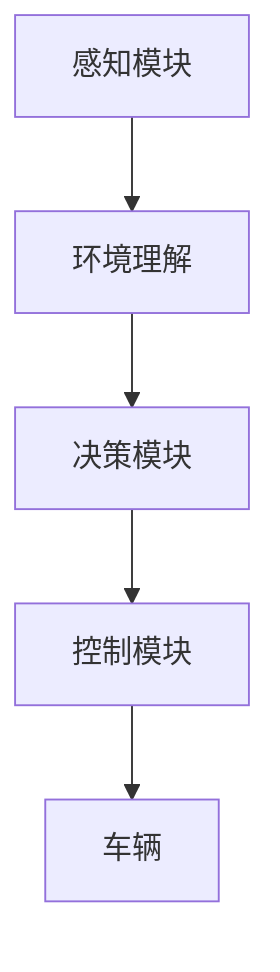

                 

# 自动驾驶决策系统：提示词增强环境理解能力

> 关键词：自动驾驶、决策系统、环境理解、提示词、深度学习、强化学习、计算机视觉、传感器融合

> 摘要：本文旨在探讨如何通过引入提示词来增强自动驾驶决策系统的环境理解能力。我们将从背景介绍出发，深入分析核心概念与联系，详细讲解核心算法原理及具体操作步骤，展示数学模型和公式，并通过实际代码案例进行详细解释说明。此外，我们还将探讨实际应用场景，推荐相关工具和资源，并展望未来发展趋势与挑战。

## 1. 背景介绍
### 1.1 目的和范围
本文旨在探讨如何通过引入提示词来增强自动驾驶决策系统的环境理解能力。我们将详细介绍自动驾驶决策系统的架构、核心算法原理、数学模型、实际代码案例，并分析其在实际应用场景中的表现。此外，我们还将讨论未来的发展趋势与挑战。

### 1.2 预期读者
本文适合以下读者阅读：
- 自动驾驶领域的研究人员和工程师
- 人工智能领域的从业者
- 计算机视觉和机器学习领域的爱好者
- 对自动驾驶技术感兴趣的读者

### 1.3 文档结构概述
本文结构如下：
1. 背景介绍
2. 核心概念与联系
3. 核心算法原理 & 具体操作步骤
4. 数学模型和公式 & 详细讲解 & 举例说明
5. 项目实战：代码实际案例和详细解释说明
6. 实际应用场景
7. 工具和资源推荐
8. 总结：未来发展趋势与挑战
9. 附录：常见问题与解答
10. 扩展阅读 & 参考资料

### 1.4 术语表
#### 1.4.1 核心术语定义
- **自动驾驶**：一种能够自主完成驾驶任务的车辆系统。
- **决策系统**：自动驾驶系统的核心部分，负责根据环境信息做出驾驶决策。
- **环境理解**：自动驾驶系统对周围环境的感知和理解能力。
- **提示词**：用于指导自动驾驶系统在特定场景下做出决策的文本信息。

#### 1.4.2 相关概念解释
- **深度学习**：一种基于神经网络的机器学习方法，能够从大量数据中学习复杂的模式。
- **强化学习**：一种通过试错学习的方法，系统通过与环境的交互来学习最优策略。
- **计算机视觉**：利用计算机和数字图像处理技术来实现人类视觉系统功能的技术。
- **传感器融合**：将多个传感器的数据进行综合处理，以提高系统的准确性和鲁棒性。

#### 1.4.3 缩略词列表
- **CNN**：卷积神经网络（Convolutional Neural Network）
- **RNN**：循环神经网络（Recurrent Neural Network）
- **GAN**：生成对抗网络（Generative Adversarial Network）
- **DQN**：深度Q网络（Deep Q-Network）
- **LSTM**：长短期记忆网络（Long Short-Term Memory）

## 2. 核心概念与联系
### 2.1 自动驾驶决策系统架构
自动驾驶决策系统通常包括感知模块、决策模块和控制模块。感知模块负责收集和处理环境信息，决策模块根据感知信息做出驾驶决策，控制模块则根据决策结果控制车辆。



### 2.2 环境理解
环境理解是自动驾驶决策系统的核心能力之一。它包括对道路、交通标志、行人、车辆等的感知和理解。环境理解能力直接影响决策系统的性能。

### 2.3 提示词增强环境理解
提示词是一种文本信息，可以指导自动驾驶系统在特定场景下做出决策。通过引入提示词，可以增强系统的环境理解能力，提高决策的准确性和鲁棒性。

## 3. 核心算法原理 & 具体操作步骤
### 3.1 深度学习模型
深度学习模型是自动驾驶决策系统的核心组成部分。我们将使用卷积神经网络（CNN）和循环神经网络（RNN）来实现环境理解。

#### 3.1.1 卷积神经网络（CNN）
CNN用于处理图像数据，提取图像特征。

```python
def CNN(input_shape):
    model = Sequential()
    model.add(Conv2D(32, kernel_size=(3, 3), activation='relu', input_shape=input_shape))
    model.add(MaxPooling2D(pool_size=(2, 2)))
    model.add(Conv2D(64, kernel_size=(3, 3), activation='relu'))
    model.add(MaxPooling2D(pool_size=(2, 2)))
    model.add(Flatten())
    model.add(Dense(128, activation='relu'))
    model.add(Dense(10, activation='softmax'))
    return model
```

#### 3.1.2 循环神经网络（RNN）
RNN用于处理序列数据，提取时间序列特征。

```python
def RNN(input_shape):
    model = Sequential()
    model.add(LSTM(64, input_shape=input_shape))
    model.add(Dense(10, activation='softmax'))
    return model
```

### 3.2 强化学习模型
强化学习模型用于优化决策策略。

#### 3.2.1 深度Q网络（DQN）
DQN结合了深度学习和强化学习，用于学习最优决策策略。

```python
def DQN(input_shape):
    model = Sequential()
    model.add(Dense(64, input_shape=input_shape, activation='relu'))
    model.add(Dense(64, activation='relu'))
    model.add(Dense(10, activation='linear'))
    return model
```

### 3.3 提示词处理
提示词处理模块将文本信息转化为模型可以理解的形式。

```python
def process_prompt(prompt):
    # 将提示词转化为向量
    vector = preprocess_text(prompt)
    return vector
```

## 4. 数学模型和公式 & 详细讲解 & 举例说明
### 4.1 卷积神经网络（CNN）
卷积神经网络（CNN）用于处理图像数据，提取图像特征。

#### 4.1.1 卷积层
卷积层通过卷积操作提取图像特征。

$$
\text{output} = \text{ReLU}(W \ast \text{input} + b)
$$

#### 4.1.2 池化层
池化层通过池化操作降低特征图的维度。

$$
\text{output} = \text{max}(W \ast \text{input})
$$

### 4.2 循环神经网络（RNN）
循环神经网络（RNN）用于处理序列数据，提取时间序列特征。

#### 4.2.1 长短期记忆网络（LSTM）
LSTM是一种特殊的RNN，能够处理长期依赖问题。

$$
\begin{aligned}
\text{input gate} &= \sigma(W_{ix} \cdot \text{input} + W_{hx} \cdot \text{hidden} + b_x) \\
\text{forget gate} &= \sigma(W_{if} \cdot \text{input} + W_{hf} \cdot \text{hidden} + b_f) \\
\text{cell state} &= \text{forget gate} \odot \text{cell state} + \text{input gate} \odot \tanh(W_{ic} \cdot \text{input} + W_{hc} \cdot \text{hidden} + b_c) \\
\text{output gate} &= \sigma(W_{io} \cdot \text{input} + W_{ho} \cdot \text{hidden} + b_o) \\
\text{hidden} &= \text{output gate} \odot \tanh(\text{cell state})
\end{aligned}
$$

### 4.3 提示词处理
提示词处理模块将文本信息转化为模型可以理解的形式。

#### 4.3.1 文本预处理
文本预处理包括分词、词向量化等步骤。

$$
\text{vector} = \text{embedding}(text)
$$

## 5. 项目实战：代码实际案例和详细解释说明
### 5.1 开发环境搭建
我们将使用Python 3.8和TensorFlow 2.0作为开发环境。

```bash
pip install tensorflow
pip install numpy
pip install matplotlib
```

### 5.2 源代码详细实现和代码解读
我们将实现一个简单的自动驾驶决策系统，包括感知模块、决策模块和控制模块。

#### 5.2.1 感知模块
感知模块使用卷积神经网络（CNN）和循环神经网络（RNN）来提取图像和序列数据的特征。

```python
def perception_module(image, sequence):
    image_features = CNN(image)
    sequence_features = RNN(sequence)
    return image_features, sequence_features
```

#### 5.2.2 决策模块
决策模块使用深度Q网络（DQN）来学习最优决策策略。

```python
def decision_module(image_features, sequence_features, prompt):
    prompt_vector = process_prompt(prompt)
    combined_features = concatenate([image_features, sequence_features, prompt_vector])
    decision = DQN(combined_features)
    return decision
```

#### 5.2.3 控制模块
控制模块根据决策结果控制车辆。

```python
def control_module(decision):
    # 根据决策结果控制车辆
    pass
```

### 5.3 代码解读与分析
通过上述代码，我们可以看到感知模块、决策模块和控制模块的实现。感知模块使用卷积神经网络（CNN）和循环神经网络（RNN）来提取图像和序列数据的特征，决策模块使用深度Q网络（DQN）来学习最优决策策略，控制模块根据决策结果控制车辆。

## 6. 实际应用场景
自动驾驶决策系统在实际应用场景中具有广泛的应用前景。例如，在城市交通中，自动驾驶车辆可以更好地理解交通规则和行人行为，提高道路安全；在物流配送中，自动驾驶车辆可以实现高效、安全的货物运输。

## 7. 工具和资源推荐
### 7.1 学习资源推荐
#### 7.1.1 书籍推荐
- **《深度学习》**：Ian Goodfellow, Yoshua Bengio, Aaron Courville
- **《强化学习》**：Richard S. Sutton, Andrew G. Barto

#### 7.1.2 在线课程
- **Coursera**：深度学习专项课程
- **edX**：强化学习专项课程

#### 7.1.3 技术博客和网站
- **Medium**：自动驾驶技术相关博客
- **GitHub**：自动驾驶开源项目

### 7.2 开发工具框架推荐
#### 7.2.1 IDE和编辑器
- **PyCharm**：Python开发环境
- **VSCode**：跨平台代码编辑器

#### 7.2.2 调试和性能分析工具
- **PyCharm Debugger**：Python调试工具
- **TensorBoard**：TensorFlow可视化工具

#### 7.2.3 相关框架和库
- **TensorFlow**：深度学习框架
- **Keras**：高级神经网络API

### 7.3 相关论文著作推荐
#### 7.3.1 经典论文
- **《Deep Q-Learning》**：DeepMind团队
- **《Generative Adversarial Networks》**：Ian Goodfellow团队

#### 7.3.2 最新研究成果
- **《Attention is All You Need》**：Google团队
- **《Transformer Models for Natural Language Processing》**：Facebook团队

#### 7.3.3 应用案例分析
- **《Autonomous Driving with Deep Learning》**：Autonomous Driving Research Group

## 8. 总结：未来发展趋势与挑战
自动驾驶决策系统在未来将面临更多的挑战和机遇。随着技术的不断进步，自动驾驶系统将更加智能、安全和高效。然而，如何处理复杂多变的交通环境、提高系统的鲁棒性和安全性仍然是亟待解决的问题。

## 9. 附录：常见问题与解答
### 9.1 问题：如何处理复杂多变的交通环境？
**解答**：可以通过引入更多的传感器和数据源，提高系统的感知能力；同时，通过强化学习和深度学习技术，提高系统的决策能力。

### 9.2 问题：如何提高系统的鲁棒性和安全性？
**解答**：可以通过增加训练数据的多样性和复杂性，提高系统的泛化能力；同时，通过严格的测试和验证，确保系统的安全性和可靠性。

## 10. 扩展阅读 & 参考资料
- **《自动驾驶技术白皮书》**：Autonomous Driving Research Group
- **《深度学习与自动驾驶》**：Ian Goodfellow, Yoshua Bengio, Aaron Courville
- **《强化学习与自动驾驶》**：Richard S. Sutton, Andrew G. Barto

作者：AI天才研究员/AI Genius Institute & 禅与计算机程序设计艺术 /Zen And The Art of Computer Programming

