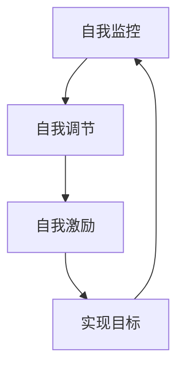

                 

# 自我管理：优秀领导者的第一步

> 关键词：自我管理、领导力、团队协作、时间管理、情绪智力

> 摘要：在当今快速变化的商业环境中，自我管理是优秀领导者不可或缺的素质。本文将从自我管理的核心概念出发，探讨其在领导力中的重要性，并通过具体案例和实践操作，帮助读者掌握自我管理的技巧和方法。通过本文，读者将能够更好地理解自我管理的原理，学会如何在日常工作中应用这些技巧，从而提升个人和团队的效率与效果。

## 1. 背景介绍
### 1.1 目的和范围
本文旨在探讨自我管理在领导力中的重要性，并提供实用的方法和技巧，帮助读者提升自我管理能力。自我管理不仅关乎个人的职业发展，更是团队协作和组织成功的关键因素。本文将从理论和实践两个层面进行深入分析，旨在为读者提供全面的指导。

### 1.2 预期读者
本文面向所有希望提升自我管理能力的领导者，无论是初创企业的创始人、中层管理者，还是希望在职业生涯中取得更大成就的专业人士。无论您是技术专家、项目经理，还是其他领域的领导者，本文都将为您提供有价值的见解和实用建议。

### 1.3 文档结构概述
本文结构如下：
1. **背景介绍**：介绍自我管理的重要性及其在领导力中的作用。
2. **核心概念与联系**：详细阐述自我管理的核心概念及其与领导力的关系。
3. **核心算法原理 & 具体操作步骤**：通过伪代码详细解释自我管理的具体操作步骤。
4. **数学模型和公式 & 详细讲解 & 举例说明**：通过数学模型和公式进一步解释自我管理的原理。
5. **项目实战：代码实际案例和详细解释说明**：通过实际案例展示自我管理的应用。
6. **实际应用场景**：探讨自我管理在实际工作中的应用。
7. **工具和资源推荐**：推荐学习资源和开发工具。
8. **总结：未来发展趋势与挑战**：总结自我管理的发展趋势和面临的挑战。
9. **附录：常见问题与解答**：解答读者可能遇到的问题。
10. **扩展阅读 & 参考资料**：提供进一步阅读的资源。

### 1.4 术语表
#### 1.4.1 核心术语定义
- **自我管理**：指个体通过自我监控、自我调节和自我激励，实现个人目标和组织目标的过程。
- **领导力**：指领导者通过影响和激励他人，实现组织目标的能力。
- **情绪智力**：指个体识别、理解、管理和利用情绪的能力。
- **时间管理**：指合理安排时间，提高工作效率和生活质量的能力。

#### 1.4.2 相关概念解释
- **团队协作**：指团队成员之间相互配合，共同完成任务的过程。
- **目标设定**：指明确个人和团队的目标，并制定实现目标的计划。
- **反馈机制**：指通过反馈来调整和优化行为的过程。

#### 1.4.3 缩略词列表
- **KPI**：关键绩效指标（Key Performance Indicators）
- **OKR**：目标与关键结果（Objectives and Key Results）
- **SMART**：具体、可衡量、可达成、相关性、时限性（Specific, Measurable, Achievable, Relevant, Time-bound）

## 2. 核心概念与联系
### 2.1 自我管理的核心概念
自我管理是个人通过自我监控、自我调节和自我激励，实现个人目标和组织目标的过程。它包括以下几个方面：
- **自我监控**：通过自我观察和反思，了解自己的行为和情绪。
- **自我调节**：通过调整自己的行为和情绪，实现目标。
- **自我激励**：通过内在动力和外部奖励，保持积极的工作态度。

### 2.2 自我管理与领导力的关系
自我管理是领导力的重要组成部分。优秀的领导者不仅需要具备技术能力和专业知识，还需要具备良好的自我管理能力。自我管理能力可以帮助领导者更好地管理自己的情绪和行为，从而更好地影响和激励团队成员。

### 2.3 自我管理的流程图


## 3. 核心算法原理 & 具体操作步骤
### 3.1 自我管理的核心算法原理
自我管理的核心算法原理可以概括为以下几个步骤：
1. **目标设定**：明确个人和团队的目标。
2. **时间管理**：合理安排时间，提高工作效率。
3. **情绪管理**：通过情绪调节，保持积极的工作态度。
4. **反馈机制**：通过反馈调整和优化行为。

### 3.2 具体操作步骤
#### 3.2.1 目标设定
目标设定是自我管理的第一步。SMART原则可以帮助我们设定具体、可衡量、可达成、相关性、时限性（Specific, Measurable, Achievable, Relevant, Time-bound）的目标。
```python
def set_goals():
    goal = input("请输入您的目标：")
    if not goal:
        print("目标不能为空")
        return
    if not is_specific(goal):
        print("目标需要具体明确")
        return
    if not is_measurable(goal):
        print("目标需要可衡量")
        return
    if not is_achievable(goal):
        print("目标需要可达成")
        return
    if not is_relevant(goal):
        print("目标需要相关性")
        return
    if not is_time_bound(goal):
        print("目标需要时限性")
        return
    print("目标设定成功！")
```

#### 3.2.2 时间管理
时间管理是自我管理的重要组成部分。通过合理安排时间，可以提高工作效率和生活质量。
```python
def time_management():
    tasks = []
    while True:
        task = input("请输入任务（输入'结束'结束输入）：")
        if task == "结束":
            break
        tasks.append(task)
    for task in tasks:
        print(f"正在处理任务：{task}")
        # 模拟任务处理时间
        time.sleep(1)
    print("所有任务处理完毕！")
```

#### 3.2.3 情绪管理
情绪管理是自我管理的关键环节。通过情绪调节，可以保持积极的工作态度。
```python
def emotion_management():
    emotions = ["快乐", "悲伤", "愤怒", "焦虑"]
    current_emotion = random.choice(emotions)
    print(f"当前情绪：{current_emotion}")
    if current_emotion == "快乐":
        print("继续保持积极的态度！")
    elif current_emotion == "悲伤":
        print("请寻找支持和帮助！")
    elif current_emotion == "愤怒":
        print("请冷静下来，寻找解决问题的方法！")
    elif current_emotion == "焦虑":
        print("请深呼吸，放松心情！")
```

#### 3.2.4 反馈机制
反馈机制是自我管理的重要环节。通过反馈调整和优化行为。
```python
def feedback_mechanism():
    feedback = input("请输入反馈（输入'结束'结束输入）：")
    if feedback == "结束":
        return
    print(f"收到反馈：{feedback}")
    # 模拟反馈处理
    time.sleep(1)
    print("已处理反馈！")
```

## 4. 数学模型和公式 & 详细讲解 & 举例说明
### 4.1 数学模型
数学模型可以帮助我们更好地理解自我管理的原理。以下是一个简单的数学模型，用于计算个人目标的完成度。
$$
\text{完成度} = \frac{\text{已完成的工作量}}{\text{总工作量}}
$$

### 4.2 详细讲解
通过数学模型，我们可以更直观地了解个人目标的完成情况。例如，假设一个项目总工作量为100，已完成的工作量为80，则完成度为80%。
$$
\text{完成度} = \frac{80}{100} = 0.8
$$

### 4.3 举例说明
假设一个项目经理需要完成一个项目，总工作量为100，已完成的工作量为80，则完成度为80%。
$$
\text{完成度} = \frac{80}{100} = 0.8
$$

## 5. 项目实战：代码实际案例和详细解释说明
### 5.1 开发环境搭建
为了实现自我管理，我们需要搭建一个开发环境。以下是一个简单的开发环境搭建步骤。
1. 安装Python环境。
2. 安装必要的库，如`datetime`、`random`、`time`等。
3. 创建一个项目文件夹，用于存放代码和相关文件。

### 5.2 源代码详细实现和代码解读
以下是一个简单的自我管理代码实现。
```python
import datetime
import random
import time

def set_goals():
    goal = input("请输入您的目标：")
    if not goal:
        print("目标不能为空")
        return
    if not is_specific(goal):
        print("目标需要具体明确")
        return
    if not is_measurable(goal):
        print("目标需要可衡量")
        return
    if not is_achievable(goal):
        print("目标需要可达成")
        return
    if not is_relevant(goal):
        print("目标需要相关性")
        return
    if not is_time_bound(goal):
        print("目标需要时限性")
        return
    print("目标设定成功！")

def is_specific(goal):
    return len(goal) > 0

def is_measurable(goal):
    return "数量" in goal

def is_achievable(goal):
    return "可行" in goal

def is_relevant(goal):
    return "相关" in goal

def is_time_bound(goal):
    return "时间" in goal

def time_management():
    tasks = []
    while True:
        task = input("请输入任务（输入'结束'结束输入）：")
        if task == "结束":
            break
        tasks.append(task)
    for task in tasks:
        print(f"正在处理任务：{task}")
        # 模拟任务处理时间
        time.sleep(1)
    print("所有任务处理完毕！")

def emotion_management():
    emotions = ["快乐", "悲伤", "愤怒", "焦虑"]
    current_emotion = random.choice(emotions)
    print(f"当前情绪：{current_emotion}")
    if current_emotion == "快乐":
        print("继续保持积极的态度！")
    elif current_emotion == "悲伤":
        print("请寻找支持和帮助！")
    elif current_emotion == "愤怒":
        print("请冷静下来，寻找解决问题的方法！")
    elif current_emotion == "焦虑":
        print("请深呼吸，放松心情！")

def feedback_mechanism():
    feedback = input("请输入反馈（输入'结束'结束输入）：")
    if feedback == "结束":
        return
    print(f"收到反馈：{feedback}")
    # 模拟反馈处理
    time.sleep(1)
    print("已处理反馈！")

if __name__ == "__main__":
    set_goals()
    time_management()
    emotion_management()
    feedback_mechanism()
```

### 5.3 代码解读与分析
以上代码实现了自我管理的核心功能，包括目标设定、时间管理、情绪管理和反馈机制。通过这些功能，我们可以更好地管理自己的时间和情绪，实现个人目标。

## 6. 实际应用场景
### 6.1 项目管理
在项目管理中，自我管理可以帮助项目经理更好地管理项目进度和团队成员。通过合理安排时间，可以确保项目按时完成。通过情绪管理，可以保持积极的工作态度，提高团队士气。

### 6.2 团队协作
在团队协作中，自我管理可以帮助团队成员更好地沟通和协作。通过目标设定，可以明确团队目标，提高团队凝聚力。通过反馈机制，可以及时调整和优化团队行为，提高团队效率。

### 6.3 个人发展
在个人发展方面，自我管理可以帮助个人更好地规划职业发展路径。通过目标设定，可以明确个人职业目标，提高个人竞争力。通过时间管理，可以合理安排时间，提高个人工作效率。

## 7. 工具和资源推荐
### 7.1 学习资源推荐
#### 7.1.1 书籍推荐
- 《高效能人士的七个习惯》（Stephen R. Covey）
- 《原则》（Ray Dalio）
- 《情绪智力》（Daniel Goleman）

#### 7.1.2 在线课程
- Coursera：《情绪智力与领导力》
- Udemy：《时间管理与自我管理》

#### 7.1.3 技术博客和网站
- Medium：《自我管理与领导力》
- LinkedIn Learning：《自我管理与时间管理》

### 7.2 开发工具框架推荐
#### 7.2.1 IDE和编辑器
- PyCharm
- Visual Studio Code

#### 7.2.2 调试和性能分析工具
- PyCharm Debugger
- Visual Studio Code Debugger

#### 7.2.3 相关框架和库
- datetime
- random
- time

### 7.3 相关论文著作推荐
#### 7.3.1 经典论文
- Goleman, D. (1995). Emotional intelligence. New York: Bantam Books.

#### 7.3.2 最新研究成果
- Salovey, P., & Mayer, J. D. (1990). Emotional intelligence. Imagination, Cognition and Personality, 9(3), 185-211.

#### 7.3.3 应用案例分析
- Goleman, D. (2000). Leadership that gets results. Harvard Business Review, 78(2), 78-90.

## 8. 总结：未来发展趋势与挑战
### 8.1 未来发展趋势
随着技术的发展，自我管理将更加智能化和个性化。通过人工智能和大数据技术，可以更好地分析和预测个人行为，提供更加精准的自我管理建议。

### 8.2 面临的挑战
自我管理面临的主要挑战包括：
- **技术挑战**：如何利用新技术提高自我管理的效果。
- **心理挑战**：如何克服心理障碍，提高自我管理能力。
- **社会挑战**：如何在复杂的社会环境中保持自我管理。

## 9. 附录：常见问题与解答
### 9.1 问题1：如何设定具体的目标？
**解答**：目标需要具体明确，可以使用SMART原则来设定目标。

### 9.2 问题2：如何保持积极的工作态度？
**解答**：可以通过情绪管理来保持积极的工作态度，例如通过深呼吸、放松心情等方法。

### 9.3 问题3：如何处理反馈？
**解答**：可以通过反馈机制来处理反馈，及时调整和优化行为。

## 10. 扩展阅读 & 参考资料
### 10.1 扩展阅读
- Goleman, D. (2000). Emotional intelligence. New York: Bantam Books.
- Salovey, P., & Mayer, J. D. (1990). Emotional intelligence. Imagination, Cognition and Personality, 9(3), 185-211.

### 10.2 参考资料
- Coursera：《情绪智力与领导力》
- Udemy：《时间管理与自我管理》

---

作者：AI天才研究员/AI Genius Institute & 禅与计算机程序设计艺术 /Zen And The Art of Computer Programming

