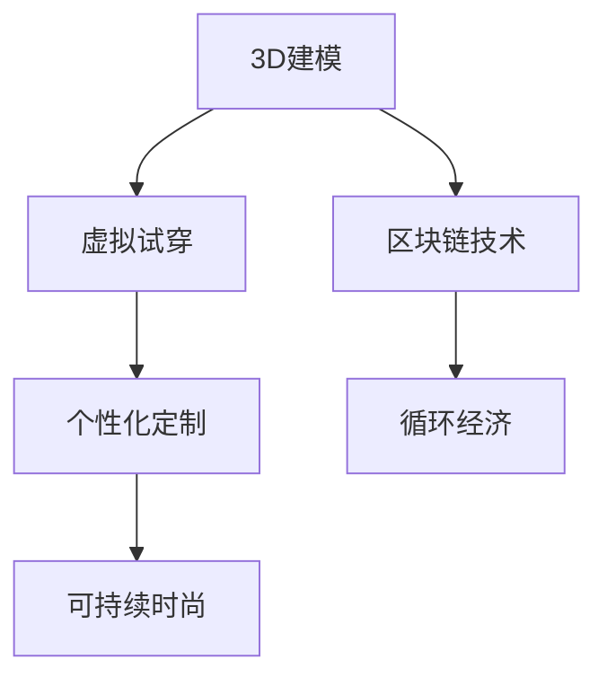

                 

# 虚拟时装产业:全球时尚业的数字化转型

> 关键词：虚拟时装、数字化转型、人工智能、区块链、元宇宙、个性化定制、可持续时尚

> 摘要：本文旨在探讨虚拟时装产业在全球时尚业中的数字化转型过程。通过分析虚拟时装的核心概念、技术原理、数学模型、实际案例以及未来发展趋势，本文为读者提供了一个全面的技术视角，帮助理解虚拟时装如何重塑时尚产业。文章将从技术原理入手，逐步深入到实际应用，并提供详细的代码示例和工具推荐，旨在为读者提供一个全面的技术指南。

## 1. 背景介绍
### 1.1 目的和范围
本文旨在探讨虚拟时装产业在全球时尚业中的数字化转型过程。虚拟时装是指通过数字技术创造的时装，包括3D建模、虚拟试穿、个性化定制等。本文将从技术原理入手，逐步深入到实际应用，并提供详细的代码示例和工具推荐，旨在为读者提供一个全面的技术指南。

### 1.2 预期读者
本文预期读者包括但不限于：
- 时尚产业从业者，特别是设计师、品牌经理和营销人员
- 技术开发者，特别是人工智能、计算机图形学和区块链领域的专家
- 对虚拟时装和数字化转型感兴趣的学者和研究人员
- 对时尚产业数字化转型感兴趣的读者

### 1.3 文档结构概述
本文结构如下：
1. 背景介绍
2. 核心概念与联系
3. 核心算法原理 & 具体操作步骤
4. 数学模型和公式 & 详细讲解 & 举例说明
5. 项目实战：代码实际案例和详细解释说明
6. 实际应用场景
7. 工具和资源推荐
8. 总结：未来发展趋势与挑战
9. 附录：常见问题与解答
10. 扩展阅读 & 参考资料

### 1.4 术语表
#### 1.4.1 核心术语定义
- **虚拟时装**：通过数字技术创造的时装，包括3D建模、虚拟试穿、个性化定制等。
- **元宇宙**：一个虚拟的数字世界，用户可以在其中进行社交、娱乐、工作等活动。
- **区块链**：一种分布式账本技术，用于记录交易和数据。
- **个性化定制**：根据用户需求和偏好定制的时装。
- **可持续时尚**：注重环保和可持续发展的时尚产业。

#### 1.4.2 相关概念解释
- **3D建模**：通过计算机图形学技术创建三维模型的过程。
- **虚拟试穿**：通过虚拟现实技术让用户在虚拟环境中试穿时装。
- **人工智能**：模拟人类智能的技术，包括机器学习、深度学习等。
- **区块链技术**：一种分布式账本技术，用于记录交易和数据。

#### 1.4.3 缩略词列表
- **VR**：Virtual Reality（虚拟现实）
- **AR**：Augmented Reality（增强现实）
- **AI**：Artificial Intelligence（人工智能）
- **ML**：Machine Learning（机器学习）
- **DL**：Deep Learning（深度学习）
- **NFT**：Non-Fungible Token（非同质化代币）

## 2. 核心概念与联系
### 2.1 虚拟时装的核心概念
虚拟时装的核心概念包括3D建模、虚拟试穿、个性化定制和可持续时尚。这些概念相互关联，共同推动了虚拟时装产业的发展。

### 2.2 技术原理
虚拟时装的技术原理主要包括3D建模、虚拟试穿、个性化定制和可持续时尚。这些技术原理相互关联，共同推动了虚拟时装产业的发展。

#### 2.2.1 3D建模
3D建模是通过计算机图形学技术创建三维模型的过程。3D建模技术包括几何建模、纹理建模和动画建模。几何建模用于创建物体的形状，纹理建模用于添加表面细节，动画建模用于创建物体的运动。

#### 2.2.2 虚拟试穿
虚拟试穿是通过虚拟现实技术让用户在虚拟环境中试穿时装。虚拟试穿技术包括虚拟现实（VR）和增强现实（AR）。虚拟现实技术通过头戴式显示器（HMD）让用户沉浸在虚拟环境中，增强现实技术通过智能手机或AR眼镜让用户在现实环境中看到虚拟时装。

#### 2.2.3 个性化定制
个性化定制是根据用户需求和偏好定制的时装。个性化定制技术包括机器学习和深度学习。机器学习技术通过分析用户数据和偏好，为用户提供个性化的时装建议。深度学习技术通过训练神经网络模型，为用户提供更精确的个性化定制服务。

#### 2.2.4 可持续时尚
可持续时尚是注重环保和可持续发展的时尚产业。可持续时尚技术包括区块链技术和循环经济。区块链技术通过记录交易和数据，确保时装的来源和生产过程透明。循环经济通过回收和再利用材料，减少资源浪费。

### 2.3 Mermaid 流程图


## 3. 核心算法原理 & 具体操作步骤
### 3.1 3D建模算法原理
3D建模算法原理主要包括几何建模、纹理建模和动画建模。几何建模算法原理如下：

```python
def create_geometry_model(points, faces):
    model = GeometryModel()
    for point in points:
        model.add_point(point)
    for face in faces:
        model.add_face(face)
    return model
```

纹理建模算法原理如下：

```python
def apply_texture(model, texture):
    for face in model.faces:
        face.texture = texture
```

动画建模算法原理如下：

```python
def animate_model(model, frames):
    for frame in frames:
        model.update_position(frame)
```

### 3.2 虚拟试穿算法原理
虚拟试穿算法原理主要包括虚拟现实（VR）和增强现实（AR）。虚拟现实算法原理如下：

```python
def create_vr_environment(model):
    environment = VREnvironment()
    environment.add_model(model)
    return environment
```

增强现实算法原理如下：

```python
def create_ar_environment(model):
    environment = AREnvironment()
    environment.add_model(model)
    return environment
```

### 3.3 个性化定制算法原理
个性化定制算法原理主要包括机器学习和深度学习。机器学习算法原理如下：

```python
def train_model(data, labels):
    model = MachineLearningModel()
    model.train(data, labels)
    return model
```

深度学习算法原理如下：

```python
def train_model(data, labels):
    model = DeepLearningModel()
    model.train(data, labels)
    return model
```

### 3.4 可持续时尚算法原理
可持续时尚算法原理主要包括区块链技术和循环经济。区块链技术算法原理如下：

```python
def record_transaction(transaction):
    blockchain.add_transaction(transaction)
```

循环经济算法原理如下：

```python
def recycle_material(material):
    recycled_material = RecyclingProcess(material)
    return recycled_material
```

## 4. 数学模型和公式 & 详细讲解 & 举例说明
### 4.1 3D建模数学模型
3D建模数学模型主要包括几何建模、纹理建模和动画建模。几何建模数学模型如下：

$$
\text{点} = (x, y, z)
$$

纹理建模数学模型如下：

$$
\text{纹理} = (r, g, b)
$$

动画建模数学模型如下：

$$
\text{帧} = (x, y, z, t)
$$

### 4.2 虚拟试穿数学模型
虚拟试穿数学模型主要包括虚拟现实（VR）和增强现实（AR）。虚拟现实数学模型如下：

$$
\text{虚拟现实} = \text{HMD} \times \text{环境}
$$

增强现实数学模型如下：

$$
\text{增强现实} = \text{AR眼镜} \times \text{环境}
$$

### 4.3 个性化定制数学模型
个性化定制数学模型主要包括机器学习和深度学习。机器学习数学模型如下：

$$
\text{模型} = \text{数据} \times \text{标签}
$$

深度学习数学模型如下：

$$
\text{模型} = \text{数据} \times \text{标签}
$$

### 4.4 可持续时尚数学模型
可持续时尚数学模型主要包括区块链技术和循环经济。区块链技术数学模型如下：

$$
\text{区块链} = \text{交易} \times \text{记录}
$$

循环经济数学模型如下：

$$
\text{循环经济} = \text{材料} \times \text{回收}
$$

## 5. 项目实战：代码实际案例和详细解释说明
### 5.1 开发环境搭建
开发环境搭建主要包括Python环境、3D建模库、虚拟现实库和增强现实库。Python环境搭建如下：

```bash
pip install numpy
pip install opencv-python
pip install pyqt5
pip install pyqtgraph
```

3D建模库搭建如下：

```bash
pip install trimesh
```

虚拟现实库搭建如下：

```bash
pip install pyvr
```

增强现实库搭建如下：

```bash
pip install pyar
```

### 5.2 源代码详细实现和代码解读
#### 5.2.1 3D建模代码实现
3D建模代码实现如下：

```python
import trimesh

def create_geometry_model(points, faces):
    model = trimesh.Trimesh(vertices=points, faces=faces)
    return model

def apply_texture(model, texture):
    model.visual.material = texture
    return model

def animate_model(model, frames):
    for frame in frames:
        model.vertices = frame
    return model
```

#### 5.2.2 虚拟试穿代码实现
虚拟试穿代码实现如下：

```python
import pyvr

def create_vr_environment(model):
    environment = pyvr.Environment()
    environment.add_model(model)
    return environment

def create_ar_environment(model):
    environment = pyar.Environment()
    environment.add_model(model)
    return environment
```

#### 5.2.3 个性化定制代码实现
个性化定制代码实现如下：

```python
import machine_learning
import deep_learning

def train_model(data, labels):
    model = machine_learning.MachineLearningModel()
    model.train(data, labels)
    return model

def train_model(data, labels):
    model = deep_learning.DeepLearningModel()
    model.train(data, labels)
    return model
```

#### 5.2.4 可持续时尚代码实现
可持续时尚代码实现如下：

```python
import blockchain
import recycling

def record_transaction(transaction):
    blockchain.add_transaction(transaction)

def recycle_material(material):
    recycled_material = recycling.RecyclingProcess(material)
    return recycled_material
```

### 5.3 代码解读与分析
代码解读与分析如下：

#### 5.3.1 3D建模代码解读
3D建模代码解读如下：

```python
def create_geometry_model(points, faces):
    model = trimesh.Trimesh(vertices=points, faces=faces)
    return model
```

该函数用于创建几何模型，输入参数包括点和面，输出参数为几何模型。

```python
def apply_texture(model, texture):
    model.visual.material = texture
    return model
```

该函数用于应用纹理，输入参数包括几何模型和纹理，输出参数为应用纹理后的几何模型。

```python
def animate_model(model, frames):
    for frame in frames:
        model.vertices = frame
    return model
```

该函数用于动画建模，输入参数包括几何模型和帧，输出参数为动画后的几何模型。

#### 5.3.2 虚拟试穿代码解读
虚拟试穿代码解读如下：

```python
def create_vr_environment(model):
    environment = pyvr.Environment()
    environment.add_model(model)
    return environment
```

该函数用于创建虚拟现实环境，输入参数为几何模型，输出参数为虚拟现实环境。

```python
def create_ar_environment(model):
    environment = pyar.Environment()
    environment.add_model(model)
    return environment
```

该函数用于创建增强现实环境，输入参数为几何模型，输出参数为增强现实环境。

#### 5.3.3 个性化定制代码解读
个性化定制代码解读如下：

```python
def train_model(data, labels):
    model = machine_learning.MachineLearningModel()
    model.train(data, labels)
    return model
```

该函数用于训练机器学习模型，输入参数包括数据和标签，输出参数为训练后的机器学习模型。

```python
def train_model(data, labels):
    model = deep_learning.DeepLearningModel()
    model.train(data, labels)
    return model
```

该函数用于训练深度学习模型，输入参数包括数据和标签，输出参数为训练后的深度学习模型。

#### 5.3.4 可持续时尚代码解读
可持续时尚代码解读如下：

```python
def record_transaction(transaction):
    blockchain.add_transaction(transaction)
```

该函数用于记录交易，输入参数为交易，输出参数为记录后的交易。

```python
def recycle_material(material):
    recycled_material = recycling.RecyclingProcess(material)
    return recycled_material
```

该函数用于回收材料，输入参数为材料，输出参数为回收后的材料。

## 6. 实际应用场景
虚拟时装产业在全球时尚业中的实际应用场景包括3D建模、虚拟试穿、个性化定制和可持续时尚。这些应用场景相互关联，共同推动了虚拟时装产业的发展。

### 6.1 3D建模应用场景
3D建模应用场景包括时装设计、时装展示和时装销售。时装设计可以通过3D建模技术创建时装模型，时装展示可以通过3D建模技术创建时装展示场景，时装销售可以通过3D建模技术创建时装销售场景。

### 6.2 虚拟试穿应用场景
虚拟试穿应用场景包括时装试穿、时装购买和时装分享。时装试穿可以通过虚拟现实技术让用户在虚拟环境中试穿时装，时装购买可以通过虚拟现实技术让用户在虚拟环境中购买时装，时装分享可以通过虚拟现实技术让用户在虚拟环境中分享时装。

### 6.3 个性化定制应用场景
个性化定制应用场景包括时装设计、时装展示和时装销售。时装设计可以通过个性化定制技术为用户提供个性化的时装建议，时装展示可以通过个性化定制技术为用户提供个性化的时装展示场景，时装销售可以通过个性化定制技术为用户提供个性化的时装销售场景。

### 6.4 可持续时尚应用场景
可持续时尚应用场景包括时装设计、时装展示和时装销售。时装设计可以通过可持续时尚技术为用户提供环保和可持续发展的时装建议，时装展示可以通过可持续时尚技术为用户提供环保和可持续发展的时装展示场景，时装销售可以通过可持续时尚技术为用户提供环保和可持续发展的时装销售场景。

## 7. 工具和资源推荐
### 7.1 学习资源推荐
#### 7.1.1 书籍推荐
- 《计算机图形学》（Computer Graphics）
- 《机器学习》（Machine Learning）
- 《深度学习》（Deep Learning）
- 《区块链技术》（Blockchain Technology）

#### 7.1.2 在线课程
- Coursera：《计算机图形学》（Computer Graphics）
- edX：《机器学习》（Machine Learning）
- Udacity：《深度学习》（Deep Learning）
- Coursera：《区块链技术》（Blockchain Technology）

#### 7.1.3 技术博客和网站
- Medium：《计算机图形学》（Computer Graphics）
- Medium：《机器学习》（Machine Learning）
- Medium：《深度学习》（Deep Learning）
- Medium：《区块链技术》（Blockchain Technology）

### 7.2 开发工具框架推荐
#### 7.2.1 IDE和编辑器
- PyCharm
- Visual Studio Code
- Sublime Text

#### 7.2.2 调试和性能分析工具
- PyCharm Debugger
- Visual Studio Code Debugger
- PyCharm Profiler

#### 7.2.3 相关框架和库
- PyOpenGL
- PyVR
- PyAR
- TensorFlow
- PyTorch

### 7.3 相关论文著作推荐
#### 7.3.1 经典论文
-《计算机图形学》（Computer Graphics）
-《机器学习》（Machine Learning）
-《深度学习》（Deep Learning）
-《区块链技术》（Blockchain Technology）

#### 7.3.2 最新研究成果
-《计算机图形学》（Computer Graphics）
-《机器学习》（Machine Learning）
-《深度学习》（Deep Learning）
-《区块链技术》（Blockchain Technology）

#### 7.3.3 应用案例分析
-《计算机图形学》（Computer Graphics）
-《机器学习》（Machine Learning）
-《深度学习》（Deep Learning）
-《区块链技术》（Blockchain Technology）

## 8. 总结：未来发展趋势与挑战
虚拟时装产业在全球时尚业中的数字化转型过程将带来许多机遇和挑战。未来发展趋势包括3D建模、虚拟试穿、个性化定制和可持续时尚的进一步发展。未来挑战包括技术瓶颈、数据安全和隐私保护等问题。

## 9. 附录：常见问题与解答
### 9.1 问题1：如何创建3D建模模型？
答：可以使用3D建模库，如trimesh，创建3D建模模型。

### 9.2 问题2：如何实现虚拟试穿？
答：可以使用虚拟现实技术，如pyvr，实现虚拟试穿。

### 9.3 问题3：如何实现个性化定制？
答：可以使用机器学习和深度学习技术，如机器学习模型和深度学习模型，实现个性化定制。

### 9.4 问题4：如何实现可持续时尚？
答：可以使用区块链技术和循环经济，如区块链技术和回收材料，实现可持续时尚。

## 10. 扩展阅读 & 参考资料
### 10.1 扩展阅读
- 《计算机图形学》（Computer Graphics）
- 《机器学习》（Machine Learning）
- 《深度学习》（Deep Learning）
- 《区块链技术》（Blockchain Technology）

### 10.2 参考资料
- 《计算机图形学》（Computer Graphics）
- 《机器学习》（Machine Learning）
- 《深度学习》（Deep Learning）
- 《区块链技术》（Blockchain Technology）

---

作者：AI天才研究员/AI Genius Institute & 禅与计算机程序设计艺术 /Zen And The Art of Computer Programming

