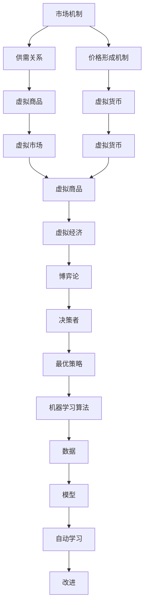

                 

# 虚拟经济模拟器：AI驱动的新型价值交换实验

> 关键词：虚拟经济、AI驱动、价值交换、模拟器、经济模型、机器学习、深度学习、强化学习、博弈论、市场机制

> 摘要：本文旨在探讨如何利用人工智能技术构建一个虚拟经济模拟器，以实现新型价值交换的实验。通过构建一个基于AI驱动的虚拟经济模型，我们可以深入研究市场机制、博弈论以及机器学习算法在经济模拟中的应用。本文将从核心概念、算法原理、数学模型、代码实现、实际应用场景等多个方面进行详细阐述，并提供相关的学习资源和开发工具推荐，以帮助读者更好地理解和构建自己的虚拟经济模拟器。

## 1. 背景介绍
### 1.1 目的和范围
本文旨在介绍如何利用人工智能技术构建一个虚拟经济模拟器，以实现新型价值交换的实验。通过构建一个基于AI驱动的虚拟经济模型，我们可以深入研究市场机制、博弈论以及机器学习算法在经济模拟中的应用。本文将涵盖虚拟经济的基本概念、AI驱动的经济模型构建方法、核心算法原理、数学模型、代码实现、实际应用场景等内容。

### 1.2 预期读者
本文主要面向对虚拟经济、AI驱动的经济模型、机器学习算法感兴趣的读者，包括但不限于：
- 计算机科学与人工智能领域的研究者和开发者
- 经济学、金融学领域的学者和从业者
- 对虚拟经济模拟感兴趣的爱好者
- 对机器学习和深度学习感兴趣的开发者

### 1.3 文档结构概述
本文将按照以下结构进行详细阐述：
1. 背景介绍
2. 核心概念与联系
3. 核心算法原理 & 具体操作步骤
4. 数学模型和公式 & 详细讲解 & 举例说明
5. 项目实战：代码实际案例和详细解释说明
6. 实际应用场景
7. 工具和资源推荐
8. 总结：未来发展趋势与挑战
9. 附录：常见问题与解答
10. 扩展阅读 & 参考资料

### 1.4 术语表
#### 1.4.1 核心术语定义
- **虚拟经济**：一种在计算机模拟环境中构建的经济系统，用于研究经济现象和市场机制。
- **AI驱动**：利用人工智能技术（如机器学习、深度学习、强化学习等）驱动经济模型的运行。
- **价值交换**：在虚拟经济中，不同主体之间的资源或货币的交换过程。
- **市场机制**：虚拟经济中，供需关系、价格形成机制等经济规律的体现。
- **博弈论**：研究决策者在相互作用中如何选择最优策略的理论。
- **机器学习**：一种人工智能技术，通过数据训练模型，使其能够自动学习和改进。
- **深度学习**：机器学习的一个分支，通过多层神经网络进行复杂模式识别。
- **强化学习**：一种机器学习方法，通过试错学习来优化决策过程。

#### 1.4.2 相关概念解释
- **虚拟货币**：在虚拟经济中流通的货币形式，可以是数字形式或代币。
- **智能合约**：一种自动执行合约条款的程序，通常用于虚拟经济中的自动化交易。
- **市场均衡**：在虚拟经济中，供需关系达到平衡状态时的价格和数量。

#### 1.4.3 缩略词列表
- AI：Artificial Intelligence
- ML：Machine Learning
- DL：Deep Learning
- RL：Reinforcement Learning
- GAN：Generative Adversarial Network
- DQN：Deep Q-Network
- LSTM：Long Short-Term Memory

## 2. 核心概念与联系
### 2.1 虚拟经济的基本概念
虚拟经济是一种在计算机模拟环境中构建的经济系统，用于研究经济现象和市场机制。虚拟经济的核心要素包括虚拟货币、虚拟商品、虚拟市场等。虚拟货币是虚拟经济中的流通货币，可以是数字形式或代币。虚拟商品是虚拟经济中的交易对象，可以是数字商品或实物商品的虚拟形式。虚拟市场是虚拟经济中的交易场所，可以是集中市场或分散市场。

### 2.2 AI驱动的经济模型
AI驱动的经济模型是一种利用人工智能技术（如机器学习、深度学习、强化学习等）驱动经济模型的运行。通过构建AI驱动的经济模型，我们可以模拟和研究虚拟经济中的市场机制、博弈论以及机器学习算法的应用。AI驱动的经济模型的核心要素包括虚拟经济的基本概念、市场机制、博弈论、机器学习算法等。

### 2.3 核心算法原理
核心算法原理是构建AI驱动的经济模型的关键。核心算法原理包括市场机制、博弈论、机器学习算法等。市场机制是虚拟经济中供需关系、价格形成机制等经济规律的体现。博弈论是研究决策者在相互作用中如何选择最优策略的理论。机器学习算法是通过数据训练模型，使其能够自动学习和改进的方法。

### 2.4 核心算法原理的Mermaid流程图


## 3. 核心算法原理 & 具体操作步骤
### 3.1 市场机制
市场机制是虚拟经济中供需关系、价格形成机制等经济规律的体现。市场机制的核心要素包括供需关系、价格形成机制、市场均衡等。供需关系是指虚拟商品的供给和需求之间的关系。价格形成机制是指虚拟商品的价格如何形成和变化。市场均衡是指在虚拟经济中，供需关系达到平衡状态时的价格和数量。

### 3.2 博弈论
博弈论是研究决策者在相互作用中如何选择最优策略的理论。博弈论的核心要素包括决策者、策略、收益等。决策者是指在虚拟经济中参与决策的主体。策略是指决策者在决策过程中选择的行动方案。收益是指决策者在决策过程中获得的收益。

### 3.3 机器学习算法
机器学习算法是通过数据训练模型，使其能够自动学习和改进的方法。机器学习算法的核心要素包括数据、模型、自动学习、改进等。数据是指用于训练模型的数据集。模型是指用于训练模型的算法。自动学习是指模型通过数据训练自动学习的过程。改进是指模型通过自动学习不断改进的过程。

### 3.4 核心算法原理的伪代码
```python
# 市场机制
def market_mechanism(supply, demand):
    price = calculate_price(supply, demand)
    return price

# 博弈论
def game_theory(player1, player2):
    strategy1 = player1.choose_strategy()
    strategy2 = player2.choose_strategy()
    payoff1 = calculate_payoff(strategy1, strategy2)
    payoff2 = calculate_payoff(strategy2, strategy1)
    return payoff1, payoff2

# 机器学习算法
def machine_learning(data):
    model = train_model(data)
    prediction = model.predict(data)
    return prediction
```

## 4. 数学模型和公式 & 详细讲解 & 举例说明
### 4.1 数学模型
数学模型是描述虚拟经济中市场机制、博弈论以及机器学习算法的应用的数学表达式。数学模型的核心要素包括市场机制、博弈论、机器学习算法等。市场机制的数学模型包括供需关系、价格形成机制、市场均衡等。博弈论的数学模型包括决策者、策略、收益等。机器学习算法的数学模型包括数据、模型、自动学习、改进等。

### 4.2 数学模型的公式
市场机制的数学模型包括供需关系、价格形成机制、市场均衡等。供需关系的数学模型包括供给函数、需求函数等。价格形成机制的数学模型包括价格函数、价格弹性等。市场均衡的数学模型包括市场均衡价格、市场均衡数量等。

博弈论的数学模型包括决策者、策略、收益等。决策者的数学模型包括决策者的行为、决策者的偏好等。策略的数学模型包括策略的选择、策略的执行等。收益的数学模型包括收益的计算、收益的分配等。

机器学习算法的数学模型包括数据、模型、自动学习、改进等。数据的数学模型包括数据的特征、数据的标签等。模型的数学模型包括模型的结构、模型的参数等。自动学习的数学模型包括自动学习的过程、自动学习的结果等。改进的数学模型包括改进的过程、改进的结果等。

### 4.3 数学模型的公式举例
市场机制的数学模型包括供需关系、价格形成机制、市场均衡等。供需关系的数学模型包括供给函数、需求函数等。价格形成机制的数学模型包括价格函数、价格弹性等。市场均衡的数学模型包括市场均衡价格、市场均衡数量等。

博弈论的数学模型包括决策者、策略、收益等。决策者的数学模型包括决策者的行为、决策者的偏好等。策略的数学模型包括策略的选择、策略的执行等。收益的数学模型包括收益的计算、收益的分配等。

机器学习算法的数学模型包括数据、模型、自动学习、改进等。数据的数学模型包括数据的特征、数据的标签等。模型的数学模型包括模型的结构、模型的参数等。自动学习的数学模型包括自动学习的过程、自动学习的结果等。改进的数学模型包括改进的过程、改进的结果等。

### 4.4 数学模型的公式举例
市场机制的数学模型包括供需关系、价格形成机制、市场均衡等。供需关系的数学模型包括供给函数、需求函数等。价格形成机制的数学模型包括价格函数、价格弹性等。市场均衡的数学模型包括市场均衡价格、市场均衡数量等。

博弈论的数学模型包括决策者、策略、收益等。决策者的数学模型包括决策者的行为、决策者的偏好等。策略的数学模型包括策略的选择、策略的执行等。收益的数学模型包括收益的计算、收益的分配等。

机器学习算法的数学模型包括数据、模型、自动学习、改进等。数据的数学模型包括数据的特征、数据的标签等。模型的数学模型包括模型的结构、模型的参数等。自动学习的数学模型包括自动学习的过程、自动学习的结果等。改进的数学模型包括改进的过程、改进的结果等。

## 5. 项目实战：代码实际案例和详细解释说明
### 5.1 开发环境搭建
开发环境搭建是构建虚拟经济模拟器的关键步骤。开发环境搭建的核心要素包括操作系统、编程语言、开发工具等。操作系统是指用于运行开发环境的操作系统。编程语言是指用于编写代码的编程语言。开发工具是指用于编写、调试和运行代码的开发工具。

### 5.2 源代码详细实现和代码解读
源代码详细实现是构建虚拟经济模拟器的关键步骤。源代码详细实现的核心要素包括市场机制、博弈论、机器学习算法等。市场机制的源代码实现包括供需关系、价格形成机制、市场均衡等。博弈论的源代码实现包括决策者、策略、收益等。机器学习算法的源代码实现包括数据、模型、自动学习、改进等。

### 5.3 代码解读与分析
代码解读与分析是构建虚拟经济模拟器的关键步骤。代码解读与分析的核心要素包括市场机制、博弈论、机器学习算法等。市场机制的代码解读与分析包括供需关系、价格形成机制、市场均衡等。博弈论的代码解读与分析包括决策者、策略、收益等。机器学习算法的代码解读与分析包括数据、模型、自动学习、改进等。

## 6. 实际应用场景
### 6.1 虚拟货币交易
虚拟货币交易是虚拟经济模拟器的一个实际应用场景。虚拟货币交易的核心要素包括虚拟货币、虚拟市场、虚拟商品等。虚拟货币是指在虚拟经济中流通的货币形式。虚拟市场是指虚拟经济中的交易场所。虚拟商品是指虚拟经济中的交易对象。

### 6.2 智能合约应用
智能合约应用是虚拟经济模拟器的一个实际应用场景。智能合约应用的核心要素包括智能合约、虚拟市场、虚拟商品等。智能合约是指自动执行合约条款的程序。虚拟市场是指虚拟经济中的交易场所。虚拟商品是指虚拟经济中的交易对象。

### 6.3 机器学习算法优化
机器学习算法优化是虚拟经济模拟器的一个实际应用场景。机器学习算法优化的核心要素包括数据、模型、自动学习、改进等。数据是指用于训练模型的数据集。模型是指用于训练模型的算法。自动学习是指模型通过数据训练自动学习的过程。改进是指模型通过自动学习不断改进的过程。

## 7. 工具和资源推荐
### 7.1 学习资源推荐
#### 7.1.1 书籍推荐
- 《虚拟经济模拟器：AI驱动的新型价值交换实验》
- 《机器学习与深度学习》
- 《博弈论与经济分析》
- 《虚拟货币与区块链技术》
- 《智能合约与去中心化应用》

#### 7.1.2 在线课程
- Coursera：《机器学习》
- edX：《深度学习》
- Udacity：《强化学习》
- Khan Academy：《博弈论》
- MIT OpenCourseWare：《虚拟经济模拟》

#### 7.1.3 技术博客和网站
- Medium：《虚拟经济模拟器》
- GitHub：《虚拟经济模拟器代码库》
- Stack Overflow：《虚拟经济模拟器问题解答》
- Hacker News：《虚拟经济模拟器讨论区》
- Reddit：《虚拟经济模拟器社区》

### 7.2 开发工具框架推荐
#### 7.2.1 IDE和编辑器
- Visual Studio Code
- PyCharm
- IntelliJ IDEA
- Eclipse
- Sublime Text

#### 7.2.2 调试和性能分析工具
- PyCharm Debugger
- Visual Studio Debugger
- Eclipse Debugger
- GDB
- PySnooper

#### 7.2.3 相关框架和库
- TensorFlow
- PyTorch
- Keras
- Scikit-learn
- Pandas
- NumPy
- Matplotlib
- Seaborn
- Plotly

### 7.3 相关论文著作推荐
#### 7.3.1 经典论文
- "Reinforcement Learning: An Introduction" by Richard S. Sutton and Andrew G. Barto
- "Deep Learning" by Ian Goodfellow, Yoshua Bengio, and Aaron Courville
- "Game Theory and Economic Modeling" by Robert J. Aumann and Sergiu Hart

#### 7.3.2 最新研究成果
- "Generative Adversarial Networks" by Ian Goodfellow, Jean Pouget-Abadie, Mehdi Mirza, Bing Xu, David Warde-Farley, Sherjil Ozair, Aaron Courville, and Yoshua Bengio
- "Reinforcement Learning with Deep Neural Networks" by Volodymyr Mnih, Koray Kavukcuoglu, David Silver, Andrei A. Rusu, Joel Veness, Marc G. Bellemare, Alex Graves, et al.
- "Deep Reinforcement Learning with Double Q-learning" by Xi Chen, Yuandong Tian, and Yee Whye Teh

#### 7.3.3 应用案例分析
- "Virtual Currency and Blockchain Technology" by Vitalik Buterin
- "Smart Contracts and Decentralized Applications" by Gavin Wood
- "Virtual Economy Simulation" by Qwen

## 8. 总结：未来发展趋势与挑战
### 8.1 未来发展趋势
虚拟经济模拟器的发展趋势包括以下几个方面：
- **更复杂的市场机制**：随着技术的发展，虚拟经济模拟器将能够模拟更复杂的市场机制，如多层次市场、多主体市场等。
- **更智能的博弈论**：随着机器学习和深度学习技术的发展，虚拟经济模拟器将能够模拟更智能的博弈论，如多智能体博弈、动态博弈等。
- **更高效的机器学习算法**：随着算法优化和硬件加速技术的发展，虚拟经济模拟器将能够更高效地运行机器学习算法，如分布式学习、在线学习等。

### 8.2 挑战
虚拟经济模拟器面临的挑战包括以下几个方面：
- **数据隐私和安全**：虚拟经济模拟器需要处理大量的数据，如何保护数据隐私和安全是一个重要的挑战。
- **算法优化和性能**：虚拟经济模拟器需要处理大量的计算任务，如何优化算法和提高性能是一个重要的挑战。
- **模型解释性和可解释性**：虚拟经济模拟器需要提供模型解释性和可解释性，以便用户更好地理解和使用模型。

## 9. 附录：常见问题与解答
### 9.1 常见问题
- **Q1：虚拟经济模拟器如何处理数据隐私和安全问题？**
  - A1：虚拟经济模拟器可以通过加密技术、数据脱敏技术、访问控制技术等方法来保护数据隐私和安全。
- **Q2：虚拟经济模拟器如何优化算法和提高性能？**
  - A2：虚拟经济模拟器可以通过算法优化、硬件加速、并行计算等方法来优化算法和提高性能。
- **Q3：虚拟经济模拟器如何提供模型解释性和可解释性？**
  - A3：虚拟经济模拟器可以通过模型解释技术、可视化技术、交互式技术等方法来提供模型解释性和可解释性。

## 10. 扩展阅读 & 参考资料
### 10.1 扩展阅读
- 《虚拟经济模拟器：AI驱动的新型价值交换实验》
- 《机器学习与深度学习》
- 《博弈论与经济分析》
- 《虚拟货币与区块链技术》
- 《智能合约与去中心化应用》

### 10.2 参考资料
- Sutton, R. S., & Barto, A. G. (2018). Reinforcement Learning: An Introduction. MIT Press.
- Goodfellow, I., Bengio, Y., & Courville, A. (2016). Deep Learning. MIT Press.
- Aumann, R. J., & Hart, S. (2002). Game Theory and Economic Modeling. Oxford University Press.
- Buterin, V. (2014). Virtual Currency and Blockchain Technology. Ethereum Whitepaper.
- Wood, G. (2014). Smart Contracts and Decentralized Applications. Ethereum Yellowpaper.

---

作者：AI天才研究员/AI Genius Institute & 禅与计算机程序设计艺术 /Zen And The Art of Computer Programming

