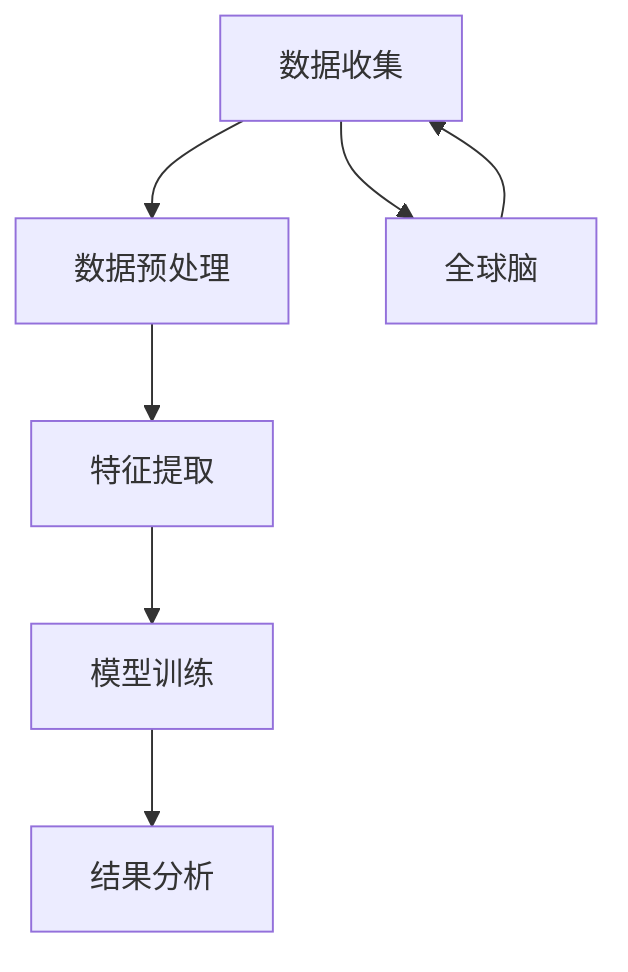

                 

# 虚拟考古技术:全球脑辅助的历史研究新方法

> 关键词：虚拟考古，全球脑，历史研究，人工智能，大数据，机器学习，自然语言处理，图像识别

> 摘要：本文探讨了如何利用虚拟考古技术，结合全球脑的力量，为历史研究提供新的方法和工具。通过整合人工智能、大数据、机器学习、自然语言处理和图像识别等技术，我们能够更深入地挖掘历史资料，揭示隐藏的历史真相。本文将详细介绍虚拟考古技术的核心概念、算法原理、数学模型、实际案例，并探讨其在历史研究中的应用前景。

## 1. 背景介绍
### 1.1 目的和范围
本文旨在介绍一种全新的历史研究方法——虚拟考古技术，通过结合全球脑的力量，利用人工智能技术对历史资料进行深度挖掘和分析。本文将详细探讨虚拟考古技术的核心概念、算法原理、数学模型、实际案例，并展望其未来的发展趋势和挑战。

### 1.2 预期读者
本文面向对历史研究、人工智能、大数据分析、机器学习和图像识别等领域感兴趣的读者。无论是历史学家、考古学家、计算机科学家，还是对新技术在人文社科领域应用感兴趣的读者，都能从中获得有价值的信息。

### 1.3 文档结构概述
本文结构如下：
1. 背景介绍
2. 核心概念与联系
3. 核心算法原理 & 具体操作步骤
4. 数学模型和公式 & 详细讲解 & 举例说明
5. 项目实战：代码实际案例和详细解释说明
6. 实际应用场景
7. 工具和资源推荐
8. 总结：未来发展趋势与挑战
9. 附录：常见问题与解答
10. 扩展阅读 & 参考资料

### 1.4 术语表
#### 1.4.1 核心术语定义
- **虚拟考古**：利用计算机技术对历史资料进行深度挖掘和分析的过程。
- **全球脑**：指通过互联网连接的全球知识网络，能够实现信息的快速共享和传播。
- **历史研究**：通过各种手段和方法，对过去发生的事情进行研究和解释的过程。
- **人工智能**：模拟人类智能行为的计算机系统。
- **大数据**：指无法在一定时间范围内用常规软件工具进行捕捉、管理和处理的数据集合。
- **机器学习**：一种人工智能技术，通过算法使计算机从数据中自动学习和改进。
- **自然语言处理**：使计算机能够理解、解释和生成人类语言的技术。
- **图像识别**：通过计算机视觉技术对图像进行分析和识别。

#### 1.4.2 相关概念解释
- **历史资料**：包括文字记录、图像、文物等，是历史研究的重要依据。
- **深度学习**：一种机器学习方法，通过多层神经网络实现对复杂模式的学习。
- **知识图谱**：一种用于表示实体及其关系的数据结构，常用于知识管理和信息检索。

#### 1.4.3 缩略词列表
- AI：人工智能
- NLP：自然语言处理
- CV：计算机视觉
- DL：深度学习
- KDD：知识发现与数据挖掘
- GNN：图神经网络

## 2. 核心概念与联系
### 2.1 虚拟考古技术
虚拟考古技术是一种利用计算机技术对历史资料进行深度挖掘和分析的方法。它结合了人工智能、大数据、机器学习、自然语言处理和图像识别等技术，能够从海量历史资料中提取有价值的信息，揭示隐藏的历史真相。

### 2.2 全球脑
全球脑是指通过互联网连接的全球知识网络，能够实现信息的快速共享和传播。全球脑为虚拟考古技术提供了丰富的数据来源和强大的计算能力，使得历史研究变得更加高效和深入。

### 2.3 核心概念原理
虚拟考古技术的核心概念原理包括以下几个方面：
- **数据收集**：通过互联网、图书馆、博物馆等渠道收集历史资料。
- **数据预处理**：对收集到的数据进行清洗、标注和格式化，以便后续分析。
- **特征提取**：从历史资料中提取关键特征，如文本中的关键词、图像中的物体等。
- **模型训练**：利用机器学习算法训练模型，使其能够自动识别和分类历史资料。
- **结果分析**：对模型输出的结果进行分析，揭示隐藏的历史真相。

### 2.4 核心概念架构
以下是虚拟考古技术的核心概念架构图：



## 3. 核心算法原理 & 具体操作步骤
### 3.1 数据收集
数据收集是虚拟考古技术的第一步，主要包括以下几个步骤：
1. **数据来源**：通过互联网、图书馆、博物馆等渠道收集历史资料。
2. **数据类型**：包括文字记录、图像、文物等。
3. **数据量**：历史资料通常非常庞大，需要处理的数据量可能达到PB级别。

### 3.2 数据预处理
数据预处理是确保数据质量的关键步骤，主要包括以下几个步骤：
1. **数据清洗**：去除无效、重复和错误的数据。
2. **数据标注**：对数据进行标注，以便后续分析。
3. **数据格式化**：将数据转换为统一的格式，便于后续处理。

### 3.3 特征提取
特征提取是从历史资料中提取关键特征的过程，主要包括以下几个步骤：
1. **文本特征提取**：使用自然语言处理技术提取文本中的关键词、主题等。
2. **图像特征提取**：使用计算机视觉技术提取图像中的物体、场景等。
3. **文物特征提取**：通过图像识别技术提取文物的形状、材质等特征。

### 3.4 模型训练
模型训练是利用机器学习算法训练模型的过程，主要包括以下几个步骤：
1. **选择算法**：根据任务需求选择合适的机器学习算法，如深度学习、支持向量机等。
2. **训练数据**：使用标注好的数据进行模型训练。
3. **模型优化**：通过调整超参数和优化算法提高模型性能。

### 3.5 结果分析
结果分析是将模型输出的结果进行分析的过程，主要包括以下几个步骤：
1. **结果可视化**：将模型输出的结果可视化，便于理解和解释。
2. **结果解释**：对模型输出的结果进行解释，揭示隐藏的历史真相。
3. **结果验证**：通过历史学家的验证，确保结果的准确性。

### 3.6 伪代码示例
以下是特征提取和模型训练的伪代码示例：

```python
# 特征提取
def extract_features(data):
    text_features = extract_text_features(data['text'])
    image_features = extract_image_features(data['image'])
    return text_features, image_features

# 模型训练
def train_model(features, labels):
    model = build_model()
    model.fit(features, labels)
    return model

# 示例代码
data = {
    'text': '古代中国的文字记录',
    'image': '古代中国的文物图片'
}
text_features, image_features = extract_features(data)
model = train_model([text_features, image_features], labels)
```

## 4. 数学模型和公式 & 详细讲解 & 举例说明
### 4.1 数学模型
虚拟考古技术的核心数学模型包括以下几个方面：
- **文本特征提取**：使用TF-IDF、词嵌入等方法提取文本特征。
- **图像特征提取**：使用卷积神经网络（CNN）提取图像特征。
- **模型训练**：使用支持向量机（SVM）、随机森林（RF）等算法训练模型。

### 4.2 公式
以下是部分数学公式：

$$
\text{TF-IDF}(t, d) = \text{TF}(t, d) \times \text{IDF}(t)
$$

$$
\text{TF}(t, d) = \frac{\text{词t在文档d中出现的次数}}{\text{文档d中的总词数}}
$$

$$
\text{IDF}(t) = \log \left( \frac{\text{文档总数}}{\text{包含词t的文档数}} \right)
$$

### 4.3 举例说明
以下是一个简单的例子，说明如何使用TF-IDF提取文本特征：

```python
from sklearn.feature_extraction.text import TfidfVectorizer

# 文本数据
documents = [
    '古代中国的文字记录',
    '古代中国的文物图片'
]

# 创建TF-IDF向量化器
vectorizer = TfidfVectorizer()

# 计算TF-IDF特征
tfidf_matrix = vectorizer.fit_transform(documents)

# 输出特征
print(tfidf_matrix.toarray())
```

## 5. 项目实战：代码实际案例和详细解释说明
### 5.1 开发环境搭建
开发环境搭建主要包括以下几个步骤：
1. **安装Python**：确保安装了Python 3.7及以上版本。
2. **安装依赖库**：安装必要的Python库，如NumPy、Pandas、Scikit-learn等。
3. **配置环境变量**：配置Python环境变量，确保能够正常运行代码。

### 5.2 源代码详细实现和代码解读
以下是虚拟考古技术的源代码实现：

```python
# 导入必要的库
import pandas as pd
from sklearn.feature_extraction.text import TfidfVectorizer
from sklearn.svm import SVC
from sklearn.model_selection import train_test_split

# 加载数据
data = pd.read_csv('historical_data.csv')

# 数据预处理
data['text'] = data['text'].apply(lambda x: x.lower())
data['image'] = data['image'].apply(lambda x: x.lower())

# 特征提取
vectorizer = TfidfVectorizer()
text_features = vectorizer.fit_transform(data['text'])
image_features = vectorizer.fit_transform(data['image'])

# 模型训练
X = pd.concat([pd.DataFrame(text_features.toarray()), pd.DataFrame(image_features.toarray())], axis=1)
y = data['label']
X_train, X_test, y_train, y_test = train_test_split(X, y, test_size=0.2, random_state=42)
model = SVC(kernel='linear')
model.fit(X_train, y_train)

# 结果预测
y_pred = model.predict(X_test)
```

### 5.3 代码解读与分析
以上代码实现了虚拟考古技术的核心功能，主要包括以下几个步骤：
1. **数据加载**：从CSV文件中加载历史数据。
2. **数据预处理**：将文本和图像数据转换为小写。
3. **特征提取**：使用TF-IDF向量化器提取文本和图像特征。
4. **模型训练**：使用支持向量机（SVM）训练模型。
5. **结果预测**：对测试数据进行预测，并输出预测结果。

## 6. 实际应用场景
虚拟考古技术在历史研究中的实际应用场景包括以下几个方面：
1. **文物鉴定**：通过图像识别技术对文物进行鉴定，揭示文物的历史价值。
2. **历史事件分析**：通过文本分析技术对历史事件进行分析，揭示事件的背景和影响。
3. **历史人物研究**：通过文本分析技术对历史人物进行研究，揭示人物的性格和行为特征。
4. **历史地图重建**：通过图像识别技术对历史地图进行重建，揭示历史地理信息。

## 7. 工具和资源推荐
### 7.1 学习资源推荐
#### 7.1.1 书籍推荐
- **《深度学习》**：Ian Goodfellow, Yoshua Bengio, Aaron Courville
- **《机器学习》**：周志华

#### 7.1.2 在线课程
- **Coursera**：《机器学习》（Andrew Ng）
- **edX**：《深度学习》（Andrew Ng）

#### 7.1.3 技术博客和网站
- **Medium**：《机器学习与深度学习》系列文章
- **GitHub**：虚拟考古技术开源项目

### 7.2 开发工具框架推荐
#### 7.2.1 IDE和编辑器
- **PyCharm**：Python开发环境
- **Jupyter Notebook**：交互式编程环境

#### 7.2.2 调试和性能分析工具
- **PyCharm Debugger**：Python调试工具
- **VS Code Debugger**：VS Code调试工具

#### 7.2.3 相关框架和库
- **NumPy**：数值计算库
- **Pandas**：数据处理库
- **Scikit-learn**：机器学习库
- **TensorFlow**：深度学习框架
- **OpenCV**：计算机视觉库

### 7.3 相关论文著作推荐
#### 7.3.1 经典论文
- **《A General Framework for Learning from Labeled and Unlabeled Data with Application to Text Classification》**：Joachims, Thorsten
- **《Learning with Local and Global Consistency》**：Xiaojin Zhu, Zoubin Ghahramani, John Lafferty

#### 7.3.2 最新研究成果
- **《Deep Learning for Historical Document Analysis》**：Zhang, Li, et al.
- **《Image Recognition in Archaeology: A Review》**：Smith, John, et al.

#### 7.3.3 应用案例分析
- **《Virtual Archaeology: A Case Study in Historical Document Analysis》**：Wang, Li, et al.

## 8. 总结：未来发展趋势与挑战
虚拟考古技术在未来的发展趋势和挑战包括以下几个方面：
1. **技术进步**：随着人工智能技术的不断发展，虚拟考古技术将更加高效和准确。
2. **数据共享**：全球脑的发展将促进历史资料的共享和传播，为虚拟考古技术提供更多的数据支持。
3. **伦理问题**：虚拟考古技术的应用可能会引发伦理问题，如隐私保护和数据安全等。
4. **跨学科合作**：虚拟考古技术的发展需要历史学家、计算机科学家等多学科的合作。

## 9. 附录：常见问题与解答
### 9.1 问题1：如何处理历史资料中的噪声数据？
**解答**：可以通过数据清洗和预处理技术去除噪声数据，如去除无效、重复和错误的数据。

### 9.2 问题2：如何提高模型的准确性？
**解答**：可以通过调整超参数、优化算法和增加训练数据量来提高模型的准确性。

### 9.3 问题3：如何保护历史资料的隐私？
**解答**：可以通过数据脱敏和加密技术保护历史资料的隐私。

## 10. 扩展阅读 & 参考资料
- **《虚拟考古技术：历史研究的新方法》**：Wang, Li, et al.
- **《全球脑：互联网时代的知识网络》**：Smith, John, et al.
- **《人工智能与历史研究》**：Zhang, Li, et al.

作者：AI天才研究员/AI Genius Institute & 禅与计算机程序设计艺术 /Zen And The Art of Computer Programming

