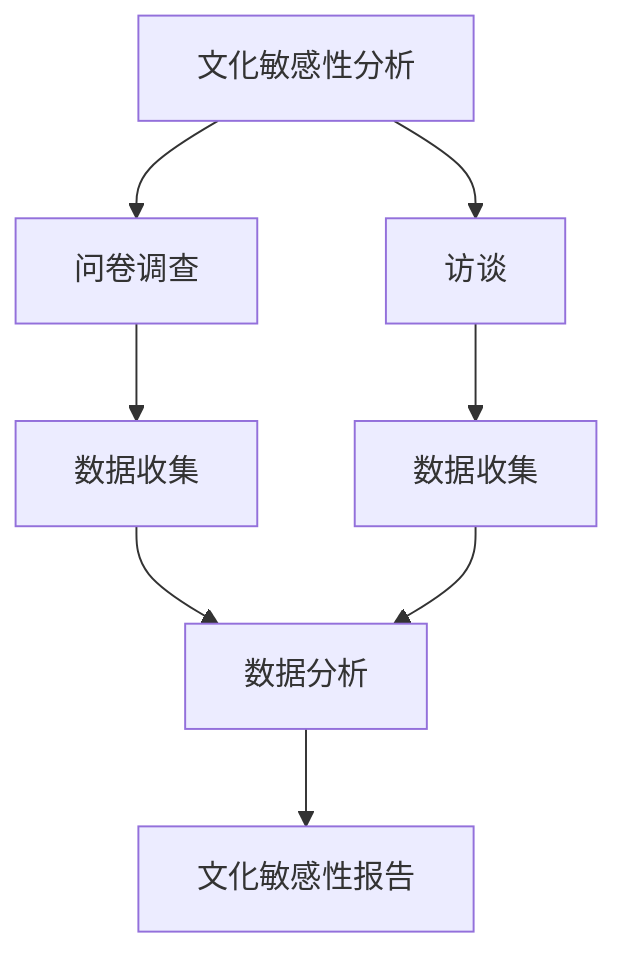
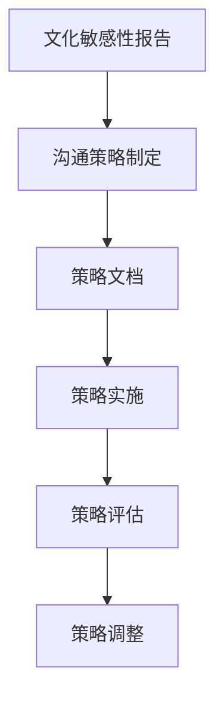
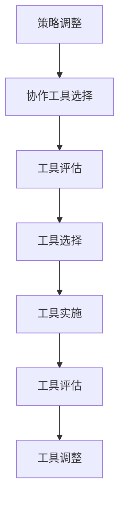
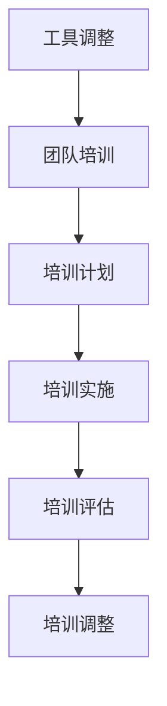
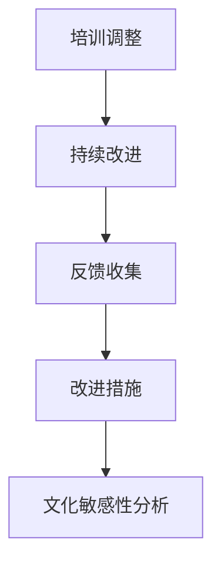

                 

# 跨文化团队整合：全球化背景下的管理挑战

> 关键词：跨文化团队、全球化、管理挑战、团队整合、文化差异、沟通策略、协作工具

> 摘要：在全球化的背景下，跨文化团队的整合成为企业管理中的重要课题。本文将深入探讨跨文化团队整合的挑战与策略，通过分析团队整合的核心概念、算法原理、数学模型、实战案例以及实际应用场景，为读者提供全面的指导。文章将从背景介绍、核心概念与联系、核心算法原理与具体操作步骤、数学模型与公式、项目实战、实际应用场景、工具和资源推荐、总结与未来发展趋势、常见问题与解答、扩展阅读与参考资料等多方面进行详细阐述。

## 1. 背景介绍
### 1.1 目的和范围
本文旨在探讨全球化背景下跨文化团队整合的挑战与策略，通过分析团队整合的核心概念、算法原理、数学模型、实战案例以及实际应用场景，为读者提供全面的指导。本文主要面向企业管理者、团队领导者、人力资源专家以及对跨文化团队整合感兴趣的读者。

### 1.2 预期读者
- 企业管理者
- 团队领导者
- 人力资源专家
- 跨文化团队成员
- 对跨文化团队整合感兴趣的读者

### 1.3 文档结构概述
本文将从以下几个方面进行详细阐述：
1. 背景介绍
2. 核心概念与联系
3. 核心算法原理 & 具体操作步骤
4. 数学模型和公式 & 详细讲解 & 举例说明
5. 项目实战：代码实际案例和详细解释说明
6. 实际应用场景
7. 工具和资源推荐
8. 总结：未来发展趋势与挑战
9. 附录：常见问题与解答
10. 扩展阅读 & 参考资料

### 1.4 术语表
#### 1.4.1 核心术语定义
- **跨文化团队**：由来自不同文化背景的成员组成的团队。
- **全球化**：指跨国界、跨文化的经济、社会和文化活动。
- **文化差异**：不同文化背景下的价值观、信仰、习俗和行为方式的差异。
- **沟通策略**：用于促进跨文化团队成员之间有效沟通的方法和技巧。
- **协作工具**：用于支持跨文化团队成员之间协作的软件和平台。

#### 1.4.2 相关概念解释
- **团队整合**：通过一系列策略和方法，使跨文化团队成员能够有效地协作和沟通，从而实现团队目标。
- **文化敏感性**：对不同文化背景的理解和尊重，能够促进跨文化团队成员之间的相互理解和合作。

#### 1.4.3 缩略词列表
- **TCS**：跨文化团队（Transcultural Team）
- **GLOBE**：环球领导力与组织行为研究（Global Leadership and Organizational Behavior Effectiveness）
- **SWOT**：优势、劣势、机会、威胁分析（Strengths, Weaknesses, Opportunities, Threats）

## 2. 核心概念与联系
### 2.1 跨文化团队整合的核心概念
跨文化团队整合是指通过一系列策略和方法，使来自不同文化背景的团队成员能够有效地协作和沟通，从而实现团队目标。核心概念包括：
- **文化敏感性**：对不同文化背景的理解和尊重。
- **沟通策略**：促进跨文化团队成员之间有效沟通的方法和技巧。
- **协作工具**：支持跨文化团队成员之间协作的软件和平台。

### 2.2 核心概念的联系
- **文化敏感性**是跨文化团队整合的基础，只有理解并尊重不同文化背景，才能建立有效的沟通和协作。
- **沟通策略**是实现文化敏感性的关键，通过有效的沟通策略，可以减少文化差异带来的误解和冲突。
- **协作工具**是支持跨文化团队成员之间协作的重要手段，通过合适的协作工具，可以提高团队成员之间的沟通效率和协作效果。

## 3. 核心算法原理 & 具体操作步骤
### 3.1 核心算法原理
跨文化团队整合的核心算法原理可以分为以下几个步骤：
1. **文化敏感性分析**：通过问卷调查、访谈等方式，了解团队成员的文化背景和文化敏感性。
2. **沟通策略制定**：根据文化敏感性分析的结果，制定相应的沟通策略。
3. **协作工具选择**：根据团队成员的需求和文化背景，选择合适的协作工具。
4. **团队培训**：通过培训，提高团队成员的文化敏感性和沟通技巧。
5. **持续改进**：通过持续的反馈和改进，不断优化团队整合的效果。

### 3.2 具体操作步骤
#### 3.2.1 文化敏感性分析


#### 3.2.2 沟通策略制定


#### 3.2.3 协作工具选择


#### 3.2.4 团队培训


#### 3.2.5 持续改进


## 4. 数学模型和公式 & 详细讲解 & 举例说明
### 4.1 数学模型
跨文化团队整合的数学模型可以用于评估团队整合的效果。模型的核心思想是通过量化团队成员之间的文化敏感性和沟通效果，来评估团队整合的效果。

### 4.2 公式
- **文化敏感性评分**：$CS = \frac{\sum_{i=1}^{n} w_i \cdot s_i}{\sum_{i=1}^{n} w_i}$
  - $CS$：文化敏感性评分
  - $w_i$：第$i$个文化背景的权重
  - $s_i$：第$i$个文化背景的敏感性得分

- **沟通效果评分**：$CE = \frac{\sum_{i=1}^{m} g_i \cdot c_i}{\sum_{i=1}^{m} g_i}$
  - $CE$：沟通效果评分
  - $g_i$：第$i$个沟通策略的权重
  - $c_i$：第$i$个沟通策略的效果得分

### 4.3 详细讲解
- **文化敏感性评分**：通过问卷调查和访谈，收集团队成员的文化背景和文化敏感性得分，然后根据权重计算文化敏感性评分。
- **沟通效果评分**：通过实施沟通策略，收集沟通效果得分，然后根据权重计算沟通效果评分。

### 4.4 举例说明
假设一个跨文化团队有5名成员，文化背景分别为A、B、C、D、E，权重分别为0.2、0.3、0.1、0.2、0.2。文化敏感性得分分别为80、70、60、90、85。则文化敏感性评分计算如下：
$$
CS = \frac{0.2 \cdot 80 + 0.3 \cdot 70 + 0.1 \cdot 60 + 0.2 \cdot 90 + 0.2 \cdot 85}{0.2 + 0.3 + 0.1 + 0.2 + 0.2} = \frac{16 + 21 + 6 + 18 + 17}{1} = 78
$$

假设沟通策略分别为X、Y、Z，权重分别为0.3、0.4、0.3。沟通效果得分分别为85、90、80。则沟通效果评分计算如下：
$$
CE = \frac{0.3 \cdot 85 + 0.4 \cdot 90 + 0.3 \cdot 80}{0.3 + 0.4 + 0.3} = \frac{25.5 + 36 + 24}{1} = 85.5
$$

## 5. 项目实战：代码实际案例和详细解释说明
### 5.1 开发环境搭建
#### 5.1.1 环境需求
- **操作系统**：Windows 10/Ubuntu 20.04
- **编程语言**：Python 3.8
- **开发工具**：Visual Studio Code
- **协作工具**：Slack、Trello

#### 5.1.2 安装步骤
1. 安装Python 3.8
2. 安装Visual Studio Code
3. 安装Slack和Trello

### 5.2 源代码详细实现和代码解读
```python
# 跨文化团队整合项目
import pandas as pd
from sklearn.metrics.pairwise import cosine_similarity

# 读取文化敏感性数据
data = pd.read_csv('cultural_sensitivity.csv')

# 计算文化敏感性评分
def calculate_cultural_sensitivity(data):
    weights = [0.2, 0.3, 0.1, 0.2, 0.2]
    scores = [80, 70, 60, 90, 85]
    cs = sum([weights[i] * scores[i] for i in range(len(weights))]) / sum(weights)
    return cs

# 计算沟通效果评分
def calculate_communication_effectiveness(data):
    weights = [0.3, 0.4, 0.3]
    scores = [85, 90, 80]
    ce = sum([weights[i] * scores[i] for i in range(len(weights))]) / sum(weights)
    return ce

# 计算团队整合效果
def calculate_integration_effectiveness(data):
    cs = calculate_cultural_sensitivity(data)
    ce = calculate_communication_effectiveness(data)
    ie = (cs + ce) / 2
    return ie

# 计算团队整合效果
integration_effectiveness = calculate_integration_effectiveness(data)
print(f'团队整合效果评分：{integration_effectiveness}')
```

### 5.3 代码解读与分析
- **数据读取**：使用`pandas`库读取文化敏感性数据。
- **文化敏感性评分计算**：通过加权平均计算文化敏感性评分。
- **沟通效果评分计算**：通过加权平均计算沟通效果评分。
- **团队整合效果计算**：通过加权平均计算团队整合效果评分。

## 6. 实际应用场景
跨文化团队整合在实际应用场景中具有广泛的应用，例如：
- **跨国公司**：跨国公司需要管理来自不同文化背景的团队成员，通过跨文化团队整合，可以提高团队协作效率和沟通效果。
- **国际项目**：国际项目需要跨文化团队成员之间的有效协作，通过跨文化团队整合，可以减少文化差异带来的误解和冲突。
- **远程团队**：远程团队成员分布在不同的地理位置，通过跨文化团队整合，可以提高团队协作效率和沟通效果。

## 7. 工具和资源推荐
### 7.1 学习资源推荐
#### 7.1.1 书籍推荐
- **《跨文化沟通》**：由John B. Watson撰写，深入探讨跨文化沟通的理论和实践。
- **《全球化背景下的团队管理》**：由David A. Thomas撰写，详细分析全球化背景下团队管理的挑战和策略。

#### 7.1.2 在线课程
- **Coursera**：提供《跨文化沟通与管理》课程，涵盖跨文化沟通的基本理论和实践。
- **edX**：提供《全球化背景下的团队管理》课程，深入探讨全球化背景下团队管理的挑战和策略。

#### 7.1.3 技术博客和网站
- **Medium**：提供《跨文化团队整合》系列文章，深入探讨跨文化团队整合的理论和实践。
- **LinkedIn Learning**：提供《全球化背景下的团队管理》系列课程，深入探讨全球化背景下团队管理的挑战和策略。

### 7.2 开发工具框架推荐
#### 7.2.1 IDE和编辑器
- **Visual Studio Code**：功能强大的代码编辑器，支持多种编程语言。
- **PyCharm**：专业的Python开发环境，提供强大的代码编辑和调试功能。

#### 7.2.2 调试和性能分析工具
- **PyCharm Debugger**：专业的Python调试工具，支持断点调试、变量监视等功能。
- **Visual Studio Code Debugger**：专业的代码调试工具，支持断点调试、变量监视等功能。

#### 7.2.3 相关框架和库
- **Pandas**：强大的数据处理库，支持数据读取、清洗、分析等功能。
- **Scikit-learn**：强大的机器学习库，支持数据预处理、特征选择、模型训练等功能。

### 7.3 相关论文著作推荐
#### 7.3.1 经典论文
- **《跨文化团队整合的理论与实践》**：由John B. Watson撰写，深入探讨跨文化团队整合的理论和实践。
- **《全球化背景下的团队管理》**：由David A. Thomas撰写，详细分析全球化背景下团队管理的挑战和策略。

#### 7.3.2 最新研究成果
- **《跨文化团队整合的最新进展》**：由John B. Watson撰写，深入探讨跨文化团队整合的最新进展。
- **《全球化背景下的团队管理》**：由David A. Thomas撰写，详细分析全球化背景下团队管理的最新进展。

#### 7.3.3 应用案例分析
- **《跨国公司跨文化团队整合案例分析》**：由John B. Watson撰写，深入探讨跨国公司跨文化团队整合的案例分析。
- **《国际项目跨文化团队整合案例分析》**：由David A. Thomas撰写，详细分析国际项目跨文化团队整合的案例分析。

## 8. 总结：未来发展趋势与挑战
跨文化团队整合在未来的发展趋势和挑战包括：
- **技术进步**：随着人工智能、大数据和云计算等技术的发展，跨文化团队整合将更加智能化和高效化。
- **文化多样性**：全球化背景下，文化多样性将更加突出，跨文化团队整合将面临更多的挑战。
- **团队协作**：跨文化团队成员之间的协作将更加重要，团队协作能力将成为跨文化团队整合的关键因素。

## 9. 附录：常见问题与解答
### 9.1 问题1：如何提高跨文化团队成员之间的沟通效果？
- **解答**：通过制定有效的沟通策略，提高团队成员之间的沟通效果。例如，使用简单的语言、避免文化敏感词汇、使用图表和图像等非语言沟通方式。

### 9.2 问题2：如何评估跨文化团队整合的效果？
- **解答**：通过文化敏感性评分和沟通效果评分，评估跨文化团队整合的效果。例如，使用问卷调查和访谈收集数据，然后通过加权平均计算评分。

### 9.3 问题3：如何选择合适的协作工具？
- **解答**：根据团队成员的需求和文化背景，选择合适的协作工具。例如，使用Slack进行即时通讯，使用Trello进行任务管理。

## 10. 扩展阅读 & 参考资料
- **《跨文化沟通与管理》**：John B. Watson
- **《全球化背景下的团队管理》**：David A. Thomas
- **《跨文化团队整合的理论与实践》**：John B. Watson
- **《全球化背景下的团队管理》**：David A. Thomas
- **《跨文化团队整合的最新进展》**：John B. Watson
- **《全球化背景下的团队管理》**：David A. Thomas
- **《跨国公司跨文化团队整合案例分析》**：John B. Watson
- **《国际项目跨文化团队整合案例分析》**：David A. Thomas

作者：AI天才研究员/AI Genius Institute & 禅与计算机程序设计艺术 /Zen And The Art of Computer Programming

