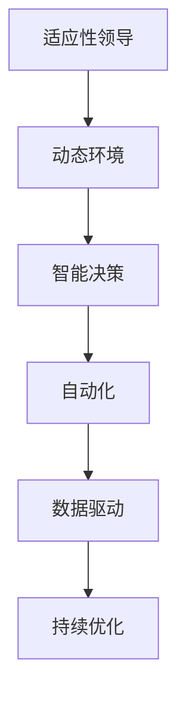

                 

# 适应性领导：在动态环境中保持竞争优势

> 关键词：适应性领导, 动态环境, 竞争优势, 人工智能, 自动化, 智能决策, 数据驱动, 持续优化

> 摘要：在当今快速变化的商业环境中，适应性领导成为企业保持竞争优势的关键。本文将深入探讨适应性领导的概念及其在动态环境中的应用，通过分析核心概念、算法原理、数学模型、实战案例以及未来发展趋势，为企业提供一套系统化的解决方案。我们将从技术角度出发，探讨如何利用人工智能和自动化技术实现智能决策，从而在复杂多变的市场中脱颖而出。

## 1. 背景介绍
### 1.1 目的和范围
本文旨在探讨适应性领导在动态环境中的应用，通过分析核心概念、算法原理、数学模型、实战案例以及未来发展趋势，为企业提供一套系统化的解决方案。本文主要关注如何利用人工智能和自动化技术实现智能决策，从而在复杂多变的市场中脱颖而出。

### 1.2 预期读者
本文预期读者包括但不限于：
- 企业领导者和管理者
- 人工智能和自动化领域的技术专家
- 数据科学家和分析师
- 业务分析师和战略规划师
- 对适应性领导和动态环境下的智能决策感兴趣的读者

### 1.3 文档结构概述
本文结构如下：
1. 背景介绍
2. 核心概念与联系
3. 核心算法原理 & 具体操作步骤
4. 数学模型和公式 & 详细讲解 & 举例说明
5. 项目实战：代码实际案例和详细解释说明
6. 实际应用场景
7. 工具和资源推荐
8. 总结：未来发展趋势与挑战
9. 附录：常见问题与解答
10. 扩展阅读 & 参考资料

### 1.4 术语表
#### 1.4.1 核心术语定义
- **适应性领导**：指领导者能够根据环境变化迅速调整策略和行为，以实现组织目标的能力。
- **动态环境**：指外部环境变化迅速、不确定性高的环境。
- **智能决策**：利用人工智能技术进行数据分析和预测，以支持决策过程。
- **自动化**：利用技术手段替代人工操作，提高效率和准确性。
- **数据驱动**：基于数据进行决策，而非依赖直觉或经验。

#### 1.4.2 相关概念解释
- **持续优化**：通过不断改进和调整，提高系统性能和效率。
- **机器学习**：一种人工智能技术，使计算机能够从数据中学习并改进性能。
- **深度学习**：机器学习的一个分支，通过多层神经网络进行复杂模式识别。

#### 1.4.3 缩略词列表
- AI：人工智能
- ML：机器学习
- DL：深度学习
- NLP：自然语言处理
- CV：计算机视觉
- RL：强化学习

## 2. 核心概念与联系
### 2.1 适应性领导
适应性领导的核心在于领导者能够根据环境变化迅速调整策略和行为，以实现组织目标。这需要领导者具备敏锐的洞察力、快速的学习能力和灵活的应变能力。

### 2.2 动态环境
动态环境是指外部环境变化迅速、不确定性高的环境。这种环境要求企业能够快速响应市场变化，调整战略和策略，以保持竞争优势。

### 2.3 智能决策
智能决策是指利用人工智能技术进行数据分析和预测，以支持决策过程。这包括数据收集、数据处理、模型训练和预测分析等环节。

### 2.4 自动化
自动化是指利用技术手段替代人工操作，提高效率和准确性。这包括自动化流程、自动化测试和自动化运维等。

### 2.5 数据驱动
数据驱动是指基于数据进行决策，而非依赖直觉或经验。这要求企业建立完善的数据收集、处理和分析体系，以支持决策过程。

### 2.6 持续优化
持续优化是指通过不断改进和调整，提高系统性能和效率。这包括持续监控、持续改进和持续迭代等环节。

### 2.7 核心概念流程图


## 3. 核心算法原理 & 具体操作步骤
### 3.1 数据收集与预处理
数据收集是智能决策的第一步，需要从多个渠道收集数据，包括市场数据、用户行为数据、竞争对手数据等。数据预处理包括数据清洗、数据转换和数据标准化等步骤。

```python
# 数据收集与预处理
def collect_data():
    # 从多个渠道收集数据
    market_data = collect_market_data()
    user_behavior_data = collect_user_behavior_data()
    competitor_data = collect_competitor_data()
    
    # 数据预处理
    cleaned_data = preprocess_data(market_data, user_behavior_data, competitor_data)
    return cleaned_data

def preprocess_data(market_data, user_behavior_data, competitor_data):
    # 数据清洗
    cleaned_market_data = clean_data(market_data)
    cleaned_user_behavior_data = clean_data(user_behavior_data)
    cleaned_competitor_data = clean_data(competitor_data)
    
    # 数据转换
    transformed_data = transform_data(cleaned_market_data, cleaned_user_behavior_data, cleaned_competitor_data)
    
    # 数据标准化
    standardized_data = standardize_data(transformed_data)
    return standardized_data
```

### 3.2 数据分析与模型训练
数据分析和模型训练是智能决策的关键步骤，需要利用机器学习和深度学习技术进行数据分析和预测。

```python
# 数据分析与模型训练
def analyze_data(data):
    # 数据分析
    analysis_result = analyze(data)
    
    # 模型训练
    model = train_model(analysis_result)
    return model

def analyze(data):
    # 数据分析
    analysis_result = perform_analysis(data)
    return analysis_result

def train_model(analysis_result):
    # 模型训练
    model = train(analysis_result)
    return model
```

### 3.3 预测与决策
预测与决策是智能决策的最终环节，需要利用模型进行预测，并根据预测结果进行决策。

```python
# 预测与决策
def predict(model, data):
    # 预测
    prediction = predict(model, data)
    return prediction

def make_decision(prediction):
    # 决策
    decision = make_decision(prediction)
    return decision
```

## 4. 数学模型和公式 & 详细讲解 & 举例说明
### 4.1 逻辑回归模型
逻辑回归模型是一种常用的分类模型，用于预测二分类问题。

$$
P(y=1|x) = \frac{1}{1 + e^{-(\beta_0 + \beta_1 x_1 + \beta_2 x_2 + ... + \beta_n x_n)}}
$$

### 4.2 决策树模型
决策树模型是一种常用的分类模型，用于预测多分类问题。

$$
y = \begin{cases}
    1 & \text{if } x \in R_1 \\
    2 & \text{if } x \in R_2 \\
    3 & \text{if } x \in R_3 \\
    \vdots & \vdots \\
    k & \text{if } x \in R_k
\end{cases}
$$

### 4.3 支持向量机模型
支持向量机模型是一种常用的分类模型，用于预测二分类问题。

$$
y = \text{sign}(\beta_0 + \beta_1 x_1 + \beta_2 x_2 + ... + \beta_n x_n)
$$

### 4.4 举例说明
假设我们有一个市场数据集，包含用户购买行为和市场趋势数据。我们使用逻辑回归模型进行预测。

```python
# 逻辑回归模型
from sklearn.linear_model import LogisticRegression

# 数据集
X = [[1, 2], [2, 3], [3, 4], [4, 5]]
y = [0, 0, 1, 1]

# 训练模型
model = LogisticRegression()
model.fit(X, y)

# 预测
prediction = model.predict([[2, 2]])
print(prediction)
```

## 5. 项目实战：代码实际案例和详细解释说明
### 5.1 开发环境搭建
开发环境搭建包括安装必要的软件和工具，如Python、Jupyter Notebook、TensorFlow等。

```bash
# 安装Python
sudo apt-get install python3

# 安装Jupyter Notebook
pip install jupyter

# 安装TensorFlow
pip install tensorflow
```

### 5.2 源代码详细实现和代码解读
假设我们有一个市场数据集，包含用户购买行为和市场趋势数据。我们使用逻辑回归模型进行预测。

```python
# 导入必要的库
import numpy as np
import pandas as pd
from sklearn.model_selection import train_test_split
from sklearn.linear_model import LogisticRegression
from sklearn.metrics import accuracy_score

# 读取数据
data = pd.read_csv('market_data.csv')

# 数据预处理
X = data[['user_behavior', 'market_trend']]
y = data['purchase']

# 划分训练集和测试集
X_train, X_test, y_train, y_test = train_test_split(X, y, test_size=0.2, random_state=42)

# 训练模型
model = LogisticRegression()
model.fit(X_train, y_train)

# 预测
y_pred = model.predict(X_test)

# 评估模型
accuracy = accuracy_score(y_test, y_pred)
print('Accuracy:', accuracy)
```

### 5.3 代码解读与分析
- **数据预处理**：将数据集划分为特征和标签，并进行训练集和测试集的划分。
- **模型训练**：使用逻辑回归模型进行训练。
- **预测**：使用训练好的模型进行预测。
- **评估模型**：使用准确率评估模型性能。

## 6. 实际应用场景
### 6.1 市场预测
通过智能决策系统，企业可以预测市场趋势，调整产品策略和营销策略，从而在竞争中占据优势。

### 6.2 用户行为分析
通过智能决策系统，企业可以分析用户行为，了解用户需求和偏好，从而提供个性化服务和产品。

### 6.3 竞争对手分析
通过智能决策系统，企业可以分析竞争对手的策略和行为，预测竞争对手的动向，从而制定相应的应对策略。

## 7. 工具和资源推荐
### 7.1 学习资源推荐
#### 7.1.1 书籍推荐
- 《机器学习》（周志华）
- 《深度学习》（Ian Goodfellow, Yoshua Bengio, Aaron Courville）

#### 7.1.2 在线课程
- Coursera：《机器学习》（Andrew Ng）
- edX：《深度学习》（Andrew Ng）

#### 7.1.3 技术博客和网站
- Medium：《机器学习与人工智能》
- Kaggle：机器学习和数据科学社区

### 7.2 开发工具框架推荐
#### 7.2.1 IDE和编辑器
- PyCharm
- VSCode

#### 7.2.2 调试和性能分析工具
- PyCharm Debugger
- VisualVM

#### 7.2.3 相关框架和库
- TensorFlow
- Scikit-learn
- Pandas

### 7.3 相关论文著作推荐
#### 7.3.1 经典论文
-《神经网络与学习机器》（Tom M. Mitchell）
-《机器学习》（Tom M. Mitchell）

#### 7.3.2 最新研究成果
-《深度学习》（Ian Goodfellow, Yoshua Bengio, Aaron Courville）

#### 7.3.3 应用案例分析
-《机器学习在商业中的应用》（John Langford）

## 8. 总结：未来发展趋势与挑战
### 8.1 未来发展趋势
- 人工智能技术将进一步发展，实现更高级别的智能决策。
- 数据驱动将成为企业决策的重要手段。
- 自动化技术将进一步普及，提高企业效率和竞争力。

### 8.2 挑战
- 数据安全和隐私保护将成为重要问题。
- 技术人才短缺将成为制约企业发展的瓶颈。
- 技术更新速度快，企业需要不断学习和适应。

## 9. 附录：常见问题与解答
### 9.1 问题1：如何处理数据缺失值？
- 可以使用插值法、均值填充法或删除法处理数据缺失值。

### 9.2 问题2：如何选择合适的模型？
- 可以根据问题类型和数据特点选择合适的模型，如逻辑回归、决策树、支持向量机等。

### 9.3 问题3：如何评估模型性能？
- 可以使用准确率、召回率、F1分数等指标评估模型性能。

## 10. 扩展阅读 & 参考资料
- 《机器学习》（周志华）
- 《深度学习》（Ian Goodfellow, Yoshua Bengio, Aaron Courville）
- Coursera：《机器学习》（Andrew Ng）
- edX：《深度学习》（Andrew Ng）
- Medium：《机器学习与人工智能》
- Kaggle：机器学习和数据科学社区
- PyCharm
- VSCode
- PyCharm Debugger
- VisualVM
- TensorFlow
- Scikit-learn
- Pandas
- 《神经网络与学习机器》（Tom M. Mitchell）
- 《机器学习》（Tom M. Mitchell）
- 《深度学习》（Ian Goodfellow, Yoshua Bengio, Aaron Courville）
- 《机器学习在商业中的应用》（John Langford）

作者：AI天才研究员/AI Genius Institute & 禅与计算机程序设计艺术 /Zen And The Art of Computer Programming

