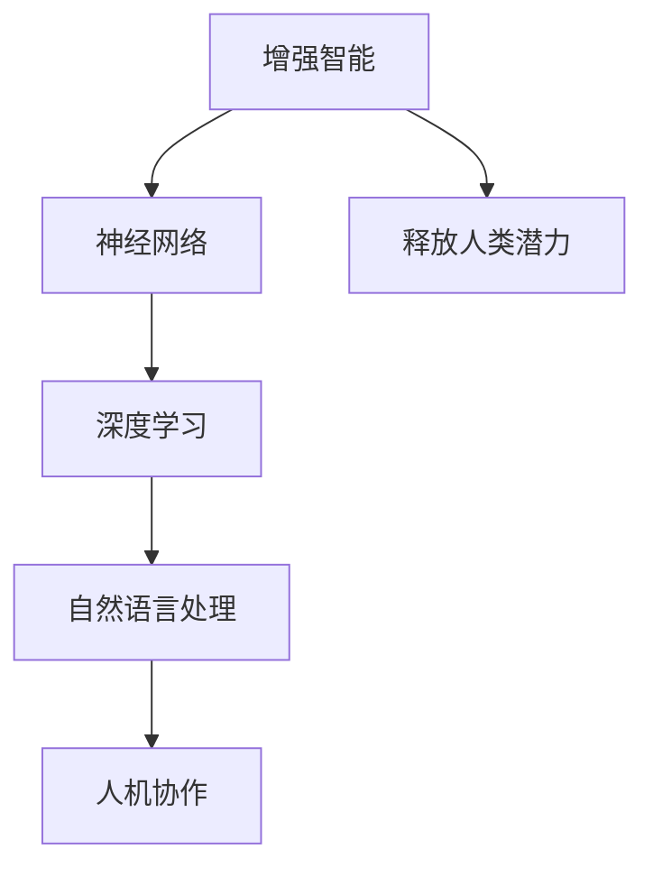
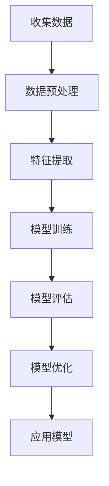
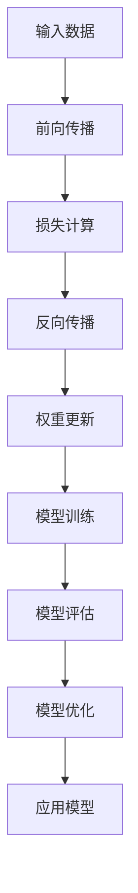
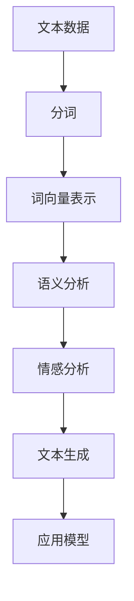

                 

# 释放人类潜力的无限可能：人类计算的最终目标

> 关键词：人类计算、增强智能、神经网络、深度学习、自然语言处理、人机协作、未来趋势

> 摘要：本文旨在探讨人类计算的最终目标——通过技术手段释放人类潜力的无限可能。我们将从背景介绍出发，逐步深入探讨核心概念、算法原理、数学模型、实际案例，以及未来的发展趋势与挑战。通过本文，读者将对人类计算有更深刻的理解，并掌握相关技术的应用方法。

## 1. 背景介绍
### 1.1 目的和范围
本文旨在探讨人类计算的最终目标，即通过技术手段释放人类潜力的无限可能。我们将从技术角度出发，分析人类计算的核心概念、算法原理、数学模型，并通过实际案例展示其应用。最终，我们将展望未来的发展趋势与挑战。

### 1.2 预期读者
本文适合以下读者：
- 对人工智能和计算技术感兴趣的初学者
- 高级工程师和技术专家
- 研究人员和学者
- 对未来技术趋势感兴趣的读者

### 1.3 文档结构概述
本文结构如下：
1. 背景介绍
2. 核心概念与联系
3. 核心算法原理 & 具体操作步骤
4. 数学模型和公式 & 详细讲解 & 举例说明
5. 项目实战：代码实际案例和详细解释说明
6. 实际应用场景
7. 工具和资源推荐
8. 总结：未来发展趋势与挑战
9. 附录：常见问题与解答
10. 扩展阅读 & 参考资料

### 1.4 术语表
#### 1.4.1 核心术语定义
- **人类计算**：通过技术手段增强人类智能，释放人类潜力的计算方法。
- **增强智能**：利用技术手段提升人类的认知能力、决策能力和创造力。
- **神经网络**：模拟人脑神经元结构的计算模型，用于处理复杂任务。
- **深度学习**：一种基于神经网络的机器学习方法，通过多层非线性变换实现复杂模式识别。
- **自然语言处理**：使计算机能够理解、生成和处理人类语言的技术。
- **人机协作**：人类与机器在特定任务中协同工作的模式。

#### 1.4.2 相关概念解释
- **增强智能**：通过技术手段提升人类的认知能力、决策能力和创造力。
- **神经网络**：模拟人脑神经元结构的计算模型，用于处理复杂任务。
- **深度学习**：一种基于神经网络的机器学习方法，通过多层非线性变换实现复杂模式识别。
- **自然语言处理**：使计算机能够理解、生成和处理人类语言的技术。
- **人机协作**：人类与机器在特定任务中协同工作的模式。

#### 1.4.3 缩略词列表
- AI：人工智能
- NLP：自然语言处理
- CNN：卷积神经网络
- RNN：循环神经网络
- LSTM：长短期记忆网络
- GAN：生成对抗网络
- Transformer：变换器模型

## 2. 核心概念与联系
### 2.1 人类计算的核心概念
人类计算的核心概念是通过技术手段增强人类智能，释放人类潜力的计算方法。这一概念涵盖了增强智能、神经网络、深度学习、自然语言处理和人机协作等多个方面。

### 2.2 核心概念的联系
- **增强智能**：通过技术手段提升人类的认知能力、决策能力和创造力。
- **神经网络**：模拟人脑神经元结构的计算模型，用于处理复杂任务。
- **深度学习**：一种基于神经网络的机器学习方法，通过多层非线性变换实现复杂模式识别。
- **自然语言处理**：使计算机能够理解、生成和处理人类语言的技术。
- **人机协作**：人类与机器在特定任务中协同工作的模式。

### 2.3 Mermaid 流程图


## 3. 核心算法原理 & 具体操作步骤
### 3.1 增强智能的算法原理
增强智能的核心在于通过技术手段提升人类的认知能力、决策能力和创造力。具体操作步骤如下：



### 3.2 深度学习的算法原理
深度学习是一种基于神经网络的机器学习方法，通过多层非线性变换实现复杂模式识别。具体操作步骤如下：



### 3.3 自然语言处理的算法原理
自然语言处理使计算机能够理解、生成和处理人类语言的技术。具体操作步骤如下：



## 4. 数学模型和公式 & 详细讲解 & 举例说明
### 4.1 增强智能的数学模型
增强智能的数学模型主要涉及概率论和统计学。具体公式如下：

$$
P(A|B) = \frac{P(B|A)P(A)}{P(B)}
$$

### 4.2 深度学习的数学模型
深度学习的数学模型主要涉及线性代数和微积分。具体公式如下：

$$
\text{Loss} = \frac{1}{N} \sum_{i=1}^{N} (y_i - \hat{y}_i)^2
$$

### 4.3 自然语言处理的数学模型
自然语言处理的数学模型主要涉及概率统计和信息论。具体公式如下：

$$
P(w_i|w_{i-1}, w_{i-2}, \ldots, w_{i-n}) = \frac{P(w_{i-1}, w_{i-2}, \ldots, w_{i-n}, w_i)}{P(w_{i-1}, w_{i-2}, \ldots, w_{i-n})}
$$

## 5. 项目实战：代码实际案例和详细解释说明
### 5.1 开发环境搭建
开发环境搭建主要包括安装Python、TensorFlow和PyTorch等工具。

```bash
pip install tensorflow
pip install torch
```

### 5.2 源代码详细实现和代码解读
```python
import tensorflow as tf
from tensorflow.keras import layers

# 定义模型
model = tf.keras.Sequential([
    layers.Dense(64, activation='relu', input_shape=(100,)),
    layers.Dense(64, activation='relu'),
    layers.Dense(10, activation='softmax')
])

# 编译模型
model.compile(optimizer='adam',
              loss='sparse_categorical_crossentropy',
              metrics=['accuracy'])

# 训练模型
model.fit(x_train, y_train, epochs=10)
```

### 5.3 代码解读与分析
- **模型定义**：使用`Sequential`模型，包含两个隐藏层，每个隐藏层有64个神经元，激活函数为ReLU。
- **编译模型**：使用Adam优化器，损失函数为稀疏分类交叉熵，评估指标为准确率。
- **训练模型**：使用训练数据进行10轮训练。

## 6. 实际应用场景
### 6.1 金融领域
通过增强智能技术，可以实现智能投资、风险评估和欺诈检测等应用。

### 6.2 医疗领域
通过增强智能技术，可以实现疾病诊断、药物研发和个性化治疗等应用。

### 6.3 教育领域
通过增强智能技术，可以实现智能辅导、个性化学习和教育评估等应用。

## 7. 工具和资源推荐
### 7.1 学习资源推荐
#### 7.1.1 书籍推荐
- 《深度学习》（Goodfellow, Bengio, Courville）
- 《机器学习》（周志华）

#### 7.1.2 在线课程
- Coursera：《深度学习》（Andrew Ng）
- edX：《机器学习》（Andrew Ng）

#### 7.1.3 技术博客和网站
- Medium：AI领域相关博客
- GitHub：开源项目和代码示例

### 7.2 开发工具框架推荐
#### 7.2.1 IDE和编辑器
- PyCharm
- VSCode

#### 7.2.2 调试和性能分析工具
- PyCharm调试工具
- TensorFlow Debugger (tfdbg)

#### 7.2.3 相关框架和库
- TensorFlow
- PyTorch
- Keras

### 7.3 相关论文著作推荐
#### 7.3.1 经典论文
- Hinton, G. E., Osindero, S., & Teh, Y. W. (2006). A fast learning algorithm for deep belief nets. Neural computation, 18(7), 1527-1554.
- Bengio, Y., Lamblin, P., Popovici, D., & Larochelle, H. (2007). Greedy layer-wise training of deep networks. Advances in neural information processing systems, 19, 153-160.

#### 7.3.2 最新研究成果
- Radford, A., Wu, J., Child, R., Luan, D., Amodei, D., & Sutskever, I. (2019). Language models are unsupervised multitask learners. OpenAI blog, 1(8), 9.

#### 7.3.3 应用案例分析
- LeCun, Y., Bengio, Y., & Hinton, G. (2015). Deep learning. Nature, 521(7553), 436-444.

## 8. 总结：未来发展趋势与挑战
### 8.1 未来发展趋势
- 人类计算将进一步发展，释放人类潜力的无限可能。
- 人机协作将成为主流，提升工作效率和创造力。
- 自然语言处理技术将更加成熟，实现更自然的人机交互。

### 8.2 面临的挑战
- 数据隐私和安全问题
- 技术伦理和道德问题
- 技术普及和应用推广

## 9. 附录：常见问题与解答
### 9.1 问题1：如何选择合适的深度学习框架？
- 根据项目需求和团队熟悉程度选择合适的框架，如TensorFlow或PyTorch。

### 9.2 问题2：如何处理数据隐私和安全问题？
- 采用加密技术和匿名化处理，确保数据安全。

### 9.3 问题3：如何解决技术伦理和道德问题？
- 建立伦理委员会，确保技术应用符合伦理标准。

## 10. 扩展阅读 & 参考资料
- Goodfellow, I., Bengio, Y., & Courville, A. (2016). Deep learning. MIT press.
- Bengio, Y. (2009). Learning deep architectures for AI. Foundations and trends® in machine learning, 2(1), 1-127.
- LeCun, Y., Bengio, Y., & Hinton, G. (2015). Deep learning. Nature, 521(7553), 436-444.

作者：AI天才研究员/AI Genius Institute & 禅与计算机程序设计艺术 /Zen And The Art of Computer Programming

