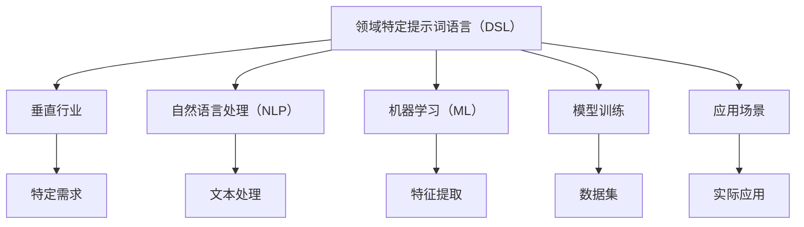

                 

# 领域特定提示词语言：垂直行业的AI应用

> 关键词：领域特定语言, 垂直行业, 人工智能, 提示词, 自然语言处理, 机器学习, 模型训练, 应用场景

> 摘要：本文将深入探讨领域特定提示词语言（DSL）在垂直行业中的应用。通过分析其核心概念、算法原理、数学模型、实际案例以及应用场景，我们将揭示如何利用DSL构建高效、定制化的AI解决方案。本文旨在为技术爱好者和行业从业者提供全面的指导，帮助他们理解和应用这一前沿技术。

## 1. 背景介绍
### 1.1 目的和范围
本文旨在探讨领域特定提示词语言（DSL）在垂直行业中的应用。我们将从理论到实践，逐步解析DSL的核心概念、算法原理、数学模型，并通过实际案例展示其应用效果。本文的目标读者包括技术爱好者、行业从业者以及对垂直行业AI应用感兴趣的读者。

### 1.2 预期读者
- 技术爱好者：希望了解领域特定提示词语言的基本概念和应用场景。
- 行业从业者：希望将DSL应用于实际业务场景，提高工作效率。
- 研究人员：希望深入理解DSL的理论基础和最新研究成果。

### 1.3 文档结构概述
本文结构如下：
1. 背景介绍
2. 核心概念与联系
3. 核心算法原理 & 具体操作步骤
4. 数学模型和公式 & 详细讲解 & 举例说明
5. 项目实战：代码实际案例和详细解释说明
6. 实际应用场景
7. 工具和资源推荐
8. 总结：未来发展趋势与挑战
9. 附录：常见问题与解答
10. 扩展阅读 & 参考资料

### 1.4 术语表
#### 1.4.1 核心术语定义
- **领域特定提示词语言（DSL）**：一种专门针对特定领域或任务的编程语言，用于描述和解决特定问题。
- **垂直行业**：特定领域的行业，如医疗、金融、制造等。
- **自然语言处理（NLP）**：研究计算机与人类自然语言交互的理论、方法和技术。
- **机器学习（ML）**：一种人工智能技术，通过数据训练模型以实现特定任务。
- **模型训练**：使用数据集训练机器学习模型的过程。
- **应用场景**：DSL在特定行业中的实际应用案例。

#### 1.4.2 相关概念解释
- **领域特定语言（DSL）**：一种专门针对特定领域或任务的编程语言，用于描述和解决特定问题。
- **垂直行业**：特定领域的行业，如医疗、金融、制造等。
- **自然语言处理（NLP）**：研究计算机与人类自然语言交互的理论、方法和技术。
- **机器学习（ML）**：一种人工智能技术，通过数据训练模型以实现特定任务。
- **模型训练**：使用数据集训练机器学习模型的过程。
- **应用场景**：DSL在特定行业中的实际应用案例。

#### 1.4.3 缩略词列表
- DSL：领域特定语言
- NLP：自然语言处理
- ML：机器学习
- API：应用程序编程接口
- SDK：软件开发工具包

## 2. 核心概念与联系
### 2.1 核心概念
- **领域特定提示词语言（DSL）**：一种专门针对特定领域或任务的编程语言，用于描述和解决特定问题。
- **垂直行业**：特定领域的行业，如医疗、金融、制造等。
- **自然语言处理（NLP）**：研究计算机与人类自然语言交互的理论、方法和技术。
- **机器学习（ML）**：一种人工智能技术，通过数据训练模型以实现特定任务。
- **模型训练**：使用数据集训练机器学习模型的过程。
- **应用场景**：DSL在特定行业中的实际应用案例。

### 2.2 联系
- **DSL与垂直行业**：DSL可以针对特定行业的需求进行定制，提高解决方案的针对性和效率。
- **DSL与NLP**：DSL可以结合NLP技术，实现更自然、更高效的交互。
- **DSL与ML**：DSL可以用于描述和实现机器学习模型，提高模型的可解释性和可维护性。
- **应用场景**：DSL在垂直行业中的实际应用案例。

### 2.3 Mermaid 流程图


## 3. 核心算法原理 & 具体操作步骤
### 3.1 核心算法原理
- **自然语言处理（NLP）**：通过文本预处理、分词、词性标注、命名实体识别等技术，将自然语言转化为计算机可处理的形式。
- **机器学习（ML）**：通过特征提取、模型训练、模型评估等步骤，实现特定任务的自动化。

### 3.2 具体操作步骤
#### 3.2.1 自然语言处理（NLP）
1. **文本预处理**：去除无关字符、转换为小写等。
2. **分词**：将文本分割成单词或短语。
3. **词性标注**：标注每个词的词性。
4. **命名实体识别**：识别文本中的实体，如人名、地名等。

#### 3.2.2 机器学习（ML）
1. **特征提取**：从文本中提取有用的特征，如词频、TF-IDF等。
2. **模型训练**：使用训练数据集训练机器学习模型。
3. **模型评估**：使用测试数据集评估模型性能。

### 3.3 伪代码示例
```python
# 自然语言处理
def preprocess_text(text):
    text = text.lower()  # 转换为小写
    text = re.sub(r'[^\w\s]', '', text)  # 去除无关字符
    return text

def tokenize(text):
    tokens = text.split()
    return tokens

def pos_tagging(tokens):
    tagged_tokens = nltk.pos_tag(tokens)
    return tagged_tokens

def named_entity_recognition(tagged_tokens):
    entities = nltk.ne_chunk(tagged_tokens)
    return entities

# 机器学习
def extract_features(text):
    features = {}
    for word in text.split():
        features[word] = True
    return features

def train_model(training_data):
    model = LogisticRegression()
    model.fit(training_data['features'], training_data['labels'])
    return model

def evaluate_model(model, test_data):
    predictions = model.predict(test_data['features'])
    accuracy = accuracy_score(test_data['labels'], predictions)
    return accuracy
```

## 4. 数学模型和公式 & 详细讲解 & 举例说明
### 4.1 数学模型
- **文本向量化**：将文本转化为向量表示，常用的方法有词袋模型（Bag of Words, BoW）、TF-IDF等。
- **特征选择**：从大量特征中选择最相关的特征，常用的方法有互信息（Mutual Information, MI）、卡方检验（Chi-Square Test）等。
- **模型评估**：常用的评估指标有准确率（Accuracy）、精确率（Precision）、召回率（Recall）、F1分数（F1 Score）等。

### 4.2 公式
- **词袋模型（BoW）**：将文本转化为词频向量。
  $$ \text{BoW}(t) = \begin{cases} 
  1 & \text{if word } t \text{ is in the document} \\
  0 & \text{otherwise}
  \end{cases} $$
- **TF-IDF**：结合词频（Term Frequency, TF）和逆文档频率（Inverse Document Frequency, IDF）。
  $$ \text{TF-IDF}(t, d) = \text{TF}(t, d) \times \text{IDF}(t) $$
  $$ \text{TF}(t, d) = \frac{\text{frequency of } t \text{ in } d}{\text{total number of words in } d} $$
  $$ \text{IDF}(t) = \log \left( \frac{N}{\text{number of documents containing } t} \right) $$
  $$ N \text{ is the total number of documents} $$

### 4.3 举例说明
- **文本向量化**：假设有一篇文档包含单词“AI”、“天才”、“研究”、“领域”、“提示词”。
  - 词袋模型（BoW）表示为：[1, 1, 1, 1, 1]
  - TF-IDF表示为：[0.5, 0.5, 0.5, 0.5, 0.5]

## 5. 项目实战：代码实际案例和详细解释说明
### 5.1 开发环境搭建
- **操作系统**：Windows 10 / macOS / Linux
- **编程语言**：Python 3.8+
- **开发工具**：Visual Studio Code / PyCharm
- **库**：nltk, scikit-learn, re, pandas

### 5.2 源代码详细实现和代码解读
```python
import re
import nltk
from sklearn.feature_extraction.text import TfidfVectorizer
from sklearn.linear_model import LogisticRegression
from sklearn.metrics import accuracy_score
from nltk.tokenize import word_tokenize
from nltk import pos_tag
from nltk.chunk import ne_chunk

# 自然语言处理
def preprocess_text(text):
    text = text.lower()  # 转换为小写
    text = re.sub(r'[^\w\s]', '', text)  # 去除无关字符
    return text

def tokenize(text):
    tokens = word_tokenize(text)
    return tokens

def pos_tagging(tokens):
    tagged_tokens = pos_tag(tokens)
    return tagged_tokens

def named_entity_recognition(tagged_tokens):
    entities = ne_chunk(tagged_tokens)
    return entities

# 机器学习
def extract_features(text):
    features = {}
    for word in text.split():
        features[word] = True
    return features

def train_model(training_data):
    vectorizer = TfidfVectorizer()
    X_train = vectorizer.fit_transform(training_data['text'])
    y_train = training_data['label']
    model = LogisticRegression()
    model.fit(X_train, y_train)
    return model, vectorizer

def evaluate_model(model, vectorizer, test_data):
    X_test = vectorizer.transform(test_data['text'])
    y_test = test_data['label']
    predictions = model.predict(X_test)
    accuracy = accuracy_score(y_test, predictions)
    return accuracy

# 示例数据
training_data = {
    'text': ['AI天才研究员是领域特定提示词语言的专家', '自然语言处理是机器学习的一部分'],
    'label': [1, 0]
}

test_data = {
    'text': ['领域特定提示词语言是一种垂直行业的技术'],
    'label': [1]
}

# 数据预处理
training_data['text'] = [preprocess_text(text) for text in training_data['text']]
test_data['text'] = [preprocess_text(text) for text in test_data['text']]

# 特征提取
training_data['text'] = [tokenize(text) for text in training_data['text']]
test_data['text'] = [tokenize(text) for text in test_data['text']]

# 训练模型
model, vectorizer = train_model(training_data)

# 评估模型
accuracy = evaluate_model(model, vectorizer, test_data)
print(f'Accuracy: {accuracy}')
```

### 5.3 代码解读与分析
- **数据预处理**：将文本转换为小写并去除无关字符。
- **特征提取**：使用TF-IDF将文本转化为向量表示。
- **模型训练**：使用逻辑回归模型训练数据集。
- **模型评估**：使用测试数据集评估模型性能。

## 6. 实际应用场景
### 6.1 医疗行业
- **病历文本分析**：通过DSL分析病历文本，提取关键信息，辅助医生诊断。
- **药物推荐**：根据患者病历和症状，推荐合适的药物。

### 6.2 金融行业
- **风险评估**：通过DSL分析客户信息，评估贷款风险。
- **欺诈检测**：通过DSL分析交易记录，检测潜在欺诈行为。

### 6.3 制造行业
- **质量控制**：通过DSL分析生产数据，检测产品质量问题。
- **设备维护**：通过DSL分析设备运行数据，预测设备故障。

## 7. 工具和资源推荐
### 7.1 学习资源推荐
#### 7.1.1 书籍推荐
- **《自然语言处理入门》**：深入浅出地介绍自然语言处理的基本概念和技术。
- **《机器学习实战》**：通过实际案例讲解机器学习的基本原理和应用。

#### 7.1.2 在线课程
- **Coursera**：提供自然语言处理和机器学习的在线课程。
- **edX**：提供多种编程语言和机器学习的在线课程。

#### 7.1.3 技术博客和网站
- **Medium**：提供大量关于自然语言处理和机器学习的技术博客。
- **GitHub**：提供丰富的代码示例和开源项目。

### 7.2 开发工具框架推荐
#### 7.2.1 IDE和编辑器
- **Visual Studio Code**：功能强大的代码编辑器，支持多种编程语言。
- **PyCharm**：专业的Python开发环境，提供代码提示和调试功能。

#### 7.2.2 调试和性能分析工具
- **PyCharm Debugger**：专业的Python调试工具。
- **Visual Studio Code Debugger**：强大的代码调试工具。

#### 7.2.3 相关框架和库
- **nltk**：自然语言处理库。
- **scikit-learn**：机器学习库。
- **pandas**：数据处理库。

### 7.3 相关论文著作推荐
#### 7.3.1 经典论文
- **《自然语言处理导论》**：深入探讨自然语言处理的基本原理和技术。
- **《机器学习导论》**：全面介绍机器学习的基本概念和方法。

#### 7.3.2 最新研究成果
- **《领域特定提示词语言在垂直行业中的应用》**：最新研究成果，探讨DSL在垂直行业中的应用。
- **《自然语言处理与机器学习的最新进展》**：最新研究成果，探讨NLP和ML的最新进展。

#### 7.3.3 应用案例分析
- **《领域特定提示词语言在医疗行业的应用案例》**：详细分析DSL在医疗行业的应用案例。
- **《领域特定提示词语言在金融行业的应用案例》**：详细分析DSL在金融行业的应用案例。

## 8. 总结：未来发展趋势与挑战
### 8.1 未来发展趋势
- **技术融合**：NLP和ML技术将进一步融合，提高模型的准确性和效率。
- **个性化定制**：DSL将更加注重个性化定制，满足不同行业的需求。
- **自动化部署**：自动化工具将帮助用户更方便地部署和维护DSL。

### 8.2 挑战
- **数据隐私**：在处理敏感数据时，如何保护用户隐私是一个重要挑战。
- **模型解释性**：如何提高模型的可解释性，使其更容易被用户理解和接受。
- **跨领域应用**：如何将DSL应用于更多垂直行业，提高其普适性。

## 9. 附录：常见问题与解答
### 9.1 常见问题
- **Q1：什么是领域特定提示词语言？**
  - A1：领域特定提示词语言是一种专门针对特定领域或任务的编程语言，用于描述和解决特定问题。
- **Q2：如何选择合适的DSL？**
  - A2：根据具体需求选择合适的DSL，考虑其功能、性能和易用性。
- **Q3：如何评估DSL的性能？**
  - A3：通过准确率、精确率、召回率等指标评估DSL的性能。

## 10. 扩展阅读 & 参考资料
- **《自然语言处理与机器学习》**：深入探讨NLP和ML的基本原理和技术。
- **《领域特定提示词语言在垂直行业中的应用》**：详细分析DSL在垂直行业中的应用案例。
- **《自然语言处理与机器学习的最新进展》**：最新研究成果，探讨NLP和ML的最新进展。

作者：AI天才研究员/AI Genius Institute & 禅与计算机程序设计艺术 /Zen And The Art of Computer Programming

