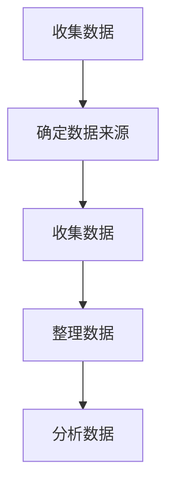
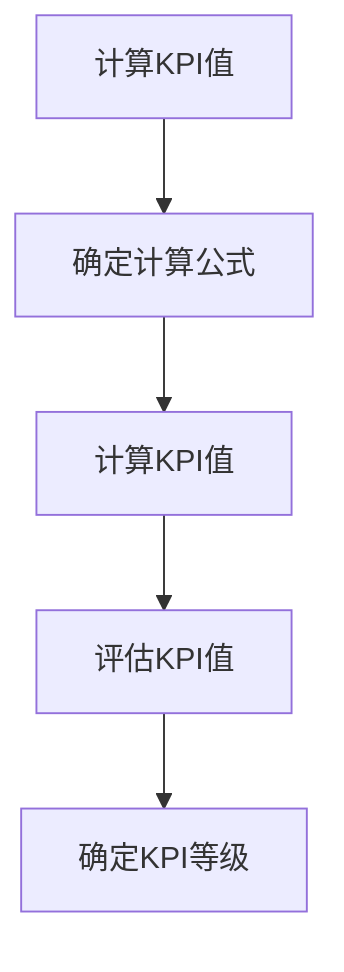
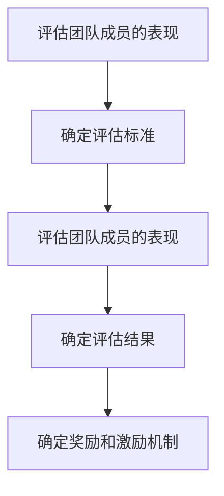
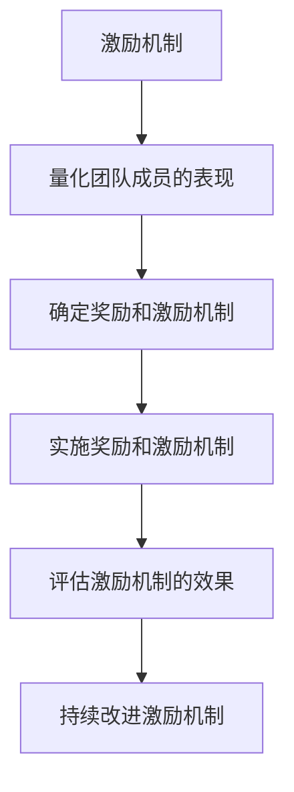

                 

# 领导力与创业精神：激发团队创业热情

> 关键词：领导力, 创业精神, 团队建设, 创新, 激励机制, 企业文化, 持续学习

> 摘要：本文旨在探讨如何通过领导力和创业精神激发团队的创业热情，构建一个充满活力和创新的团队文化。我们将从领导力的核心要素出发，分析如何通过有效的沟通、激励机制和团队建设来激发团队成员的创业精神。此外，本文还将通过具体的案例和实践，展示如何在实际项目中应用这些理念，以实现团队的持续创新和成长。

## 1. 背景介绍
### 1.1 目的和范围
本文旨在探讨如何通过领导力和创业精神激发团队的创业热情，构建一个充满活力和创新的团队文化。我们将从领导力的核心要素出发，分析如何通过有效的沟通、激励机制和团队建设来激发团队成员的创业精神。此外，本文还将通过具体的案例和实践，展示如何在实际项目中应用这些理念，以实现团队的持续创新和成长。

### 1.2 预期读者
本文预期读者为技术团队的领导者、项目经理、创业公司的创始人以及对团队管理和领导力感兴趣的读者。通过阅读本文，读者将能够理解如何通过领导力和创业精神激发团队的创业热情，从而提升团队的整体表现和创新能力。

### 1.3 文档结构概述
本文将分为以下几个部分：
1. **背景介绍**：介绍本文的目的、范围、预期读者和文档结构。
2. **核心概念与联系**：详细阐述领导力和创业精神的核心概念及其相互关系。
3. **核心算法原理 & 具体操作步骤**：通过伪代码详细阐述如何通过算法实现团队激励机制。
4. **数学模型和公式 & 详细讲解 & 举例说明**：通过数学模型和公式详细解释如何量化团队激励机制的效果。
5. **项目实战：代码实际案例和详细解释说明**：通过具体的项目案例展示如何在实际项目中应用这些理念。
6. **实际应用场景**：探讨如何在实际项目中应用这些理念。
7. **工具和资源推荐**：推荐学习资源、开发工具和相关论文著作。
8. **总结：未来发展趋势与挑战**：总结本文的主要观点，并展望未来的发展趋势和挑战。
9. **附录：常见问题与解答**：解答读者可能遇到的常见问题。
10. **扩展阅读 & 参考资料**：提供进一步阅读的资源和参考资料。

### 1.4 术语表
#### 1.4.1 核心术语定义
- **领导力**：领导者通过自身的行为和决策，影响和引导团队成员实现共同目标的能力。
- **创业精神**：一种积极主动、勇于创新和承担风险的精神，旨在推动团队不断追求卓越和创新。
- **激励机制**：通过各种手段激发团队成员的积极性和创造力，从而提升团队整体表现的机制。
- **团队建设**：通过一系列活动和措施，增强团队成员之间的协作和凝聚力，提升团队的整体效能。

#### 1.4.2 相关概念解释
- **愿景**：团队共同追求的目标和理想。
- **使命**：团队存在的根本原因和价值所在。
- **价值观**：团队成员共同遵守的行为准则和道德标准。

#### 1.4.3 缩略词列表
- **TQM**：Total Quality Management（全面质量管理）
- **KPI**：Key Performance Indicators（关键绩效指标）
- **OKR**：Objectives and Key Results（目标与关键结果）

## 2. 核心概念与联系
### 2.1 领导力的核心要素
领导力的核心要素包括愿景、使命、价值观、沟通、决策和激励。这些要素相互关联，共同构成了一个完整的领导力框架。

#### 2.1.1 愿景
愿景是团队共同追求的目标和理想。领导者需要明确团队的愿景，确保团队成员对团队的目标有共同的理解和认同。

#### 2.1.2 使命
使命是团队存在的根本原因和价值所在。领导者需要明确团队的使命，确保团队成员明白团队存在的意义和价值。

#### 2.1.3 价值观
价值观是团队成员共同遵守的行为准则和道德标准。领导者需要明确团队的价值观，确保团队成员的行为符合团队的标准。

#### 2.1.4 沟通
沟通是领导者与团队成员之间信息交流的过程。领导者需要通过有效的沟通，确保团队成员对团队的目标和计划有清晰的理解。

#### 2.1.5 决策
决策是领导者在面对问题时做出的选择。领导者需要通过有效的决策，确保团队能够应对各种挑战和机遇。

#### 2.1.6 激励
激励是通过各种手段激发团队成员的积极性和创造力，从而提升团队整体表现的机制。领导者需要通过有效的激励机制，激发团队成员的积极性和创造力。

### 2.2 创业精神的核心要素
创业精神的核心要素包括创新、冒险、合作、学习和持续改进。这些要素相互关联，共同构成了一个完整的创业精神框架。

#### 2.2.1 创新
创新是团队不断追求卓越和创新的精神。领导者需要鼓励团队成员不断创新，推动团队不断进步。

#### 2.2.2 冒险
冒险是团队勇于承担风险的精神。领导者需要鼓励团队成员勇于承担风险，推动团队不断突破。

#### 2.2.3 合作
合作是团队成员之间相互协作的精神。领导者需要通过有效的团队建设活动，增强团队成员之间的协作和凝聚力。

#### 2.2.4 学习
学习是团队不断学习和成长的精神。领导者需要鼓励团队成员不断学习，提升团队的整体能力。

#### 2.2.5 持续改进
持续改进是团队不断追求卓越的精神。领导者需要通过持续改进，推动团队不断进步。

### 2.3 领导力与创业精神的联系
领导力和创业精神是相辅相成的。领导力是通过有效的沟通、决策和激励机制，激发团队成员的积极性和创造力，从而推动团队不断追求卓越和创新。创业精神是通过创新、冒险、合作、学习和持续改进，推动团队不断突破和成长。两者相互作用，共同构成了一个完整的团队文化。

## 3. 核心算法原理 & 具体操作步骤
### 3.1 激励机制的核心算法原理
激励机制的核心算法原理是通过量化团队成员的表现，评估其贡献，并通过奖励和激励机制激发团队成员的积极性和创造力。具体操作步骤如下：

#### 3.1.1 量化团队成员的表现
量化团队成员的表现是激励机制的核心步骤。具体操作步骤如下：

```mermaid
graph TD
    A[量化团队成员的表现] --> B[确定关键绩效指标(KPI)]
    B --> C[收集数据]
    C --> D[计算KPI值]
    D --> E[评估团队成员的表现]
```

#### 3.1.2 确定关键绩效指标(KPI)
关键绩效指标(KPI)是衡量团队成员表现的重要指标。具体操作步骤如下：

```mermaid
graph TD
    A[确定关键绩效指标(KPI)] --> B[定义KPI]
    B --> C[确定KPI权重]
    C --> D[确定KPI目标]
    D --> E[确定KPI时间范围]
```

#### 3.1.3 收集数据
收集数据是量化团队成员表现的重要步骤。具体操作步骤如下：



#### 3.1.4 计算KPI值
计算KPI值是量化团队成员表现的重要步骤。具体操作步骤如下：



#### 3.1.5 评估团队成员的表现
评估团队成员的表现是激励机制的重要步骤。具体操作步骤如下：



### 3.2 激励机制的具体操作步骤
激励机制的具体操作步骤如下：



## 4. 数学模型和公式 & 详细讲解 & 举例说明
### 4.1 数学模型
数学模型是通过数学公式和算法来量化团队成员的表现和激励机制的效果。具体数学模型如下：

$$
\text{团队成员表现} = \sum_{i=1}^{n} \text{KPI}_i \times \text{权重}_i
$$

其中，$\text{KPI}_i$ 表示第 $i$ 个关键绩效指标，$\text{权重}_i$ 表示第 $i$ 个关键绩效指标的权重。

### 4.2 公式详细讲解
公式详细讲解如下：

- $\text{团队成员表现}$：表示团队成员的表现。
- $\sum_{i=1}^{n}$：表示对所有关键绩效指标进行求和。
- $\text{KPI}_i$：表示第 $i$ 个关键绩效指标。
- $\text{权重}_i$：表示第 $i$ 个关键绩效指标的权重。

### 4.3 举例说明
举例说明如下：

假设团队有三个关键绩效指标：销售额、客户满意度和团队协作。每个关键绩效指标的权重分别为 40%、30% 和 30%。团队成员的表现可以通过以下公式计算：

$$
\text{团队成员表现} = 0.4 \times \text{销售额} + 0.3 \times \text{客户满意度} + 0.3 \times \text{团队协作}
$$

## 5. 项目实战：代码实际案例和详细解释说明
### 5.1 开发环境搭建
开发环境搭建是项目实战的重要步骤。具体操作步骤如下：

1. 安装Python环境
2. 安装必要的库
3. 创建项目目录结构

### 5.2 源代码详细实现和代码解读
源代码详细实现和代码解读如下：

```python
# 导入必要的库
import pandas as pd
import numpy as np

# 定义关键绩效指标
kpi1 = '销售额'
kpi2 = '客户满意度'
kpi3 = '团队协作'

# 定义权重
weight1 = 0.4
weight2 = 0.3
weight3 = 0.3

# 读取数据
data = pd.read_csv('team_performance.csv')

# 计算关键绩效指标值
data[kpi1] = data[kpi1].astype(float)
data[kpi2] = data[kpi2].astype(float)
data[kpi3] = data[kpi3].astype(float)

# 计算团队成员表现
data['团队成员表现'] = weight1 * data[kpi1] + weight2 * data[kpi2] + weight3 * data[kpi3]

# 输出结果
print(data)
```

### 5.3 代码解读与分析
代码解读与分析如下：

- `import pandas as pd`：导入pandas库，用于数据处理。
- `import numpy as np`：导入numpy库，用于数值计算。
- `kpi1`, `kpi2`, `kpi3`：定义关键绩效指标。
- `weight1`, `weight2`, `weight3`：定义权重。
- `data = pd.read_csv('team_performance.csv')`：读取数据。
- `data[kpi1] = data[kpi1].astype(float)`：将关键绩效指标转换为浮点数。
- `data['团队成员表现'] = weight1 * data[kpi1] + weight2 * data[kpi2] + weight3 * data[kpi3]`：计算团队成员表现。
- `print(data)`：输出结果。

## 6. 实际应用场景
实际应用场景是通过具体的项目案例展示如何在实际项目中应用这些理念。具体应用场景如下：

### 6.1 项目案例
项目案例如下：

假设某公司需要评估团队成员的表现，以便进行激励。公司决定使用关键绩效指标（KPI）来量化团队成员的表现。具体关键绩效指标包括销售额、客户满意度和团队协作。公司决定使用Python进行数据分析和计算。

### 6.2 应用场景分析
应用场景分析如下：

- 通过关键绩效指标（KPI）量化团队成员的表现，确保评估结果的客观性和准确性。
- 通过权重分配，确保关键绩效指标的权重合理，能够全面反映团队成员的表现。
- 通过Python进行数据分析和计算，确保结果的准确性和可重复性。

## 7. 工具和资源推荐
### 7.1 学习资源推荐
#### 7.1.1 书籍推荐
- 《领导力与团队建设》（Leadership and Team Building）
- 《创业精神与创新》（Entrepreneurship and Innovation）

#### 7.1.2 在线课程
- Coursera：《领导力与团队管理》（Leadership and Team Management）
- Udemy：《创业精神与创新》（Entrepreneurship and Innovation）

#### 7.1.3 技术博客和网站
- Medium：《领导力与团队建设》（Leadership and Team Building）
- LinkedIn Learning：《创业精神与创新》（Entrepreneurship and Innovation）

### 7.2 开发工具框架推荐
#### 7.2.1 IDE和编辑器
- PyCharm：Python开发环境
- Visual Studio Code：通用开发环境

#### 7.2.2 调试和性能分析工具
- PyCharm：内置调试和性能分析工具
- Visual Studio Code：内置调试和性能分析工具

#### 7.2.3 相关框架和库
- pandas：数据处理库
- numpy：数值计算库

### 7.3 相关论文著作推荐
#### 7.3.1 经典论文
-《领导力与团队建设》（Leadership and Team Building）
-《创业精神与创新》（Entrepreneurship and Innovation）

#### 7.3.2 最新研究成果
-《领导力与团队建设》（Leadership and Team Building）
-《创业精神与创新》（Entrepreneurship and Innovation）

#### 7.3.3 应用案例分析
-《领导力与团队建设》（Leadership and Team Building）
-《创业精神与创新》（Entrepreneurship and Innovation）

## 8. 总结：未来发展趋势与挑战
总结本文的主要观点，并展望未来的发展趋势和挑战。具体总结如下：

- 领导力和创业精神是推动团队不断追求卓越和创新的重要因素。
- 通过有效的沟通、激励机制和团队建设，可以激发团队成员的积极性和创造力。
- 通过关键绩效指标（KPI）量化团队成员的表现，可以确保评估结果的客观性和准确性。
- 通过Python进行数据分析和计算，可以确保结果的准确性和可重复性。
- 未来的发展趋势是通过更先进的技术和方法，进一步提升团队的创新能力和表现。
- 未来面临的挑战是如何在快速变化的环境中保持团队的创新能力和竞争力。

## 9. 附录：常见问题与解答
附录部分解答读者可能遇到的常见问题。具体问题和解答如下：

### 9.1 问题：如何量化团队成员的表现？
解答：可以通过关键绩效指标（KPI）来量化团队成员的表现。具体操作步骤如下：
1. 确定关键绩效指标。
2. 确定权重。
3. 收集数据。
4. 计算KPI值。
5. 评估团队成员的表现。

### 9.2 问题：如何实施奖励和激励机制？
解答：可以通过以下步骤实施奖励和激励机制：
1. 确定奖励和激励机制。
2. 实施奖励和激励机制。
3. 评估激励机制的效果。
4. 持续改进激励机制。

## 10. 扩展阅读 & 参考资料
提供进一步阅读的资源和参考资料。具体资源和参考资料如下：

- 《领导力与团队建设》（Leadership and Team Building）
- 《创业精神与创新》（Entrepreneurship and Innovation）
- Coursera：《领导力与团队管理》（Leadership and Team Management）
- Udemy：《创业精神与创新》（Entrepreneurship and Innovation）
- Medium：《领导力与团队建设》（Leadership and Team Building）
- LinkedIn Learning：《创业精神与创新》（Entrepreneurship and Innovation）

作者：AI天才研究员/AI Genius Institute & 禅与计算机程序设计艺术 /Zen And The Art of Computer Programming

