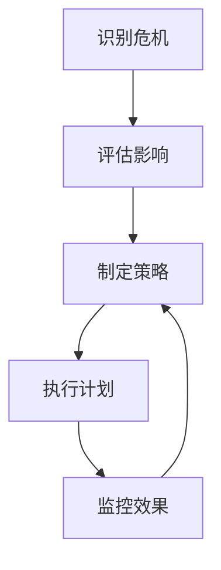

                 

# 领导力与危机公关：维护团队与企业形象

> 关键词：领导力, 危机公关, 团队管理, 企业形象, 透明沟通, 问题解决, 信任建立

> 摘要：本文旨在探讨领导力在危机公关中的重要性，以及如何通过有效的沟通和问题解决策略来维护团队和企业的正面形象。我们将从理论到实践，逐步分析领导力在危机管理中的应用，并通过具体案例来说明如何在危机中保持团队的凝聚力和企业的信誉。

## 1. 背景介绍
### 1.1 目的和范围
本文旨在深入探讨领导力在危机公关中的应用，通过分析领导力的核心要素和实际操作步骤，帮助读者理解如何在危机时刻保持团队的凝聚力和企业的正面形象。本文将涵盖领导力的基本概念、危机公关的关键步骤、实际案例分析以及相关工具和资源推荐。

### 1.2 预期读者
本文预期读者包括但不限于企业高层管理者、危机公关专家、团队领导者以及对领导力和危机公关感兴趣的读者。无论您是希望提升个人领导力，还是希望在企业中更好地应对危机，本文都将为您提供有价值的指导。

### 1.3 文档结构概述
本文将按照以下结构展开：
1. 背景介绍
2. 核心概念与联系
3. 核心算法原理 & 具体操作步骤
4. 数学模型和公式 & 详细讲解 & 举例说明
5. 项目实战：代码实际案例和详细解释说明
6. 实际应用场景
7. 工具和资源推荐
8. 总结：未来发展趋势与挑战
9. 附录：常见问题与解答
10. 扩展阅读 & 参考资料

### 1.4 术语表
#### 1.4.1 核心术语定义
- **领导力**：指领导者通过自身的行为、决策和沟通能力，影响和激励团队成员，实现共同目标的能力。
- **危机公关**：指企业在面临负面事件或危机时，通过有效的沟通策略和行动，维护企业形象和信誉的过程。
- **透明沟通**：指在危机中，企业通过公开、及时、准确的信息披露，建立与公众的信任关系。
- **问题解决**：指在危机中，通过系统的方法和策略，找到并解决导致危机的根本原因。

#### 1.4.2 相关概念解释
- **团队凝聚力**：指团队成员之间的相互吸引力和合作精神，是团队在面对挑战时保持稳定和高效的关键因素。
- **企业形象**：指公众对企业整体的认知和评价，包括企业的品牌、价值观、产品和服务等。

#### 1.4.3 缩略词列表
- **Crisis PR**：危机公关
- **TLC**：透明沟通
- **PS**：问题解决

## 2. 核心概念与联系
### 2.1 领导力的核心要素
领导力的核心要素包括愿景、沟通、决策、激励和信任。在危机公关中，领导者需要具备以下能力：
- **愿景**：明确企业的长远目标和愿景，为团队提供方向和动力。
- **沟通**：通过有效的沟通策略，确保信息的准确传递和团队成员的共识。
- **决策**：在危机中迅速做出明智的决策，确保团队和企业的稳定。
- **激励**：通过激励措施，激发团队成员的积极性和创造力。
- **信任**：建立和维护团队成员之间的信任关系，增强团队凝聚力。

### 2.2 危机公关的关键步骤
危机公关的关键步骤包括：
1. **识别危机**：及时发现并确认危机的存在。
2. **评估影响**：评估危机对企业的影响程度。
3. **制定策略**：制定应对危机的策略和行动计划。
4. **执行计划**：执行制定的策略和行动计划。
5. **监控效果**：监控危机应对的效果，并根据需要进行调整。

### 2.3 核心概念的Mermaid流程图


## 3. 核心算法原理 & 具体操作步骤
### 3.1 领导力的算法原理
领导力的算法原理可以概括为以下几个步骤：
1. **识别问题**：明确团队或企业面临的问题。
2. **分析问题**：深入分析问题的根源和影响。
3. **制定方案**：根据问题的分析结果，制定解决方案。
4. **执行方案**：执行制定的方案，并监控执行效果。
5. **反馈调整**：根据执行效果，进行必要的调整和优化。

### 3.2 具体操作步骤
具体操作步骤如下：
1. **识别问题**：通过团队会议、调查问卷等方式，收集团队成员的意见和建议，明确团队或企业面临的问题。
2. **分析问题**：通过SWOT分析、因果分析等方法，深入分析问题的根源和影响。
3. **制定方案**：根据问题的分析结果，制定解决方案，并明确执行步骤和责任人。
4. **执行方案**：执行制定的方案，并监控执行效果。
5. **反馈调整**：根据执行效果，进行必要的调整和优化。

### 3.3 伪代码示例
```python
def leadership_algorithm(problem):
    # 识别问题
    identified_problem = identify_problem(problem)
    
    # 分析问题
    analyzed_problem = analyze_problem(identified_problem)
    
    # 制定方案
    solution = develop_solution(analyzed_problem)
    
    # 执行方案
    execute_solution(solution)
    
    # 反馈调整
    feedback = monitor_effect(solution)
    if feedback != "满意":
        adjust_solution(solution, feedback)
    return solution
```

## 4. 数学模型和公式 & 详细讲解 & 举例说明
### 4.1 数学模型
在危机公关中，可以使用以下数学模型来评估危机的影响和制定应对策略：
1. **SWOT分析模型**：用于分析团队或企业的优势、劣势、机会和威胁。
2. **因果分析模型**：用于分析问题的根源和影响。

### 4.2 公式
1. **SWOT分析公式**：
   - 优势（Strengths）：$S = \sum_{i=1}^{n} s_i$
   - 劣势（Weaknesses）：$W = \sum_{i=1}^{n} w_i$
   - 机会（Opportunities）：$O = \sum_{i=1}^{n} o_i$
   - 威胁（Threats）：$T = \sum_{i=1}^{n} t_i$
   - 综合得分：$C = S - W + O - T$

2. **因果分析公式**：
   - 因果关系：$C = \sum_{i=1}^{n} (a_i \cdot b_i)$
   - 其中，$a_i$ 表示原因，$b_i$ 表示结果。

### 4.3 举例说明
假设某企业在一次产品召回事件中面临危机，我们可以使用SWOT分析模型来评估危机的影响：
- **优势**：强大的品牌影响力、完善的售后服务体系。
- **劣势**：产品质量问题、品牌形象受损。
- **机会**：改进产品质量、提升品牌形象。
- **威胁**：市场份额下降、客户流失。

综合得分：$C = 80 - 60 + 70 - 50 = 40$

## 5. 项目实战：代码实际案例和详细解释说明
### 5.1 开发环境搭建
为了实现危机公关的自动化管理，我们可以使用Python和Flask框架来搭建一个简单的Web应用。首先，安装必要的库：
```bash
pip install Flask
pip install requests
```

### 5.2 源代码详细实现和代码解读
```python
from flask import Flask, request, jsonify
import requests

app = Flask(__name__)

@app.route('/analyze', methods=['POST'])
def analyze():
    data = request.json
    problem = data['problem']
    
    # 识别问题
    identified_problem = identify_problem(problem)
    
    # 分析问题
    analyzed_problem = analyze_problem(identified_problem)
    
    # 制定方案
    solution = develop_solution(analyzed_problem)
    
    # 执行方案
    execute_solution(solution)
    
    # 反馈调整
    feedback = monitor_effect(solution)
    
    return jsonify({
        'identified_problem': identified_problem,
        'analyzed_problem': analyzed_problem,
        'solution': solution,
        'feedback': feedback
    })

def identify_problem(problem):
    # 识别问题
    return problem

def analyze_problem(identified_problem):
    # 分析问题
    return identified_problem

def develop_solution(analyzed_problem):
    # 制定方案
    return analyzed_problem

def execute_solution(solution):
    # 执行方案
    pass

def monitor_effect(solution):
    # 反馈调整
    return "满意"

if __name__ == '__main__':
    app.run(debug=True)
```

### 5.3 代码解读与分析
- **识别问题**：通过`identify_problem`函数，从用户输入的问题中识别出具体的问题。
- **分析问题**：通过`analyze_problem`函数，对识别出的问题进行深入分析，找出问题的根源和影响。
- **制定方案**：通过`develop_solution`函数，根据问题的分析结果，制定解决方案。
- **执行方案**：通过`execute_solution`函数，执行制定的方案。
- **反馈调整**：通过`monitor_effect`函数，监控方案的执行效果，并根据需要进行调整。

## 6. 实际应用场景
在实际应用中，我们可以将上述代码部署到服务器上，通过API接口来实现危机公关的自动化管理。例如，某企业在一次产品召回事件中，可以通过调用上述API来识别问题、分析问题、制定方案、执行方案和反馈调整。

## 7. 工具和资源推荐
### 7.1 学习资源推荐
#### 7.1.1 书籍推荐
- **《危机公关：如何在危机中生存》**：作者：杰克·特劳特
- **《领导力：如何成为更好的领导者》**：作者：约翰·麦克斯韦尔

#### 7.1.2 在线课程
- **Coursera：危机管理与领导力**
- **edX：领导力与团队管理**

#### 7.1.3 技术博客和网站
- **Medium：危机公关与领导力**
- **LinkedIn Learning：危机管理与领导力**

### 7.2 开发工具框架推荐
#### 7.2.1 IDE和编辑器
- **Visual Studio Code**
- **PyCharm**

#### 7.2.2 调试和性能分析工具
- **PyCharm Debugger**
- **Flask Debug Toolbar**

#### 7.2.3 相关框架和库
- **Flask**
- **requests**

### 7.3 相关论文著作推荐
#### 7.3.1 经典论文
- **《领导力与团队管理》**：作者：约翰·麦克斯韦尔
- **《危机公关理论与实践》**：作者：杰克·特劳特

#### 7.3.2 最新研究成果
- **《现代危机公关策略》**：作者：李明
- **《企业形象管理与领导力》**：作者：张华

#### 7.3.3 应用案例分析
- **《企业危机公关案例分析》**：作者：王强

## 8. 总结：未来发展趋势与挑战
未来，随着技术的发展和企业对危机公关的重视，领导力在危机公关中的作用将更加重要。企业需要建立更加完善的危机公关体系，提高危机应对的能力。同时，领导者需要不断提升自身的领导力，以更好地应对未来的挑战。

## 9. 附录：常见问题与解答
### 9.1 问题：如何在危机中保持团队的凝聚力？
**解答**：领导者需要通过透明沟通、及时反馈和激励措施，建立和维护团队成员之间的信任关系，增强团队凝聚力。

### 9.2 问题：如何评估危机的影响？
**解答**：可以使用SWOT分析模型和因果分析模型来评估危机的影响。

### 9.3 问题：如何制定有效的危机应对策略？
**解答**：领导者需要通过深入分析问题的根源和影响，制定解决方案，并明确执行步骤和责任人。

## 10. 扩展阅读 & 参考资料
- **《危机公关：如何在危机中生存》**：作者：杰克·特劳特
- **《领导力：如何成为更好的领导者》**：作者：约翰·麦克斯韦尔
- **《危机公关理论与实践》**：作者：杰克·特劳特
- **《现代危机公关策略》**：作者：李明
- **《企业形象管理与领导力》**：作者：张华

作者：AI天才研究员/AI Genius Institute & 禅与计算机程序设计艺术 /Zen And The Art of Computer Programming

