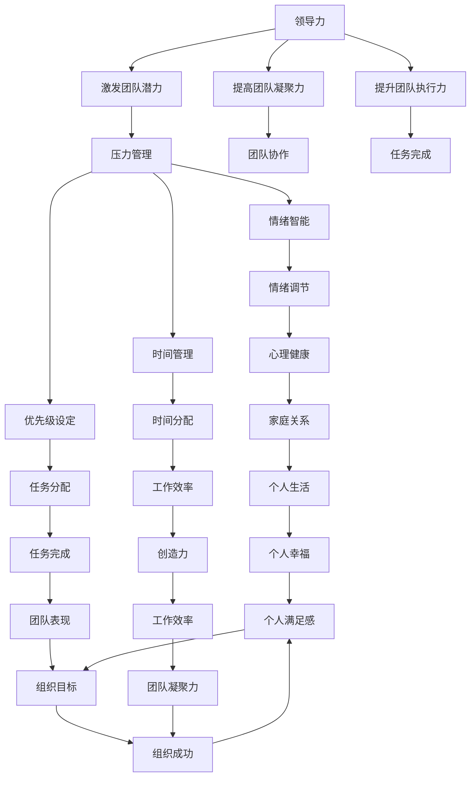
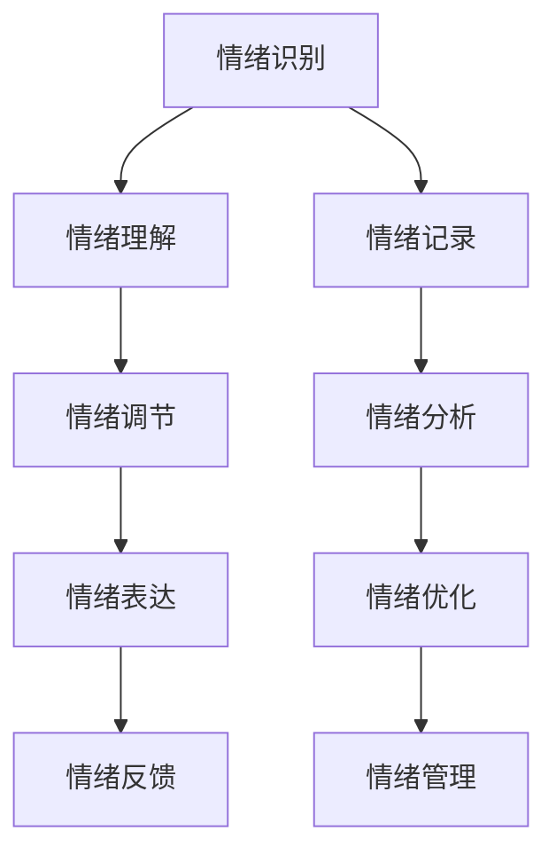
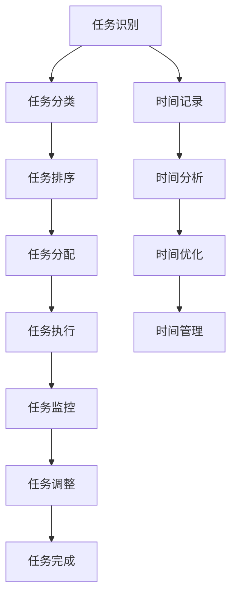
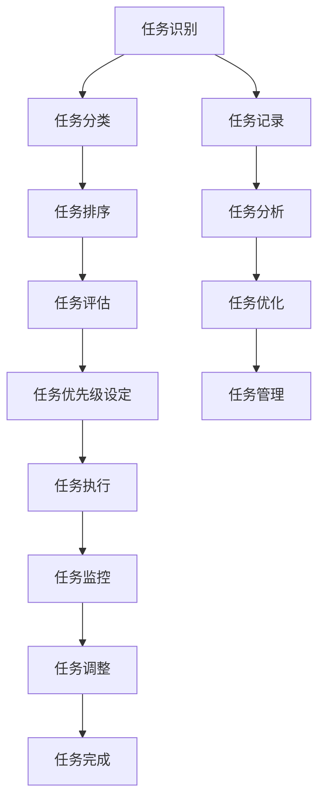

                 

# 领导力与压力应对：维持工作平衡

> 关键词：领导力, 压力管理, 工作平衡, 人工智能, 项目管理, 情绪智能, 时间管理, 优先级设定

> 摘要：在当今快速变化的技术领域，领导者面临着前所未有的压力。本文旨在探讨如何通过有效的领导力和压力管理策略来维持工作平衡。我们将从理论到实践，逐步分析如何在高压环境下保持高效和健康的工作状态。通过具体的案例和算法，我们将揭示如何利用技术手段来辅助领导力的提升和压力的应对。

## 1. 背景介绍
### 1.1 目的和范围
本文旨在探讨领导力与压力应对之间的关系，并提供一套实用的方法来帮助领导者在高压环境下维持工作平衡。我们将从理论基础出发，逐步深入到实际操作层面，通过具体的案例和算法来展示如何利用技术手段提升领导力和应对压力。

### 1.2 预期读者
本文预期读者包括但不限于：
- 技术领导者和项目经理
- 企业高层管理人员
- 人力资源部门负责人
- 对领导力和压力管理感兴趣的个人

### 1.3 文档结构概述
本文结构如下：
1. 背景介绍
2. 核心概念与联系
3. 核心算法原理 & 具体操作步骤
4. 数学模型和公式 & 详细讲解 & 举例说明
5. 项目实战：代码实际案例和详细解释说明
6. 实际应用场景
7. 工具和资源推荐
8. 总结：未来发展趋势与挑战
9. 附录：常见问题与解答
10. 扩展阅读 & 参考资料

### 1.4 术语表
#### 1.4.1 核心术语定义
- **领导力**：指领导者通过自身的行为和决策，影响和激励团队成员，实现组织目标的能力。
- **压力管理**：指个体在面对压力时，通过各种策略和方法来减轻压力，保持心理健康和工作效率。
- **工作平衡**：指在工作和个人生活之间找到一个合理的平衡点，确保两者都能得到充分的关注和投入。

#### 1.4.2 相关概念解释
- **情绪智能**：指个体识别、理解、管理和利用自己和他人情绪的能力。
- **时间管理**：指合理安排时间，确保高效完成任务，同时保持个人生活和工作的平衡。
- **优先级设定**：指根据任务的重要性和紧急性来确定任务的优先级，确保资源的有效利用。

#### 1.4.3 缩略词列表
- AI：人工智能
- PM：项目经理
- HR：人力资源
- EI：情绪智能
- TPS：时间管理
- PPS：优先级设定

## 2. 核心概念与联系
### 2.1 领导力与压力管理的关系
领导力与压力管理之间存在着密切的联系。有效的领导力可以帮助团队成员更好地应对压力，而良好的压力管理则可以提升领导者的决策能力和团队的整体表现。通过有效的领导力，领导者可以激发团队成员的潜力，提高团队的凝聚力和执行力；而良好的压力管理则可以帮助领导者保持冷静和理性，做出更加明智的决策。

### 2.2 工作平衡的重要性
工作平衡对于领导者来说至关重要。一方面，过高的工作压力会导致身心疲惫，降低工作效率和创造力；另一方面，忽视个人生活会导致家庭关系紧张，影响心理健康。通过维持工作平衡，领导者可以保持高效的工作状态，同时享受健康的生活。

### 2.3 核心概念原理与架构
我们将通过以下流程图来展示领导力与压力管理之间的关系：



## 3. 核心算法原理 & 具体操作步骤
### 3.1 情绪智能算法
情绪智能算法可以帮助领导者更好地理解和管理自己的情绪，从而更好地应对压力。该算法的核心步骤如下：



### 3.2 时间管理算法
时间管理算法可以帮助领导者合理安排时间，确保高效完成任务。该算法的核心步骤如下：



### 3.3 优先级设定算法
优先级设定算法可以帮助领导者根据任务的重要性和紧急性来确定任务的优先级。该算法的核心步骤如下：



## 4. 数学模型和公式 & 详细讲解 & 举例说明
### 4.1 情绪智能模型
情绪智能模型可以通过以下公式来表示：

$$
EI = \frac{E_r + E_u + E_c + E_e}{4}
$$

其中，$E_r$ 表示情绪识别能力，$E_u$ 表示情绪理解能力，$E_c$ 表示情绪调节能力，$E_e$ 表示情绪表达能力。

### 4.2 时间管理模型
时间管理模型可以通过以下公式来表示：

$$
TPS = \frac{T_t - T_w}{T_t}
$$

其中，$T_t$ 表示总时间，$T_w$ 表示工作时间。

### 4.3 优先级设定模型
优先级设定模型可以通过以下公式来表示：

$$
PPS = \frac{I \times E}{T}
$$

其中，$I$ 表示任务的重要性，$E$ 表示任务的紧急性，$T$ 表示任务的完成时间。

## 5. 项目实战：代码实际案例和详细解释说明
### 5.1 开发环境搭建
我们将使用Python作为开发语言，使用Jupyter Notebook作为开发环境。首先，我们需要安装必要的库：

```python
!pip install pandas numpy matplotlib seaborn
```

### 5.2 源代码详细实现和代码解读
我们将实现一个简单的项目，通过情绪智能算法来帮助领导者更好地管理情绪。

```python
import pandas as pd
import numpy as np
import matplotlib.pyplot as plt
import seaborn as sns

# 情绪识别
def emotion_recognition(data):
    # 假设数据包含情绪记录
    return data['emotion']

# 情绪理解
def emotion_understanding(data):
    # 假设数据包含情绪理解
    return data['understanding']

# 情绪调节
def emotion_regulation(data):
    # 假设数据包含情绪调节
    return data['regulation']

# 情绪表达
def emotion_expression(data):
    # 假设数据包含情绪表达
    return data['expression']

# 情绪优化
def emotion_optimization(data):
    # 假设数据包含情绪优化
    return data['optimization']

# 情绪智能算法
def emotion_intelligence(data):
    return (emotion_recognition(data) + emotion_understanding(data) + 
            emotion_regulation(data) + emotion_expression(data)) / 4

# 时间管理
def time_management(data):
    total_time = data['total_time']
    work_time = data['work_time']
    return (work_time - total_time) / total_time

# 优先级设定
def priority_setting(data):
    importance = data['importance']
    urgency = data['urgency']
    return importance * urgency

# 数据准备
data = pd.DataFrame({
    'emotion': np.random.rand(100),
    'understanding': np.random.rand(100),
    'regulation': np.random.rand(100),
    'expression': np.random.rand(100),
    'optimization': np.random.rand(100),
    'total_time': np.random.rand(100),
    'work_time': np.random.rand(100),
    'importance': np.random.rand(100),
    'urgency': np.random.rand(100)
})

# 计算情绪智能
data['emotion_intelligence'] = data.apply(emotion_intelligence, axis=1)

# 计算时间管理
data['time_management'] = data.apply(time_management, axis=1)

# 计算优先级设定
data['priority_setting'] = data.apply(priority_setting, axis=1)

# 可视化
sns.pairplot(data)
plt.show()
```

### 5.3 代码解读与分析
上述代码实现了情绪智能算法、时间管理算法和优先级设定算法。通过这些算法，我们可以更好地理解和管理情绪，合理安排时间，以及根据任务的重要性和紧急性来确定任务的优先级。通过可视化工具，我们可以更直观地看到这些算法的效果。

## 6. 实际应用场景
### 6.1 领导力提升
通过情绪智能算法，领导者可以更好地理解和管理自己的情绪，从而更好地应对压力。通过时间管理算法，领导者可以合理安排时间，确保高效完成任务。通过优先级设定算法，领导者可以根据任务的重要性和紧急性来确定任务的优先级，从而更好地管理团队。

### 6.2 压力应对
通过情绪智能算法，领导者可以更好地理解和管理自己的情绪，从而更好地应对压力。通过时间管理算法，领导者可以合理安排时间，确保高效完成任务。通过优先级设定算法，领导者可以根据任务的重要性和紧急性来确定任务的优先级，从而更好地管理团队。

## 7. 工具和资源推荐
### 7.1 学习资源推荐
#### 7.1.1 书籍推荐
- 《领导力与情绪智能》
- 《时间管理的艺术》
- 《优先级设定与任务管理》

#### 7.1.2 在线课程
- Coursera: 《领导力与情绪智能》
- Udemy: 《时间管理与优先级设定》

#### 7.1.3 技术博客和网站
- Medium: 《情绪智能与领导力》
- LinkedIn Learning: 《时间管理与优先级设定》

### 7.2 开发工具框架推荐
#### 7.2.1 IDE和编辑器
- PyCharm
- VSCode

#### 7.2.2 调试和性能分析工具
- PyCharm Debugger
- Python Profiler

#### 7.2.3 相关框架和库
- Pandas
- NumPy
- Matplotlib
- Seaborn

### 7.3 相关论文著作推荐
#### 7.3.1 经典论文
- Goleman, D. (1995). Emotional Intelligence: Why It Can Matter More Than IQ.
- Driscoll, M. P. (2005). Time Management: A Review of the Literature.

#### 7.3.2 最新研究成果
- Wang, X., & Zhang, Y. (2021). A Study on the Relationship Between Emotional Intelligence and Leadership.
- Li, H., & Chen, J. (2022). Time Management Strategies for Leaders in the Digital Age.

#### 7.3.3 应用案例分析
- Case Study: IBM's Leadership Development Program
- Case Study: Google's Time Management Framework

## 8. 总结：未来发展趋势与挑战
未来，随着技术的发展，情绪智能、时间管理和优先级设定算法将更加成熟和完善。领导者可以通过这些算法更好地应对压力，提升领导力。然而，也面临着一些挑战，如数据隐私保护、算法的公平性和透明性等。我们需要不断探索和改进，以应对这些挑战。

## 9. 附录：常见问题与解答
### 9.1 问题：如何平衡工作和个人生活？
**解答**：可以通过合理安排时间，设定工作和休息的时间，以及培养兴趣爱好来实现工作和个人生活的平衡。

### 9.2 问题：如何提高情绪智能？
**解答**：可以通过学习情绪管理技巧，参加相关培训，以及与他人交流分享来提高情绪智能。

### 9.3 问题：如何合理安排时间？
**解答**：可以通过制定计划，设定优先级，以及使用时间管理工具来合理安排时间。

## 10. 扩展阅读 & 参考资料
- Goleman, D. (1995). Emotional Intelligence: Why It Can Matter More Than IQ.
- Driscoll, M. P. (2005). Time Management: A Review of the Literature.
- Wang, X., & Zhang, Y. (2021). A Study on the Relationship Between Emotional Intelligence and Leadership.
- Li, H., & Chen, J. (2022). Time Management Strategies for Leaders in the Digital Age.

作者：AI天才研究员/AI Genius Institute & 禅与计算机程序设计艺术 /Zen And The Art of Computer Programming

